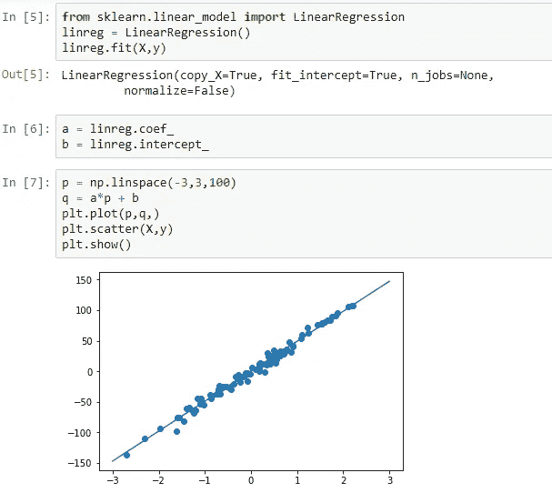
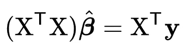

# sk learn-引擎盖下的线性回归

> 原文：<https://medium.com/analytics-vidhya/sklearn-linear-regression-under-the-hood-31ee71aec00?source=collection_archive---------5----------------------->

使用梯度下降收敛到最优解的线性回归模型。然而，sklearn 线性回归不使用梯度下降。

“线性回归”这个术语肯定会让数据科学和统计学领域的每个人都有所触动。这是最简单和“第一次教”的算法。

然而，它看起来是多么简单，几百年的数学在勒让德和高斯等人的贡献下发展了它。

线性回归所做的，或者我应该这样说，它试图做的很简单，不是很有创造性。简单地说，它试图找到使给定数据集的方差最小化的最佳拟合超平面。线性回归模型的“好”取决于它捕捉和解释数据集变化的能力。做一个 n 维的超平面，需要 n 个系数和 1 个截距系数。

线性回归的奇特之处在于，许多人知道它做了什么，但没有多少人知道它是如何做的。这正是我们想要揭示的。

# 稍微了解一下 sklearn 线性回归的工作原理:

我们首先使用 sklearn 的 make_regression 方法创建一个合成数据集，并在此基础上创建一个线性回归模型。参数“噪声”决定了点的标准偏差，而“n _ 特征”，顾名思义，决定了特征的数量。

接下来，继续在上述数据集上创建模型，

这条直线是算法得出的。

该算法最小化损失函数，在线性回归的情况下，损失函数是均方根误差(RMSE)。

# 进入 OLS。

n 维空间中的(n-1)维超平面有无限种可能，所以蛮力永远找不到我们的最优解。对我们有利的一件事是，RMSE 的导数形成了一个凸函数，没有局部极小值和一个全局极小值。因此，梯度下降是第一件想到的事情，以制定出最佳解决方案。

除了梯度下降法之外，还有许多寻找最佳超平面系数的方法。sklearn 用的是**普通最小二乘法，**由高斯-马尔可夫定理**推导而来。**我们将超平面定义为:

在方程中，贝塔系数(βs)是 OLS 估计的参数。ε是随机误差。

所以，我们可以通过找到β *0* ，β *1，…，* β *k.* 的值来完全定义我们的超平面，β的值告诉我们一件重要的事情。如果我们的模型预测了|βi|的高值，这意味着我们的模型在决定预测值时给予了特征 X *i* 很高的重要性。β *i =* 0 意味着我们的模型完全忽略了特征 X *i.*

我们可以将上面的等式转换成矩阵形式，并写成:

其中 ***x*** *i* 是所有解释变量的第 *i* 个观测值的列向量；β是未知参数的 k×1 向量。

在数学中，当使用正规方程求解时，给定的问题有唯一的解，

正态方程

这最终将我们引向:

我们开始寻找的系数向量可以用一组矩阵运算来计算

# 证明 sklearn 线性回归遵循 OLS 方法并使用正规方程来确定系数:

如前所述，再次创建一个简单的合成数据集，在线 y=9x + 10 周围有 20，000 个正态分布的数据点，我们得到

为了便于观察，我们选择了一个简单的模型，其中有一个因变量和一个自变量。由于我们已经知道生成这些点所使用的线，最佳拟合线(由 sklearn 线性回归预测)必须具有非常接近 9°的**斜率和非常接近 10°的 y 截距。**

现在将线性回归付诸实施，并将结果与我们之前看到的正态方程进行比较，

建议使用 linalg.pinv 而不是 linalg.inv，因为它也可以处理不可逆矩阵。

结果匹配！我们刚刚揭开了复杂的线性回归的幕后！虽然 sklearn 在其基础上使用了额外的数学技巧，如奇异值分解和 Moore-Penrose 伪逆来降低计算要求，但基本思想仍然是相同的。

发现有用就留个掌声！