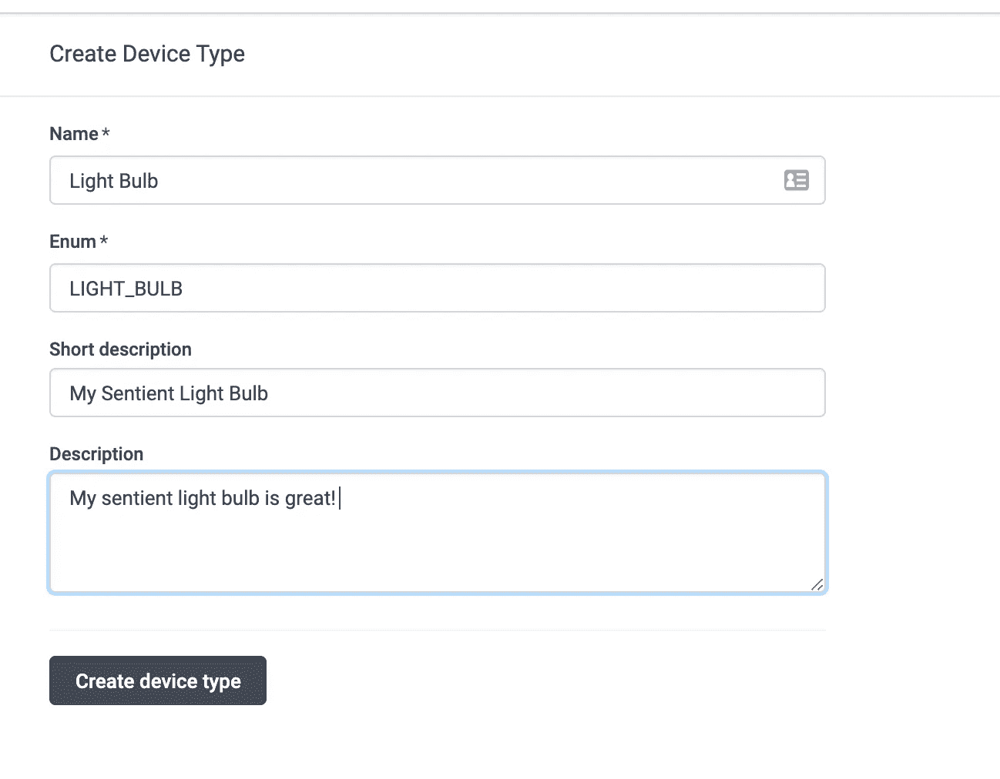

# 放松你的工作

> 原文：<https://medium.com/analytics-vidhya/slackify-your-iot-5f8bda5a129?source=collection_archive---------14----------------------->


让你更接近你的智能灯泡

你有没有想过和你的智能灯聊天？你知道，交流阳光下一切的故事，谈论你最有活力的时刻，分享你内心深处对黑暗时代、光明时代的想法……好了，我就不说灯泡双关语了。

但是说真的，简单地通过[放松](https://slack.com)你的灯来打开智能灯不是很酷吗？我觉得会很酷，就试了一下。以下是我学到的东西。

## 制造智能灯

起初，我真的打算拿出我曾经拥有的电气工程技能(也忘记了我多年来是一只代码猴子)。我很快放弃了这个想法，意识到实际制作一个智能灯很难，并回到我舒适的代码世界。

作为一名数据科学家和人工智能研究人员，我的首选语言是 Python。当然，真的开灯会很酷，但是做一件值得信赖的事情对我来说已经够近了。所以，我离开了，去建造我新的想象中的灯泡朋友。

首先，我启动了我的虚拟环境:`virtualenv venv`并编写了我即将感知的光的“固件”:

简单的轻量级固件

不幸的是，这不是一个特别吸引人的灯泡来满足我对朋友的需求。至少是一直开着的！

与我的新朋友聊天的第一步是将我的固件连接到云。这是我需要将我的东西(我的灯泡)连接到互联网的地方:输入 IoT！我考虑了很多平台——things speak、ThingsBoard 和 Iotery。

我决定选择 [Iotery.io](https://iotery.io) ，因为这似乎是我就灯丝与二极管的优点进行深入哲学讨论的最快途径(并且对我的简单应用程序来说是免费的)。它还有许多封装了 REST APIs 的 python SDKs，这让我的生活更加轻松。

所以我去创建了我的团队:


我的新团队

在创建我的团队后，我被指示创建一个新的[设备类型](https://iotery.io/device-types)——一个灯泡:



创建设备类型—灯泡

紧接着，我在`[Devices](https://iotery.io/devices)`菜单选项下创建了一个灯泡设备类型的实例(我的实际灯泡)。我给他取名弗雷德:


创造一个装置(我的灯泡朋友)——弗雷德！

我担心 Fred 的安全，所以我首先尝试使用 Iotery 的`KEYED`认证方案，它看起来更安全。但是，我必须在 Fred 的固件(RSA)中实现 X.509 非对称证书。我认为弗雷德只要使用 Iotery 的`Basic`安全模式就足够安全了:一个序列、密钥和秘密的组合。幸运的是，Iotery 的所有 REST APIs 在传输过程中都用 TLS (HTTPS)进行了加密，所以 Fred 应该是安全的。

我还在 Iotery 设备面板上给 Fred 做了一个云连接设备。如果弗雷德是一个真正的灯泡，这将意味着他会说 IP (HTTP)。

然后是时候编写固件连接到云，真正成为弗雷德！为了让我的生活更轻松，我安装了嵌入式 Iotery Python SDK:

```
pip install iotery_embedded_python_sdk
```

Fred 还需要最终能够让我了解他的状态，所以他需要报告他的基本状态(开/关)，所以我在 Iotery 仪表板中创建了一个数据类型:


弗雷德的状态(一种数据类型)

在仔细阅读了 Iotery 嵌入式 SDK 的文档和 Iotery 发布数据的 REST API 之后，我连接了固件(Fred)向 Iotery 报告他的状态:

弗雷德灯泡连接到 Iotery 和报告他的光的状态

我运行了文件(在做了一个`EXPORT IOTERY_TEAM_ID=my-team-id`之后)，检查了 Iotery 仪表板，发现 Fred 正在报告数据！


弗雷德报告数据！

我的创作快完成了[插入邪笑]！但是，我需要能够告诉弗雷德(并最终放松他)打开和关闭！

我回到 Iotery 仪表板，创建了一个[命令类型](https://iotery.io/command-types):


我还创建了另一种命令类型`TURN_LIGHT_OFF`。

我需要 Fred 响应命令实例(命令类型的实例)来打开或关闭。原来，弗雷德每次发布数据(在`postData`的回应中)都会从 Iotery 那里得到未执行的命令。

在阅读了关于 [Iotery 构造](https://iotery.io/docs)的内容后，我还了解到 Iotery 将嵌入式设备(在我们的例子中是 Fred)视为真理的来源，所以 Fred 一旦执行命令就必须告诉 Iotery。

因此，我使用嵌入式 SDK 来处理命令:

我需要验证它们是否工作，所以我使用设备页面(命令选项卡)来执行我创建的命令类型:


通过控制台指挥弗雷德

厉害！更接近拥有一个新朋友来照亮我的一天！

在这一点上，我觉得很有成就感。但是，唉，我仍然无法通过 Slack 与弗雷德聊天。需要做更多的工作…

读了一些之后，我发现了很多[网页挂钩](https://iotery.io/webhooks)。Webhooks 将允许我创建自己的 RESTful web 服务器(Iotery 称之为*增值系统*)，在那里我可以使用 [Slack API](https://api.slack.com) 最终与 Fred 聊天！

## 创建我的网络服务器(增值系统)

在了解到我可以在 Iotery 中设置一个 webhook，以便在每次 Fred 向 Iotery 发布数据时向我的 web 服务器发送一些数据后，我开始在 Iotery 仪表板中使用 webhook:


使用 grok 的我的 Webhook

我需要在本地开发我的 web 服务器，所以我决定使用 [ngrok](https://ngrok.io) 。当我启动它(`ngrok http 7500`)时，ngrok 给了我一个 URL[https://f38a 4488 . ngrok . I](https://f38a4488.ngrok.i)o，它将所有流量指向我的本地服务器 http://localhost:7500 。

完美！现在我只需要编写一个 web 服务器来处理所有进入[http://localhost:7500/light-status](http://localhost:7500/light-status)的请求。

保持我的 Python 主题，我决定为我的 RESTful 服务器使用 [Flask。我创建了另一个文件夹和一个新的`virtualenv`，安装了 Flask ( `pip install flask`)，然后开始编写我的 web 服务器:](https://www.fullstackpython.com/flask.html)

Fred 发布数据时接收 Iotery 的 webhook 的基本 REST 路径

每次弗雷德发布数据时，我的网络服务器(VAS)都会打印“弗雷德发布数据！”。

现在我只需要让弗雷德放松他的状态！我前往[松弛 API](https://api.slack.com) 。

## 配置 Slack 的传入 Webhook

首先，我创建了一个 [Slack 工作空间](https://slack.com) (fred-talk.slack.com)。我进入工作区管理页面([https://mobility-dev.slack.com/apps/manage](https://mobility-dev.slack.com/apps/manage))，创建了一个新的`App`名为“弗雷德对话”。


为与 Fred 交谈创建新的 Slack 应用程序

与 Iotery 的 Webhooks 类似，Slack 允许我在我的“Fred Talk”应用程序中创建新的传入 webhook:


创建新的传入 Webhook 来处理来自 Fred 的数据

在激活了传入的 webhook 之后，我让 slack 创建了一个新的 webhook URL，当 Fred 报告数据时，我可以将它`POST`到我的 web 服务器内部。

我使用请求(`pip install requests`)对 slack webhook API 进行 HTTP `POST`。

添加了 slack webhook，这样 Fred 就可以告诉我他的当前状态了！

我终于可以实现我一生的梦想，在 slack 上与我的新电灯泡朋友弗雷德(单向)交谈了！！


好吧！弗雷德能说出自己的想法！！我就快成功了——我只需要让弗雷德放松一下。

我决定最快的方法是使用 Slack 的斜杠命令并创建一个新命令，这样每当我想和 Fred 通话(并告诉他开机)时，我只需键入`/light-er-up-fred`。我使用 Slack 的仪表板创建了一个新的斜杠命令:


并将网络挂钩指向我的网络服务器(VAS)。我创建了另一个名为`/cut-it-out-fred`的斜杠命令来关闭弗雷德。

我所要做的就是在我的 VAS 中编写一个路由处理器来处理 slack 的 Webhooks，一个用于打开 Fred，一个用于关闭 Fred。我通过安装 Python SDK ( `pip install iotery_python_server_sdk`)并用我的 Iotery 团队的 [API 键](https://iotery.io/system)实例化它，使用了 [Iotery 的账户管理器 API](https://iotery.io/docs) :

嘣！我们可以通过在 slack 通道中键入`/light-er-up-fred`或`/cut-it-out-fred`来让 Fred slack，并告诉他打开和关闭！我的梦想终于实现了！我的生活现在有了一点光明。