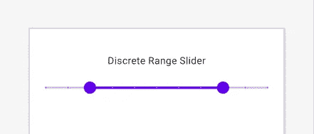

# 滑块 Android 的材质组件

> 原文：<https://medium.com/analytics-vidhya/sliders-material-component-for-android-5be61bbe6726?source=collection_archive---------0----------------------->

用于从给定的滑动条中查看和选择值或范围的滑块。它们主要用于调节音量和亮度等设置。

滑块可以在条的两端使用图标来表示数字或相对刻度。值的范围或值的性质(如音量变化)可以用图标来传达。

滑块添加到库版本 **1.2.0 的材料设计中。**所以，需要在材质设计上增加 1.2.0 或更高版本。


滑块设计

# 滑块的类型

有两种类型的滑块。

*   连续滑块
*   离散滑块

此外，我们还有另一个称为范围滑块的滑块。

让我们来详细了解一下这些滑块。

# 连续滑块

连续滑块允许我们在给定的开始值和结束值之间选择任何值。

例如，valueFrom = "0.0 "和 valueTo="100.0 "在这种情况下，您可以选择从值和到值之间的任何值，如 55.5、62.0 等。


连续滑块

定义布局中的滑块，

```
<com.google.android.material.slider.Slider
        android:id="@+id/continuousSlider"
        android:layout_width="match_parent"
        android:layout_height="wrap_content"
        android:valueFrom="0.0"
        android:valueTo="100.0"
        android:value="20.0"/>
```

在布局中，

**valueFrom :** 滑块的起始值。

**valueTo :** 滑块的结束值。

**值:**设置滑块的初始值。

类似地，我们可以在布局中添加一个 **RangeSlider** :

```
<com.google.android.material.slider.RangeSlider
        android:id="@+id/rangeSlider"
        android:layout_width="match_parent"
        android:layout_height="wrap_content"
        android:valueFrom="0.0"
        android:valueTo="100.0"
        android:stepSize="10.0"
        app:values="@array/initial_range_slider_values" />
```

RangeSlider 有 **app:values** 属性来设置滑块的范围。我们需要以数组的形式提供范围。

**values/arrays.xml** :

```
<resources>
    <array name="initial_range_slider_values">
        <item>20.0</item>
        <item>80.0</item>
    </array>
</resources>
```


连续范围滑块

## 价值观改变听众

我们可以用两种不同的方式观察滑块的变化。

**addOnSliderTouchListener**

通过使用 addOnSliderTouchListener，我们可以观察滑块开始和停止触摸位置值。

```
continuousSlider.addOnSliderTouchListener(object : Slider.OnSliderTouchListener {
            override fun onStartTrackingTouch(slider: Slider) {
                // Responds to when slider's touch event is being started
                Log.d("onStartTrackingTouch", slider.value.toString())
            }

            override fun onStopTrackingTouch(slider: Slider) {
                // Responds to when slider's touch event is being stopped
                Log.d("onStopTrackingTouch", slider.value.toString())
            }
        })
```

类似地，我们可以为范围滑块添加触摸监听器。

```
rangeSlider.addOnSliderTouchListener(object : RangeSlider.OnSliderTouchListener{
            override fun onStartTrackingTouch(slider: RangeSlider) {
                val values = rangeSlider.values
                Log.d("onStartTrackingTouch From", values[0].toString())
                Log.d("onStartTrackingTouch T0", values[1].toString())
            }

            override fun onStopTrackingTouch(slider: RangeSlider) {
                val values = rangeSlider.values
                Log.d("onStopTrackingTouch From", values[0].toString())
                Log.d("onStopTrackingTouch T0", values[1].toString())
            }
        })
```

**addOnChangeListener**

Sliders OnChangeListener 在滑块值每次改变时通知。

```
continuousSlider.addOnChangeListener(object: Slider.OnChangeListener{
            override fun onValueChange(slider: Slider, value: Float, fromUser: Boolean) {
                Log.d("addOnChangeListener", slider.value.toString())
            }
        })
```

还有，RangeSlider 的 OnChangeListener。

```
rangeSlider.addOnChangeListener(object : RangeSlider.OnChangeListener{

            override fun onValueChange(slider: RangeSlider, value: Float, fromUser: Boolean) {
                val values = rangeSlider.values
                Log.d("From", values[0].toString())
                Log.d("T0", values[1].toString())
            }
        })
```

# 离散滑块

离散滑块允许用户在给定的输入范围内选择一个精确的值。

如果你希望滑块是离散的，那么你需要添加属性调用 **android:stepSize="5.0 "。**这将根据**步长**值设置的**值和**值到**值之间的步长。**

例如，valueFrom = 10.0，valueTo = 50.0，stepSize = 10.0，则只能选择值 10.0，20.0，30.0，40.0，50.0。


离散滑块

在布局中定义离散滑块:

```
<com.google.android.material.slider.Slider
        android:id="@+id/discreteSlider"
        android:layout_width="match_parent"
        android:layout_height="wrap_content"
        android:valueFrom="0.0"
        android:valueTo="100.0"
        android:stepSize="10.0"
        android:value="30.0"
        />
```

此外，我们可以在**范围滑块**中添加离散。



离散范围滑块

我们可以观察到离散滑块值的变化与连续滑块值的变化相同。请检查上面的**值变化监听器**。

# 设置滑块标签

触摸滑块后，标签将显示在滑块顶部。基本上，滑块布局保持滑块的当前选定值。

我们可以使用以下方法改变行为和标签格式。

# app:labelBehavior

你可以通过 **app:labelBehavior** 属性或者 **setLabelBehavior** 方法来改变它的绘制方式。

**app:标签行为**有三种不同的模式。

*   **浮动(默认)** —在滑块视图上方绘制标签。


浮动滑块

*   **withinBounds** —在滑块视图中绘制标签。因此标签高度将包含在滑块高度中。


界限内滑块

*   **消失—** 标签不会显示。

# 标签格式器

通过使用**标签格式器**您可以根据您的要求更改所选值的显示格式，如 10KG、12MB 等。

这可以通过 setLabelFormatter 方法来实现。这可以通过 **setLabelFormatter** 方法实现。

```
continuousSlider.setLabelFormatter **{** value: Float **->
    return**@setLabelFormatter **"$${**value.*roundToInt*()**}"
}**
```

在上面的代码中，我将选择的值四舍五入并转换成美元。


标签格式器

# 滑块的关键属性

滑块有四个 UI 元素。

1.  轨道
2.  拇指
3.  价值标签
4.  刻度线(仅用于离散滑块)


滑块用户界面元素

# 追踪属性

# 缩略图属性

# 值标签属性

# 刻度线属性

# 实现滑块主题

滑块支持素材主题化，可以根据颜色和排版进行定制。


滑块主题

在 **res/values/styles.xml** 中添加所有与主题相关的更改

# 设置滑块原色

```
<style name="Widget.App.Slider" parent="Widget.MaterialComponents.Slider">
        <item name="materialThemeOverlay">@style/ThemeOverlay.App.Slider</item>
        <item name="labelStyle">@style/Widget.App.Tooltip</item>
    </style>

    <style name="ThemeOverlay.App.Slider" parent="">
        <item name="colorPrimary">@color/green_200</item>
        <item name="colorOnPrimary">@color/green_900</item>
        <item name="colorOnSurface">@color/green_200</item>
    </style>
```

# 主题滑块工具提示

```
<style name="Widget.App.Tooltip" parent="Widget.MaterialComponents.Tooltip">
        <item name="android:textAppearance">@style/TextAppearance.App.Tooltip</item>
        <item name="backgroundTint">@color/green_200</item>
    </style>

    <style name="TextAppearance.App.Tooltip" parent="TextAppearance.MaterialComponents.Tooltip">
        <item name="android:textColor">@android:color/black</item>
    </style>
```

最后，将所有更改添加到 **AppTheme** 中，以反映所有滑块中的更改。

```
<style name="AppTheme" parent="Theme.MaterialComponents.Light.DarkActionBar">
        <item name="colorPrimary">@color/colorPrimary</item>
        <item name="colorPrimaryDark">@color/colorPrimaryDark</item>
        <item name="colorAccent">@color/colorAccent</item>
        <item name="sliderStyle">@style/Widget.App.Slider</item>
    </style>
```

就是这样。

你可以在 **Github** 下载我的滑块例子。

[](https://github.com/velmurugan35/Android-Example/tree/master/SliderMaterialDesign) [## velmurugan 35/Android-示例

### Android 示例。在 GitHub 上创建一个帐户，为 velmurugan35/Android-Example 开发做出贡献。

github.com](https://github.com/velmurugan35/Android-Example/tree/master/SliderMaterialDesign) 

谢谢你的阅读。

喜欢请分享。

此外，检查我的其他职位相关的材料设计，

[安卓芯片:安卓的材料组件](/android-beginners/material-chips-material-components-for-android-dd0ef942e5ce)

[Android Snackbar 示例](/android-beginners/android-snackbar-example-tutorial-a40aae0fc620)