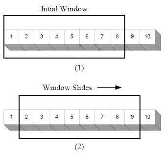
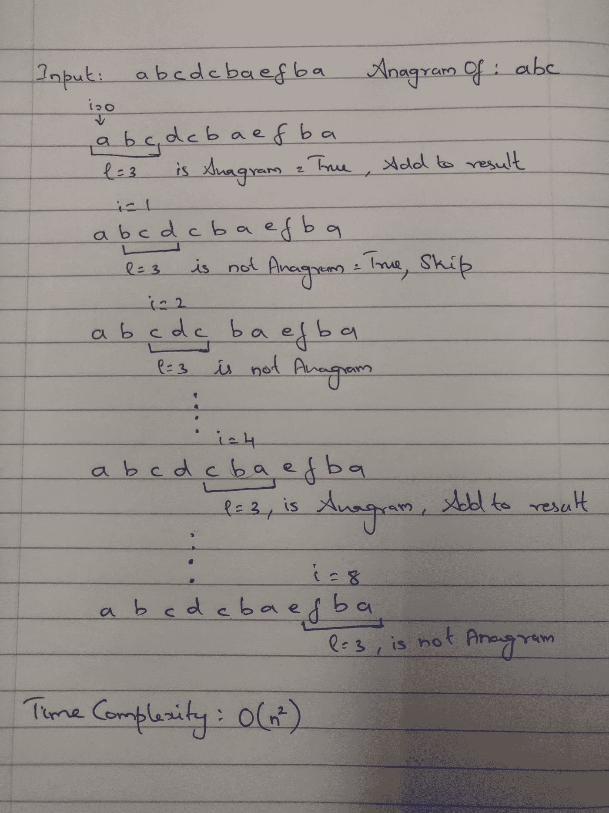

# 滑动窗口算法

> 原文：<https://medium.com/analytics-vidhya/sliding-window-algorithms-c1cdf2638487?source=collection_archive---------25----------------------->



滑动窗口

有一类问题，在编程面试中很常见，可以通过使用所谓的*滑动窗口*技术，以*优化*的方式来解决。通常这些问题有这些特征:

*   在算法中的任何时候，基于输入的子集做出决定
*   将会有更简单的方法来解决这个计算量很大的问题

让我们用一些代码的例子来看看我的意思。假设给你一个输入字符串和一个变位词字符串，要求你从输入字符串中找出所有变位词子字符串的起始索引，你会怎么做呢？一个简单的算法可能包括以下步骤:

```
For each index in the input string:
   For the substring input[index, index + length of anagram]:
      Check if the substring is an anagram, if yes add it to results
```

这里有一个相同的图示



这是它的代码:

```
**def** findAnagrams(s: str, p: str) -> List[int]:
    s_len, p_len = len(s), len(p)
    p_chars_freq = {c: 0 **for** c **in** p}
    **for** c **in** p:
        p_chars_freq[c] += 1
    result = []
    **for** i **in** range(s_len - p_len + 1):
        substr_start, substr_end = i, i + p_len
        remaining_chars_for_anagram = p_len
        p_chars_check_freq = {c: p_chars_freq[c] **for** c **in** p_chars_freq}
        **for** c **in** range(substr_start, substr_end):
            **if** s[c] **in** p_chars_check_freq **and** p_chars_check_freq[s[c]] > 0:
                remaining_chars_for_anagram -= 1
                p_chars_check_freq[s[c]] -= 1
        **if** remaining_chars_for_anagram == 0:
            result.append(i)
    **return** result
```

请注意，问题本身并不难解决，上述解决方案的时间复杂度为 O(n)。所以很自然，要问的问题是，我们能做得更好吗？

是的，我们可以，让我们看看怎么做。

在上图的两次迭代之间，真正改变的是什么？
1。我们省略了左边的字符，包括了右边的字符
2。因此，我们不必为中间的所有东西重新计算频率

让我们更详细地解释一下，我们需要什么来省略左边的字符:
如果它是变位词的一部分，那么增加频率计数并增加剩下的字符数，以成为变位词

b)包括右边的字符:
减少频率计数

让我们看看这在代码中是如何工作的

```
**def** findAnagrams(s: str, p: str) -> List[int]:
    """
    *s:* is the input string
    *p:* is the anagram
    """
    start_indices = []
    s_len, p_len = len(s), len(p)
    chars_left_to_be_anagram = p_len
    **if** s_len < p_len:
        **return** start_indices
    *# Keep a map of the frequency of characters in the anagram* p_char_freq = {}
**for** c **in** p:
        p_char_freq[c] = p_char_freq.get(c,0) + 1
    window_start_index = 0
    **for** window_end_index, current_char **in** enumerate(s):  **if** p_char_freq.get(current_char, 0) > 0:
            chars_left_to_be_anagram -= 1
        p_char_freq[current_char] = p_char_freq.get(current_char, 0) - 1
        **if** window_end_index + 1 - window_start_index == p_len:
            **if** chars_left_to_be_anagram == 0:
                start_indices.append(window_start_index)
            # If it was part of anagram then increase the no of chars left to form an anagram
            **if** p_char_freq.get(s[window_start_index], 0) >= 0:
                chars_left_to_be_anagram += 1
            p_char_freq[s[window_start_index]] = p_char_freq.get(s[window_start_index], 0) + 1
            window_start_index += 1
    **return** start_indices
```

嗯，大概就是这样。我们现在能够在线性时间内解决这个问题。在下一个帖子里，让我们来看看滑动窗口的其他问题。

参考:
[https://leet code . com/problems/find-all-anagrams-in-a-string/submissions/](https://leetcode.com/problems/find-all-anagrams-in-a-string/submissions/)