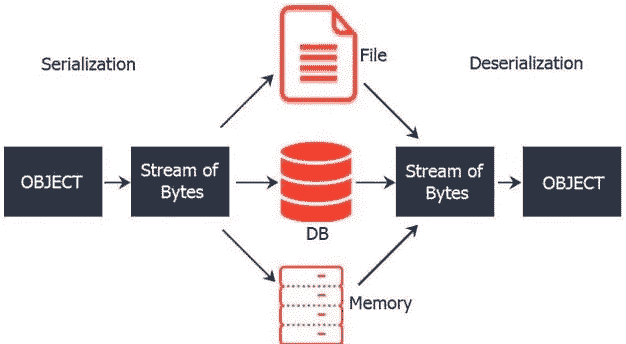
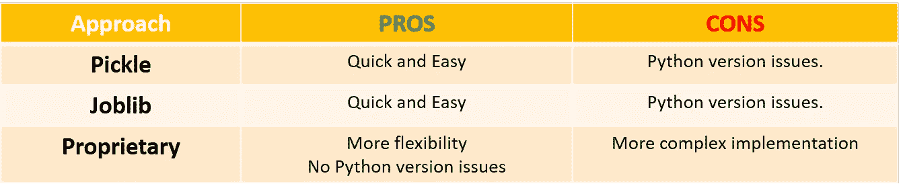
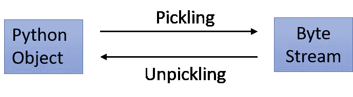

# 滑流-保存和加载已训练的 ML 模型

> 原文：<https://medium.com/analytics-vidhya/slipstream-saving-and-loading-trained-ml-models-99ab6efe0584?source=collection_archive---------30----------------------->



“Slipstream”是一系列帖子，我希望读者在其中找到关于应用于投资的机器学习主题的指导，如数据预处理、EDA、ML 模型、策略回溯测试和其他 ML 相关领域。我的例子和代码片段将会尽可能的简洁明了，以传达关键思想，而不是提供可读性差的冗长代码，这会损害帖子的目的。

机器学习模型训练可能是一项单调乏味的任务。除非我们有实时的需求来训练我们的模型——我..e .高频交易或短期投资范围策略—**提高效率的最佳方式是训练模型一次，保存并在最需要的时候上传**,例如与其他模型进行比较，或使用最新发布的预测数据(如收益数据)预测新结果。

此外，我们可以考虑在另一个项目/策略中使用相同的模型结果。因此，保存一个训练好的模型并在我们方便的时候上传它将会在我们的生产流程中节省大量的时间。这些**“保存”和“加载”过程也被称为** [**序列化和反序列化**](https://en.wikipedia.org/wiki/Serialization)

好消息是 Python 允许多种方法来执行我们的 ML 模型的序列化和反序列化: **pickle 模块、joblib 模块和专有开发。**下表提供了一个快速比较概述，当将 pickle 和 joblib 与一个更内部/专有的开发方法进行比较时，在灵活性和复杂性之间有明显的权衡。



出于说明的目的，在不考虑超参数优化、交叉验证或数据预处理的情况下，创建了一个简单的 ML 模型。**这篇文章的目标是理解如何保存一个模型——无论它是复杂还是简单—** 因此接下来的几行脚本就足够了。理想情况下，我们应该做一些超参数优化和交叉验证，但我们会把数据留给其他旨在优化算法的帖子。

数据收集是第一阶段。假设我们的目标是开发一个模型来预测可口可乐(股票代码:KO)的每日走势，那么我们使用 pandas_datareader 模块来下载安全价格信息。此外，我们将根据简单的移动平均线和收益滞后为我们的模型创建几个预测器。下一步是在“训练”和“验证”之间拆分数据，并使用训练指数来定义我们的训练样本。最后但同样重要的是，**我们运行一个简单的 logit 模型，以便有一个 ML 模型可以使用。**

```
# Modules
import time
import pandas_datareader.data as web
import numpy as np
import pandas as pd
import json
from sklearn.model_selection import TimeSeriesSplit
from sklearn.linear_model import LogisticRegression# data download:
t_list = [‘KO’]
s= ‘1999–12–31’
e= ‘2018–12–31’ # Training Period 2000–2018
df = web.get_data_yahoo(t_list, s,e) 
df = df[‘Adj Close’].copy() # Only Price# feature engineering: creating predictors
t=df.columns # ticker
# SMA Rule Signals: 
SMA_L=200
SMA_M=50
SMA_S=10
df[‘SMA_L’] = df[t].rolling(SMA_L).mean() 
df[‘SMA_M’] = df[t].rolling(SMA_M).mean() 
df[‘SMA_S’] = df[t].rolling(SMA_S).mean() 
df[‘X_ML_r’]= np.where(df[‘SMA_M’] > df[‘SMA_L’], 1, -1) 
df[‘X_SM_r’]= np.where(df[‘SMA_S’] > df[‘SMA_M’], 1, -1) 
df[‘X_SL_r’]= np.where(df[‘SMA_S’] > df[‘SMA_L’], 1, -1)# Lag returns binary signals:
lags=6 # number of predictors
df[t+’_1d_r’]= np.log(df[t] / df[t].shift(1))
for lag in range(1, lags + 1):
 df[t+’_’+str(lag)+’d_r’] =df[t+’_1d_r’].shift(lag)# Define Model X and y
df[t+’_y’] = np.sign(np.log(df[t].shift(-1)/df[t])) # dependent variable = 1 day future return on a binary basis
df.dropna(inplace=True)
X=df.filter(regex=’_r’).copy()
y=df[t+’_y’]
y.head(5)# train/validation split:
tscv = TimeSeriesSplit(n_splits=2) # generate train/cv indices => this generate 2 sets of train/cv indices
train_idx = list(tscv.split(df))[1][0] # take the second set of train indices
X=X.iloc[train_idx]
y=y.iloc[train_idx]# Model Training: Train simple Logit Model
model= LogisticRegression()
model.fit(X,y)
model.score(X,y)0.5158456228427989
```

既然我们的模型已经训练好了，那么让我们来讨论一下我们的三种方法，以便在将来有空的时候保存和加载它。

**方法 1: pickle 模块**
[Pickle 模块](https://docs.python.org/3/library/pickle.html)实现了一种基于二进制协议的算法，用于将 Python 对象结构 Pickle(序列化)成字节流，并将字节流解 Pickle(反序列化)回对象层次结构。Pickle 很容易实现，但是它也存在一些缺陷，比如处理大数据的困难、对导入其他库的依赖、缺乏压缩选项以及无法存储数据(例如结果等)。



首先，我们导入 pickle 库，并定义一个变量来存储一个字符串，该字符串带有模型将要被序列化的 pkl 文件的名称。pickle.dump()允许我们将模型保存在所需的位置:

```
# import library
import picklepkl_file = “LOG_model.pkl”# Save model in current folder
with open(pkl_file, ‘wb’) as file: 
 pickle.dump(model, file)
```

其次，我们将加载回我们的模型，并确认 logit 模型已被成功反序列化:

```
# Load Model
with open(pkl_file, ‘rb’) as file: 
 load_model = pickle.load(file)
# check model:
load_model.score(X,y)0.5158456228427989
```

显然，模型加载正在工作，因为我们获得了完全相同的结果。我们本来可以执行额外的测试，但是为了本文的简洁起见，前面的测试已经足够了。

**方法 2: Joblib 模块**
[Joblib 模块](https://scikit-learn.org/stable/modules/model_persistence.html)是 [scikit-learn 模块](https://scikit-learn.org/stable/index.html)中的内置方法，可以更好地处理大数据。Joblib 也以 pickle 格式保存模型，但是代码可读性显著提高，因为不需要导入其他库，而且它还允许存储数据。此外，Joblib 可以处理文件对象和字符串文件名，而 Pickle 需要一个文件对象作为参数。最后但同样重要的是，在选择压缩格式(gzip、zlib、bz2’)和压缩程度时，Joblib 提供了更广泛的选项。

下面几行代码提供了 joblib 的一个简单实现，用于最初保存我们的模型:

```
# import library
from sklearn.externals import joblib
# Save model in current folder:
jl_file = “jl_LOG_model.pkl” 
joblib.dump(model, jl_file)
```

我们将再次通过加载以下内容来检查反序列化是否有效:

```
# Load Model
jl_load_model = joblib.load(jl_file)
# Check Model
jl_load_model.score(X,y)0.5158456228427989
```

我们的加载模型提供了相同的结果，所以这里也没有问题。正如上面的截图所示，与 Pickle 的纯对象语法相比，joblib 允许以字符串格式传递文件对象和名称；这在使用 joblib 时提高了代码的可读性。

**方法 3:专有**
构建一个 ML 模型综合类来序列化和反序列化 JSON 格式的模型的可能性，允许完全控制哪些数据需要存储以及如何存储，此外还可以用任何文本编辑器打开 JSON 文件进行可视化检查。需要注意的一点是代码的可读性，因为随着需要更多的灵活性，语法的复杂性也会增加。另一个缺点是使用 JSON 格式而不是字节流，这对我们的基础设施的安全性有负面影响。最后但同样重要的是，如果 ML 研究者增加了任何新的变量/预测因子，这种方法需要持续修正；此外，有时 Python 中的 sklearn ML 模型对象可能有不同的结构，因此迫使管理员进一步调整下面的代码。

下面的脚本展示了如何构建一个类来实现这个目的。首先，观察我们的类“my_model”是作为子类构建的，继承了父类(即“model”对象)的方法和属性。一旦新的子类“my_model”被创建，用户可以调用三个方法:

*   **Mimic:** 通过复制一个已经创建的模型对象的实例来创建模型，该模型对象将作为新参数传递到函数(model_inst)中。
*   **保存:**将模型信息以 json 格式保存在所需的目的地/名称(路径)中。
*   **加载:**从指定的目的地/名称(路径)加载 json 格式的模型信息。

```
## Import libraries
import json# Reboot model object (Parent Class):
model= LogisticRegression()# Create Synthetic ML Model Class:
# build model class based on our model instance class e.g. LogisticRegression, SVM, etc
# Note; 
class my_model(model.__class__): 
    def __init__(self):
        model.__class__.__init__(self) # 1def mimic(self, model_inst):
 ‘’’
 Create model based on copying an instance of an already created model 
 Parameter
 — — — — -
 model_inst = enter model object instance with trained/fitted model
 ‘’’
    list_ = list(filter(lambda x: x.endswith(‘_’)!=0 and      x.startswith(‘_’)==0 ,dir(model_inst))) # instance attributes (ending “_”)
    for i in list_: # 2
        setattr(self,i,eval(‘model_inst.’+eval(‘i’)))

 def save(self,path):
 ‘’’
 Save model information using json format.
 Params
 — — — 
 path = file name using “name.json” format including path address where it will be stored in a different \
 directory than the current folder.

 ‘’’
     dict_={‘path’:path}
     array_param=[]
     for i in self.__dict__.keys():
         dict_[i]= eval(‘self.’+eval(‘i’))
         if type(dict_[i]).__name__== ‘ndarray’: # 3
             array_param.append(i)
             dict_[i]=dict_[i].tolist() # 4 
     dict_[‘array_param’]=array_param # 5
     json_ = json.dumps(dict_, indent=4)
     with open(path, ‘w’) as file:
         file.write(json_)

 def load(self,path):
 ‘’’
 Load model information using json format.
 Params
 — — — 
 path = file name using “name.json” format where the model info will loaded \
 including path address if the json file is in a folder different than the \
 current working directory
 ‘’’
     with open(path, ‘r’) as file:
         dict_load = json.load(file)
         for p in dict_load[‘array_param’]:
             dict_load[p] = np.array(dict_load[p]) # 6

     for i in dict_load.keys():
         setattr(self,i,dict_load[i])
```

为了阐明脚本中列举的代码行，下面几行提供了一些解释:

1.  初始化该类以加载父类的默认参数。
2.  Mimic 创建一个已训练模型对象(model_inst)的基本属性列表，允许在未来的会话中加载模型，而无需进一步训练。指出 [setattr](https://docs.python.org/3/library/functions.html#setattr) 是一个非常有用的内置方法，可以在类中使用循环来分配新属性。
3.  这一行测试元素是否是数组对象。
4.  这一行将数组元素转换成列表，因为 json 格式不支持数组对象。
5.  存储数组元素的名称对于将来加载模型时将它们转换回数组对象是很重要的。
6.  将先前标识为数组格式的元素转换为数组格式，这些元素先前存储在 save()方法中名为“array_param”的属性中。

在进入下一部分之前，我们可以测试我们的类是否如预期的那样运行:

```
# Create new model instance:
test=my_model()
# Create a synthetic replica of our trained ML model object instance:
test.mimic(model)
# Save our new synthetic model configuration:
test.save(‘test.json’)# Restart your kernel/session
# Load your X,y data again
# Load ML Model:
load_model = my_model()
load_model.load(‘js.json’)
load_model.__dict__ # check trained ML model info (coefficients, etc) is loaded
```

输出如下所示:

```
{‘penalty’: ‘l2’,
 ‘dual’: False,
 ‘tol’: 0.0001,
 ‘C’: 1.0,
 ‘fit_intercept’: True,
 ‘intercept_scaling’: 1,
 ‘class_weight’: None,
 ‘random_state’: None,
 ‘solver’: ‘liblinear’,
 ‘max_iter’: 100,
 ‘multi_class’: ‘ovr’,
 ‘verbose’: 0,
 ‘warm_start’: False,
 ‘n_jobs’: 1,
 ‘path’: ‘js.json’,
 ‘classes_’: array([-1., 0., 1.]),
 ‘coef_’: array([[-0.01761617, 0.03940818, -0.04529708, -0.22983772, 0.54803269,
 -0.19148281, 0.13275605, 0.32121991, 0.21970841],
 [-0.08148684, 0.20891583, -0.22773737, -0.07924449, -0.0869601 ,
 0.02197722, 0.07910192, 0.12206928, -0.03592072],
 [ 0.0194266 , -0.04965671, 0.05607809, 0.30001922, -0.47147896,
 0.1708758 , -0.20327823, -0.4302993 , -0.18861738]]),
 ‘intercept_’: array([-0.08293168, -4.40521989, 0.0394294 ]),
 ‘n_iter_’: array([7]),
 ‘array_param’: [‘classes_’, ‘coef_’, ‘intercept_’, ‘n_iter_’]}
```

我们最后的 acid 测试用训练数据检查分数:

```
load_model.score(X,y)0.5158456228427989
```

**其他方法:超越本地地平线**
这篇文章旨在帮助读者更轻松地保存和加载本地机器学习实验的模型。然而，**这些方法在处理为企业目的插入生产中的巨大模型或大数据模型时存在不足**。幸运的是，有其他方法可以使用远程数据库或云计算工具非本地地管理/存储模型，这使我们能够更有效地保存和加载 ML 模型，下面给出了一些例子:

*   将模型保存为文件，并将它们推送到一个 [GIT LFS(大型文件存储)存储库中。](https://git-lfs.github.com/)
*   将模型保存在 SQL 数据库或非 SQL 数据库中(例如 [MongoDB](https://www.mongodb.com/cloud/atlas/lp/general/try?utm_source=google&utm_campaign=gs_emea_united%20kingdom_search_brand_atlas_desktop&utm_term=mongodb&utm_medium=cpc_paid_search&utm_ad=e&gclid=CjwKCAiA6vXwBRBKEiwAYE7iS7KNt9Ufo00bSj3Wq_HtMh7D40Xctalv8r4d0Lm2tpTwrOTrKYkxJBoC42sQAvD_BwE) )
*   一些 ML 库比如 [Tensorflow](https://www.tensorflow.org/tfx/guide/serving) 有内置的保存/加载方法。
*   像 [AWS 的 S3](https://aws.amazon.com/s3/) 这样的云产品允许将我们的模型保存为对象而不是文档，因此这对于大型项目来说是非常好的，但是需要进行一些成本分析以确保我们不会超出预算，此外当存储对象而不是文件时，ML 模型管理会更加混乱。
*   其他库/开源解决方案也是:；
*   [数据块](https://databricks.com/blog/2018/06/05/introducing-mlflow-an-open-source-machine-learning-platform.html)
*   [Datmo](https://github.com/datmo/datmo)
*   [Vespa 发动机](https://github.com/vespa-engine/vespa)
*   [联系](https://nexpy.github.io/nexpy/)
*   [DvC](https://dvc.org/)
*   [H20](https://www.h2o.ai/products/h2o-driverless-ai/)

前一种方法在管理 ML 模型管道方面更现实，但是它们超出了本文的范围。“滑流”系列的后续文章将深入探讨与 ML 管理相关的更复杂的问题。

**推荐资源:**

*   **教程:** [Python 类](https://www.w3schools.com/python/python_classes.asp)
*   **Github:**脚本