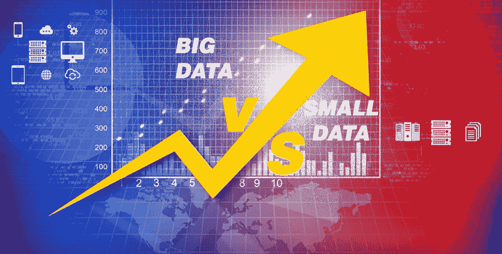
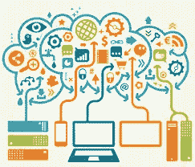
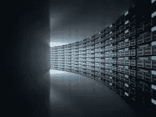
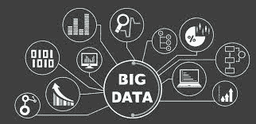

# 小数据与大数据

> 原文：<https://medium.com/analytics-vidhya/small-data-vs-big-data-30a38f129074?source=collection_archive---------6----------------------->

除了 3V 的！

这很常见，你们都必须意识到大数据主要由 3V 定义，即多样性、速度和容量。
**量:**数据量巨大。 **种类:**包含多种形式的数据。
**速度:**以近乎实时的方式持续分析海量的流数据。
但是大数据和小数据之间还有更多区别。让我们来看看这些:

***目标:*** 小数据通过分析数据，帮助完成单个任务。而在大数据中，目标会发生变化，并重定向到一些意想不到的情况。我们可以在开始时有一个特定的目标，随着时间的推移它会发生变化。

大型数据分布在云环境中的不同服务器上。

***位置:*** 小型数据通常位于数据库或本地 PC 的单个文件中的一个位置。但是大数据分布在云上多个位置的多台服务器上。

***结构:*** 与单个表中的结构化小数据相比，大数据可以是跨多个来源的半结构化或非结构化数据。

***数据准备:*** 小数据通常是最终用户为了自己的特定目标而准备的。所以放数据的人知道数据的用途以及从数据中得到什么。另一方面，大数据是由一群可能不是最终用户的人准备的。因此，处理数据所需的协调非常先进。

大数据、大存储

***寿命:*** 小数据可以保留一段时间，或者我们可以说保留到项目结束。但是无限时间存储是大数据的要求。

***再现性:*** 如果数据偶然丢失或有任何错误，那么在小数据的情况下可以重新制作，但是在大数据中复制是不可行的。因此，任何要删除的坏数据都应该在删除前仔细研究和分析。

***利害风险:*** 在小数据中风险是有限的。而在大数据中，风险是巨大的，因为涉及的资金、人力、材料和时间都很高。

**但是在大数据中，许多格式的许多文件可能很难找到。如果没有适当的记录，那么就很难解释这些数据。**

可以基于各种数据进行许多不同形式的分析。

***分析:*** 小数据可以在一台机器上用一个程序进行分析。而大数据可能需要分解，在分布式环境中使用不同的方法逐步分析。

嗯，除了我想分享的主要的 3V 之外，还有一些不同之处！

希望你喜欢这些内容！