# 具有注意机制的智能预测器

> 原文：<https://medium.com/analytics-vidhya/smart-composer-with-attention-mechanism-b67e798803b3?source=collection_archive---------6----------------------->

**目录**

1.  注意机制导论。
2.  问题陈述。
3.  数据准备
4.  Seq2Seq 建模，编解码，注意层。
5.  结果
6.  未来的工作
7.  参考

# **1。注意力机制介绍**

这里是我在[之前的博客](/@amanvaryani1910/attention-mechanism-in-detail-42f4d9914d10)中对注意力机制的详细描述，它涵盖了注意力如何工作的所有细节。

当我们想到英文单词“Attention”时，我们知道它的意思是将你的注意力集中在某件事情上，并给予更多的关注。深度学习中的注意力机制基于这种引导你的注意力的概念，在处理数据时，它更加关注某些因素。

让我们用这个例子来理解，假设你开始读小说，由于某种原因，你在 5-10 天内不能读小说。当你在 5-10 天后继续你剩余的小说时，你将不会再读这部小说。你只需要注意你记得整个故事的情节。注意力就像预测下一句话一样，预测者不会记住整个输入。

# **问题陈述**

众所周知，当你给某人写信息时，你会得到下一个单词的预测。

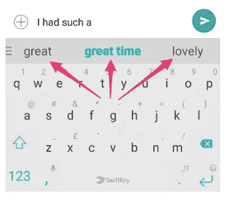

因为它最多只提供两三个单词的预测。

**2。谷歌自动完成**

Google 建议自动完成你的句子，这也是一个基于模型的解决方案，考虑到目前为止输入的搜索短语，并在趋势搜索中运行前缀搜索。

**3。GMAIL 智能撰写**

正如你在上面的例子中所看到的，单词级预测最适合较短的句子，但是在电子邮件中，你的句子会根据情况而变化。因此，用户需要输入的内容越少，效率就越高。如果你仔细观察，你会发现用户重复很多句子，从问候到基本问题。

智能合成不同于其他单词级预测。它不仅使用当前文本，还使用电子邮件的主题和您发送给该人的前一封电子邮件。它还可以记录时间，所以在写问候的时候，它也会自动完成你的问候。

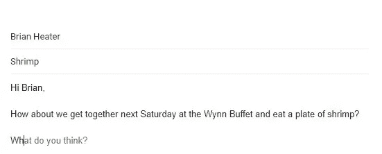

所以我试着做了一个智能写作的原型，它通过用户输入的前一个单词来预测下一个句子。由于它不是 s [mart compose](https://arxiv.org/abs/1906.00080) 的精确复制品，开发者使用了许多东西来预测下一句话和多年的研究。这个项目背后的主要动机是让人们清楚地了解注意力是如何工作的，并尽可能得到最好的结果。

在深入研究技术代码之前，有一个小提示:如果你对 LSTM、RNN、Seq2Seq 和 Attention 有基本的了解，你会对代码有清晰的理解。顺便说一句，我保证尽可能简单地交付它。

# **数据准备**

我使用了 kaggle 上的[安然电子邮件数据集](https://www.kaggle.com/wcukierski/enron-email-dataset)。安然电子邮件数据集包含大约 500，000 封由安然公司员工生成的电子邮件。这是联邦能源管理委员会在调查安然公司倒闭时获得的。

或者你可以通过 python 中的 [API](https://tobler-optik.ch/blbjq/python-extract-data-from-email.html) 来使用你自己的电子邮件数据集。

使用安然电子邮件数据集时，第一步是将所有信息压缩成两列。这里是[提取信息](https://github.com/amanv1906/SMART-COMPOSER-WITH-ATTENTION-MECHANISM/blob/master/EXTRACTING_DATA.ipynb)的链接。

提取数据后，我们只需要包含电子邮件消息部分的消息正文，如下所示。

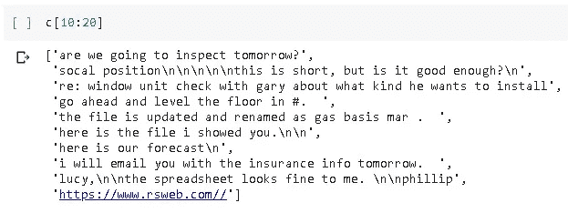

msg _ 安然电子邮件正文

我们要做的第一件事是预处理数据，因为你可以看到数据非常脏，它包含许多不必要的符号。

最近，在语言模型的开发中使用神经网络已经变得非常流行，以至于它现在可能是优选的方法。

在语言建模中使用神经网络通常被称为神经语言建模，或简称为 NLM。

无论是在独立的语言模型上，还是在语音识别和机器翻译等具有挑战性的任务上，神经网络方法都比经典方法取得了更好的结果。

具体而言，采用单词嵌入，其使用实值向量来表示投影向量空间中的每个单词。这种基于单词用法的单词学习表示允许具有相似意思的单词具有相似的表示。

你可以把基于单词的语言模型想成这样:

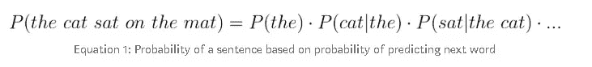

简单地说，语言模型的目标是分解文本语料库，并为文本序列分配概率，通常是一次一个单词。(但也有其他变种)。

我使用了一个字符一个字符的模型，而不是逐字逐句。

对语言建模的理解超出了本博客的范围，我们使用语言建模来生成 seq。

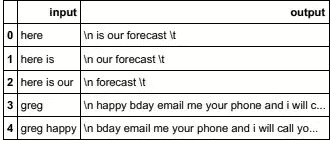

\n 和\t 只是句首和句尾的前缀和后缀。我附上这个是因为在预测给定输入的句子时，我们的模型知道什么时候开始，什么时候结束。如果你开始输入***【w】****它就会预测到 ***【如你日】*** *。*所以我们可能需要一个比单词级的 LM 更细粒度的 LM。对于机器学习和深度学习任务，给定的输入可以是任何形式，因此应该转换为数字数据。对于这个任务，我们的输入是句子，所以我们必须对输入进行标记，并制作包含特定单词索引映射的字典。*

*上述函数逐个字符地标记句子并填充序列。*

*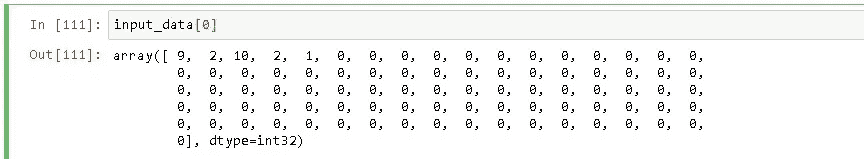*

*我们的输入将如下所示。*

*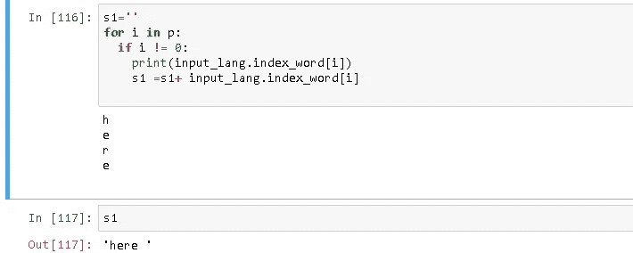*

# *Seq2Seq 建模，编解码，注意层。*

*顾名思义，seq2seq 将一个单词序列(一个或多个句子)作为输入，并生成一个单词输出序列。这是通过使用递归神经网络(RNN)来实现的。虽然很少使用 RNN 的普通版本，但它的更高级版本，即 LSTM 或 GRU，会被使用。这是因为 RNN 面临着梯度消失的问题。它通过在每个时间点获取 2 个输入来发展单词的上下文。一个来自用户，另一个来自之前的输出，因此称为递归(输出作为输入)。*

*下面提到 seq2seq 模型有许多变体。*

*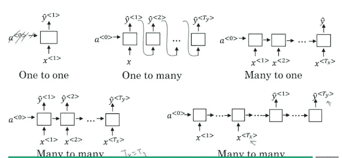*

*对于我的任务，我使用了多对多，因为我不知道我的输出句子长度会是多少。*

*它主要由两部分组成，即*编码器*和*解码器*，因此有时被称为**编解码网络**。*

***编码器:**使用深度神经网络层，将输入的单词转换成相应的隐藏向量。每个向量代表当前单词和单词的上下文。*

***解码器:**类似于编码器。它将编码器生成的隐向量、自身的隐状态和当前单词作为输入，产生下一个隐向量，并最终预测下一个单词。*

*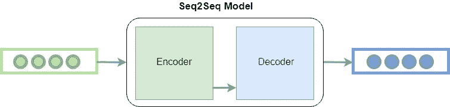*

*让我们开始:*

*你可以在最后提供的 github 链接中找到所有必要的代码*

***建筑:-***

## *编码器*

***第一步编码器部分***

*编码器是简单的 LSTM 层，在每个时间步
接受单一输入。返回状态将为真，即先前时间步
的隐藏状态将输入当前时间步的 LSTM 状态。*

*一个数据序列，即一个句子，被传递到编码器，
记住，在将该序列数据传递到编码器或
解码器之前，必须对该序列应用填充和标记
，与传递到 LSTM 模型的序列数据相同。*

***注意:***

***第二步:注意部分***

*在前一层(编码器)中生成的权重向量和输出被传递给关注层
。在注意层中，隐藏状态和输出通过密集层，以便它们可以用反向传播
来训练，在此基础上应用双曲正切激活函数，然后与可训练向量相乘。
之后，应用 softmax，整个向量的和变为 1，向量中的每个值在 0 和 1 之间变化
，从而知道每个时间步长的每个输入的权重。*

# *注意机制*

1.  *隐藏形状== (Batch_Size，隐藏单位)*
2.  *y_hidden_states =(批量大小 x 1 x 隐藏单位)*
3.  *我们这样做是为了执行加法来计算分数*
4.  *并将密集层的两个输出相加*
5.  *现在，来自密集层的输出的总和与编码器输出的输出相加，并且与 tanh 和单个单位密集层相加*
6.  *分数形状==(批处理大小，序列长度，1)*
7.  *我们在最后一个轴上得到 1，因为我们对 self 应用了分数。V*
8.  *应用 self 之前张量的形状。v 是(批量大小，最大长度，单位)*
9.  *我们将 softmax 应用于分数，以获得 0 和 1 之间的值，值的总和= 1。应用 axis = 1 的原因是因为默认情况下 softmax 仅应用于最后一个轴，但我们必须应用于 Tx 状态(Tx 是超参数)*
10.  *上下文向量形状=(批量大小，隐藏单位)*

***解码器:***

***第三步。解码器部分***

*到解码器层的输入也与在前一层中生成的上下文向量连接(注意)
，并且该连接的向量作为输入被传递到解码层，如图所示。解码器将在每个时间步长生成输出。将这些生成的输出与目标值进行比较，并反向传播所有层以获得最佳权重。*

# *培训:-*

*定义优化器、损失函数和精度函数。*

*使用急切执行，我们为 10 个时期训练网络。要阅读更多关于渴望执行的内容，请参考官方文档 [*此处*](https://www.tensorflow.org/guide/eager) 。*

*输出:*

*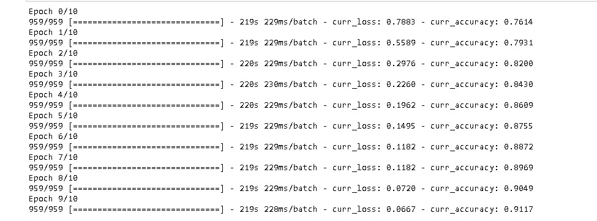*

## *绘图的可视化:*

*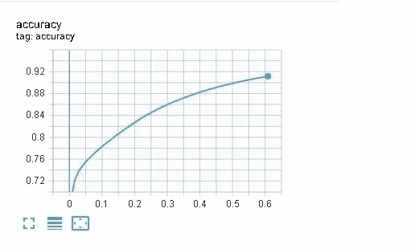**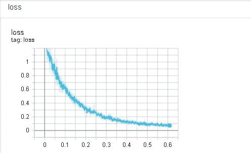*

## *测试:*

*对于测试，我们使用 bleu 评分。BLEU score 计算句子的相似度，我们通过预测句子和实际句子，检查我们的预测输出是否与实际相同。*

*例如:*

*输入序列是我的模型所采用的，预测序列是当输入序列通过模型时，我们得到的预测输出。 [BLEU SCORE](https://machinelearningmastery.com/calculate-bleu-score-for-text-python/) 是当预测输出包含与原始句子中相同的单词时，输出为一个 eg。*

*original = [['this '，' is '，' small '，' test']]*

*预测= ['this '，' is '，' a '，' test']*

*BLEU 评分:0.75(因为我原来的句子里没有 a。*

*当 t 在那里时我们停止，这意味着句子在那里结束。*

*测试句子的可视化:*

*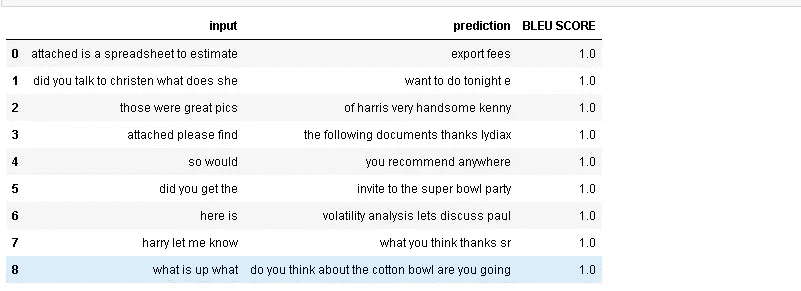*

## *未来工作:-*

*尝试用 flask 做一个 web app。*

*使用变压器*

# *参考:-*

1.  *[https://www . coursera . org/lecture/NLP-sequence-models/Attention-model-lSwVa](https://www.coursera.org/lecture/nlp-sequence-models/attention-model-lSwVa)(吴恩达关于注意力的解释)*
2.  *https://arxiv.org/abs/1409.3215*
3.  *【https://keras.io/examples/lstm_seq2seq/ *
4.  *[https://arxiv.org/abs/1406.1078](https://arxiv.org/abs/1406.1078)*
5.  *[https://machine talk . org/2019/03/29/neural-machine-translation-with-attention-mechanism/](https://machinetalk.org/2019/03/29/neural-machine-translation-with-attention-mechanism/)*
6.  *[https://www . Applied ai course . com/course/11/Applied-Machine-learning-course](https://www.appliedaicourse.com/course/11/Applied-Machine-learning-course)*

## *代码:-*

*你可以在 github repo [这里](https://github.com/amanv1906/SMART-COMPOSER-WITH-ATTENTION-MECHANISM)获得我的完整代码*

*[领英](https://www.linkedin.com/in/aman-varyani-885725181/)*