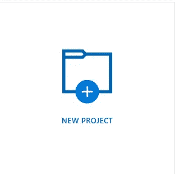
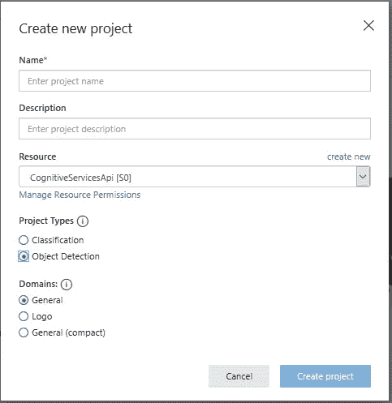
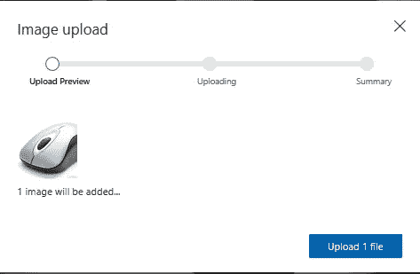
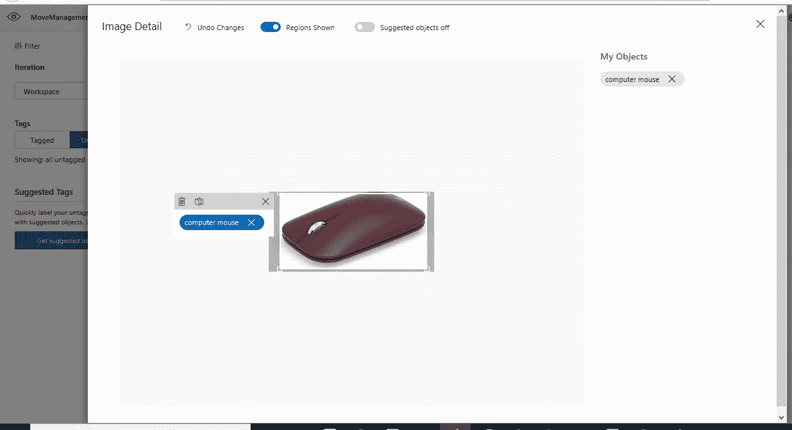
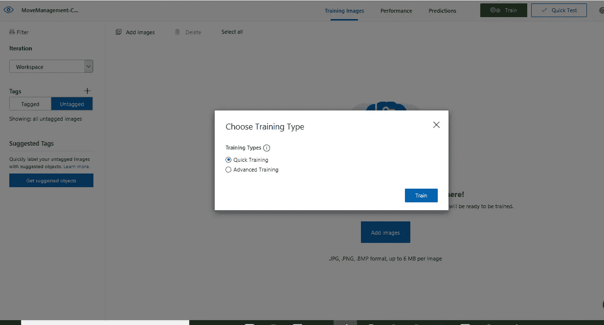

# 可以检测你周围物体的智能电源应用程序

> 原文：<https://medium.com/analytics-vidhya/smart-powerapps-which-can-detect-objects-around-you-27ad829b4ec4?source=collection_archive---------22----------------------->

运营效率是一种传统的资产，自从人类开始评估所做的工作产生的吞吐量以来就一直存在。数字化转型将运营效率放在首位，其理念是将自动化发挥到极致，让人类只做机器还做不到的事情。

让我们举一个例子，在你的办公室空间中识别可能需要特定团队注意的物体，例如一把坏了的椅子或一个坏了的桌面、鼠标、显示器、键盘、白板等。PowerApps 可以利用 Azure Custom Vision 来识别和自动化这些东西，从而提高效率并缩短解决问题的时间，而不是创建进入服务台的票证或手动通知指定的团队。

第 1 步——使用免费订阅创建一个 Azure 帐户[,前提是你还没有](https://azure.microsoft.com/en-in/free/)

步骤 2 —登录 [Azure 定制视觉认知服务](https://www.customvision.ai/)

步骤 3 —创建新项目并添加所需的详细信息(选择对象检测)



第 4 步—点击创建项目。现在，您需要有目标对象的样本图像，使用这些图像，您可以开始为对象检测训练模型。你需要至少 15 张图片来训练模型。

第 5 步—点击右上角的“添加图片”,上传所有选中的图片。



第 6 步—将出现一个窗口，允许您标记图像。例如，如果它是一个鼠标，然后在标签中添加“计算机鼠标”,并选择图像中覆盖整个鼠标的区域。



第 7 步—一旦完成，我们需要训练模型。点击右上角的“训练”按钮，训练模型。如果您给出了许多样本图像，这将需要几分钟时间。



步骤 8-一旦完成训练，您就可以使用“发布按钮”来发布模型

步骤 9-单击发布按钮将在弹出窗口中显示 API 端点、URL 和订阅密钥。复制详细信息，因为它将用于编写我们的自定义服务，以与 PowerApps 集成。

步骤 10-编写 Python Flask 服务，将图像作为输入，并使用我们新训练的自定义鼠标视觉模型来检测对象。下面是示例代码。请确保代码正确对齐和缩进。有关 Python-Flask 的更多详情，请访问 https://realpython.com/tutorials/flask/—

```
[@app](http://twitter.com/app).route('/scanner/product', methods=['GET'])
def scan_product():
 try:
 # Needs Blob conainer name and image name as an input 
 container_name = request.args['cntrname']
 image_name = request.args['imagename']

 #Detail of Blob container where PowerApps will upload the image - URL, container name required
 container_url = "your container URL" + container_name
 image_url = container_url + "/" + image_name

 # Place your custom vision prediction key here
 headers = {'Prediction-Key': 'your prediction key',
 'Content-Type': 'application/json'}
 data = {'url': image_url}

 product_vision_url = "your vision url"
# Logic to get the object in response
 prod_response = requests.post(
 product_vision_url, headers=headers, json=data)
 prod_response.raise_for_status()
 prod_analysis = prod_response.json()
 my_dict = prod_analysis['predictions']
 p_name = ""
 confidence1 = 0
 for i in range(0, len(my_dict)):
 confidence2 = my_dict[i]['probability']
 if(confidence2 > confidence1):
 confidence1 = confidence2
 p_name = my_dict[i]['tagName']
 else:
 pass
Result_json = {"result_string": p_name}
 return jsonify(Result_json)
 except Exception as e:
 return jsonify(e)
```

步骤 11-创建一个包含以下控件的 PowerApps 一个用于拍照的相机控件，一个显示检测到哪个对象的标签，以及一个提交票据的按钮

步骤 12 —在 PowerApps 中创建一个 Azure Blob 连接器。使用 Azure Blob 连接器，将从 PowerApps 相机拍摄的图像上传到 Azure Blob 中的特定容器。选择相机时，执行以下操作-

```
Set(
 __image_name,
 "office-object" & Text(
 Now(),
 "[$-en-US]mm-dd-yyyy-hh-mm-ss"
 ) & ".png"
);Set(
 __image_content,
 card_cam.Photo
);AzureBlobStorage_1.CreateFile(
 "your container name",
 __image_name,
 card_cam.Photo
);
```

步骤 13 —在 PowerApps 中创建自定义连接器。更多详情请参考链接—[https://docs . Microsoft . com/en-us/connectors/custom-connectors/define-blank](https://docs.microsoft.com/en-us/connectors/custom-connectors/define-blank)

步骤 14 —在步骤 12 中的代码后添加以下公式。所以最终的代码变成了—

```
Set(
 __image_name,
 "office-object" & Text(
 Now(),
 "[$-en-US]mm-dd-yyyy-hh-mm-ss"
 ) & ".png"
);Set(
 __image_content,
 card_cam.Photo
);AzureBlobStorage_1.CreateFile(
 "your container name",
 __image_name,
 card_cam.Photo
);Set(
 __response,
 CustomConnectorName.OfficeProductDetector(
 {
 cntrname: "Your container name here",
 imagename: __image_name
 }
 ).result_string
);
```

第 15 步—使用变量保存响应，并在新屏幕的标签中显示。

步骤 16——为了进一步自动化，您可以编写另一个服务，比如使用 REST API 调用在 Service Now 中创建一个票证，公开该服务并将其作为自定义连接器添加到 PowerApps 中。

第 17 步—调用自定义连接器中的新服务，单击按钮即可创建服务中的票证。

希望这有所帮助。虽然这不是一个有清晰步骤的详细教程，但它仍然可以帮助有基础知识的初学者思考和做事。