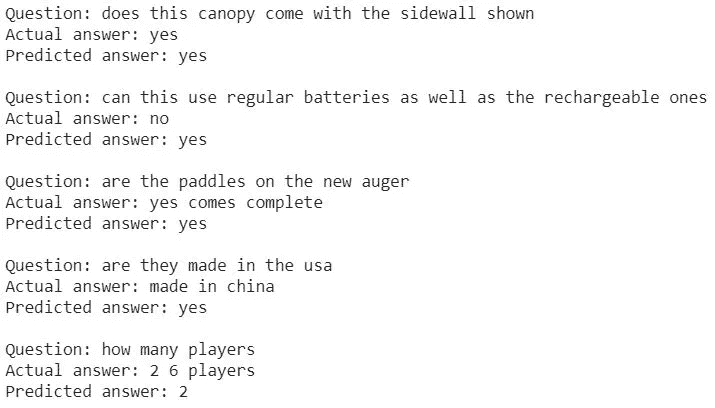

# 智能回复:问题的自动响应生成

> 原文：<https://medium.com/analytics-vidhya/smart-reply-automated-response-generation-for-question-5111f2173de?source=collection_archive---------10----------------------->

[高效智能回复，现为 Gmail](http://ai.googleblog.com/2017/05/efficient-smart-reply-now-for-gmail.html)

在这篇文章中，我将展示深度学习模型在自动回答问题中的应用。

首先，我将这篇文章分成以下几个部分:

1.  问题陈述
2.  资料组
3.  拟议解决方案
4.  密码
5.  结果
6.  观察
7.  限制
8.  未来范围
9.  确认

# 问题陈述

*   尽管社交网络平台越来越多，电子邮件仍然是互联网上最受欢迎的交流方式之一。

> 根据[的研究](https://arxiv.org/abs/1606.04870)，在电子邮件回复对中，观察到大约 25%的电子邮件回复有 20 个或更少的标记。

*   如果在用户回复电子邮件时向他们建议一些简短的电子邮件回复，他们会受益；因此，节省了他们的时间。
*   这个生成对电子邮件的响应的问题可以映射为生成对用户问题的智能响应。
*   通过利用已被证明有效解决基于文本的神经机器学习问题的深度学习技术，本案例研究旨在为用户的问题生成智能响应，并节省用户为常见问题寻找答案的时间。

# 资料组

*   捕捉足够和有效的电子邮件回复对来训练深度学习模型是一项具有挑战性的任务，因此，这里的想法是解决映射的问题陈述，并使用开放数据集之一— [亚马逊 QA 数据](http://jmcauley.ucsd.edu/data/amazon/qa/)。
*   通过两次迭代从公共数据集中提取要素。
*   在每一次迭代中，深度学习模型都被训练来评估模型的功效。

## 迭代— I

*   数据是为 ***17 个产品类别*** 下载的，这些产品类别可在“有多个答案的问题”部分找到。

图 1:示例问题和答案的快照

*   如上面的快照所示，解决这个问题的有用特性是“问题”和“答案”字段。
*   提取的原始数据存储在数据框中，它有 ***四百万个问答对*** *。*
*   我们执行了探索性数据分析(EDA)来提取有意义的问答对，一些分析快照如下所示:

图 2:问题的类型及其数量

*   上图显示，与是/否相比，开放式问题更多。

图 3:问题长度及其数量

*   上图显示，大部分问题都在 20 个字以上。

图 4:问题的前两个单词及其计数

*   上图可见问题种类繁多，大部分问题都有共同的前两个字。

图 5:问题的答案数量及其计数

*   上图显示，大部分问题都有不止一个答案。

图 6:答案的长度和数量

*   上图显示，大部分答案的长度大于或等于 2。

图 7:答案的前两个单词及其计数

*   上图显示，很多答案开头都是同样的前两个字。
*   在对基于文本的数据，即“问题”和“答案”进行预处理后，在 ***周围选择 213K 问答对*** 用于训练深度学习模型。
*   基于数据分析和预处理的结果，问题和答案的最大长度分别设置为 11 和 3。

## 迭代-II

*   通过填写[请求表](https://forms.gle/A8hBfPxKkKGFCP238)来获取更多数据([元数据](https://nijianmo.github.io/amazon/index.html)，以改进评估指标和模型预测。

图 8:元数据的快照

*   元数据中有几个可用的特性，如上面的快照所示，特性“title”、“price”和“image”被选择用于提取。
*   数据(特征“问题”和“答案”)和元数据(特征“标题”、“价格”和“图像”)是为*14 个产品类别获取的，因为其他产品类别没有数据或元数据。*
*   *应用一些数据过滤逻辑来加速元数据特征提取过程，并且随后执行 EDA。*

**

*图 9:标题长度直方图*

*   *上图可以看出，大部分标题的字数都在 20 个字以内。*
*   *接下来，合并数据(特征“问题”和“答案”)和元数据(特征“标题”、“价格”和“图像”)，并分析图像特征。*

**

*图 10:每个图像形状的图像数量*

*   *上图显示，大多数图像的宽度和高度为 40 和 3 个通道。*
*   *对合并后的数据(特征“问题”、“答案”、“标题”、“价格”和“图片”)进行预处理后，在 ***周围选取 32K 个数据点*** 用于训练深度学习模型。*
*   *基于数据分析和预处理的结果，问题、标题和答案的最大长度分别设置为 11、13 和 3。*
*   *根据数据分析和预处理的结果，将图像的大小设置为(40，40，3)。*
*   *当产品特定信息与用户的问题一起提供时，这种迭代将有助于分析模型预测和评估指标的质量。*

# *拟议解决方案*

*   *深度学习技术，如序列对序列模型、变压器模型等。已经证明对于解决一些基于自然语言处理(NLP)的机器学习问题是有效的。*
*   *[***序列到序列建模技术***](https://arxiv.org/abs/1409.3215) 被用来解决这个问题的陈述。*

## *迭代— I*

**

*图 11:数据准备、模型构建、模型训练和模型评估中涉及的步骤*

*   *上图概述了从数据准备到模型评估的高级步骤。*

******

***图 12:基线模型***

******

***图 13:带有生成嵌入层的遮罩的基线模型***

******

***图 14: [注意](https://arxiv.org/abs/1409.0473)带有自定义遮罩生成层的模型***

******

***图 15: [注意](https://arxiv.org/abs/1409.0473)带有遮罩生成层的模型***

*   ***一旦确定了最佳模型，就在一个系统上模拟模型部署，该系统使用下面的体系结构来生成对用户问题的自动响应:***

******

***图 16:新数据点的模型推理中涉及的步骤***

## ***迭代-II***

******

***图 17:数据准备、模型构建、模型训练和模型评估中涉及的步骤***

*   ***上图概述了从数据准备到模型评估的高级步骤，另外还对 ***优化模型*** 进行了模型推理。***
*   ******序列间模型的四种不同架构*** 按照上述步骤进行训练，每种架构的高级设计如下:***

******

***图 18:基线模型***

******

***图 19:带有生成嵌入层的遮罩的基线模型***

******

***图 20: [注意](https://arxiv.org/abs/1409.0473)带有自定义遮罩生成层的模型***

******

***图 21: [注意](https://arxiv.org/abs/1409.0473)带有遮罩生成层的模型***

*   ***一旦确定了最佳模型，就在一个系统上模拟模型部署，该系统使用以下体系结构对用户的产品特定问题生成自动响应:***

******

***图 22:新数据点的模型推理中涉及的步骤***

# ***密码***

## ***迭代— I***

*   ***读取预处理的数据集，为每个答案添加开始和结束标记，并拆分数据集。***

*   ***将每个问题和答案填充到最大长度(问题长度= 11，答案长度= 5)，并创建单词索引和反向单词索引(从单词→ id 和 id →单词的字典映射)。***

*   ***加载预训练的单词嵌入( [fastText](https://fasttext.cc/docs/en/english-vectors.html) )并生成单词嵌入。***

*   ***创建训练、验证和测试集。***

*   ***将序列写入序列模型。***

***基线模型(参见图 12)***

***带有生成嵌入层的遮罩的基线模型(参见图 13)***

***具有自定义掩码生成层的注意力模型(参见图 14)***

***具有掩模生成层的注意力模型(参见图 15)***

*   ***定义优化器、损失函数、设置检查点(基于对象的保存)、张量板记录。***

*   ***在训练和验证集上使用教师强制技术来训练模型。***

*   ***对测试集执行模型推理(贪婪搜索和[波束搜索](https://arxiv.org/abs/1702.01806)技术)。***

*   ***使用指标( [BLEU 评分](https://www.aclweb.org/anthology/P02-1040.pdf))评估生成的响应。***

## ***迭代-II***

****(不同于迭代-I 的代码块在下面给出)****

*   ***读取预处理的数据集，为每个答案添加开始和结束标记，并拆分数据集。***

*   ***将每个问题、标题和答案填充到最大长度(问题、标题和答案的长度分别为 11、13 和 5)，并创建单词索引和反向单词索引(字典从单词→ id 和 id →单词映射)。***

*   ***加载预训练的单词嵌入( [fastText](https://fasttext.cc/docs/en/english-vectors.html) )并生成单词嵌入。***
*   ***标准化特征价格，调整特征图像的大小并使其正常化。***

*   ***创建训练、验证和测试集。***

*   ***将序列写入序列模型。***

***基线模型(参见图 18)***

***带有生成嵌入层的遮罩的基线模型(参见图 19)***

***具有自定义掩码生成层的注意力模型(参见图 20)***

***带有自定义掩码生成层的注意力模型(参见图 21)***

*   ***定义优化器、损失函数、设置检查点(基于对象的保存)、张量板记录。***
*   ***在训练和验证集上使用教师强制技术来训练模型。***
*   ***对测试集执行模型推理(贪婪搜索和[波束搜索](https://arxiv.org/abs/1702.01806)技术)。***

*   ***使用指标( [BLEU 评分](https://www.aclweb.org/anthology/P02-1040.pdf))评估生成的响应。***
*   ***使用训练后 float16 量化来优化模型。***

*   ***对测试集执行优化模型的模型推理(贪婪搜索和波束搜索技术)。***

****在我的* [*GitHub 库*](https://github.com/hsomaiya/machinelearning/tree/master/DL-Seq2Seq-AmznQA) *中可以找到两次迭代从下载数据到系统上的模型推理的完整代码。****

# ***结果***

## ***列表模型分数***

***图 23:经过训练和评估的模型列表***

*   ***在迭代 I 中，使用 Adam 优化器对从索引 01 到 08 的模型进行十个时期的训练，并根据大约。1000 个测试数据点。***
*   ***在迭代 II 中，使用 Adam 优化器对指数 09 到 16 的模型进行十个时期的训练，并根据大约。1000 个测试数据点。***

## ***迭代— I***

*   ***最佳模型损失图*(见图 23，索引 04 和索引 08):****

******

***图 24:最佳模型(注意力模型)的损失图***

*   ***使用贪婪搜索技术的最佳模型推理:***

******

*   ***使用波束搜索技术的最佳模型推断；***

******

## ***迭代-II***

*   ***最佳模型损失图 *(* 参见*图 23，索引 09 和索引 16):****

******

***图 25:最佳模型的损失图(基线模型)***

******

***图 26:最佳模型(注意力模型)的损失图***

*   ***使用贪婪搜索技术的最佳模型推理:***

******

*   ***使用波束搜索技术的最佳模型推断；***

******

*   ***使用贪婪搜索技术的最佳模型推理优化:***

******

*   ***使用波束搜索技术的最佳模型推断；***

****请*参见*限制部分。****

*   ***优化的最佳模型尺寸:***

******

***图 27:优化的最佳模型大小(基线)***

# ***观察***

*   ***EDA 是从如此庞大的数据集中提取有意义的数据和元数据的关键。***
*   ***所有训练好的模型都很稳定。***
*   ***模型的训练时间、推理时间、损失值和评估度量分数因 GPU 而异。***
*   ***模型的训练时间和推理时间在 CPU 上非常高。***
*   ***波束搜索技术比贪婪搜索模型推断技术花费更多的时间。***
*   ***向数据中添加元数据要素后，模型评估度量有所改善，但会对模型的损失值产生影响。***
*   ***在模型架构中应用掩蔽概念后，模型的损失有了显著的改善。***
*   ***根据模型评估标准选择了最佳模型，从结果可以明显看出，基于注意力的模型架构提供了比基线模型更好的预测。***
*   ***应用模型优化技术后，最佳模型尺寸减少了 1/2。***

# ***限制***

*   ***TensorFlow 2.3.0 稳定版无法在配置了 NVIDIA cuDNN 的 GPU 上训练这些模型架构。***
*   ***从 TensorFlow 2.3.0 的稳定版本开始，所使用的模型优化技术具有有限的操作员支持，因此，它不适用于具有掩模生成层的注意力模型。***
*   ***如果在 GPU 上训练模型，那么很难再现相同的模型损失值。***
*   ***如果在 GPU 上执行模型推断，那么很难再现相同的模型评估度量分数。***

# ***未来范围***

*   ***使用 Transformer 模型、不同的嵌入策略(如字符级嵌入、上下文嵌入等)改进模型预测和评估指标。以及向数据添加更多的元数据特征。***
*   ***使用 tensor flow Extended(TFX)-tensor flow Serving 和 TensorFlow Lite 或使用基于 Flask 的后端，模型可随时部署，如下所示:***

******

***图 28:使用基于 flask 的后端对部署策略建模***

# ***承认***

***[1]Google Colab——用于提供平台和 GPU。***

***[2] [倪](https://nijianmo.github.io/) —用于提供数据集。***

***[3]使用的所有深度学习架构和编程库的作者。***

***[4]应用课程团队。***

****感谢您阅读我的文章。****

****如果你想联系我，请随时通过*[*LinkedIn*](http://www.linkedin.com/in/harshsomaiya)*联系我。****

****请不要忘记为我的文章鼓掌:-)****

******