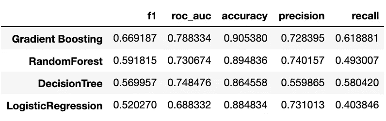

# 非平衡数据集 ML 分类模型中的 SMOTE-NC

> 原文：<https://medium.com/analytics-vidhya/smote-nc-in-ml-categorization-models-fo-imbalanced-datasets-8adbdcf08c25?source=collection_archive---------0----------------------->

# 介绍

对于这个项目，我使用了从 UCI 机器学习知识库中获得的**在线购物者购买意向数据集**。目标是建立一个预测性的机器学习模型，可以根据用户在浏览网站时的行为将用户分为创收和非创收两类。

这篇博文将重点关注 SMOTE-NC，以及它对用于分类数据的机器学习模型分数的影响。对于本项目中使用的探索性数据分析或数据转换技术，将不会讨论太多细节。如果您想查看整个笔记本以了解更多详细信息，请点击以下链接:

[https://github . com/feraguilari/DSC-mod-5-project-online-ds-pt-021119/blob/master/student . ipynb](https://github.com/feraguilari/dsc-mod-5-project-online-ds-pt-021119/blob/master/student.ipynb)

# 数据集

数据集包含 18 列，其中 17 列是特性，1 列是目标变量，在本例中为“收入”。下面描述了数据集中每一列的含义:

*   管理:查看的“管理”页面数
*   Administrative_Duration:查看“管理”页面所花费的时间
*   信息:查看的“信息”页面的数量
*   Informational_Duration:查看“信息”页面所花费的时间
*   产品相关:查看的“产品相关”页面的数量
*   ProductRelated_Duration:查看“产品相关”页面所花费的时间
*   反弹率:从该页面进入网站，然后离开(“反弹”)而没有在该会话期间触发任何其他对分析服务器的请求的访问者的百分比
*   ExitRates:它是根据该页面的所有页面浏览量计算的，是该会话中最后一次的百分比
*   PageValues:表示用户在完成电子商务交易之前访问的网页的平均值
*   特殊日:表示现场访问时间与特定特殊日(如母亲节、情人节)的接近程度，在该特殊日，会议更有可能最终完成交易
*   月份:会话的月份
*   OperatingSystems:用于会话的操作系统
*   浏览器:用于会话的浏览器
*   区域:用户所在的区域
*   流量类型:流量类型
*   访问者类型:访问者的类型
*   周末:会议是否发生在周末
*   RevenueRevenue:表示用户是否产生了收入


数据集头，首次检验

该数据集可在以下网站下载:[https://archive . ics . UCI . edu/ml/datasets/Online+购物者+购买意愿+数据集](https://archive.ics.uci.edu/ml/datasets/Online+Shoppers+Purchasing+Intention+Dataset)

# 不平衡数据集

此数据集的一个问题是，目标变量中的关联显示数据集可能不平衡。目标发生率显示数据集是平衡的还是不平衡的。它被定义为数据集中每个单独目标值的事例数。这很重要，因为项目的目标是预测用户会话是否产生收入。这个模型是一个二元分类器，意味着只有两种可能的结果:

1.  False(值:0)-会话没有产生收入。
2.  True(值:1)-会话产生收入。


标准化目标变量关联的条形图

考虑到数据集中的数据量，15%的目标发生率是可行的，但是这个比例仍然很小，我认为这是不平衡的。因此，我将实施数据扩充技术，以便用合成数据提高目标发生率。为了解决类不平衡的问题，Chawla 等人[3]在 2002 年引入了合成少数过采样技术(SMOTe)。

# 合成少数过采样技术(SMOTE)

SMOTE 是一种基于最近邻的技术，通过特征空间中数据点之间的欧几里德距离来判断。对于这个项目，我使用了不平衡学习库中的名义和连续特征的合成少数过采样技术(SMOTE-NC ),该技术为数据集中的分类和定量特征创建了合成数据。SMOTE-NC 稍微改变了生成新样本的方式，对分类特征执行了一些特定的操作。事实上，新生成样本的类别是通过挑选在生成期间出现的最频繁类别的最近邻来决定的。


基于 k-最近邻使用 SMOTE 生成新的合成数据点。不平衡学习

到目前为止，原始数据集已经过一次热编码和缩放。数据已被分成训练数据集和测试数据集。仅将 SMOTE 应用于训练集而非测试集是非常重要的，以避免污染和向模型中引入偏差。

# 测试

在将 SMOTE-NC 应用于训练集之前，我训练了四种普通的机器学习算法。机器学习算法有:决策树、逻辑回归、随机森林和梯度推进。鉴于数据的不平衡性质，最好的分类分数是 f1 和曲线下面积分数。

为了比较在数据集上执行 SMOTE-NC 的有效性，这里是在数据集已经被清理、一次热编码、缩放和分割之后每个模型的第一个分数。

值得注意的是，在分割过程中，使用 sklearn 库中的训练测试分割工具，通过设置超参数“分层=目标”来保持训练和测试数据集上的相同目标发生率，从而完成分割。

```
#Display scores for each of the models
results3 = baseline_models(data=[X_train, X_test, y_train, y_test])
results3.sort_values('f1',ascending=False)
```



之前每个模型的分数

因此，目前表现最好的模型是梯度提升模型，F1 值接近 67%，roc_auc 值约为 78%。现在让我们在训练集上执行一个默认的 SMOTE-NC。

```
0    0.625
1    0.375
Name: outcome, dtype: float64
```

在训练数据集上应用 SMOTE-NC 后，新的目标发生率从 15.47%上升到 37.5%，上升了 60%。产生过采样的因子可以在 sampling_startegy 超参数中指定。该参数可以设置为您选择的任何百分比。如果显示的百分比是 100，那么对于每个实例，将创建一个新的样本。因此，少数类实例的数量将会翻倍。

另一个可以调整的超参数是 k_neighbors。默认值为 5，这是最适合我的数据集的值。该超参数指示用于构建合成样本的最近邻的数量。

关于我的数据集中模型性能的提高，最大的改进是 roc-auc 得分从 78%上升到 84%多一点。


# 结论

SMOTE-NC 是生成合成数据以对不平衡数据集中的少数目标类进行过采样的强大工具。可以调整的参数有 k-neighbors 和采样策略，k-neighbors 允许确定创建新样本的最近邻的数量，采样策略允许指示创建多少个新样本。重要的是要记住只将其应用于训练数据集，以避免给模型带来偏差。

# 参考资料和进一步阅读

 [## 2.过采样-不平衡-学习 0.5.0 文档

### 可以参考不同过采样算法的比较。解决这个问题的一个方法是产生新的…

不平衡-learn.readthedocs.io](https://imbalanced-learn.readthedocs.io/en/stable/over_sampling.html#smote-adasyn) [](/towards-artificial-intelligence/application-of-synthetic-minority-over-sampling-technique-smote-for-imbalanced-data-sets-509ab55cfdaf) [## 综合少数过采样技术在不平衡数据集上的应用

### 在数据科学中，不平衡的数据集并不奇怪。如果数据集用于分类问题，如…

medium.com](/towards-artificial-intelligence/application-of-synthetic-minority-over-sampling-technique-smote-for-imbalanced-data-sets-509ab55cfdaf) [](https://github.com/feraguilari/dsc-mod-5-project-online-ds-pt-021119/blob/master/student.ipynb) [## 网上购物者购买意向分类

### 完整笔记本

github.com](https://github.com/feraguilari/dsc-mod-5-project-online-ds-pt-021119/blob/master/student.ipynb)