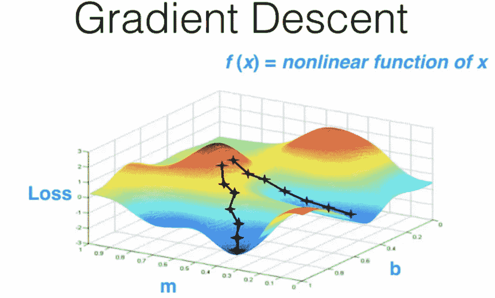

# 快照集成:在神经网络中利用集成

> 原文：<https://medium.com/analytics-vidhya/snapshot-ensembles-leveraging-ensembling-in-neural-networks-a0d512cf2941?source=collection_archive---------1----------------------->

在我之前的[文章](/analytics-vidhya/understanding-genetic-algorithms-in-the-artificial-intelligence-spectrum-7021b7cc25e7)中，我试图解释我们如何利用 [***遗传算法***](/analytics-vidhya/understanding-genetic-algorithms-in-the-artificial-intelligence-spectrum-7021b7cc25e7) 的力量来解决神经网络中的超参数问题。 [***克里斯蒂安·阿亚拉***](/@christianayalalauroba) 问了一个很有意思的问题“是不是比网格搜索更好更便宜？”为了寻找这个问题的答案，我发现了一篇非常有趣的 [***研究论文***](https://arxiv.org/pdf/1704.00109.pdf) ，其中介绍了一个有趣的新概念 ***快照集成*** ，这是一种技术，你训练一个神经网络一次，得到几个模型，我们可以进一步集成这些多个神经网络，以获得更通用的结果。感谢 [***杰瑞米***](https://twitter.com/jeremyphoward) 他在自己的 [***fast.ai 课程***](http://www.fast.ai/) 中多次提到这个技巧。

***求最小值的问题。***

让我们用简单的话来理解这个问题。让我们假设下图是一座小山，你的任务是找到山的最低点。因此，从图中可以清楚地看到，不是一个最低点，而是有多个最低点，你可以到达其中的任何一个。这些点被称为 ***局部最小值*** ，所有这些点中的最小值被认为是 ***全局最小值*** 。

两条黑色路径将我们引向两个不同的局部极小值。

在训练神经网络时，我们的目标是总是找到这种曲线或函数的全局最小值，更简单地说，我们总是希望最小化预测标签和实际标签之间的差异。通过最小化这种差异，我们可以确保我们训练过的网络能够更准确地预测结果。每次训练后，神经网络都会自己制定一个复杂的数学函数，用来预测新的结果。如果我们绘制这些函数，它将看起来类似于上图所示的图。即复凸函数。

但是为什么寻找最小值是一个问题呢？因为我们有可能到达几个局部极小值中的一个，而不是更一般的全局极小值。同样，如果我们从两个不同的点开始我们的旅程，我们可以再次到达两个完全不同的局部最小值。

***理解极小值、成本函数图及其意义***

现在，让我们暂时忘记如何找到局部最小值的问题，我将在我接下来的帖子中回答这个问题。现在，让我们专注于极小和情节本身。

上面显示的图属于神经网络的成本函数。成本函数是衡量神经网络在给定训练样本和预期输出方面表现“有多好”的指标，它有大量参数，包括我们的网络已经学习的权重和偏差，并代表您的模型的准确性。在某一点，即在最小值，其值越低，模型产生的误差越少。有趣的是，如果我们有几个极小值，那么我们就有几组不同的权重和偏差，这样网络就会犯更少的错误。因此，每一个最小值都可以被认为是一个更普遍问题的微弱但潜在的解决方案。

***快照集:明智的做法***

如果我们遍历整个图，并记录所有局部最小值或其子集的权重和偏差，会怎么样？我们最终将在很少的训练中获得多组神经网络，每组神经网络产生的错误都很少。我们可能想要集合这些多重网络，在得到最终结果之前对它们进行聚合或平均，以得到更一般化的结果。

现在的问题是怎么做？当我们继续沿着图走下去时，我们会不断记录或拍摄每个局部最小值的权重和偏差的快照。在整个行走的最后，我们将拥有一套神经网络。

当我们获取权重和偏差的快照并集成这些网络时，这种方法被称为 ***快照集成。***

左图中的蓝色旗帜代表单个最小值，但右图中的红色旗帜表示我们已经记录了每个最小值的权重和偏差。

***我们怎么做？***
为了找到这些最小值，我们应用了 ***梯度下降算法*** 。现在，让我们不要进入梯度下降的细节，只要记住梯度下降是一个数学模型，用于表示从任何给定的地点走下坡路。

我们在梯度下降中使用了一个术语 ***学习速率*** ，它决定了我们接近最小值的速率。你可以把它想象成我们在这个小山形状的地块上行走的步幅。

当我们达到某个最小值时，我们简单地保存在该点获得的权重和偏差值，并增加我们的学习速率，即迈出更大的一步。你可以把这一大步看作是跳到这块土地上的某个不同点，开始寻找下一个最小值。在整个过程的最后，我们为一个错误率低的神经网络设置了一组权重和偏差。

***结论***
这篇帖子仍然没有回答克里斯蒂安·阿亚拉的问题，即网格搜索如何优于应用遗传算法来获得超参数。然而，我们刚刚看到了一种全新的方法来创建一个最先进的神经网络，其中我们利用快照集成技术在很短的训练时间内获得了多个神经网络的能力。