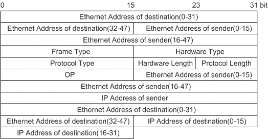

# 从网络外部嗅探系统:TCP 反向外壳+使用 Scapy 的 ARP 中毒

> 原文：<https://medium.com/analytics-vidhya/sniffing-a-system-from-outside-a-network-tcp-reverse-shell-arp-poisoning-using-scapy-77a57b545cf6?source=collection_archive---------7----------------------->

来源:[https://resources . infosec institute . com/hacker-tools-sniffers/# gref](https://resources.infosecinstitute.com/hacker-tools-sniffers/#gref)

在网络中嗅探只是监视网络流量并从中提取感兴趣的信息。为了理解嗅探的基础知识，有必要了解本地网络是如何工作的。随着世界上系统/节点数量的不断增加，IPv4 地址不足以唯一识别连接到互联网的所有系统。因此，某些被称为*不可路由地址*的 IP 地址空间被用于标识本地网络中的节点，所有这些节点都通过网关与外部世界通信。

网关。来源:[https://bytesofgigabytes . com/networking/what-is-gateway-in-networking/](https://bytesofgigabytes.com/networking/what-is-gateway-in-networking/)

从外部世界的角度来看，所有流量都来自和去往网关，然后网关进行操作，使得流量被传递到本地网络内的原始节点。几个概念如 [NAT](https://en.wikipedia.org/wiki/Network_address_translation) 和 [ARP](https://en.wikipedia.org/wiki/Address_Resolution_Protocol) (或 IPv6 情况下的替代邻居发现协议)正在发挥作用。我们对维护定期更新的 MAC-IP 映射表的 ARP(地址解析协议)感兴趣。

将 IPv4 地址映射到 MAC 地址的 ARP 表示例

唯一的 MAC 地址可以被视为硬件地址，而 IPv4 地址是在节点加入网络后动态分配的。当接收到传入的网络流量时，网关使用 NAT 将目的 IP 地址转换为其本地 IPv4 地址之一。然后，它在 ARP 表中查找相应的 MAC 地址，用最近发现的 MAC 地址创建一个新的以太网层，并发送数据包。

我们正在寻找嗅探这样的交通。来自网络之外！！！

# 攻击概述

TCP 反向外壳已在本文的[中进行了解释和演示。因此，我们在本文中重点讨论 ARP。](/swlh/python-tcp-reverse-shell-compromising-a-kali-machine-using-a-mac-6449b8684836)

根据对 ARP 和 NAT 的讨论，出现了以下 ARP 中毒的可能性(这种攻击被防火墙检测到，并且在邻居发现协议的情况下是无效的)。然而，在我们的例子中，保护整个网络的防火墙将无法检测到任何异常，因为与外部的连接首先是从网络内部请求的(TCP 反向外壳)。保护目标节点流量的自定义防火墙将能够检测到异常情况。

来源:https://tournasdimitrios1.wordpress.com/2011/02/08/4426/

在这种情况下，Bob 和 Alice 的 ARP 表与交换机(网关)通信。现在来了一个攻击者，他发起 ARP 病毒攻击(也称为 MIT 或中间人攻击),这样他们修改 Bob、Alice 和交换机的 ARP 缓存，如下所示:

1.  **交换机 ARP:** 鲍勃的 IP →攻击者 MAC
2.  **交换机 ARP:** 爱丽丝的 IP →攻击者 MAC
3.  **Bob 的 ARP:** 交换机的 IP →攻击者的 MAC
4.  **爱丽丝的 ARP:** 交换机的 IP →攻击者的 MAC

很明显，缓存中毒，认为系统试图与之通信的节点实际上位于攻击者的硬件目的地。例如，如果 Bob 必须向交换机发送数据包，他们将发送到交换机的 IP 地址(这是正确的),该地址又转到攻击者的 IP 地址(由于中毒/不正确的映射)。然后，攻击者嗅探数据包，根据需要进行修改，然后转发给交换机。

**IP 转发** ( [启用/禁用方法](https://linuxconfig.org/how-to-turn-on-off-ip-forwarding-in-linux))在攻击者的机器上启用，并允许将发往交换机 IP 的传入数据包转发到交换机。因此，如果没有防火墙，Bob 在浏览互联网时不会遇到任何异常，而实际上他们的网络流量是通过代理转发的。

## 但是在网络之外呢？

这种攻击是从本地网络内部进行的。攻击者必须连接到同一个网关。我们更希望从网络外部进行监听。以下简单的组合效果很好:

1.  在目标网络中的*低挂果实*上打开 TCP 反向外壳。您有权访问或可以设计让 TCP 反向外壳运行的节点/系统。设此节点为 *M.*
2.  发现本地网络中的节点，并识别目标。设此节点为 *T.*
3.  从 *M* 到 *T，*进行 ARP 中毒，利用 TCP 反向外壳将信息传递给攻击者。

可以跨网络管理 TCP 反向外壳。

## 工具/库使用说明

确实有一些工具可以在你的终端上用简单的命令启动，你可以导入和调用函数/方法来减少你的代码量。在抽象和底层材料之间有一个微妙的权衡:*更多的底层材料迫使你处理它们核心的大量问题，从而在减缓开发速度的同时暴涨学习，而抽象的工具/库可能会停滞学习。*

决定你学习道路上的最佳点是一项重要的任务。您可以使用工具/库来简单快速地实现下面描述的所有功能，或者您可以从零开始编写所有代码。这完全取决于你在学习抽象之前对基础知识的理解程度。至于这篇文章，我们坚持使用纯 Python 和套接字实现 TCP 反向 shell，但是求助于 Scapy 来实现 ARP 中毒(或者一般来说，为了更快地创建和解析包，这在纯 Python 中是很麻烦的)。我们仍然限制执行 ARP 中毒攻击的内置 Scapy 函数。

# 设置 TCP 反向外壳

[文章](/swlh/python-tcp-reverse-shell-compromising-a-kali-machine-using-a-mac-6449b8684836)详细解释了设置 TCP 反向外壳的机制。然而，这是针对同一网络内的通信。要跨网络进行通信，只需很少的更改。

第一点是发现攻击者的全局 IP。在终端输入`hostname -I`或`ifconfig`(或者如果不起作用，访问[https://whatismyipaddress.com](https://whatismyipaddress.com))。为此，我们将使用 IPv6 地址。

TCP 反向外壳的目标端脚本的更改

以下更改就足够了。在将`AF_INET6`套接字绑定到端口`12345`之前，对攻击者端脚本进行同样的更新。按照本文[帖子](/swlh/python-tcp-reverse-shell-compromising-a-kali-machine-using-a-mac-6449b8684836)所述进行测试，连接工作正常。

# 发现本地网络中的节点

下一步是从我们打开 TCP 反向外壳的机器上发现本地网络中的节点。在继续之前，请务必熟悉 Scapy 的[基础知识](https://scapy.readthedocs.io/en/latest/usage.html)。

发现本地网络上的节点

这里我们看到了 Scapy 在包操作中的强大功能。参考以下格式。

ARP 数据包格式。来源:[https://support . Huawei . com/enterprise/en/doc/edoc 1000166600/6bb 92 FD 8/ARP-implementation](https://support.huawei.com/enterprise/en/doc/EDOC1000166600/6bb92fd8/arp-implementation)

如前所述，我们首先创建`Ethernet`层，它可以被视为包含源和目的 MAC 地址的硬件层。`Ethernet(dst=)`用于创建具有目的地`ff:ff:ff:ff:ff:ff`或未指定的 MAC 地址的层(因此，该数据包被 ping 到本地网络中基于第二层`ARP`进行应答的所有节点)。第二层控制哪些节点响应数据包。如果节点在 ARP 层(格式的`IP address of destination`部分)找到它们的 IP 地址，它们就应答`ARP`包。`srp`用于发送数据包和接收响应(`timeout`表示发送和接收持续的时间)。`ans`(或应答的数据包)是一个漂亮的元组列表，其中每个元素都是一个元组，包含发送的数据包和接收的相应响应。`received[ARP]`访问接收到的数据包的 ARP 层，之后我们可以提取任何需要的信息:

1.  `psrc`:协议源(或源 IP 地址)
2.  `pdst`:协议目的地(或目的 IP 地址)
3.  `hwsrc`:硬件源(或源 MAC 地址)
4.  `hwdst`:硬件目的地(或目的 MAC 地址)

目前，我们关心的是 IP 地址。因此有了术语`received[ARP].psrc`。既然我们知道了接收节点会应答 ARP 数据包*当且仅当*在`ARP()`中它们的地址被称为`pdst`时，我们指定一个 IP 地址范围，向所有节点发送数据包，并接受响应。

启动一个终端，输入`ifconfig | grep inet`或类似的命令，显示你的机器的 IP 地址和子网掩码。样本响应的类型为:`inet 192.168.43.34 netmask 0xffffff00 broadcast 192.168.43.255`。由此，启动脚本并调用函数`discovery('192.168.43.1/24', 10)`。

发现功能的示例响应。两个节点响应了。地址 192.168.43.38 是一个新条目。

请注意 ARP 表中的更新

# ARP 病毒攻击

攻击分以下几个阶段进行(确保[启用 IP 转发](https://linuxconfig.org/how-to-turn-on-off-ip-forwarding-in-linux)):

1.  获取网关和目标的 MAC
2.  毒害和嗅嗅
3.  恢复:覆盖 ARP 表中的磁道。

发现指定 IP 地址的 MAC 地址

`ff:ff:ff:ff:ff:ff`通过问题`who-has ip_address`向所有硬件地址广播该数据包。我们得到一个带有答案`is_at hwsrc`的数据包作为响应。我们提取接收到的包的硬件地址，因为这个硬件地址响应了我们的`ARP`包。

毒害 ARP 缓存

`op`是一个我们不太关心的选项。中毒过程如下:

1 .**【目标至网关】:**网关接收到一个数据包，该数据包表示

a) `hwdst`或目的 MAC 作为网关 MAC。网关知道该分组是针对它的。同样，`pdst`也可以，或者 IP 是网关的 IP。

b) `hwsrc`是否为**留空。**发送时，攻击者机器的 MAC 填入该字段。

c) `psrc`是目标机器的 IP。现在网关检查它的 ARP 表，发现`psrc`和`hwsrc` **不匹配。因此，它更新了表格。**

同样，**【通往目标】**路线中毒。主要思想是伪造一个包，它携带一台机器的源 IP 和另一台机器的源 MAC。接收节点会注意到这一差异，并更新 ARP 表。

嗅探器

一旦中毒完成，我们就为`ip host target_ip`或来自`source target_ip`的通过攻击者机器的所有数据包设置一个嗅探器。因此，我们捕获来自目标的所有数据包，并在一个由`prn`引用的函数中对数据包执行操作(或者在嗅到有效数据包时做什么)。功能`callback`很简单；它寻找相关层，捕获信息，并将其写入变量。

在我们完成攻击后，恢复就完成了。

修复工作

还原类似于中毒；在某种程度上，我们代表网关和目标进行**发现调用。中毒后，假设从**网关到目标**的每个数据包都被发送到攻击者的硬件地址。我们通过**代表网关发出一个发现/ARP 调用来解决这个问题，这个调用试图发现目标的硬件地址**；或者用`hwdst="ff:ff:ff:ff:ff:ff"`制作一个从网关到目标的数据包(源 IP 和 MAC 是网关的，目的 IP 还是以前的目标)。`hwdst`设置为`broadcast`只是为了当目标机(或`pdst`)响应 ARP 请求时，网关接收到目标 MAC 为`hwsrc`的 ARP 响应。网关再次查看 ARP 表，发现`hwsrc`(在中毒阶段设置为攻击者 MAC)和`psrc`(设置为目标 IP)之间不匹配。网关解决这个问题；网关的 ARP 就这样恢复了。**

类似的恢复是通过代表目标发出一个 ARP 调用来完成的，该调用寻找网关的硬件地址。有趣的是，由于我们已经指定了`hwsrc`并设置为`hwdst`到`broadcast`，尽管我们从攻击者的机器发出这个调用，但是响应还是会按照`psrc` / `hwsrc`的指定发送到网关或目标。注意与发现阶段的区别，在发现阶段`hwsrc`和`psrc`被设置为攻击者的机器，因此响应到达攻击者。

> 因此，有可能在一个系统中创建分组，其响应被另一个系统接收。正是这一点有助于恢复。

# 集成 TCP 反向外壳和 ARP 病毒脚本

更新了运行命令方法

修改来自 [TCP 反向外壳](/swlh/python-tcp-reverse-shell-compromising-a-kali-machine-using-a-mac-6449b8684836)的`run_command`方法，以处理两个独立的命令`poison`和`discover`。`entry`函数集合了 ARP 中毒脚本的所有部分。

主要功能集成了 ARP 病毒攻击的所有组件

很明显，攻击的三个阶段是按顺序进行的。

# 样品运行

网络设置如下:

1.  网络 A:

a)网关:WiFi 热点， **Moto G6**

b) TCP 反壳: **Macbook Air** 接 **moto G6**

c)目标: **Redmi** 连接到 **Moto G6**

2.网络 B:

a)网关:WiFi 热点；**三星**

b)攻击者:**HP**Kali Linux

攻击者通过攻击者的全局 IP 地址在 Macbook 上打开一个 TCP 反向外壳。

攻击者的网关信息。注意标志 G 表示网关。

TCP 反向外壳目标的网关信息。注意标志 G 表示网关。

攻击者发出的发起攻击的一系列命令。

攻击者端命令

使用`ifconfig`和`netstat`确定目标网络配置，主要是`netmask`和`inet`地址。使用这个信息，触发一个`discover 192.168.43.1/24 10`，其中第一个参数表示要发现的目标地址范围，第二个参数表示超时。我们收到三个响应，在研究 ARP 表时，发现一个`redminote5pro-redmi`位于`192.168.43.125`。我们从 Macbook Air 向 Redmi 发起 ARP 病毒攻击，并将嗅到的数据传输回位于本地网络外部的 Kali 节点。

在攻击者的机器上嗅探数据包的数据

在 TCP 反向外壳目标上执行的命令。

# 结论

有些事情需要牢记在心。

1.  我们可能会尝试在 Scapy 中开发一个反向 shell，但这是不可靠的，而且经常会崩溃。此外，与套接字路由相比，Scapy 路由是不可靠的。参见[本](https://github.com/secdev/scapy/issues/1941)
2.  Scapy 需要 root 权限才能打开原始套接字。要在 TCP 反向外壳目标上正确运行，请参考[和](https://stackoverflow.com/questions/36215201/python-scapy-sniff-without-root)(必须小心操作)。
3.  泄露 MAC 地址是个问题吗？参见[本](https://security.stackexchange.com/questions/67893/is-it-dangerous-to-post-my-mac-address-publicly)。
4.  一个主要问题是需要攻击者的 IPv6 地址来开始通信。IPv6 地址会定期更改，我们需要一种机制让 TCP 反向外壳目标自动适应这种情况。截至目前，我还没想过克服这个。

祝你今天开心！玩的开心！