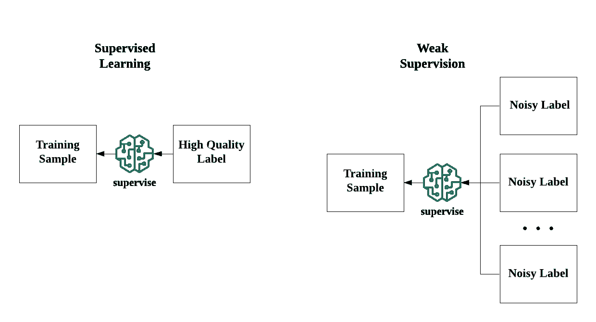

# 通气管:构建没有标记数据的 ML 模型

> 原文：<https://medium.com/analytics-vidhya/snorkel-build-ml-models-without-labeled-data-21aa38b9d7a9?source=collection_archive---------12----------------------->


有了大量的实践工具，对数据科学家来说，在有标签的数据上建立模型已经是一件容易的事情。然而，在现实世界中，许多任务都不是格式良好的监督学习问题:标记数据可能很昂贵，甚至不可能获得。另一种方法是利用廉价和低质量的数据来实现监管，这就是本文的主题:**弱监管**

在接下来的部分中，我将介绍弱监管的概念。我还会介绍一个叫 [**通气管**](https://www.snorkel.org/) 的工具，是斯坦福开发的。最后，我将向您展示 HK01 如何使用浮潜捕捉脸书的趋势话题，从而增强我们的推荐引擎。

如果没有大量高质量的人工标记的训练数据，有几种算法范例来补救这种情况。如下图所示，如果您没有足够的数据，您必须找到另一个知识来源，以实现与传统监管相当的监管水平。


来源:[http://ai.stanford.edu/blog/weak-supervision/](http://ai.stanford.edu/blog/weak-supervision/)

在这些范例中选择一个是相当棘手的。这取决于你手上有什么。迁移学习对于在类似任务中具有训练有素的模型的任务非常有用，比如用自己的类别微调 ImageNet 模型；虽然您可能对拓扑结构有一些假设，例如簇的形状，但您可能更喜欢半监督学习。

**那么，什么样的情况最适合弱监管呢？**

看了弱监管的定义你可能会有一些想法。是的，*如果你有大量的领域专家但缺乏数据，监管不力是你的选择*。

背后的原因在定义中透露出来:监管不力使得从低质量、嘈杂的标签中学习成为可能。换句话说，你仍然可以找到模式，就像监督学习所做的那样，除非你应该为每个训练样本补充多个有噪声的标签，以便模型可以从中归纳知识。



弱监管使得多个嘈杂标签的监管成为可能

监管不力的理由是，有噪声的数据通常比高质量的数据更容易获得，也更便宜。想象一下，你在一家保险公司工作，你的老板要求一个全新产品线的推荐引擎，当然，你没有数据。在销售专家的帮助下，我们可以制定一些“基本正确”的规则，比如新产品对老年人更有吸引力。这些规则并不完全正确；但是，它们足以为你的模型提供集体智慧。最重要的是，这些规则比完全手工标注的数据更容易获得。

那么，下一个问题是:**我们如何将这些规则注入到我们的 ML 模型中？**答案是浮潜。

潜泳是一个由斯坦福大学开发的系统，它允许你将规则编程到 ML 模型中。该方法的核心思想是建立生成模型，表示真实标签和噪声标签之间的因果关系。


上图的左侧是表示从真实标签到有噪标签的生成过程的概率模型。虽然真实的标签是不可观测的，但我们仍然可以通过不同噪声标签的一致性和不一致性来学习准确性和相关性。因此，我们可以估计每个噪声标签的 P(L|y ),这本质上是质量的指标。通过聚集噪声标签，我们获得估计的真实标签，并使用它来训练我们的模型。

在通气管中，噪音标签被编程为**标签功能**。标签函数基本上是一个 python 函数，它硬编码一个规则来确定标签。例如，如果您正在编写一个程序来确定哪封电子邮件是垃圾邮件，该程序应该类似于:

```
from snorkel.labeling import labeling_functionSPAM = 1
NORMAL = 0
ABSTAIN = -1@labeling_function()
def contain_hyperlink(x):
    if 'http' in x:
        return SPAM 
    else:
        return NORMAL@labeling_function()
def contain_foul_language(x):
    for each in x:
        if each in foul_language:
            return SPAM
        else:
            return NORMAL
```

在这个玩具例子中，你可以看到浮潜的基本要素。

*   定义标签。在这个例子中，标签是垃圾邮件、正常和弃权。absent 是在无法确定标签时使用的标签。
*   定义标签功能。添加一个 decorator `@labeling_function()`来声明。

定义标注和标注函数后，可以将标注函数应用于数据集并估计最佳标注:

```
from snorkel.labeling import PandasLFApplier, LabelModellfs = [contain_hyperlink, contain_foul_language]applier = PandasLFApplier(lfs=lfs)
overall_result = applier.apply(df=dataset, progress_bar=False)label_model = LabelModel(cardinality=2, verbose=True)
label_model.fit(L_train=overall_result, n_epochs=100, lr=0.001, log_freq=100, seed=123)score = label_model.predict_proba(overall_result)
```

*   声明一个标签函数列表`lfs`
*   创建一个应用程序，将标注函数应用到你的数据集，以获得噪声标注`overall_result`
*   创建一个创成式模型`label_model`来解决嘈杂标签之间的冲突
*   得到训练样本的预测概率`score`

然后，`score`可以作为训练你的模型的估计标签。

在 HK01 中，我们的任务之一是捕捉社会媒体中的热门话题。这项任务的成功可以提高我们建议的质量。此外，它还为我们提供了有关新闻重要性的额外信息。

挑战之一是将热门话题与我们现有的新闻进行匹配。显然，手工标注匹配是非常低效的，因为我们必须为每个主题浏览成千上万的文章。然而，有经验的编辑可以运用他们的领域知识来过滤无关的文章。

我们还应用机器学习和自然语言处理算法来构建标注函数。例如，我们使用命名实体识别和标记化来快速识别关键词，以便我们可以计算趋势主题和现有文章之间的距离。

## 参考

1.  [http://ai.stanford.edu/blog/weak-supervision/](http://ai.stanford.edu/blog/weak-supervision/)
2.  【https://www.snorkel.org/ 号
3.  【https://arxiv.org/pdf/1711.10160.pdf 