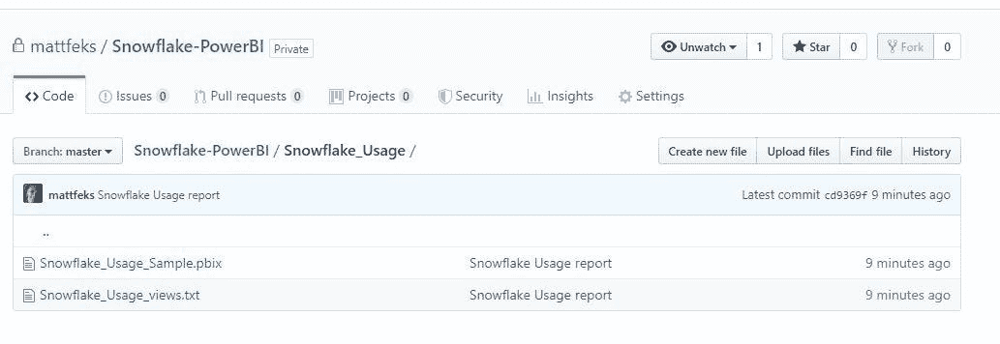
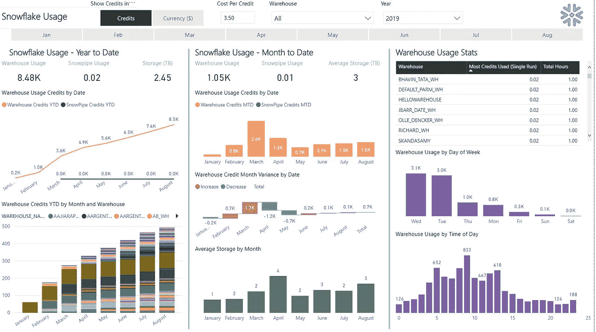
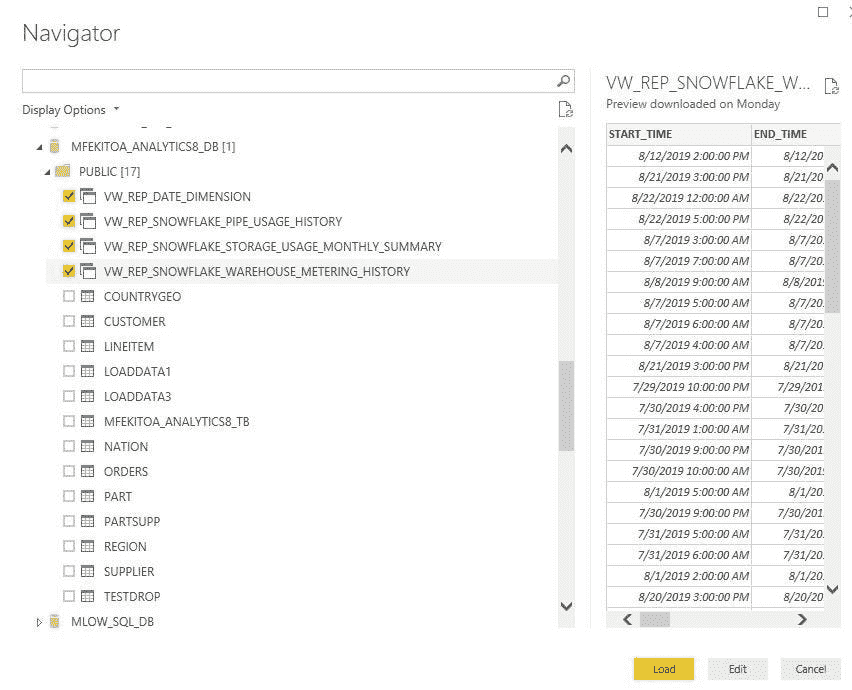
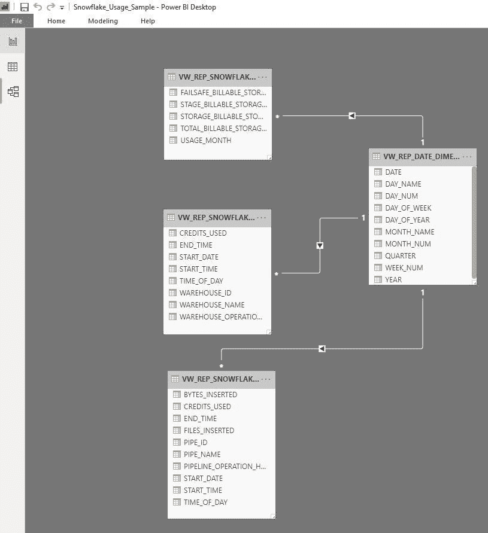
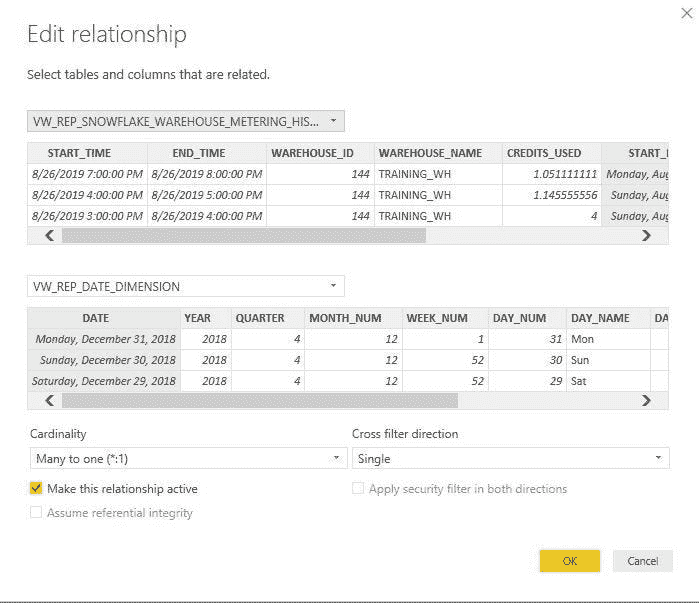
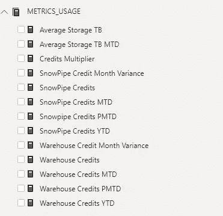
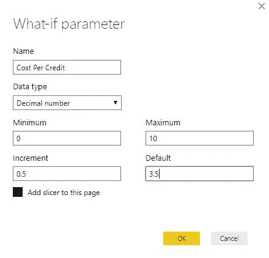
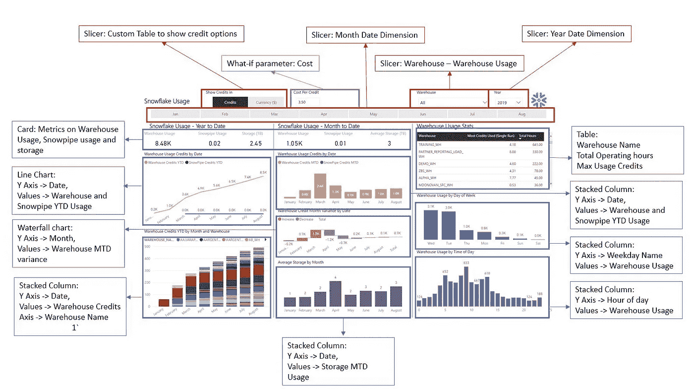

# 雪花+电源 BI

> 原文：<https://medium.com/analytics-vidhya/snowflake-power-bi-snowflake-usage-report-f628dadbdc85?source=collection_archive---------2----------------------->

## 雪花使用报告

有兴趣的可以在这里 下载 [**力量 BI 报告。我添加了一个雪花 SQL 脚本文件(用于视图创建)和 PBIX 文件。**](https://github.com/mattfeks/Snowflake-PowerBI)

饭桶

下面的文章给出了雪花使用报告的快速解释和一些设置步骤。这是“雪花的力量”和“BI 的力量”系列文章的一部分。

**概述**:[https://www . LinkedIn . com/pulse/snow flake-power-bi-Matthew-feki toa/](https://www.linkedin.com/pulse/snowflake-power-bi-matthew-fekitoa/)

**雪花设置**:[https://www . LinkedIn . com/pulse/snow flake-power-bi-Setup-Matthew-feki toa/](https://www.linkedin.com/pulse/snowflake-power-bi-setup-matthew-fekitoa/)

雪花使用报告用于帮助运营部门管理和跟踪雪花的持续成本。这里回答的关键问题是:

*   我目前每月的花费是多少？
*   我今年的成本跟踪情况如何？
*   信用在哪里被消耗(仓库、一天中的时间、一周中的某一天)？

在撰写本信用证时，可对以下账户进行收费:

*   **仓库用途**:(用于大多数 Select 和 DML 查询)。每秒收费(一旦仓库恢复，总是对前 60 秒收费)
*   **存储:**每 TB 成本
*   **Snowpipe 用法:**(连续加载):每秒/每核收费
*   **自动聚类和物化视图:**雪花在内部执行这些工作负载。

当前的雪花使用情况报告着眼于前 3 种信用使用情况。肯定会有更多的东西添加到雪花中，这将有一个信用组件(任务和流)，并且使用报告将需要更新，以适应雪花的使用方式。当前的报告重点关注仓库使用情况，同时也显示了有关 Snowpipe 和存储的数据。

雪花使用报告

# 雪花视图

报告本身将利用雪花中的以下视图。我在视图中添加了一些额外的列，以简化 Power BI 报告。视图 DDL 可以在上面提到的 GIT 存储库中下载。

视图本身将需要在一个雪花数据库其他雪花数据库帐户使用视图(因为这是一个共享的数据库，不能进行更改)

**VW _ REP _ snow flake _ STORAGE _ USAGE _ MONTHLY _ SUMMARY**:引用雪花数据库中的 [STORAGE_USAGE](https://docs.snowflake.net/manuals/sql-reference/account-usage/storage_usage.html) 视图。在月级别聚合存储使用信息。

**VW _ REP _ 雪花 _WAREHOUSE_METERING_HISTORY** :引用雪花数据库中的[WAREHOUSE _ METERING _ HISTORY](https://docs.snowflake.net/manuals/sql-reference/account-usage/warehouse_metering_history.html)视图。返回单个仓库的每小时信用使用量。

**VW _ REP _ snow flake _ PIPE _ USAGE _ HISTORY**:引用雪花数据库中的 [PIPE_USAGE_HISTORY](https://docs.snowflake.net/manuals/sql-reference/account-usage/pipe_usage_history.html) 视图。返回 Snowpipe 的使用信息。

**VW_REP_DATE_DIMENSION** :自定义视图，将返回过去 720 天每天的日期。这用于所有 3 个表的公共日期维度。

**TABLE_USAGE_OPTION** :这是一个内置在 Power BI 中的自定义表，它具有显示信用值的选项(相对于信用)。

# 步骤 2:获取数据

Power BI 有一个到雪花的连接器，所以开始使用相当简单。雪花连接器本身需要雪花 ODBC 连接器，可以从[这里](https://docs.snowflake.net/manuals/user-guide/odbc-download.html)下载。

设置完成后，您可以点击 Power BI Desktop 中的“GET DATA ”,选择要导入报告的视图。

电源双获取数据

# 步骤 3:建立模型

一旦表进入 Power BI，您将需要设置报告所需的任何关系。对于使用情况报告，我已经建立了从日期维度(on date)到雪花操作视图中每个日期的一对多关系。

该使用报告的模型非常简单

权力二元关系观

Power BI —编辑关系视图

# 步骤 4:设置测量\参数

度量(使用 DAX)和参数是 Power BI 中的一个重要概念，可以真正地深入了解您的数据。测量通常会聚合数据(总和、最小值、最大值)，并在与数据交互时进行计算(例如，当您更改过滤器时)。我在这里保留了对信用使用列的年初至今\月至今计算的过滤器

功率 BI-测量

Power BI 中的 what-if 参数提供了一些简单的用户输入功能。在雪花使用报告中，我添加了每个信用的成本参数。这是为了允许任何用户以他们处理的货币添加每个信用的成本。

功率 BI —假设参数

# 第五步:观想时间

这个谜题的最后一块是建立观想本身。现在所有的数据都可用了，接下来就由你来设置如何显示报告。我在下面用简单的折线图\条形图展示了一段时间内指标的变化。

下面是所使用的不同观想的分类。

电源双可视化故障

# 步骤 6:发布和计划

我不会深入讨论如何设置 Power BI 网关或发布报告，因为目前，雪花 Power BI 连接器需要一个网关，以便 Power BI 服务连接到雪花(是的，这意味着数据必须通过您的网关，而不是直接从服务连接)。我敢肯定，随着雪花的影响，这种情况会很快改变，但现在“建立一个网关”。

# 结论

就这样,“雪花使用报告”启动并运行，为用户提供了一种不同的方式来了解配额在环境中的使用情况。这为已经在使用 Power BI 的客户提供了一个很好的方式，让他们在当前的报告解决方案中获得雪花的使用情况，并为用户提供了查看这些使用情况数据的不同方式。