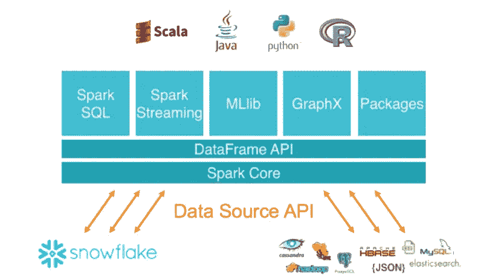

# 带火花的雪花

> 原文：<https://medium.com/analytics-vidhya/snowflake-with-spark-2f3691af322d?source=collection_archive---------13----------------------->



Snowflake 是一个基于云的 SQL 数据仓库，专注于高性能、零调优、数据源多样性和安全性。

Spark 的雪花连接器支持使用雪花作为 Apache Spark 数据源，类似于其他数据源(PostgreSQL、HDFS、S3 等)。).雪花支持三个版本的 Spark: Spark 2.2、Spark 2.3 和 Spark 2.4。每个版本的 Spark 都有一个单独版本的雪花 Spark 连接器。针对您的 Spark 版本使用正确版本的连接器。

在本主题中，我们将使用 Spark 2.4，并了解如何向雪花数据库读写数据帧。

确保您在这里遵循关于创建雪花数据库[的主题。](/@keitamouhamad/snowflake-in-5minutes-9c6e4c22bb4)

## SBT 属地

```
*libraryDependencies* ++= *Seq*(
  "net.snowflake" %% "spark-snowflake" % "2.7.0-spark_2.4"
)
```

## 创建雪花表格

要在雪花中创建数据库，请参考主题[snow SQL 上的 SQL](http://mk) 。要访问雪花数据库，我们必须创建一个新表。我们可以使用下面的程序来创建一个表格。

```
*package* com.sparkSnowFlake

*import* java.sql.*DriverManager

object CreateSnowflakeTable extends App* {

  *val properties* = *new* java.util.Properties()
  *properties*.put("user", "mouhamadkeita92")
  *properties*.put("password", "*********")
  *properties*.put("account", "re54891")
  *properties*.put("warehouse", "COMPUTE_WH")
  *properties*.put("db", "PEOPLE")
  *properties*.put("schema", "public")
  *properties*.put("role", "SYSADMIN")

  *val jdbcUrl* = "jdbc:snowflake://re54891.east-us-2.azure.snowflakecomputing.com/"

  *println*("Created connection")
  *val connection* = *DriverManager*.*getConnection*(*jdbcUrl*, *properties*)
  *val statement* = *connection*.createStatement
  *println*("Done creating connection")

  *println*("Creating table PEOPLE")
  *statement*.executeUpdate("create or replace table PEOPLE(name VARCHAR, age INT, job VARCHAR)")
  *statement*.close()
  *println*("Done creating PEOPLE table")

  *connection*.close()
}
```

在这段代码中，我们用 Spark 创建了一个数据库“PEOPLE”。我们也可以用 SnowSQL CLI 或 Snowflake GUI 创建数据库。

## 将火花数据帧写入雪花

为了将数据从雪花读入 Spark 数据帧，我们使用了`DataFrame`的`write()`方法来构造一个`DataFrameWriter`。

```
*package* com.sparkSnowFlake

*import* org.apache.spark.sql.{*SaveMode*, SparkSession}

*object WriteDataToSnowflake extends App* {

  *val spark* = *SparkSession*.*builder*()
    .master("local[*]")
    .appName("SparkSnowflakeWrite")
    .getOrCreate()
  *spark*.*sparkContext*.setLogLevel("ERROR")
  *import spark*.*implicits*._
  *var sfParameters* = *Map*(
    "sfURL" -> "https://re54891.east-us-2.azure.snowflakecomputing.com/",
    "sfAccount" -> "re54891",
    "sfUser" -> "mouhamadkeita92",
    "sfPassword" -> "Ousmane92.",
    "sfDatabase" -> "PEOPLE",
    "sfSchema" -> "PUBLIC",
    "sfRole" -> "ACCOUNTADMIN"
  )

  *val data* = *Seq*(("Jorge",23,"Developer"),
    ("Bob",28,"Developer"),
    ("Bill",31,"Admin"),
    ("John",40,"Project Manager")
  )
  *val peopleDF* = *data*.toDF("name","age","job")

  *peopleDF*.write
    .format("snowflake")
    .options(*sfParameters*)
    .option("dbtable", "PEOPLE")
    .mode(*SaveMode*.*Overwrite*)
    .save()
}
```

在这段代码中，我们将数据插入数据库 PEOPLE 中的表 PEOPLE。在下一节中，我们将把保存在 PEOPLE 表中的数据读入 Dataframe。

## 将雪花表读入火花数据帧

为了将数据从雪花读入 Spark 数据帧，我们使用了`SqlContext`对象的`read()`方法来构造一个`DataFrameReader`。

> 使用 DataFrames 时，雪花连接器仅支持 SELECT 查询。

```
*package* com.sparkSnowFlake

*import* org.apache.spark.sql.{*DataFrame*, SparkSession}

*object ReadDataFromSnowflake extends App* {

  *val spark* = *SparkSession*.*builder*()
    .master("local[*]")
    .appName("SparkByExamples.com")
    .getOrCreate()
  *var sfParameters* = *Map*(
    "sfURL" -> "https://re54891.east-us-2.azure.snowflakecomputing.com/",
    "sfAccount" -> "re54891",
    "sfUser" -> "mouhamadkeita92",
    "sfPassword" -> "********",
    "sfDatabase" -> "PEOPLE",
    "sfSchema" -> "PUBLIC",
    "sfRole" -> "ACCOUNTADMIN"
  )

  *val df*: *DataFrame* = *spark*.read
    .format("snowflake")
    .options(*sfParameters*)
    .option("dbtable", "PEOPLE")
    .load()
  *df*.show(*false*)
}
```

输出


## 使用查询读取雪花表

上面带 Spark 的雪花示例演示了使用`dbtable`选项从雪花表中读取整个表并创建 Spark 数据帧，下面的示例使用`query`选项执行过滤 SQL 查询。

```
 *val df*: *DataFrame* = *spark*.read
    .format("snowflake")
    .options(*sfParameters*)
    .option("query", "SELECT * FROM PEOPLE WHERE job = 'Developer'")
    .load()
  *df*.show(*false*)
```

输出


## 通过 SnowSQL CLI 检查数据

我们可以从 SnowSQL 中读取数据，以确保一切正常。

```
❯ snowsql
* SnowSQL * v1.2.5
Type SQL statements or !help
mouhamadkeita92#COMPUTE_WH@PEOPLE.PUBLIC>SELECT * FROM "PEOPLE"."PUBLIC"."PEOPLE"
                                         ;
+-------+-----+-----------------+
| NAME  | AGE | JOB             |
|-------+-----+-----------------|
| Jorge |  23 | Developer       |
| Bob   |  28 | Developer       |
| Bill  |  31 | Admin           |
| John  |  40 | Project Manager |
+-------+-----+-----------------+
4 Row(s) produced. Time Elapsed: 1.795s
mouhamadkeita92#COMPUTE_WH@PEOPLE.PUBLIC>
```

***参考文献:***

*   [https://docs . snow flake . com/en/user-guide-getting-started . html](https://docs.snowflake.com/en/user-guide-getting-started.html)
*   [https://www.snowflake.com/](https://www.snowflake.com/)
*   [https://github.com/mkprime92/sparksnowflake](https://github.com/mkprime92/sparksnowflake)