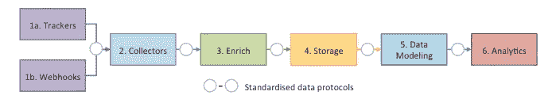
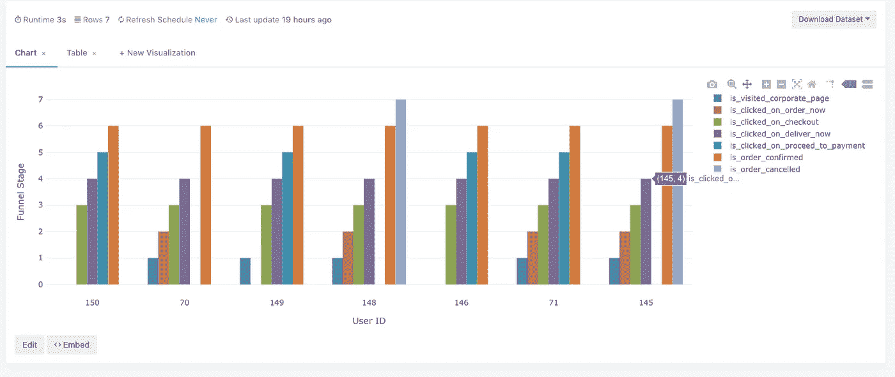

# 了解你的客户，他们在你的平台上的行为

> 原文：<https://medium.com/analytics-vidhya/snowplow-analytics-e355d11c4e80?source=collection_archive---------20----------------------->

每个电子商务组织都需要强大的分析工具，可以记录客户与其网站、应用程序或服务器的交互，并可视化客户层面的行为。

# 什么是扫雪机分析？

Snowplow Analytics 是一款开源工具，拥有丰富的社区支持。它在跟踪和记录云(AWS 和 GCP)基础设施上的事件方面拥有巨大的能力。
该工具需要在云上设置管道。完成设置后，你可以将追踪器放入你的网站、应用或服务器。跟踪器将数据发送到数据收集器，这些数据将经过大量的转换。在最后阶段，您将在您选择的数据仓库中拥有结构良好的数据。



# 为什么选择 Snowplow Analytics？

1-拥有您的数据和基础架构。
2- Snowplow 原子事件有大约 130 个属性，它被广泛设计以覆盖最大的业务用例。你可以在这里找到这些[的详细属性。
3-它丰富数据，有助于获得高质量的数据。
4-由于管道的验证步骤(只有通过验证的数据才会出现在数据仓库中),您将获得质量极高的数据。它提供了记录定制结构化事件的灵活性，您可以根据您的业务用例形成定制的模式字段。
6-来自所有平台(网络/移动/服务器端/广告展示)的数据以相同的方式构建并存储在相同的位置。
7-比 GA360 便宜。你只需要支付云基础设施的成本。](https://github.com/snowplow/snowplow/wiki/canonical-event-model)

## 我如何做扫雪机管道设置？

我将在下一篇博客中解释这一部分。

## 如何处理数据？

来自电子商务网站的用户交互数据可用于绘制以下用例。我只写了几个，你可以根据你的数据想出更多的用例。
1-追踪流量
2-追踪营销来源和推荐人
3-漏斗分析
4-下线和转换率
5-优化用户体验
6-产品个性化

## 事件级数据建模？

这是流水线的一个基本步骤，它基本上将数据仓库中记录的原子事件序列聚集在一组抽象的数据模型单元中，这些数据模型单元描述了我们的数据模型，最终有助于可视化我们的建模数据和决策。我们为数据聚合编写 sql 查询，这通常很复杂，由数据团队根据业务用例编写。我为我的组织( [Box8](https://box8.in/) )写了一个用例“绘制访问过公司页面的客户旅程”。
如果你看看我们的[网站](https://box8.in/corporate)平台，有一个公司页面，客户现在需要填写地址并点击订单。稍后，客户将商品添加到购物车，购物车结账并完成付款。这些步骤对于上述用例非常重要。首先，我需要找出访问过公司网页的客户名单。我可以从页面 url 与公司页面 url 匹配的原子事件表中提取这些信息。现在我需要知道有多少人点击了“现在订购”按钮。这也可以通过点击事件表来实现。这就是我们如何聚集原子数据来描述完整的客户旅程。
对于上述用例，我用下面列出的 7 个抽象单元对我们的事件级数据进行了建模。
1-is _ visited _ corporate _ page
2-is _ clicked _ on _ order _ now
3-is _ clicked _ on _ check out
4-is _ clicked _ on _ deliver _ now
5-is _ clicked _ on _ proceed _ payment
6-is _ order _ confirmed
7-is _ order _ cancelled
我在此给出为上述用例编写的聚合查询，并附上可视化图像。
这只是为了参考，它不适合您的用例，因为它基于自定义结构模式字段。在进行事件级数据建模之前，您需要非常清楚您的用例，如果需要自定义结构模式字段，则必须实现它。自定义结构模式字段是数据仓库表的列。例如，我创建了一个采购表，它记录订单确认时的采购数据。它有多个列(total_payable、tracking_id、coupon、order_type)。

```
SELECT temp1.user_id,
      temp2.*
FROM
  (SELECT domain_userid,
          domain_sessionid,
          user_id
  FROM atomic.events
  WHERE atomic.events.dvce_created_tstamp > (CURRENT_DATE - INTERVAL '3 DAY')
     AND user_id IS NOT NULL
  GROUP BY domain_userid,
            domain_sessionid,
            user_id) AS temp1
INNER JOIN
  (SELECT en.domain_userid,
          en.domain_sessionid,
          en.app_id,
          CASE
              WHEN ec.page_url IS NOT NULL THEN 1
              ELSE 0
          END AS is_visited_corporate_page,
          CASE
              WHEN eon.label IS NOT NULL THEN 2
              ELSE 0
          END AS is_clicked_on_order_now,
          CASE
              WHEN eoc.label IS NOT NULL THEN 3
              ELSE 0
          END AS is_clicked_on_checkout,
          CASE
              WHEN edn.label IS NOT NULL THEN 4
              ELSE 0
          END AS is_clicked_on_deliver_now,
          edn.deliver_now_click_count,
          CASE
              WHEN edl.label IS NOT NULL THEN 4
              ELSE 0
          END AS is_clicked_on_deliver_later,
          CASE
              WHEN epp.label IS NOT NULL THEN 5
              ELSE 0
          END AS is_clicked_on_proceed_to_payment,
          epp.proceed_to_payment_click_count,
          CASE
              WHEN epc.order_count IS NOT NULL THEN 6
              ELSE 0
          END AS is_order_confirmed,
          epc.order_count,
          epc.total_payables,
          epc.tracking_ids,
          epc.order_types,
          CASE
              WHEN ecp.label IS NOT NULL THEN 7
              ELSE 0
          END AS is_order_cancelled
  FROM
     (SELECT domain_userid,
             domain_sessionid,
             app_id
      FROM atomic.events
      WHERE atomic.events.dvce_created_tstamp > (CURRENT_DATE - INTERVAL '3 DAY')
      GROUP BY domain_userid,
              domain_sessionid,app_id) AS en
  LEFT JOIN
     (SELECT domain_userid,
             domain_sessionid,
             page_url
      FROM atomic.events
      WHERE atomic.events.dvce_created_tstamp > (CURRENT_DATE - INTERVAL '3 DAY')
        AND page_url = '[https://mojopizza.in/corporate'](https://ssr.preprod.web.mojopizza.in/corporate')
      GROUP BY domain_sessionid,
              domain_userid,
              page_url) AS ec ON ec.domain_userid = en.domain_userid
  AND ec.domain_sessionid = en.domain_sessionid
  LEFT JOIN
     (SELECT temp1.domain_userid,
             temp1.domain_sessionid,
             temp2.label
      FROM atomic.events AS temp1
      INNER JOIN atomic.in_box8_click_event_1 AS temp2 ON temp2.root_id = temp1.event_id
      WHERE temp1.dvce_created_tstamp > (CURRENT_DATE - INTERVAL '3 DAY')
        AND temp2.label = 'ORDER NOW'
        AND temp1.page_url = '[https://mojopizza.in/corporate'](https://ssr.preprod.web.mojopizza.in/corporate')
      GROUP BY temp1.domain_userid,
              temp1.domain_sessionid,
              temp2.label) AS eon ON eon.domain_userid = en.domain_userid
  AND eon.domain_sessionid = en.domain_sessionid
  LEFT JOIN
     (SELECT temp1.domain_userid,
             temp1.domain_sessionid,
             temp2.label
      FROM atomic.events AS temp1
      INNER JOIN atomic.in_box8_click_event_1 AS temp2 ON temp2.root_id = temp1.event_id
      WHERE temp1.dvce_created_tstamp > (CURRENT_DATE - INTERVAL '3 DAY')
        AND temp2.label = 'Checkout'
        AND temp2.parent_component='Cart Dropdown'
      GROUP BY temp1.domain_userid,
              temp1.domain_sessionid,
              temp2.label) AS eoc ON eoc.domain_userid = en.domain_userid
  AND eoc.domain_sessionid = en.domain_sessionid
  LEFT JOIN
     (SELECT temp1.domain_userid,
             temp1.domain_sessionid,
             temp2.label,
             count(*) AS deliver_now_click_count
      FROM atomic.events AS temp1
      INNER JOIN atomic.in_box8_click_event_1 AS temp2 ON temp2.root_id = temp1.event_id
      WHERE temp1.dvce_created_tstamp > (CURRENT_DATE - INTERVAL '3 DAY')
        AND temp2.label = 'Deliver Now'
        AND temp2.parent_component = 'User Identity'
      GROUP BY temp1.domain_userid,
              temp1.domain_sessionid,
              temp2.label) AS edn ON edn.domain_userid = en.domain_userid
  AND edn.domain_sessionid = en.domain_sessionid
  LEFT JOIN
     (SELECT temp1.domain_userid,
             temp1.domain_sessionid,
             temp2.label
      FROM atomic.events AS temp1
      INNER JOIN atomic.in_box8_click_event_1 AS temp2 ON temp2.root_id = temp1.event_id
      WHERE temp1.dvce_created_tstamp > (CURRENT_DATE - INTERVAL '3 DAY')
        AND temp2.label = 'Deliver Later'
        AND temp2.parent_component = 'User Identity'
      GROUP BY temp1.domain_userid,
              temp1.domain_sessionid,
              temp2.label) AS edl ON edl.domain_userid = en.domain_userid
  AND edl.domain_sessionid = en.domain_sessionid
  LEFT JOIN
     (SELECT temp1.domain_userid,
             temp1.domain_sessionid,
             temp2.label,
             count(*) AS proceed_to_payment_click_count,
             listagg(json_extract_path_text(temp2.data,'order_type',TRUE),',') AS order_type,
             listagg(json_extract_path_text(temp2.data,'orderType',TRUE),',') AS orderType
      FROM atomic.events AS temp1
      INNER JOIN atomic.in_box8_click_event_1 AS temp2 ON temp2.root_id = temp1.event_id
      WHERE temp1.dvce_created_tstamp > (CURRENT_DATE - INTERVAL '3 DAY')
        AND temp2.label = 'PROCEED_TO_PAYMENT'
        AND temp2.parent_component = 'Delivery Address'
      GROUP BY temp1.domain_userid,
              temp1.domain_sessionid,
              temp2.label) AS epp ON epp.domain_userid = en.domain_userid
  AND epp.domain_sessionid = en.domain_sessionid
  LEFT JOIN
     (SELECT temp1.domain_userid,
             temp1.domain_sessionid,
             count(*) AS order_count,
             listagg(total_payable,',') as total_payables,
             listagg(tracking_id,',') as tracking_ids,
             listagg(order_type,',') as order_types,
             listagg(coupon,',') as coupons
      FROM atomic.events AS temp1
      INNER JOIN atomic.in_box8_purchase_1 AS temp2 ON temp2.root_id = temp1.event_id
      WHERE temp1.dvce_created_tstamp > (CURRENT_DATE - INTERVAL '3 DAY')
      GROUP BY temp1.domain_userid,
              temp1.domain_sessionid ) AS epc ON epc.domain_userid = en.domain_userid
  AND epc.domain_sessionid = en.domain_sessionid
  LEFT JOIN
     (SELECT temp1.domain_userid,
             temp1.domain_sessionid,
             temp2.label
      FROM atomic.events AS temp1
      INNER JOIN atomic.in_box8_click_event_1 AS temp2 ON temp2.root_id = temp1.event_id
      WHERE temp1.dvce_created_tstamp > (CURRENT_DATE - INTERVAL '3 DAY')
        AND temp2.label='Cancel Proceed'
      GROUP BY temp1.domain_userid,
              temp1.domain_sessionid,
              temp2.label ) AS ecp ON ecp.domain_userid = en.domain_userid
  AND ecp.domain_sessionid = en.domain_sessionid ) AS temp2 ON temp1.domain_userid = temp2.domain_userid
AND temp1.domain_sessionid = temp2.domain_sessionid
```



**总结:** 基于数据驱动商业决策是成功组织的关键。Snowplow 有助于带来客户互动数据，并为数据团队提供一个平台来发现数据的洞察力。这可能有助于通过制定数据支持的决策来发展您的业务。分析的使用正在加速，这意味着更多的数据驱动的决策和更少的直觉。循证管理
通过在政策和效果之间添加经过验证的因果关系来补充分析。”保罗·吉本斯。

*希望听到您的想法和反馈——联系我@ keshariratnesh9@gmail.com* 您觉得这篇博文有帮助吗？如果有，愿意分享一下吗？