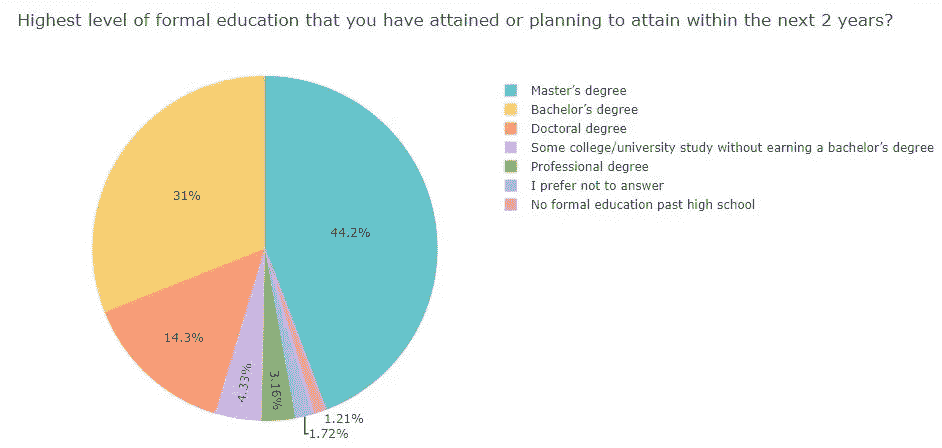
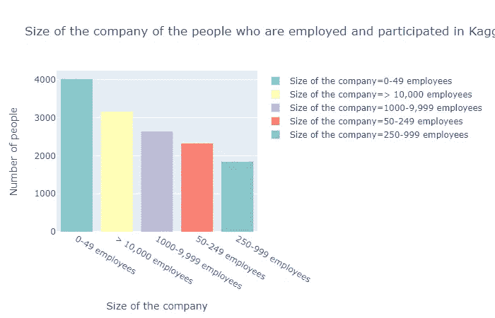
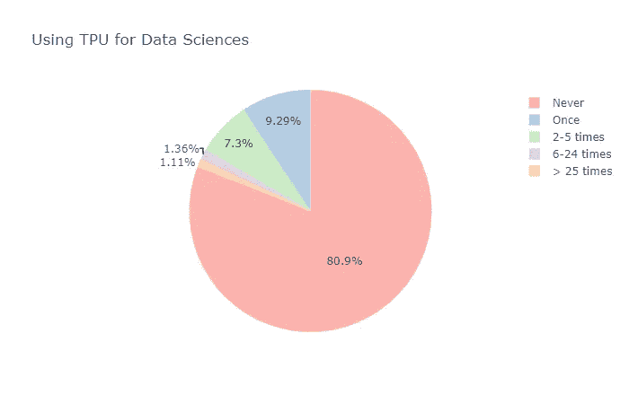
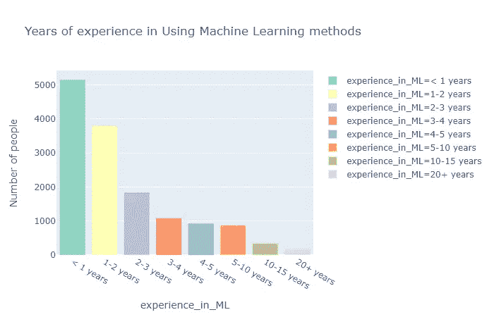
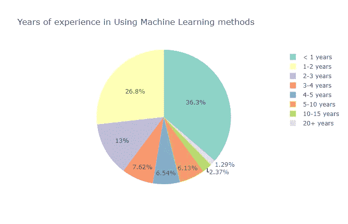

# 所以，Kaggle 2019 ML 和 DS 调查说…

> 原文：<https://medium.com/analytics-vidhya/so-kaggle-2019-ml-and-ds-survey-says-b60843e653a3?source=collection_archive---------17----------------------->

当我实际对调查结果进行分析时，我对它感到非常惊讶。这些是:

这项调查由 Kaggle 进行，旨在了解不同行业的机器学习正在发生什么，以及新数据科学家进入该领域的最佳方式。

图片来源:[https://bit.ly/2LWBi2m](https://bit.ly/2LWBi2m)

这项调查有助于我们分析数据科学从业者的行为模式和市场趋势，以及数据科学在行业中的应用。这种分析可能有助于**有抱负的数据科学家**更好地了解数据科学的趋势，并实现他们的目标。

本次调查由 200+个问题组成，有 19717 人回答(并非所有问题都是所有人回答)。只有几个问题被他们全部回答了。我挑选了几个主要是回答的问题。让我们看看它们是什么，人们对它们的反应是什么。

## 你的年龄是多少？

参与调查的人的年龄

对此问题的答复总数:19717

实际答复数:197171

年龄在 18-29 岁之间的人正在学习或研究数据科学概念，这些年龄组在榜单的前四名中占据了三个位置。令人惊讶的是，处于职业生涯后期 60+(年龄)的人也在积极参与 kaggle。尽管属于这一类的人数很少，但他们正在不断地学习目前最活跃、最有趣的领域之一。

## 你的性别是？

参与调查的人的性别

对此问题的答复总数:19717

实际答复数:197171

被忽略的回答:18 岁以下的人的回答。

超过 80%的人是活跃在该领域的男性，而女性的比例较低，只有 16.3%，但我们无法得出活跃在该领域的女性参与者的总数，因为她们可能没有参与调查，或者她们可能通过 kaggle 以外的其他平台学习或参与数据科学项目。

## 你住在哪里？

参与调查的人员的位置

对此问题的答复总数:19717

实际答复数:197171

这个结果非常令人惊讶，因为我假设他们中的大多数将来自北美(因为大多数基于产品的公司或 IT 公司将他们的基地设在美国)。

与此同时，很高兴看到印度在 19000 人中超过 4000 人的 171 个国家中名列榜首，这与其他国家参与数据科学的人数相比是一个巨大的数字。我们可以期待未来几年印度涌现出更多优秀的数据科学家:)

## 您已经达到或计划在未来 2 年内达到的最高正规教育水平？

在未来两年内追求或计划追求的教育水平

对此问题的答复总数:19717

实际回复数:19323

被忽略的回答:18 岁以下的人的回答。

超过 40%的人正在攻读或计划攻读硕士学位(希望在数据科学相关领域)，而 31%的人目前正在攻读学士学位(假设人们在 18 岁时开始攻读学士学位)。只有极少数人辍学或没有回答或追求一些专业学位。他们中很少计划接受高等教育的人能从这些统计数据中获得一些见解并据此做出决定。

## 你目前职位的头衔是什么？

参与调查的人员的职务

对此问题的答复总数:19717

实际回应数:19107

被忽略的回答:18 岁以下的人的回答。

他们中的大多数要么是学生，要么是 T2 的数据科学家。两者都占总人口的 40%左右。*第三*活跃在这个领域的大多数人是**软件工程师**其次是其他角色，如数据分析师、研究科学家等..。有趣的是，学生们对这一领域越来越感兴趣，这对行业很有用(因为在不久的将来，数据科学工作不会缺少人)。

## 你受雇的公司规模有多大？

你被雇佣的公司的规模

对此问题的答复总数:19717

实际回应数:14002

被忽略的回答:18 岁以下的人以及学生或无业人员的回答。

大多数人(超过总人数的 25%)在员工少于 50 人的公司(我们通常称之为早期创业公司)工作，几乎 22%的人在老牌公司(员工超过 10000 人)工作，不到 33%的人在中型公司(员工在 250 到 9999 人之间)工作。这种趋势已经变得很普遍，因为每年涌现的创业公司数量也在增加。

## 在您的企业中，有多少人负责数据科学工作负载？

企业中负责数据科学工作负载的人数

对此问题的答复总数:19717

实际回应数:13623

被忽略的回答:18 岁以下的人以及学生或无业人员的回答。

23.3%的人说他们公司业务中负责交付数据科学相关工作负载的人数超过 20 人**，但令人震惊的是**有 52%的人说他们工作场所中负责数据科学相关工作负载的人数不到 5 人。这是因为，他们可能仍处于在工作场所使用数据科学的起步阶段，但这应该尽快得到改善，因为每个行业都在随着最新的技术进步而更新和转型。

## **你现在的雇主会把机器学习方法融入他们的业务吗？**

在商业中引入 ML 方法

对此问题的答复总数:19717

实际回应数:13227

被忽略的回答:18 岁以下的人以及学生或无业人员的回答。

他们中很少有人说我们不使用 ML 方法，或者他们不知道他们的雇主是否在使用 ML 方法，但他们中的大多数人都在使用 ML 方法来生产他们的模型，或者至少从模型中产生洞察力。

## 你目前的年薪是多少(美元)？

年薪

对此问题的答复总数:19717

实际回应数:12497

被忽略的回答:18 岁以下的人以及学生或无业人员的回答。

我认为这是你正在寻找的重要因素之一？我知道，这可以代表之前的许多上述问题。但是，在根据这项调查得出关于数据科学领域的薪酬的结论之前，值得探讨这些问题。许多文章和研究表明，与数据科学相关的工作与其他工作相比工资更高，并且是最受欢迎的技能。

关于薪酬的分析是根据参与本次调查的人员提供的，只有超过 21%的人目前在本次调查中担任数据科学家，其余的人担任其他职务。由于我们有来自不同来源的数据，因此不建议根据本次调查得出数据科学家平均年薪的结论。

## 您在工作或学校中用来分析数据的主要工具是什么？

用于数据分析的主要工具

对此问题的答复总数:19717

实际回应数:15690

被忽略的回答:18 岁以下的人的回答。

不足为奇的是，超过一半的调查受访者使用本地开发环境，如 RStudio、Jupyter Lab、Jupyter Notebook、Spyder 等..。我相信这些是开始编写与 ML 或 DS 相关主题的代码的很好的资源。不到 12%的人使用高级分析软件(SAS、SPSS 等)或商业智能软件(Tableau、Salesforce 等)..).“大量的人使用本地开发环境”背后的原因将在下一个问题分析中知道。

## 你会推荐一个有抱负的数据科学家先学什么编程语言？

推荐学习的语言

对此问题的答复总数:19717

实际回应数:14377

被忽略的回答:未满 18 岁且从未编写过任何代码的人的回答。

超过 75%的人(四分之三的人建议学习 Python)和 10%的人建议学习 R，因为它们主要用于工业领域，这也是前一个问题中使用本地环境的原因(因为与其他语言相比，使用这些语言进行开发要容易和灵活得多)。因此，掌握这些语言将有助于有抱负的数据科学家在数据科学和分析领域更快地进步。

# 你用过 TPU 吗？

将 TPU 用于数据科学

对此问题的答复总数:19717

实际回应数:14203

被忽略的回答:未满 18 岁且从未编写过任何代码的人的回答。

TPU 代表张量处理单元，它们用于加速机器学习工作负载(这大大降低了任何算法的计算时间复杂度)。他们中 81%的人从未使用过 TPU，这并不奇怪，因为他们很贵，应该通过谷歌的云平台购买高端应用程序，或者可以通过谷歌实验室免费访问(用于学习和研究目的，但不用于模型的生产)。

## 你使用机器学习方法有多久了？

经历的年份

对此问题的答复总数:19717

实际回应数:14182

被忽略的回答:未满 18 岁且从未编写过任何代码的人的回答。

这有点令人惊讶，因为他们中的大多数人(近 60%)在使用机器学习方法(使用任何 ML 或 DL 算法)方面只有不到 2 年的经验。这让我感到惊讶，因为尽管数据科学的宣传从 2012 年又开始了。所以，我认为他们中的大多数人至少有 4-5 年的经验。

# 结论

那些认为学习数据科学或参加 Kaggle 或任何数据科学黑客马拉松比赛已经太迟的人应该从这次调查中了解到，他们中的大多数人在使用与数据科学相关的算法或编程方面只有不到 2 年的经验，根据上面的统计，如果你想开始学习数据科学，那么总是建议从 Python 开始。我相信学习永远是一个持续的过程，永远不应该停止学习。一旦停止，你就出局了。祝一切顺利:)

有关详细代码，请参考这些笔记本中的任何一个[笔记本-1](https://www.kaggle.com/chamanthmvs/so-kaggle-2019-ml-and-ds-survey-says) 或[笔记本-2](https://github.com/chamanthmvs/Exploratory-Data-Analysis/blob/master/so-kaggle-2019-ml-and-ds-survey-says.ipynb)

*感谢你到目前为止的阅读。我致力于改进我的风格和表达方式。所以，如果你有什么建议或者有什么想分享的，欢迎随时评论或者通过 linkedin* [*这里*](https://www.linkedin.com/in/chamanth-mvs-9a59a4131/) *联系我。*