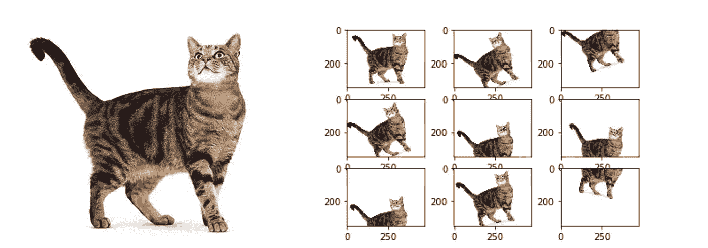

# 所以你认为你没有足够的数据来做机器学习

> 原文：<https://medium.com/analytics-vidhya/so-you-think-you-dont-have-enough-data-to-do-machine-learning-3b5c6c512e27?source=collection_archive---------5----------------------->

问一个初学者为什么 ML 这么难，你很可能会得到这样的答案:*“背后的数学真的很复杂”*或*“我不完全明白所有这些层是做什么的”*。虽然这显然是真的，而且解释 ML 模型肯定是一个模糊的主题，但事实是 ML 很难，因为我们拥有的数据往往无法满足我们模型的复杂性。这在实践中是一个非常普遍的问题，因为你的模型只有在你的数据有多好的时候才会有多好，所以我收集了一些最相关的指导方针，供你在面临数据短缺时使用。

由[弗兰基·查马基](https://unsplash.com/@franki?utm_source=medium&utm_medium=referral)在 [Unsplash](https://unsplash.com?utm_source=medium&utm_medium=referral) 上拍摄的照片

# 你实际需要多少数据？

这是每个处理数据的人都曾在某个时候想知道的事情。不幸的是，没有一套固定的规则会给你一个直接的答案，你只能求助于指导方针和经验。

首先你应该考虑你的问题有多复杂。预测客户行为与区分猫和狗是不同的。毕竟，作为人类的一员，有些人对你来说可能是不可读的，但你肯定不会发现自己为区分狗和猫而流汗。

此外，你对算法的**选择也将决定你的集合的适当大小。深度神经网络等更复杂的模型能够捕捉比线性模型更多的细节，但代价是需要更高的集合规模。**

如果这些指导方针中的任何一个失败了*(很可能是这种情况)*，就像你会**从现有文献中获得灵感**来选择一个或另一个模型一样，看看使用了什么输入。毕竟，没有多少人会重新发明轮子，所以你很有可能会遇到类似的问题。

还有一个重要的考虑因素，那就是你的数据是否呈现出某种季节性。对于遵循每日模式的集合，这肯定不会是相同的预测，就像你期望每年重复的一样。

你可能听说过 10 倍法则(意思是你应该拥有至少 10 倍的功能)。实际上，这通常是一个很好的方法，但是要注意，如果你的特征不能很好地分离目标，这个经验法则对你的问题就完全没用了。

也许你只是想要一个特定的*号*，这完全可以理解。在线性算法的情况下，每个类数百个例子可能是一个很好的起点。移动到更复杂的算法，任何非线性模型都不能处理这个数量。对于这样的算法，你会希望用至少数万个例子来保护自己，甚至在使用深度神经网络时达到数百万个。

作为最后一个建议，在你考虑我将要讨论的任何技术之前，用你所拥有的例子数量绘制一个**学习曲线**【1】。也许你选择的模型已经被你设定的尺寸饱和了，或者也许你会发现你的曲线比你最初想的更加不稳定。

# 能解决吗？

嗯，有可能！除了收集更多数据这一显而易见的选择之外，根据您的问题的特征，您还可以遵循不同的策略。在探索创建人工数据的方法之前，让我补充一些有用的东西:**特征工程**。利用你所拥有的数据集的预测能力，因为它真的可以帮助弥补例子的缺乏。不过，不要过于兴奋，创建数百个特征:你给模型的自由度越高，它就越容易过度拟合！

现在回到指导方针，不管是否有可能收集更多的数据，这些都是最常用的增加数据集大小的方法。

## 数据扩充和综合

数据扩充是一种技术，它使用已经可用的示例，通过转换它们来创建新的示例。在图像方面，一些最常见的变换包括缩放、裁剪、旋转、翻转、噪声注入或颜色改变。这种技术不仅有助于解决数据稀缺的问题，而且有助于使我们拥有的数据集变得复杂，从而更接近我们在现实生活中会发现的情况，即避免教科书中的例子。

几何变换的例子[2]

一些 Python 库很容易增加你的集合的大小，并且入门非常简单，比如 Tensorflow 的 [**tf.image**](https://www.tensorflow.org/tutorials/images/data_augmentation) 和 PyTorch 的[**torch vision . transforms**](https://pytorch.org/docs/stable/torchvision/transforms.html)

Tensorflow 数据增强

除了所讨论的几何和色彩空间变换之外，还有其他有趣的数据扩充技术。例如，随机擦除有目的地掩盖图片的部分以模拟遮挡，并且它可以实现很好的结果，因为模型被迫找到更多的描述性特征。

关于转换的最后一点提醒是，对增加的数据标签要小心，因为不恰当的改变可能会修改数据类。这方面的一些例子是将 6 减为 0，改变潜在恶性黑色素瘤的颜色，或将路标翻转到不同但现有的方向。

数据合成不是转换现有的数据点，而是生成全新的数据点。流行的方法是通过深度学习算法。其中一个是生成对抗网络(GANs)，这是一个非常酷的算法，它学习你的示例的底层分布，以创建新的示例。当然，这是对模型功能的一个非常简单的解释，但是在这篇文章中却是一个复杂的解释。

生成性对抗网络的简化[4]

另一种常用的数据合成技术是合成少数过采样技术(SMOTE) [5]，在数据集不平衡时特别有用。该方法建议将多数类的欠采样和少数类的过采样结合起来，以提高模型的性能。请注意，展示 SMOTE 的原始作品描述了 ROC 空间中的性能，而不是简单地用准确性术语描述，这在这种不平衡的情况下具有很大的欺骗性。简而言之，该算法为少数类随机选择一个数据点，然后找到它的 k 个最近邻，并再次随机选择这 k 个中的一个。新创建的数据点将在两个选定点之间的直线上随机合成[6]。

选择哪种技术很大程度上取决于您的问题。当然，使用 GAN 生成图像比使用现成的 Python 库旋转要复杂得多。还要考虑你的时间限制，使用 GAN 来合成新数据将涉及训练不止一个而是两个模型，也许你没有时间做这些。

再一次，你的场景的特征需要被考虑。您是在处理图片还是表格数据？不幸的是，在处理表格时，你不会找到许多简单的技巧来增加你的集合的大小。曾经有过使用 GANs 生成合成数据的方法[7]，但坦率地说，现实生活中的应用是有限的，社区通常不鼓励这种方法用于这种特定的用例。然而，如果你决定尝试一下，需要考虑一些因素。小心处理时间序列数据，因为生成对立模型可能无法捕捉趋势。总的来说，SMOTE 被认为是合成表格数据的更有效的选择。此外，虽然新合成或增强的图像对我们的大脑理解没有挑战，但这不一定适用于表格数据。我建议不要使用领域专家都无法理解的例子，因为你的模型很可能已经缺乏可解释性。

关于数据扩充和合成的最后一点说明是，如果您决定使用手头的所有技术，那么很容易得到一个巨大的数据集。这并不一定是一个优势，因为您可能会很快引入一个严重的过度拟合案例。

## 迁移学习

迁移学习使用预先训练好的模型作为任务的起点。这使我们能够利用网上的大量数据和已经训练好的现有复杂模型。

照片由[詹姆斯·庞德](https://unsplash.com/@jamesponddotco?utm_source=medium&utm_medium=referral)在 [Unsplash](https://unsplash.com?utm_source=medium&utm_medium=referral) 拍摄

迁移学习的想法源于这样一个事实，即从特定用例中获得的知识可以扩展到一些相关的领域。你可能会从这句话中猜到，为了让这一点发挥作用，你应该寻找已经在与你类似的数据上训练过的算法。一旦你找到了一个适合你需求的模型，你必须再次训练算法，但不是从头开始，这是一个非常好的好处，因为你的训练时间(和资源)将大大减少。然后，你要做的是冻结除了最后一层之外的所有层，或者增加几层，并且只根据你的自定义数据重新训练这些层。训练完新的之后，你总是可以做最后一轮的全网训练(但这可能不是必须的)。在任何情况下，重要的是要记住，如果新层仍然具有随机初始化的权重(即，未被训练)，则不要训练整个网络，因为这将迫使整个网络进行非常大的更新，最终导致过度拟合。

当然，在实践中有许多方法来实现迁移学习。如果您想保持简单，并且正在使用 Keras，那么使用 trainable 属性就很容易。将其设置为 false 将冻结图层，并且在训练过程中不会更新图层。您还可以在 [Keras Applications](https://keras.io/api/applications/) 上找到一份非常好且全面的可用型号列表，这样您就可以选择最符合您需求的型号。

使用 Keras 进行迁移学习

## 数据收集

有时候，更明显也可能是唯一的选择是简单地收集更多的数据。为此，您很可能希望利用领域专家来帮助您收集和标记(如果适用)新的数据点。

关于收集，如果您的用例允许的话，也可以考虑使用开源库。一些最好的公共数据集可以在 Kaggle、[谷歌数据集搜索](https://datasetsearch.research.google.com)、 [ImageNet](http://www.image-net.org) 、[亚马逊评论](https://s3.amazonaws.com/amazon-reviews-pds/readme.html)或 [UCI 机器学习知识库](http://archive.ics.uci.edu/ml/index.php)中找到；这取决于您正在寻找的数据类型(图像、表格数据、文本等。)值得看看一些主要云提供商提供的可用数据，如 GCP 或 AWS too。

也许你发现自己有足够的数据，但不幸的是没有标记。例如，可能的解决方案可以是使用亚马逊机械土耳其公司(Amazon Mechanical Turk)等工具的众包(crowdsourcing)或半监督学习(semi-supervised learning)，在这种情况下，你可以用可用的已标记数据训练一个模型，随后标记你的集合的其余部分。

# 结论

有数不清的方法可以解决数据短缺的问题，因此选择一种方法可能会非常困难。在回顾了一些最流行的技术之后，我会仔细考虑要解决的 ML 问题的特征，这不仅意味着模型或数据特征的选择，还包括时间或预算约束等业务考虑。

可能你需要一个讨论过的策略的组合，或者你唯一可能的出路是收集更多的数据。无论是哪种情况，这都是你 ML 过程中的关键一步，也是你成功的关键。

# 参考

[1] Jason Brownlee，*机器学习需要多少训练数据？*[https://machine learning mastery . com/much-training-data-required-machine-learning/](https://machinelearningmastery.com/much-training-data-required-machine-learning/)

[2] Rohit Dwivedi，*数据增强如何影响图像分类性能，代码*[https://analyticsindiamag . com/Image-Data-Augmentation-Impacts-Performance-Of-Image-class ification-With-Codes/](https://analyticsindiamag.com/image-data-augmentation-impacts-performance-of-image-classification-with-codes/)

[3] OpenGenus，*数据增强技术*[https://iq.opengenus.org/data-augmentation/](https://iq.opengenus.org/data-augmentation/)

[4]Agnieszka miko ajczyk，Michał Grochowski，*用于改进图像分类问题中深度学习的数据增强*[https://www . research gate . net/publication/325920702 _ Data _ augmentation _ for _ improving _ deep _ learning _ in _ image _ class ification _ problem](https://www.researchgate.net/publication/325920702_Data_augmentation_for_improving_deep_learning_in_image_classification_problem)

[5] Benjamin Biering，*人工智能入门:需要多少数据？*[https://2021.ai/getting-started-ai-how-much-data-needed/](https://2021.ai/getting-started-ai-how-much-data-needed/)

[6] Nitesh 诉 Chawla *等人，SMOTE:合成少数过采样技术【https://arxiv.org/pdf/1106.1813.pdf*T22

[7]https://arxiv.org/abs/1811.11264 徐磊*利用生成对抗网络*综合表格数据