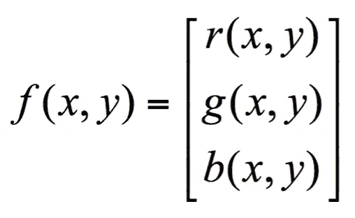
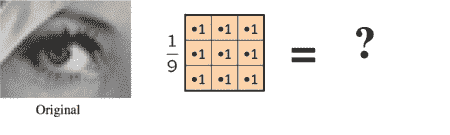
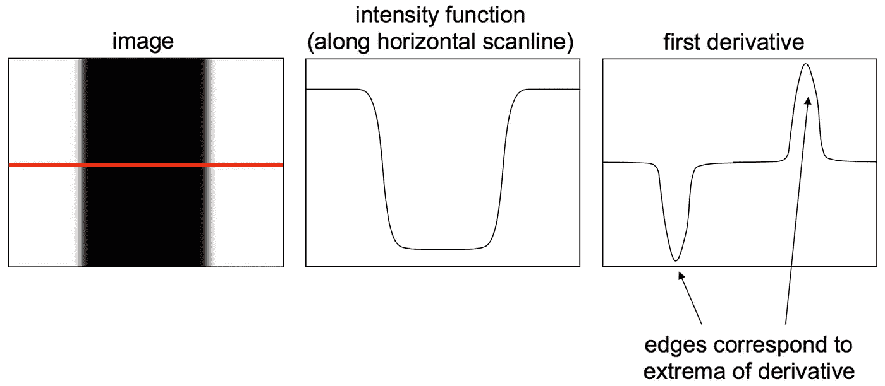
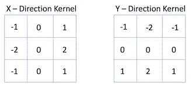
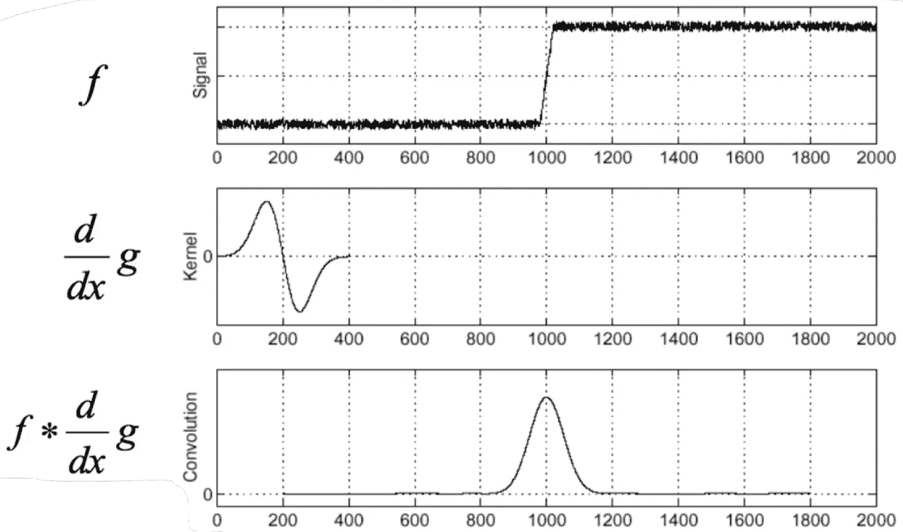
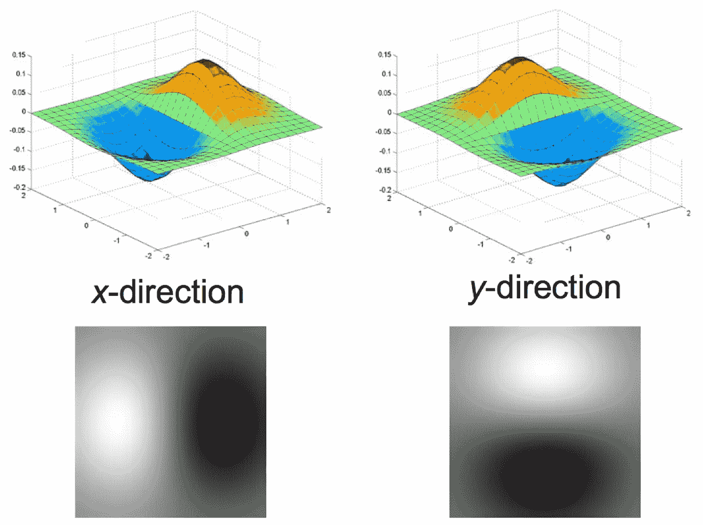
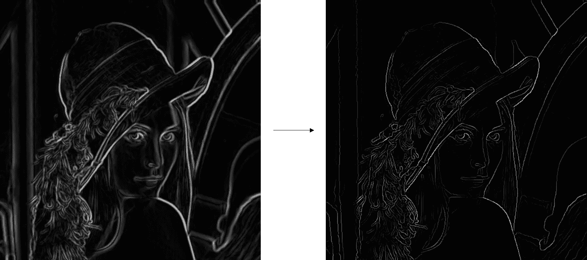
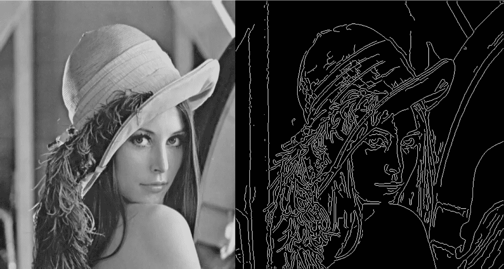

# 索贝尔边缘滤波器

> 原文：<https://medium.com/analytics-vidhya/sobel-edge-filter-daf07a462ff4?source=collection_archive---------10----------------------->

我们可以把由单个像素组成的图像看作一个函数， *f* 。每个像素也有自己的值。对于灰度图像，每个像素的亮度在 0 到 255 之间，0 表示黑色，255 表示白色。 *f(x，y)* 然后将给出像素位置 *(x，y)* 处的图像强度，假设它被定义在一个矩形上，具有有限的范围: *f: [a，b]*x*【c，d】*→[0，255]。

彩色图像只是这个的简单扩展。 *f(x，y)* 现在是三个值的向量，而不是一个。以 RGB 图像为例，颜色是由红、绿、蓝(RGB)组合而成的。

我们使用过滤器(内核)来进行图像处理。图像过滤改变了图像的范围(即像素值)，因此改变了图像的颜色而没有改变像素位置。图像滤波是通过对图像进行卷积运算来完成的。

**边缘检测**

用计算机视觉术语来说，我们可以说，边缘是图像中突然出现的不连续性，它可能是由表面法线、表面颜色、深度、光照或其他不连续性引起的。

我们可以沿着图像的一行或一列，从图像的强度分布中精确定位边缘出现的位置。只要函数的强度发生快速变化，我们就能检测到边缘。哪里有变化，哪里就有衍生。换句话说，只要函数的导数有局部极值，就有边。

图像梯度是导数概念在多个维度上的推广，它指向强度增加最多的方向。由于我们的函数，即图像不是连续函数，我们不能在通常的极限意义上求导。因此，我们使用离散变量，试图抽象出导数或梯度的概念。这可以使用 Sobel 滤波器来完成。共有两个，分别用于 *x* 和 *y* 方向。

索贝尔过滤器

虽然仅仅使用 Sobel 滤波器不会给出很好的结果，因为图像中可能有噪声。但是对输出进行阈值处理可以改善结果。

为了显著改善边缘检测，我们可以使用 Canny 边缘检测。它首先使用过滤器平滑图像，使之没有噪声，然后执行边缘检测。它使用非最大值抑制来细化边缘，从而进一步改进了边缘检测。但是 Canny 边缘检测的思想不能在单个滤波器中被捕获。

将高斯滤波器的 x 和 y 导数应用于图像，以消除噪声、改善定位并获得单一响应。找到每个像素的梯度的大小和方向。

执行非最大值抑制，将边缘细化到单个像素的宽度，因为在步骤 2 之后从梯度中提取的边缘将非常模糊，并且因为只能有一个准确的响应。

阈值和链接，也称为滞后，以创建连接的边缘。步骤是到 1。通过将低阈值和高阈值分别定义为 2 来确定弱边缘像素和强边缘像素。首先链接具有高阈值的边缘曲线，从强边缘像素开始，继续具有低阈值的曲线。