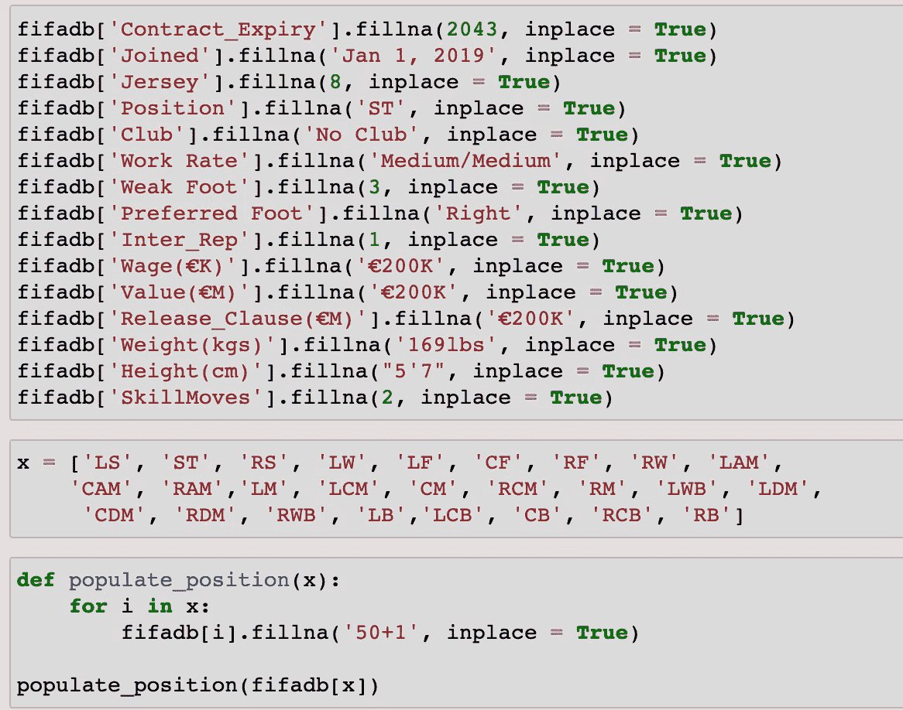

# 足球分析:使用机器学习预测工资和市场价值(1/3)。

> 原文：<https://medium.com/analytics-vidhya/soccer-analytics-prediction-of-salary-and-market-value-using-machine-learning-1-3-4b4ce6e3f660?source=collection_archive---------3----------------------->

# 第一部分

2019 年 12 月中旬，女子足球联赛决赛在拉亚达斯和老虎队之间进行。这是两个队争夺冠军的复赛。第一场比赛以 1 比 1 结束。冠军将在最后 90 分钟内产生。

Rayadas 以一个孤独的进球获胜。联赛冠军，终于来了。同一周，有报道称**玩家将因获得冠军而获得一台 Ipad** 作为奖励。两周后，这些人在击败美洲队后赢得了男子联盟冠军，尽管他们将获得的奖品是一张价值$2M 元的**支票。**

**来源** : Liga MX 女子

该项目源于需要了解墨西哥职业俱乐部向其职业女球员支付平均月薪 4.2K 比索(每月 223 美元)的考虑因素。这听起来可能微不足道，但它是关于女性赢得联赛冠军，拥有电视转播权和致力于促进足球市场新类别的赞助商。

**来源** : @Hisweaty_

钱已经摆在桌面上了，为什么不注意发展和促进女子联赛，每个锦标赛都取得了成功？这是一个非常重要的分析问题。

在墨西哥，不仅俱乐部给球员的奖金不同，体育界也存在工资差距。一名甲级球员的平均月薪为 635，000 比索(34，000 美元)，而一名低级别球员如 20 级球员的平均月薪为 30，000 比索(16，000 美元)，17 级球员的平均月薪为 160 比索(17，000 美元)。

**资料来源** : Deporte 公司。

这就凸显出 ***一个职业女选手和一个半职业选手*** 的价值是一样的。不仅是巨大的工资差距，而且当涉及到男性和女性时，从工资到创收，等等，让足球节目对一个俱乐部有利可图的方式。

在我研究这个课题的过程中，出现了一些问题:

*   一个半职业选手怎么赚的和职业女选手差不多？没有电视转播权或门票销售的发展联盟如何成为球队的盈利业务？一个发展联盟有几乎无限的资金，而一个职业女子联盟却没有，尽管有赞助商和商品收入？女子联赛的冠军怎么可能得到一台 Ipad 作为对他们努力的奖励，而男子联赛的球员怎么可能得到 200 万美元？

该项目的想法很简单:使用数据库，训练模型，预测球员的价值和市场工资。如果我能确定他们每月应该挣多少钱，他们在市场上的估价应该是多少，那么这项工作可以在其他运动中重复进行，以了解工资差距有多大。

这是三篇文章中的第一篇，我将详细解释我预测 15 名职业女性球员的市场价值和薪水的过程。

特别是，这篇文章将会谈到数据库，变量的操作，基本的统计分析，以及我如何使用**的**叶对 **651club** s 进行地理定位。

# 提取，转换和加载(ELT)国际足联 19 数据库

整个练习的第一步是下载 **Kaggle FIFA 19** 数据库([https://www.kaggle.com/karangadiya/fifa19](https://www.kaggle.com/karangadiya/fifa19))。

来源:艺电体育

下载完成后，我将它导入到 Jupyter 笔记本中，开始分析我要处理的数据类型以及数据库中有多少缺失值。

接下来的事情是操作列的名称，并填充数据库中的一些空字段。

执行一些单位转换和数据清理…

创建一些新的变量，最后，为我们将要进行的所有分析建立最终的数据库。

该数据库包含两个特别感兴趣的列:几乎 18，207 名球员的工资和市场价值。除此之外，我有关于这些运动员的身体特征和能力的信息，所以对女运动员进行“推断”可能是“简单”的事情。一旦基底被清理干净，这些信息就被用来生成图形，给出一条一般性的信息。

# 洞察力

FIFA 19 游戏数据库包含了 **651 家俱乐部**和**18207 名职业球员**的信息。值得一提的是，球员总数并不包含在世界范围内，但它可以让我们了解一群优秀球员的身体和个人特征

生成的第一个图形基于游戏中包含的每个玩家的位置分布。尤其是出现频率最高的位置【ST】**前锋**，其次是【GK】**门将**和【CB】**中路** **后卫**。

这张图表向我们展示了，平均来说，大多数球员在进攻或防守上付出了同样的努力。这是合乎逻辑的观察，因为球员涵盖了一个特定的位置，除非球队有一个受伤或被驱逐的球员，这种努力将增加，以填补空缺。如果不是这样，没有球员会跑到球场上试图覆盖一个以上的位置。

游戏中国家的多样性与我们在现实中观察到的一致。但需要注意的是，游戏是有偏向的，因为商业原因，包含的装备量集中在**英国****德国****西班牙****阿根廷****法国****巴西****意大利**等等。

薪资质量的分布集中在少数球员身上，我们将称之为**【超级球星】**，所以无论国家、位置还是身体特征都意味着，这个群体的球员，薪资几乎比一般球员高 6 倍。

关于运动员的体重，我们可以看到他们的平均体重在 **70 到 80 公斤**之间，根据他们的身高，练习这项运动时更瘦可能是一个优势，因为速度和运球能力是传球、预测比赛或进球的关键。

至于球员的**身高**我们可以看到大部分球员身高不到 1 米 60 cm。很少有球员身高接近 2 米，一般都是后卫和门将。

玩家的**年龄**主要集中在 20 到 30 岁之间，虽然也有一些非常年轻的玩家(16 岁)或一些年龄较大的玩家(43 岁)活跃在游戏数据库中。

下图显示了数据帧中包含的变量之间的相关性。我们可以观察到被认为是技能的特征具有高度的相关性

我们在分析各大联赛的**国籍**时，观察到大量的外籍球员。上述情况产生了与当地球员的激烈竞争，在某些情况下，允许产生一种竞争水平相当高的动态，我们发现联赛有非常有趣的比赛。

由于这种竞争，大多数俱乐部寻求分析某些变量，使他们能够了解球员在球场上的潜在表现，以决定对他们下注。

FIFA 19 有一个**预编程的球员潜力**，它决定了他们的属性应该增长多快，以及他们应该在职业生涯中何时停止。这就是我们如何知道哪些球员拥有成为下一个超级明星的一切

虽然它只是作为一个指南，它可能是一个准确的指南，但它不能保证任何给定的球员将发挥其全部潜力。

游戏中的许多不同的变量会阻碍球员的成长，例如有限的游戏时间，很少或没有训练，糟糕的状态或连续受伤。当一名球员转会到一家新俱乐部时，这种情况也可能发生变化，并且很容易因为缺乏节奏、个人情况或新联赛的竞争水平而下降。

另一方面，有可能观察到总估值高的球员产生高市值，并在 26-27 岁之间达到顶峰，然后开始下跌。

这是一个现实，俱乐部希望利用他们球员的最佳年华，然后重新谈判降低工资甚至出售。这些情况迫使许多球员在拿着较低的薪水打几分钟比赛和考虑退役之间做出选择。

最后，最后一张图告诉我们，随着一年的过去，年龄和潜力都有所收敛，我们可以称之为接近 29 岁的**职业高峰**。

从这一刻起，身体状况稳定下来，并开始逐渐下降，这是正常的，在球员身上完全可以观察到

# 薄层

在数据库**中找到俱乐部的地理位置并不容易。**

俱乐部的名字通常是缩写的，缺少一些首字母缩写，或者在最糟糕的情况下，与一个城市、一个洲或某个神话人物的名字相同。

这阻止了我执行 web 报废。为什么？

我需要找到每个俱乐部的纬度和经度。理想情况下，使用一个网络搜集工具，循环查找俱乐部列表，在维基百科上搜索并获取信息。很简单，对吧？

正如我之前提到的，俱乐部在数据库中的编写方式使得获取经度和纬度的过程令人头疼。

这里有一个例子

**来源**:国际足联 19

数据库中的俱乐部名称是瓜达拉哈拉，但在墨西哥被称为 **Chivas de Guadalajara** 或简称为 **Chivas** 。如果你在谷歌上输入这个，你会注意到结果是关于这个城市，而不是俱乐部。

**来源**:谷歌

来源:谷歌

来源:谷歌

如果我们现在寻找俱乐部的昵称，结果是我们想要的。

由于不可能知道人们如何知道或参考他们的俱乐部，恢复纬度和经度的过程是手动完成的**。**

**信息恢复后，下一步是创建一个包含关键变量的新数据库。这些变量是:**

*   **俱乐部的名称**
*   **体育场的名称**
*   **国家**
*   **联盟的名称**
*   **大陆**
*   **纬度**
*   **经度**

**like 中的结果如下所示**

********

**这是我练习的第一部分。如果你想更多地了解这个项目，我邀请你参观我在 https://jmcass.github.io/SportsAnalytics 的项目**

**不要错过这篇文章的第二部分，在那里我将谈论我用来了解球员的工资和市场价值的初始水平的推荐系统。**

**感谢阅读和分享！**