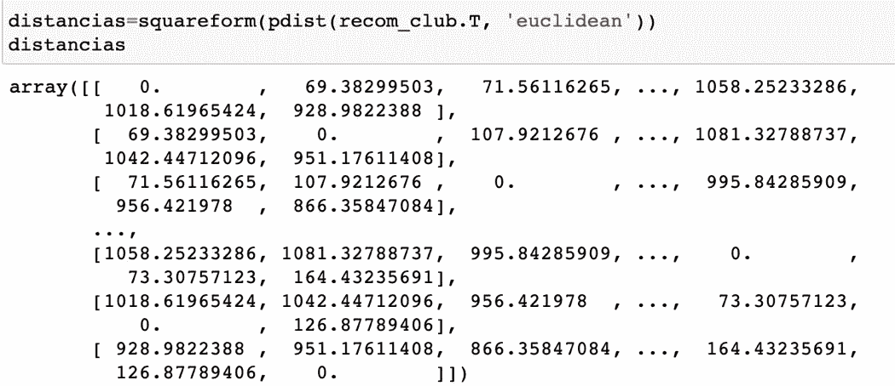

# 足球分析:使用机器学习预测工资和市场价值(2/3)。

> 原文：<https://medium.com/analytics-vidhya/soccer-analytics-prediction-of-salary-and-market-value-using-machine-learning-2-3-c612ecad5236?source=collection_archive---------15----------------------->

# 第二部分

在第二部分中，我将解释为什么我使用推荐系统来了解初始值，并与用于了解职业球员工资和市场价值的机器学习模型的结果进行比较。

文章分为以下几个部分:第一部分介绍了什么是推荐系统；第二部分阐述了获取数据的过程；最后，给出了实验结果。

## 推荐系统

一个**推荐系统**在本质上和日常生活中的工作方式是一样的。想象一下，你想邀请你的心上人共进晚餐，但你不知道哪个地方最适合和她约会。

你是做什么的？很自然，你首先想到的是*问*你的朋友或家人。

为什么？因为你和你的朋友在品味上会有一致之处，而且根据你的经验，你会对那份推荐持“信任”态度。

也就是说，如果你的一个朋友有很好的经历或记忆，这就给了你一种先验的，对你来说完全陌生的事物的有效性的感觉。

尽管我们每天产生大量的数据，这仍然是有效的，这使得像谷歌这样的搜索引擎可以根据我们与各种社交网络的互动来提出建议。

值得一提的是，我们从朋友或家人那里得到的建议总是有限的，因为如果没有技术工具，我们不可能知道世界上所有的选择。

好在有个概念叫:**协同过滤**。

来源:真实 Python

协作过滤器是一种解决世界上任何商品或服务的消费者所面临的信息过剩问题的技术。

许多公司和网站都整合了一个工具，让消费者自己“构建”一个“T8”集体推荐“T9”，将那些有相似偏好的人联系起来，这些人将收到“T10”有针对性的“T11”信息或广告，这些信息或广告基于他们之前对某个产品的点击。

另一方面，其他类型的过滤器有:

**基于内容的过滤器:**根据消费者的口味或兴趣进行推荐

**人口统计过滤器:**基于用户的特征，考虑年龄、学校等级、位置、性别等，做出推荐。

*   **混合过滤器:**它们是使用上述任何一种过滤器来丰富用户体验的结果

应用这种类型的过滤器的方式是通过度量或距离测量，这取决于所使用的数据类型。这些类型的度量通常被称为“**推荐者**”

推荐器收集并分析网站(在线商店、社交网络、音乐或电影网站等)用户的**偏好**。).

推荐的主要思想是具有相似活动或品味的用户 ***将在未来*** 继续分享他们的偏好。

当向新用户推荐具有相似品味的其他用户先前已经选择的产品或活动时，对他们的偏好的成功程度将趋向于越来越高和越来越精确。

找到最相关的用户并使用这些信息来预测他们的偏好的方法被称为 ***聚类*** ，是为了找到数据集的最佳细分，以便相似的数据属于同一组。

用于计算这种相似性的度量之一是“欧几里得距离”,它只不过是勾股定理的 N 维推广。

来源:谷歌

然而，现有的其他措施有:

*   闵可夫斯基距离
*   曼哈顿距离
*   切比雪夫距离

然而，现有的其他措施有:

闵可夫斯基距离
曼哈顿距离
切比雪夫距离

拥有这类工具的公司有:

**脸书**、 **Instagram** 、 **Twitter** 和 **LinkedIn** 根据你认识的人和他们的链接生成推荐，这使得你看到的信息与你的社交档案类型相关
**亚马逊**根据过去的购买、评级和与你相似的其他用户的购买或评级来推荐产品
**网飞**根据

来源:谷歌

但是，做好推荐的关键是要知道*两个用户有多相似*。

在这种情况下，我们将通过玩家的**物理属性**和**能力**来实现。

我们要做的第一件事是找到 FIFA 19 数据库中球员之间的比赛。

一旦我们有了这些距离，我们将继续寻找关于 15 名职业女选手的信息，最后，我们将获得初始值。

## 信息提取

由于我在 Ironhack 的最终项目有 10 天的临时限制，我只能处理 15 名职业球员的信息，其中 *3 名是墨西哥女足球运动员*。

值得一提的是，FIFA 19 在游戏**中加入了 24 支女足国家队中的 22 支**，这是游戏更新的一部分，为足球迷提供了模拟女足世界杯的机会。

然而，任何妇女的信息都不包括在现有的数据库中。起初，没有玩家的数据，我没有办法使用推荐系统。

我的第一个决定是搜索职业球员的**转会市场**门户网站(【https://www.transfermarkt.com/】T2)。问题是，这个著名的门户网站，因为拥有大量的球员信息，忘记了女人也踢足球。

让我们看一个例子

来源:Transfermarkt

来源:Transfermarkt

来源:Transfermarkt

来源:Transfermarkt

来源:Transfermarkt

幸运的是，有国际足联的索引门户网站(【https://www.fifaindex.com/es-mx/】T4)，在那里我可以查看有问题的球员的身体特征和技术。

因为我没有参加世界杯的所有球员的名单，我只拿了一组球员。

也许稍后我会恢复所有女玩家的信息，但就目前而言，有了这 15 名玩家，我们就有了相当强大的洞察力。

资料来源:国际足联指数

资料来源:国际足联指数

我把球员的信息储存在一个新的数据库里，这个数据库是专门为我需要的信息而创建的。

也就是说，因为不可能恢复诸如“俱乐部”、“位置”、“球衣”、“租借自”、“加盟”、“合同有效”等数据，所以如果我包括球员的信息，我会有空值的问题，这是我以前已经解决的问题。

## 结果

第一步是导入我们在上一篇文章中看到的最终数据库。这个数据库是完全干净完整的。

一旦导入，所有的数字域都被留下来计算 ***欧几里德距离*** 。

对这些距离的结果进行转换，使其看起来像是一个**相关矩阵**，其中对角线将始终为 1，其余值将在 0 和 1 之间变化。结果如下表所示。

有了这些结果，我试图验证推荐系统是否有效。

特别是，我寻找哪个球员与**‘l .梅西’**更相似，自然，与他最相似的球员是**‘克里斯蒂亚诺罗纳尔多’**。

一旦我检查出这是可行的，下一步就是将女玩家的信息包含到推荐系统中，并再次计算距离。

输入球员数据的方法如下:

过程是相同的，计算距离并重新生成一个从 0 到 1 的值数组。

最后选出的 3 名墨西哥选手分别是:'**肯蒂罗伯斯'**，'**朱舒市长'**，'**查林科拉尔'**。

显示的值是指与他们相似的前 5 名玩家。

其中最接近的球员是“S. Phillips ”,就身体特征和技能而言，这名球员的年薪应该相当于 100 万欧元或**20.5 万比索。**这几乎是他们在墨西哥每月平均收入的 5 倍。

**朱舒市长**的结果与肯迪·罗伯斯的结果相似。

最后，对**查林·科拉尔**的分析显示，他的工资应该接近**41.1 千比索**，这与在墨西哥支付的工资相差巨大。

从这个练习中，可以理解为什么有必要研究体育运动中男女之间的工资差异。

对身体特征和属性等具体因素的分析提供了大量的相关信息，这些信息对于任何寻求吸引尽可能优秀的人才来争夺冠军的足球俱乐部来说都可能是有意义的。

特别是在**墨西哥**的案例中，很明显，如果将这种做法推广到所有女选手，结果将不止是揭露，而且迫切需要审查所有职业女选手的工作条件。

我邀请你用机器学习模型来阅读这个项目的最后一部分，在那里做出最终的薪资和市值预测，并与推荐系统中找到的值进行比较。

如果你错过了第一部分，你可以在这里查看[http://bit.ly/31Ft45d](http://bit.ly/31Ft45d)和最终项目[https://jmcass.github.io/SportsAnalytics/index.html](https://jmcass.github.io/SportsAnalytics/index.html)

感谢阅读和分享！