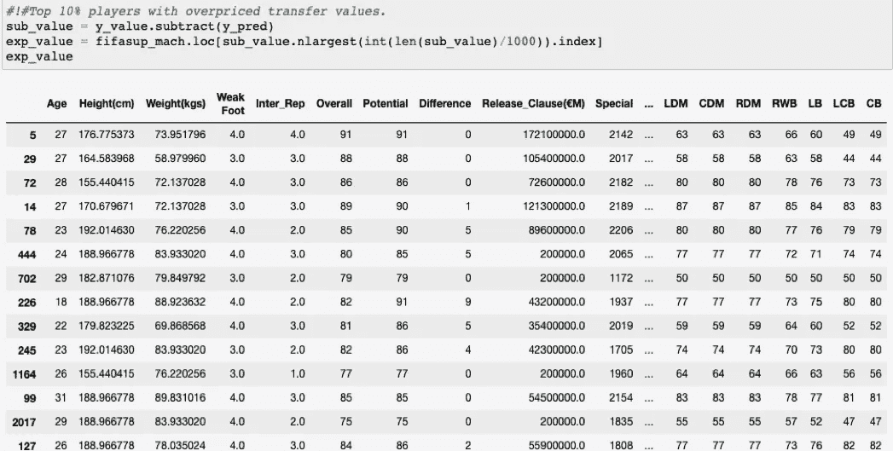
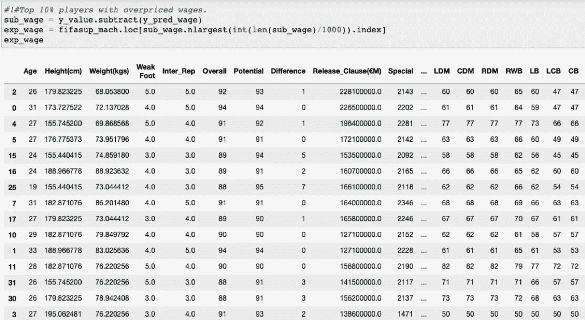

# 足球分析:使用机器学习预测工资和市场价值(3/3)。

> 原文：<https://medium.com/analytics-vidhya/soccer-analytics-prediction-of-salary-and-market-value-using-machine-learning-3-3-191fbf9d87c8?source=collection_archive---------19----------------------->

ALEXANDER IGREVSKY 摄于 Pexels

# 第三部分

在这最后一部分，我会解释为什么我用 XGBoost (Extra Gradient Boosting)模型来预测职业女选手的薪资和市值。文章分为以下几个部分:第一部分，我解释了什么是 XGBoost 第二部分，模型的建立过程；最后，显示结果。

## XGBoost 模型

Boosting 是一种机器学习方法，它允许你将单独不具有显著预测能力的小规则组合起来，但它们在一起会更有意义和力量。

想象以下场景:你生活在一个非常炎热的城市。你听说过植树可以降低环境温度。你决定在你的街道上种一棵树。你注意到什么变化了吗？大概不会。

如果你能在街道上种更多的树，会发生什么？当然，你开始注意到更多的动物，当然还有树荫。所有树木提供的更大范围的阴凉会让你感觉到更少的热量。

这个类比总结了 XGBoost 在使用弱规则(单个树)创建健壮规则(一组树)时所做的事情。

**来源**:数据科学之旅

实际上，**梯度增强**包括 **3 个元素** :
一个优化
的损失函数一个进行预测的弱学习算法。
·添加模型，添加弱学习算法，使损失函数最小化。

损失函数取决于我们面临的问题的类型，但它的主要特征是可微的。在回归问题中，我们可以使用**二次误差**，但在分类问题中，我们可以使用**对数损失**或**交叉熵。**

梯度提升中使用的 ***弱学习算法*** 就是**决策树**。决策树用于生成每个分支的真实值，以便将每个结果添加到后续模型中，并通过平均每个预测来纠正错误。

常见的是 ***限制决策树*** 的最大层数、节点数、划分数或表数，以确保算法保持弱，如下图所示。

**来源**:幸运笔记

每次添加一个决策树，而现有的决策树不会改变。然而，确定每个决策树的参数的方式是由将最小化损失函数的下降梯度来定义的。

这样，具有不同参数的树以这样的方式被添加，即它们的组合最小化了模型的损失并改进了预测。

使用**梯度推进**的决策树是非常强大的模型，用于**监督学习问题**，但是它们的一个主要缺点是需要*仔细调整参数*和一长串*训练时间*。

**XGBoost** (极限梯度提升)是最近在结构化数据**ka ggle**([https://www.kaggle.com/](https://www.kaggle.com/))比赛中掌握机器学习问题的算法。

XGBoost 是一个带有梯度提升的决策树实现，旨在 ***最小化执行速度*** 和 ***最大化性能*** 。只处理数字数据的事实是这个库如此高效的原因。

由于我们的最终数据是由 FIFA 19 数据库中所有球员的数字数据组成的，XGBoost 模型当然是可以用来预测女球员工资和市场价值的最佳模型。

**来源** : EA 游戏

## 设定模型

正如我们之前提到的，梯度推进涉及到创建决策树，并按顺序将决策树添加到集合模型中。创建新的树来校正现有集合的预测中的残留误差。

将几个模型放在一起形成一个非常大且复杂的模型会导致**过度拟合**的风险。

**来源** : GeeksforGeeks

XGBoost 要求信息以一种被称为 **Dmatrix** 的特殊方式呈现，它只不过是数据的线性转换。

它使用的参数是 **max_depth** (正在训练的决策树的最大深度) **objective** (使用的损失函数)和 **num_class** (数据集中的类的数量)。 **eta** 参数有一个特殊的解释，因为它允许我们避免过拟合的问题，因为它可以被认为是一个 ***学习率*** 。

不是简单地把新树的预测和完整的权重相加，而是将 eta 乘以为减少其权重而增加的废物。这有效地降低了通用模型的复杂性。

通常具有 0.1 至 0.3 范围内的小值。这种浪费的较低权重仍将帮助我们训练一个强大的模型，但它不会允许该模型逃避到更可能发生过度拟合的深度复杂性。

我们将首先创建一个**训练-测试-分割**，其中**训练使用 80%** 的数据，而**测试剩余的 20%** 的数据，用于市值预测模型和市场薪酬模型。

一旦定义了参数，就有必要训练模型

一旦我们得到模型的结果，我们现在寻求获得最佳参数来重新训练模型并得到更好的预测。

有了参数最好的 XGBoost 模型，现在可以预测任何球员的市场价值。

因为 XGBoost 只使用数字数据，所以不可能知道玩家的名字。然而，这个模型允许我们知道 10%的基础市场价值被高估或低估。

这种类型的信息是相关的，以试图找出市场在支付球员时考虑的因素。类似地，预测市场薪酬的模型如下所示。

同样，我们将使用具有找到的最佳参数的训练模型

我们也可以分析一下那些薪水极高的球员和那些远低于应有水平的球员。

## 结果

在找到最佳可能值之前，该模型执行了 **32 次迭代**。随后，用这些参数重新训练模型，以获得可能的最佳预测。

XGBoost 的强大之处在于加强了每个弱限定符，这将为我提供对目标变量的最佳预测。

使用 XGBoost 的一个优点是，它允许您处理大量的变量，当在第二个阶段，这个项目有了一个更大更丰富的数据框架时，这将非常有帮助。

一旦我有了训练好的模型和最终的预测者，我就获得了 15 名球员的信息，他们的理论工资值是多少。

在描述结果之前，有必要提及的是，在墨西哥，一名职业女选手平均每月收入**4200 比索**，而一名男选手每月收入**635000**比索。

15 名球员的工资结果如下:

另一方面，这些球员的市值应该在 3.77810915 亿美元(€1700 万)、4.631 亿美元(€2200 万)、1.8945 亿美元(€900 万)左右。

不幸的是，没有关于市场价值的信息来了解这项运动对墨西哥女性玩家来说离现实有多近或多远。如果这个练习是针对男性的，那么直接的比较就是在 **Transfermarkt** 中寻找工资和市场价值。

这个项目的下一步是在***Liga Mx Femenil***的网页上做网页抓取，获取尽可能多的信息，然后预测每个女球员的身体特征。

因此，通过将这些价值与他们每个人的工资和市场价值相匹配，它可以帮助他们作为谈判更好工作条件的指南。

来源:墨西哥

最后，我要感谢我在 **Ironhack:** Yonatan、Oscar 和 Vania 的老师们，他们总是带我们走向极限。另一方面，我不能不提到并感谢我在课程中遇到的朋友雷纳尔多、埃内斯托和罗杰。感谢你们所做的一切，兄弟们。对于我的其他同学，我要表达我对这么多美好时光的认可和感激。

感谢我的家人，皮塔，亨利，格雷斯和科尔米罗，感谢我的朋友卡洛斯，路易斯托，佩德罗，感谢他们的支持和激励。帕梅拉是我无穷无尽的灵感源泉。

如果你错过了第一部分，你可以点击这里查看 http://bit.ly/31Ft45d 的[，第二部分点击这里](http://bit.ly/31Ft45d)[http://bit.ly/2Tb1PwR](http://bit.ly/2Tb1PwR)，最后一个项目点击这里[https://jmcass.github.io/SportsAnalytics/](https://jmcass.github.io/SportsAnalytics/)index.html

感谢阅读和分享！