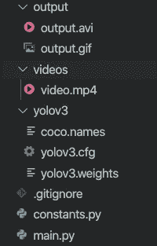

# 使用 OpenCV 和 YOLO 的社交距离分析器

> 原文：<https://medium.com/analytics-vidhya/social-distancing-analyzer-using-opencv-and-yolo-7572aed7b3bf?source=collection_archive---------5----------------------->


# **简介**

社交距离是有意增加人与人之间的物理空间，以避免传播疾病。与他人保持至少六英尺的距离会降低你感染**新冠肺炎**的几率。我们可以使用 **OpenCV** 和 **YOLO** 来监测/分析人们是否保持社交距离。

# 使用的技术和工具

我为这个项目使用了 **Python** 。我使用的一些其他工具是 **OpenCV** 和 **NumPy** 。

# 理论

一点理论不会有坏处:)

## **OpenCV**

所以，如果你不知道 OpenCV 是什么，OpenCV 是一个主要针对实时计算机视觉的编程函数库。OpenCV(开源计算机视觉库)是一个开源的计算机视觉和机器学习软件库。OpenCV 旨在为计算机视觉应用提供一个公共基础设施，并加速机器感知在商业产品中的应用。作为一个 BSD 许可的产品，OpenCV 使得企业利用和修改代码变得很容易。

该库拥有超过 2500 种优化算法，包括一套全面的经典和最先进的计算机视觉和机器学习算法。

更多信息[点击此处](https://opencv.org/)。

## **YOLO**

YOLO(你只看一次)是一个聪明的卷积神经网络(CNN)，用于实时进行对象检测。该算法将单个神经网络应用于整个图像，然后将图像分成多个区域，并预测每个区域的边界框和概率。这些边界框由预测概率加权。

YOLO 很受欢迎，因为它实现了高精度，同时还能够实时运行。该算法“只看一次”图像，因为它只需要一次通过神经网络的前向传播来进行预测。在非最大值抑制(确保对象检测算法只检测每个对象一次)之后，它会输出已识别的对象以及边界框。

更多信息[点击此处](https://pjreddie.com/darknet/yolo/)。

我们将在我们的项目中广泛使用以上两种方法。

## 概观

*   我们将使用 YOLO 进行物体检测。
*   一旦物体(人)被检测到，我们将在它们周围画一个边界框。
*   使用盒子的质心，然后我们测量它们之间的距离。
*   对于距离测量，使用了**欧几里德距离**。
*   如果**不安全**，一个盒子被涂成红色，如果**安全**，则被涂成绿色。
*   我们还会计算因为没有保持社交距离而变得不安全的人数。

已经感兴趣了？让我们从有趣的部分开始吧…


# 项目

1.  首先，让我们看看项目结构



项目结构

2.现在为 video.mp4 文件(输入)[点击这里](https://github.com/sherwyn11/Social-Distancing-Analyzer/blob/master/videos/video.mp4?raw=true)。您也可以从这里下载 YOLOv3 重量、配置和 COCO 名称:

*   YOLOv3 砝码— [点击此处](https://pjreddie.com/media/files/yolov3.weights)
*   YOLOv3 cfg — [点击此处](https://github.com/pjreddie/darknet/blob/master/cfg/yolov3.cfg)
*   可可姓名— [点击此处](https://github.com/pjreddie/darknet/blob/master/data/coco.names)

3.现在完成之后，打开 **constants.py** 并复制以下代码行

等等…我刚刚复制了什么？

放心吧！该文件仅包含 YOLO 权重的绝对路径、cfg 文件、COCO 名称、输入视频路径、输出视频路径以及需要维护的**安全距离**。

4.现在进入主要部分。打开 **main.py** 文件。首先让我们进行必要的进口。我们还定义了另外两个常量**标签**和**颜色**，我们稍后会用到。

5.接下来，我们使用之前下载的配置和权重加载 YOLO 模型。readNetFromDarknet 函数帮助我们做到这一点。

**层名**包含了我们需要的来自 YOLO 的所有输出层名。

6.现在，我们使用 OpenCV 的 **VideoCapture** 函数读取输入的视频流。

我们最初还将视频帧(W，H)的尺寸设置为(无，无)。在此之后，我们使用 OpenCV 的 **CAP_PROP_FRAME_COUNT** 来统计给定输入视频流中的帧数。我们还将它嵌入到 try/except 中，以便捕捉任何异常。

7.然后，我们读取输入视频流的每一帧。

OpenCV 的 **read** 函数帮助我们轻松做到这一点。你问框架是什么？很简单！顾名思义，一帧基本上就是视频的一个镜头。所有这些帧拼接在一起构成了一个视频。帧是由 3 个数组组成的数组。每个阵列代表一种颜色，即蓝、绿、红(**)。每个数组由 0 到 255 之间的数字组成，这些数字称为像素值。每个图像都是由像素组成的。所以对于一个 4 * 4 的图像，有 16 个像素。**

**我们使用一个 **while** 循环来循环输入视频的所有帧。如果在任何情况下，一个帧没有被抓取，我们就中断 while 循环，因为它可能是视频的结尾。我们还将 H 和 W 变量从(None，None)更新为(height_of_frame，width_of_frame)。接下来，我们创建一个图像帧的斑点。由于 OpenCV 使用“传统”的颜色表示，它们是以 **BGR** 的形式(蓝色、绿色、红色)。因此，我们传递参数 swapRB = True 来交换 R & B 颜色数组。因此，我们现在得到一个 **RGB** 颜色数组。我们还通过将数组元素除以 255 来重新缩放图像，以便每个元素位于 0 到 1 之间，这有助于模型更好地执行。**

****斑点**代表二进制大对象，指的是二进制**图像**中的一组相连像素。然后我们把它作为模型的输入，然后我们向前传递 YOLO。**

**8.YOLO 的输出由一组值组成。这些值帮助我们定义对象属于哪个类，并且它也给我们检测到的对象的边界框值。**

**我们对 layer_outputs 中的每个输出和输出中的每个检测进行循环。我们从**检测**数组中得到每个类(COCO 名字中的 80 个类)的分数。我们也获得了每个职业的自信。然后，我们将阈值置信度保持为 0.5，因为我们只对检测人感兴趣，所以我们将 classID 设置为 0。从每次检测中，我们得到一个包围盒。检测数组的前 4 个元素为我们提供了[X_center_of_box，Y_center_of_box，Width_of_box，Height_of_box]，然后我们将其缩放到我们的图像帧尺寸。**

**9.然后我们开始画边界框**

**我们使用非最大抑制来避免弱的和重叠的包围盒。然后我们计算当前框的**形心**与所有其他检测到的边界框形心之间的距离。我们使用**欧几里德距离**来度量盒子之间的距离。下面是欧几里德距离的公式。**

****

**我们将每个距离与之前在 **constants.py** 文件中定义的**安全距离**常数进行比较。接下来，我们使用 OpenCV 的使用**矩形**功能来创建一个**矩形**，它具有我们从模型中获得的盒子尺寸。我们检查盒子是安全的还是不安全的。如果不安全，那么框的颜色将是红色，否则框将是绿色。我们还使用 OpenCV 的 **text** 函数显示了不安全人数的文本。**

**10.现在，我们通过将每一帧连接起来来创建一个视频**

**OpenCV 的 **VideoWriter** 功能可以帮助我们做到这一点。它会将输出视频存储在我们之前在 **constants.py** 文件中定义的 **OUTPUT_PATH** 指定的位置。**释放**功能将释放文件指针。**

# **输出**

**唷！…既然编码部分已经结束，是时候看看我们努力的成果了。**

**继续运行 **main.py** 文件，如下所示。**

```
python main.py
```

**一旦程序执行完毕，检查你的**输出**文件夹并打开 output.avi 文件。**

**它应该看起来像这样…**

****

**输出. avi**

**令人印象深刻的权利！**

# **局限性和未来范围**

**虽然这个项目很酷，但是它有一些限制，**

*   **这个项目没有考虑相机视角。**
*   **它没有利用适当的摄像机校准(距离测量不准确)。**

**我们可以在未来解决这些限制。**

**仅此而已。只需 OpenCV、python 和几行代码，我们就能创造出很酷的东西！**

# **密码**

**本文的全部代码都在这个 GitHub 链接上。如果你喜欢这个项目，请在我的 GitHub 回购上留下⭐️。**

**[](https://github.com/sherwyn11/Social-Distancing-Analyzer) [## sherwyn 11/社交距离分析仪

### 社交距离是有意增加人与人之间的物理空间，以避免传播疾病。住在…

github.com](https://github.com/sherwyn11/Social-Distancing-Analyzer) 

# 结束注释

如果你觉得这篇文章有用，请给它一个掌声。谢谢大家！**