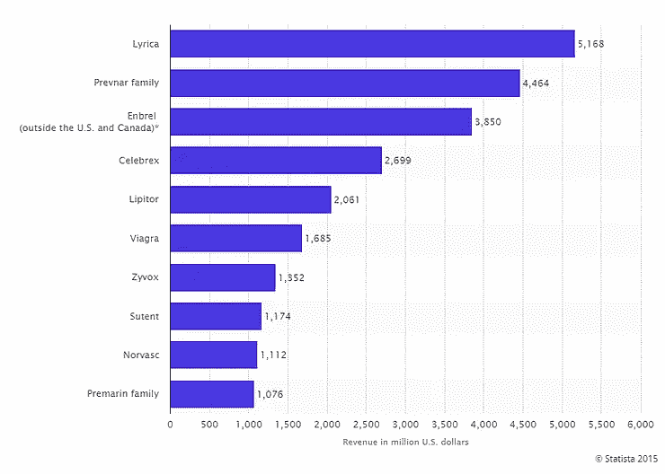
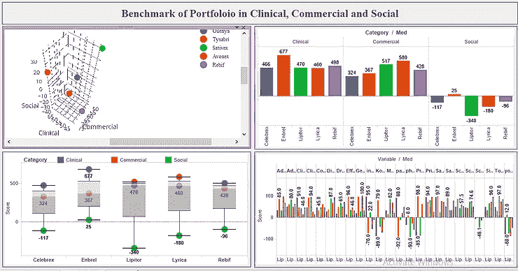
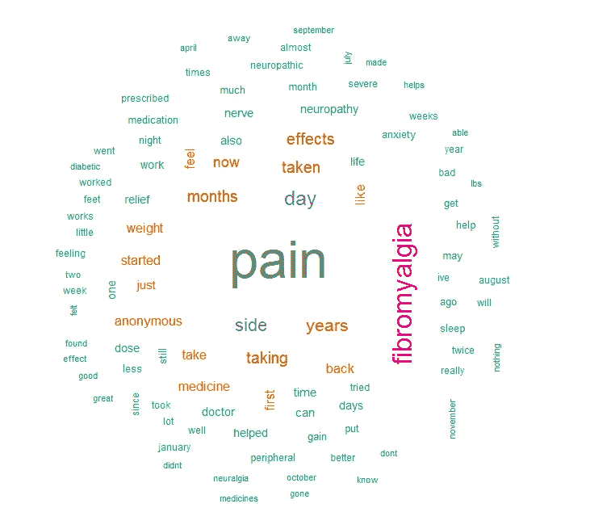
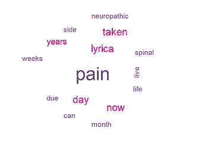
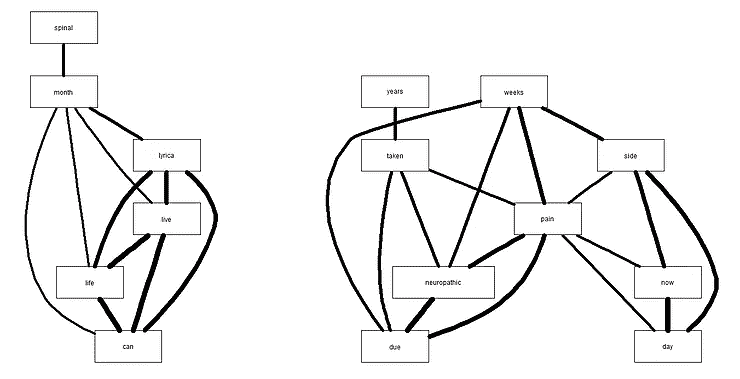
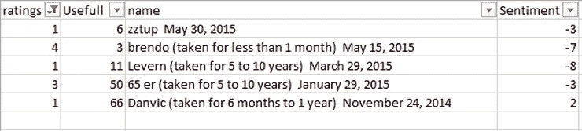

# 制药行业的社交媒体分析——用例(第 1 部分)

> 原文：<https://medium.com/analytics-vidhya/social-media-analytics-in-pharma-use-case-part-1-99ca5443739d?source=collection_archive---------18----------------------->

在当今时代，社交媒体在生活和商业的各个方面都发挥着重要作用。它甚至还在医疗保健和制药行业留下了显著的足迹。新生成的数据和各种分析引擎正在帮助制药行业发现更个性化的药物，这些药物在发挥作用和增强患者护理方面也更有深度。使用社交媒体分析，一些新的维度正在被探索，这些维度以前由于缺乏信息而无法触及。通过适当的渠道，现在医生和患者的数据很容易被许多行业竞争对手获得。

在本帖中，我们将尝试使用社交媒体数据来理解，我们可以如何探索一种药物的几个不同方面。我们将讨论研究的要点。详细讨论超出了我们的范围。

***药品关键尺寸和参数:***

根据我们的研究，我们发现，在衡量一种药物的市场表现时，主要有 3 个主要方面起着重要作用。

1.  临床的
2.  商业
3.  社会的

**临床参数:**

*   安全
*   有效性
*   可忍性
*   管理员的根目录
*   熟悉度关键意见领袖
*   满足未满足需求的能力

**商业参数:**

*   市场规模
*   独特性
*   销货力量
*   专业
*   解决多种迹象

**社交参数:**

*   不同的影响者
*   脸谱网
*   推特
*   论坛分析
*   博客
*   杂志

*著名制药公司辉瑞的十大品牌:*

*临床、商业和社交领域不同产品组合的基准:*

***文本挖掘用于社会方面的分析:***

我们试图研究名为“Lyrica”的药物的社会影响。为此，我们从[Drugs.com](http://Drugs.com)提取了一些关于患者用药的综述，并使用一些先进的机器学习技术进行了分析。

患者正在讨论的一些重要词汇:

*   ***疼痛***
*   ***纤维肌痛***
*   ***副作用***

然后，我们试图了解那些给该药物打了 5 到 8 分(满分 10 分)的人的体验。

该患者群体主要讨论:

*   ***神经性***
*   ***痛苦***
*   **脊椎*脊椎*脊椎**

我们研究了他们评论中的词语联想，以了解他们讨论的背景。

注意:两个词之间的线相对来说更粗更粗，意味着它们之间的关联比其他词更强。

***捕捉合适的用户:***

从一篇综述中，我们提取了 3 个不同的指标，以更好地了解用户和药物的有效性。

*   **评级**
*   **有用性**
*   **情绪得分**

前两个是直接从评论中获得的。第三个是我们使用情感分析的极性分数从评论中计算出来的。

*   我们可以抓住那些对普瑞巴林不满意的客户，从名称字段中我们可以抓住他们，并相应地针对他们制定适当的营销策略。
*   “**有用**”属性用于指示大多数患者所面临的问题，例如，此处用户**‘丹维克’**只给了普瑞巴林**‘1’**的评级，并且 **66 位用户**发现他/她的评论是有用的。所以我们应该专注于‘丹维克’所说的话。

因此，我们需要知道的是，利用社交媒体和其他网站的数据，我们可以更好地了解药物的有效性，并改善消费者不满意的地方。

在讨论的下一部分，我们将了解如何从脸书和医生博客等社交媒体获取数据，以了解不同知名药物的市场情况。在此之前，祝你学习愉快:)