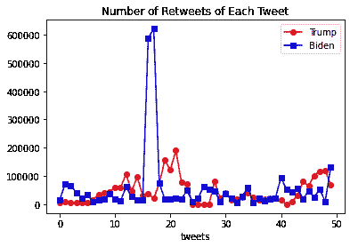
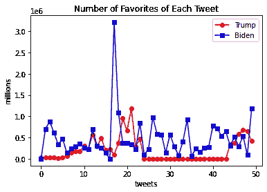
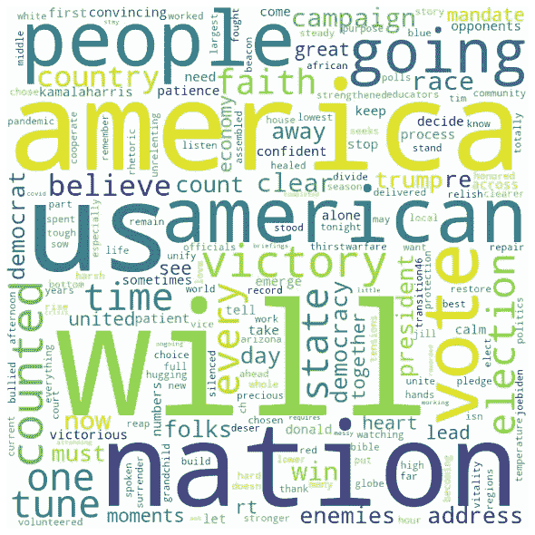
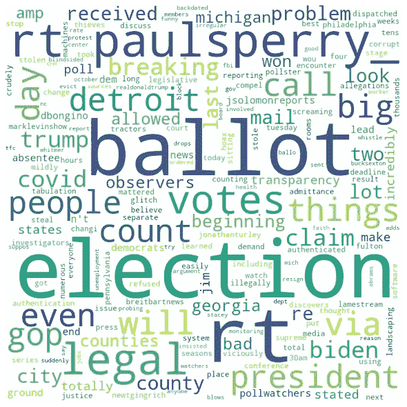

# 特朗普和拜登推特上的社交媒体分析

> 原文：<https://medium.com/analytics-vidhya/social-media-analytics-on-trump-and-bidens-twitter-2d7788deda67?source=collection_archive---------7----------------------->

更多代码链接到我的 Github:[https://Github . com/charliezcr/Social-Media-Analytics/blob/main/SMA . ipynb](https://github.com/charliezcr/Social-Media-Analytics/blob/main/sma.ipynb)

在最近的总统选举中，[乔·拜登](https://twitter.com/JoeBiden)刚刚击败[唐纳德·川普](https://twitter.com/realDonaldTrump)成为下一任美国总统。他们使用社交媒体，特别是 Twitter 的统计数据是分析的有趣材料，因为它们提供了关于总统态度和公众反应的见解。因此，在 2020 年 11 月 9 日，在乔·拜登宣布获胜后，我通过抓取他们最近的推文，调查人们的反应和检查他们推文的内容，分析了他们最近的推文数据。这是如何进行社交媒体分析的详细步骤。

## Twitter 抓取

第一步，通过网络抓取获取他们的推文数据集。因为 twitter 不允许网页抓取器，你需要申请成为一名 Twitter 开发者，并获得消费者密钥、消费者密码、访问令牌和访问令牌密码，才能访问他们 Twitter 账户的数据。之后，我使用 Twitter API Tweepy 来抓取他们的推文。下面是这个 API 的设置。

```
auth **=** tweepy**.**OAuthHandler(consumer_key, consumer_secret)
auth**.**set_access_token(access_token, access_token_secret)
api **=** tweepy**.**API(auth, wait_on_rate_limit**=True**)
```

这个 API 可以用来查询 Twitter 库并抓取他们的推文。我根据时间线刮出了前 50 条推文。特别是，我收集了一条推文的所有[属性中的时间戳、推文正文、每条推文的转发数和赞数；并将推特信息存储到熊猫数据帧中。下面是抓取代码(我只以 Trump 为例进行演示)。](https://www.geeksforgeeks.org/python-status-object-in-tweepy/)

```
*# The name of their Twitter accounts*
trump **=** "realDonaldTrump"

*# To get 50 tweets*
count **=** 50

*# Creation of query method using parameters*
trump_tweets **=** tweepy**.**Cursor(api**.**user_timeline,id**=**trump)**.**items(count)

*# Pulling information from tweets iterable object*
trump_tweets_list **=** [[tweet**.**created_at, tweet**.**text, tweet**.**retweet_count, tweet**.**favorite_count] 
                     **for** tweet **in** trump_tweets]

*# Creation of dataframe from tweets list*
tweets_trump **=** pd**.**DataFrame(biden_tweets_list, columns **=** ["time stamp", "tweet", "retweets","favorites"])
```

## 拜登和特朗普的推特分析

## 频率

通过分析时间戳，我们可以知道总统们发推特的频率。

*拜登:第一条推文发于 2020-11-08 14:28:23。
第 50 条推文于 2020-11-04 19:10:00 发出。
拜登用了 3 天 19:18:23 发了 50 条推文。根据最近的数据，拜登每 34 分钟就会发一条推文。*

*特朗普:第一条推文发于 2020-11-09 04:54:16。
第 50 条推文于 2020-11-06 16:37:01 发出。
特朗普用了 2 天 12:17:15 发了 50 条推文。根据最近的数据，特朗普每 20 分钟就会发一条推特。*

根据上面的统计，两位总统都活跃在推特上。他们都经常发推特，但特朗普在推特上更活跃。

## 回顾和收藏夹

为了分析公众对总统推文的反应，我使用 Python 模块 matplotlib 可视化并比较了每条推文的转发数和收藏夹数。下面的图表显示了他们在 Twitter 上是多么受欢迎。



拜登总共有 23764008 个收藏夹，每条推文有 475280 个收藏夹。
特朗普总共有 10064734 个收藏夹，每条推文有 201294 个收藏夹。

*拜登总共有 2874090 条转发，每条转发有 57481 条转发。
川普总共有 2275648 条转发，每条转发 45512 条。*

图表显示，拜登比特朗普获得了更多的喜爱和转发。平均而言，拜登的转发量比特朗普多一点，受欢迎的次数是特朗普的两倍多。因此，拜登的推文比特朗普的更受欢迎。

## 词云

为了研究两位总统推特的内容，我使用了 Python 模块 wordcloud 和 nltk。首先，我为每位总统建立了一个语料库。语料库包含他们推文中的每一个标记词。为了可视化单词的频率，使用下面的函数生成单词云。单词云显示他们推文中经常提到的单词。单词越大，使用频率越高。

```
**def** word_cloud(df):
    corpus **=** '' 
    stopwords **=** set(STOPWORDS)     *# iterate through the tweets*
    **for** text **in** df**.**tweet:         *# remove url links in tweets*
        text **=** result **=** re**.**sub(r"http\S+", "", str(text))
        *# split the value* 
        tokens **=** [word**.**lower() **for** word **in** word_tokenize(text)]
        *# adding the tokenized words into corpus*
        corpus **+=** " "**.**join(tokens)**+**" " wordcloud **=** WordCloud(width **=** 800, height **=** 800, 
                    background_color **=** "white", 
                    stopwords **=** stopwords, 
                    min_font_size **=** 10)**.**generate(corpus)    *# plot the WordCloud image* 
    plt**.**figure(figsize **=** (8, 8), facecolor **=** **None**) 
    plt**.**imshow(wordcloud) 
    plt**.**axis("off") 
    plt**.**tight_layout(pad **=** 0)     plt**.**show()
```



拜登(左)和特朗普(右)的字云

*注:在特朗普的词云中，“rt”是“retweet”的缩写*

云这个词表明，特朗普更关心选举，频繁提到“选举”和“选票”，但拜登更关心国家，频繁提到“民族”、“我们”和“美国”。