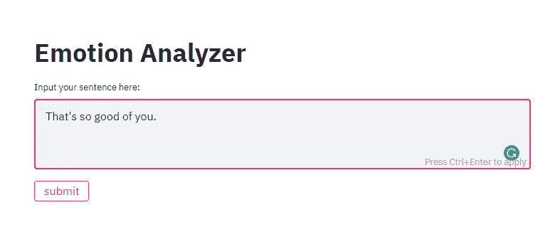
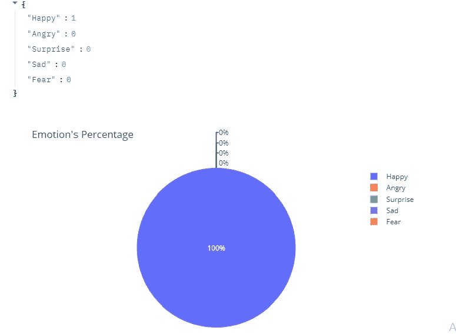

# 社交媒体监控:使用 Python 中的 text2emotion 进行情感分析

> 原文：<https://medium.com/analytics-vidhya/social-media-monitoring-emotional-analysis-using-text2emotion-in-python-193a4b2f6dc2?source=collection_archive---------9----------------------->

[来源:美国身体、感觉、情绪之间未知的联系——Rozbuzz we media](https://buildforcovid19.io/seq2seq-rl-chatbot-with-pytorch-qna/)

# **简介**

*在当今的数字世界中，每个品牌都知道社交媒体对推动他们的业务有多重要。每个品牌都试图通过广告、帖子、视频、模因等在社交媒体上从情感上驱动其潜在客户，从而获得其产品或服务的销售或转化。你有没有想过，通过分析社交媒体帖子的反馈或评论来了解客户对你产品的情绪，对你的企业有多大用处？本文使用我和我的三个同事开发的 python 包****text 2 emotion****给你一个相同的想法。*

# 目录:

1.  ***Text2Emotion***
2.  ***社交媒体监控***
3.  ***工作中的文字 2***
4.  ***怎么用？***
5.  ***关键要点***

# 1.text 2 情感:

*通过将文本的* ***语气*** *归类为快乐、愤怒、惊讶、悲伤、恐惧五种不同的情绪，帮助你对文本进行分类。*

***关键特性:***

*   处理任何文本消息，并且**识别嵌入其中的**情感**。**
*   兼容 5 种不同的情绪类别，如**快乐、愤怒、悲伤、恐惧和惊喜。**

# **2。*社交媒体监测:***

现在让我们来看一个工业用例，在这个用例中，从文本中分析情感起着至关重要的作用，让我们更清楚地了解这个主题。

[来源:品牌最佳社交媒体监测指南- Netbase](https://www.netbase.com/blog/social-media-monitoring-guide/)

*在当今的数字世界中，品牌监控和声誉管理已经成为每个业务部门最重要的方面之一。这就是* ***情感*** ***分析*** *起着至关重要作用的地方。了解最终用户或客户如何识别你的品牌或产品对每个公司和组织都非常有用。*

*我们可以实现****text 2 emotion****包来创建一个软件，通过提供最终用户对品牌的感知信息，为业务带来灵活性，并提供对公司及其产品声誉的更多洞察。这将有助于公司允许他们:*

*   *追踪消费者对公司的看法。*
*   *通过给出具体细节来指出消费者的态度。*
*   *发现不同的模式和趋势。*
*   *密切关注影响者的演示。*

所有这些都有助于我们根据客户的需求修改产品和服务，并创造更多收入。

# 3.文本工作 2 情感:

*现在让我们来看看这个软件包的工作原理。*

***A)文本预处理***

*第一步，我们的目的是通过* ***数据清洗*** *从我们的数据中去除所有的杂质或者不需要的东西，让它变得适合情感分析。*

*   *从内容中删除不需要的文本部分。*
*   *执行* ***自然语言处理*** *技术。*
*   *对文本进行预处理后，得到预处理好的文本。*

***B)情感识别***

*在第二步中，我们将从预处理文本获得的单词中识别不同的情绪，并将对每一种情绪进行计数。*

*   找出那些恰当表达情感或感觉的词语。
*   检查每个单词的情感类别。
*   存储与找到的所有单词相关的所有情绪的数量。

***C)情感分析***

****情感识别*** *完成后，我们需要对情感进行分析，以便对输入的信息得到合适的输出。**

*   *我们将以字典的形式获得输出。*
*   **关键字将以情感类别的形式出现，它们的值以情感分数的形式出现。**
*   **我们可以通过分析特定情感类别的最高分来决定特定消息所属的类别。**

# *4.怎么用？*

## *查看 Google Colab 演示:*

> *[***谷歌 Colab:text 2 emotion***](https://colab.research.google.com/drive/1sCAcIGk2q9dL8dpFYddnsUin2MlhjaRw?usp=sharing#scrollTo=ivUkOaBPEQYr)*

## *应用程序演示*

*下面给出的是用***Streamlit App****为用户实现代码的演示。**

1.  **输入短信。**

**

*在框中输入文本消息，然后单击提交按钮。*

**2。单击提交按钮。**

**3。答对了。以可视化的形式获得消息的输出。**

****

*它识别文本中的情绪，并相应地以视觉形式给你输出。*

## *[点击此处查看演示网络应用](https://text2emotion.herokuapp.com/)*

*让我们去图书馆亲身体验一下。*

## *欲了解更多信息，请访问:*

*[***text 2 情感文档***](https://pypi.org/project/text2emotion/)*

# *5.关键要点*

**总之，text2emotion 可以用:**

*   **自动化社交媒体监控流程。**
*   **监控该品牌在脸书、推特、Instagram 等不同社交媒体平台上的提及或评论。**
*   **对客户的不同评论进行分类，了解哪种社交媒体平台和哪种类型的用户对公司很重要。**