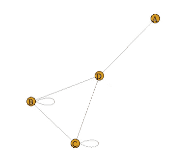

# R 中的社会网络分析第一部分:自我网络

> 原文：<https://medium.com/analytics-vidhya/social-network-analysis-in-r-part-1-ego-network-ab6b0d23ebc8?source=collection_archive---------6----------------------->

社会网络分析简介及其在 Twitter 网络上的实现。第一部分:自我网络

这是我带去办公室内部培训日的第一部分 SNA 材料。我想说这是我雄心勃勃的作品之一(也是最耗时的)。我们将使用来自 R 语言的“tidygraph”包(包括“igraph”和“ggraph ”)来学习 SNA。我们不仅要学习可视化的东西，还要学习度量标准。我们将使用“rtweet”包分析 Twitter 网络作为我们的研究案例。


带思维导图的 SNA

## 什么是社会网络分析

社会网络是由一组参与者组成的结构，其中一些参与者由一组一个或多个关系连接。SNA 致力于描述社会结构的基本模式，解释这种模式对行为和态度的影响。社交网络分析有 4 种主要类型的网络指标，即:

*   网络模型:描述如何对用户之间的关系建模
*   关键人物:根据不同的背景来识别网络中最有影响力的用户
*   联系强度:衡量用户关系的强度
*   网络凝聚力:衡量网络中的凝聚实体对网络行为的影响。

## 那又怎样？我们为什么需要它们？

人类是群居动物。即使在你睡觉的时候，你仍然可以通过你的智能手机与世界上的每个人保持联系。你的智能手机不断发送和接收信息，如天气信息、收到的 WhatsApp 消息、深夜的 One Piece 更新以及来自你最喜欢的偏见的社交媒体通知。我们总是联系在一起，到处都有网络。不知何故，一些在著名的小世界理论背后的聪明人从网络上发现了一些令人兴奋的东西。

你知不知道你和你最爱的人只隔了六步的[？我们能够量化所谓的网络，并可以在许多领域实施。在本研究中，我们将只关注确定以“关键人物”作为预期输出的网络指标(参见上面的 4 种主要网络指标)。这里有一些 SNA 的实现，可以启发你一些关于 SNA 的知识:](https://en.wikipedia.org/wiki/Six_degrees_of_separation)

业务:
- [社交媒体细分](https://www.researchgate.net/publication/320653694_Social_network_data_analytics_for_market_segmentation_in_Indonesian_telecommunications_industry)
- [信息通过网络传播(用于营销目的)](https://ieeexplore.ieee.org/abstract/document/5076278)
- [识别社会名人(用于识别最佳代言)](https://www.researchgate.net/profile/Walter_Kosters/publication/267711959_Identifying_Prominent_Actors_in_Online_Social_Networks_using_Biased_Random_Walks/links/5550870208ae956a5d24d2c2.pdf)
- [映射潜在客户](http://dl.acm.org/doi/abs/10.1145/1961189.1961194)
- [映射旅游流](https://www.tandfonline.com/doi/abs/10.1080/13683500.2014.990422)

非业务:
-分析某事物如何在社交媒体上传播
- [识别疾病传播](https://www.sciencedirect.com/science/article/pii/S0167587703000758)

## 我们开始吧

必需的库。在您的工作目录中安装并加载这个库。

```
# for data wrangling. very helpfull for preparing nodes and edges data
library(tidyverse) 
library(lubridate)# for building network and visualization 
library(tidygraph)
library(graphlayouts)
# already included in tidygraph but just fyi
library(igraph)
library(ggraph)# for crawling Twitter data 
library(rtweet)# for visualizing
library(extrafont)
loadfonts(device = "win")
```

## 先决条件

这项分析使用了 Twitter 数据。我们可以从开发者账户使用他们的 rest API 收集 Twitter 数据。您需要创建开发人员帐户，构建应用程序，并使用他们的令牌进行身份验证

```
apikey <- "A5csjkdrS2xxxxxxxxxxx"
apisecret <- "rNXrBbaRFVRmuHgEM5AMpdxxxxxxxxxxxxxxxxxxxxxxx"
acctoken <- "1149867938477797376-xB3rmjqxxxxxxxxxxxxxxxxxxx"
tokensecret <- "Dyf3VncHDtJZ8FhtnQ5Gxxxxxxxxxxxxxxxxxxxxxx"token <- create_token(app = "Automated Twitter SNA",
                      consumer_key = apikey,
                      consumer_secret = apisecret,
                      access_token = acctoken,
                      access_secret = tokensecret)
# check the token
get_token()
```

**注** *:* 最近更新的‘rtweet’允许你与 Twitter API 进行交互，而无需创建自己的 Twitter 开发者账户。你可能想先检查一下。

## 图论

在数学中，图论是对图形的研究，图形是用于建模对象之间成对关系的数学结构。本文中的图由通过**边**(也称为链接或线)连接的**顶点**(也称为节点或点)组成。一般来说，节点之间的连接分为两种类型:[有向和无向](https://www.mathworks.com/help/matlab/math/directed-and-undirected-graphs.html)。

*   有向是边具有方向(边具有方向)的节点之间的关系。你会认出它是有箭头的边。有向网络也根据其方向分为两种类型，即:入度和出度。入度表示传入顶点/节点的边的数量。在下图中，A 的入度是 1，D 的度是 2。出度表示从顶点出来的边的数量。在下图中，A 的出度是 1，C 的出度是 3。


有向图

*   无方向表示双向关系，边是单向的，没有与之相关联的方向。因此，图可以在任一方向上遍历。没有箭头说明这个图是无向的。



无向图

## 图表指标(中心性和模块性)


网络中心性

**度中心性**

其中最简单的中心性。只是**一个节点有多少条纽带**。有向和无向的计算有点不同，但它有相同的想法:有多少个节点连接到一个节点。

**接近中心性**

节点的接近中心性是图中该节点与所有其他节点之间的最短路径(测地线)的平均长度。因此，一个节点越中心，它离所有其他节点就越近。具有最高接近中心性的节点被认为是比整个网络中的任何节点更快地传播信息的节点。

**中间中心性**

中间中心性量化了节点**作为两个其他节点/组之间的最短路径上的桥的次数。**具有最高介数中心性的节点被认为是传播信息最广泛的节点。

**特征向量中心性**

特征向量中心性是网络中节点影响力的度量。分配给网络中节点的相对分数基于这样的概念，即与低分数节点的同等连接相比，与高分数节点的**连接对所讨论节点的分数**贡献更大。这个惊人的[链接](http://matrixcalc.org/en/vectors.html)将帮助你进行计算。具有最高特征向量中心性值的节点意味着它们接近在网络中具有高影响力的另一个人。

**社区和模块化**

在图论中构建社区与机器学习中的聚类有点不同。“igraph”包实现了许多社区检测方法，社区结构检测算法试图通过优化一些标准并通常使用试探法来在有向或无向图中找到密集子图。像“group_walktrap()”、“group_fast_greedy()”和“group_louvain()”这样的社区检测算法有它们自己的方式来在网络中创建社区。一种常用的社区检测算法是“group_walktrap()”。这个函数试图通过随机行走找到密集连接的子图，也称为图中的社区。这个想法是短距离随机漫步倾向于停留在同一个社区。

另一方面，模块性是划分好坏的一种度量，或者不同顶点类型之间的分离程度。综上所述，**模块化程度高的网络在社区内的节点之间具有密集的连接，而在不同社区的节点之间具有稀疏的连接**

# 团队精神自我网络

我警告你，这将是一个很长的分析，因为数据收集和争论步骤需要做很多事情。Ego 网络是指示 ego/节点直接连接到的所有节点的数量的概念，并且包括网络中节点之间的所有联系。你随便找一个你想分析的用户名/公司/个人，收集他们所有的邻居，然后进行分析。在这种情况下，我想分析 TeamAlgoritma Twitter 帐户 ego network。TeamAlgoritma 是我最近合作的公司。此分析的目标是:从 TeamAlgoritma 共同客户中可视化顶级集群，找出哪个客户具有广泛传播信息的潜力，计算中心性，并找出谁是 TeamAlgoritma 网络中的**关键人物**。

## 数据收集过程

首先，我们需要收集@ TeamAlgoritma 帐户数据及其追随者

```
# gather teamalgoritma data
algo <- lookup_users("teamalgoritma")# get TeamAlgoritma followers and its account details
folower <- get_followers("teamalgoritma",n = algo$followers_count,retryonratelimit = T)
detail_folower <- lookup_users(folower$user_id)
detail_folower <- data.frame(lapply(detail_folower,as.character),
stringsAsFactors = F)
```

TeamAlgoritma 推特账户有 342 名关注者(2020 年 5 月 15 日)。我们需要收集他们所有的追随者和追随者，但 Twitter rest API 有(有点吝啬)的限制。我们只能收集 15 个用户(包括跟随者和追随者)和每 15 分钟检索 5k，所以你可以想象如果我们要检索数千人..为了最大限度地减少时间消耗，我们需要只过滤活跃用户。“活跃用户”的标准取决于您的数据。你需要查找你的追随者是哪种类型的用户，并建立自己的标准。在这种情况下，Algoritma 的前 8 名关注者是一个媒体帐户。那个媒体账号只转发自己媒体的链接，从不转发其他账号的推文。因此，如果我们的目标是绘制围绕 TeamAlgoritma 自我网络传播的潜在信息，出于这个原因，我们需要排除它们。

经过长时间的检查，我提出了几个过滤活跃账户的标准:` Followers_count` > 100 和< 6000, `following_count` > 75，` favourites_count` > 10，并在至少 2 个月前创建一条`新推文'。我还想排除受保护的帐户，因为我们实际上对此无能为力，我们无法聚集他们的追随者和追随者。

```
active_fol <- detail_folower %>% select(user_id,screen_name,created_at,followers_count,friends_count,favourites_count) %>%
  mutate(created_at = ymd_hms(created_at),
         followers_count = as.numeric(followers_count),
         friends_count = as.numeric(friends_count),
         favourites_count = as.numeric(favourites_count)) %>%
  filter((followers_count > 100 & followers_count < 6000), friends_count > 75, favourites_count > 10, 
         created_at > "2020-03-15") %>%
  arrange(-followers_count)
```


TeamAlgoritma 活跃追随者

## 聚集团队葛里玛追随者的追随者

现在我们有 161 个用户被认为是活跃用户。接下来，我们将集合他们所有的追随者。但是由于 Twitter API 有一个非常严格的限制，我也没有太多的时间，所以我们想最小化我们想要检索的总用户数(` n '参数)。我构建了一个简单的函数，如果追随者超过 1500，则检索一半的追随者，如果追随者少于 1500，则检索 75%的追随者。

```
flt_n <- function(x){
  if(x > 1500){
    x*0.5
  }else{x*0.75}
}
```

我们还希望在收集追随者时避免 SSL/TLS 错误。有时，当您达到速率限制时，循环往往会崩溃并停止运行。为了避免这种情况，我命令循环每收集 5 个帐户就休眠一次(这并不总能解决问题，但会好得多)

```
# Create empty list and name it after their screen name
foler <- vector(mode = 'list', length = length(active_fol$screen_name))
names(foler) <- active_fol$screen_name# 
for (i in seq_along(active_fol$screen_name)) {
  message("Getting followers for user #", i, "/130")
  foler[[i]] <- get_followers(active_fol$screen_name[i], 
                                  n = round(flt_n(active_fol$followers_count[i])), 
                                retryonratelimit = TRUE)

  if(i %% 5 == 0){
    message("sleep for 5 minutes")
    Sys.sleep(5*60)
    } 
}
```

收集后，将列表绑定到数据帧，通过左连接将用户名从 active_fol 数据转换为 user_id，构建干净的无 NA 数据帧

```
# convert list to dataframe
folerx <- bind_rows(foler, .id = "screen_name")
active_fol_x <- active_fol %>% select(user_id,screen_name)# left join to convert screen_name into its user id
foler_join <- left_join(folerx, active_fol_x, by="screen_name")# subset to new dataframe with new column name and delete NA
algo_follower <- foler_join %>% select(user_id.x,user_id.y) %>%
  setNames(c("follower","active_user")) %>% 
  na.omit()
```

**聚集 TeamAlgoritma 追随者的关注**

和以前一样，我们构建一个循环函数来收集以下内容。在“rtweet”包中，以下也称为“朋友”。在我的例子中，朋友数远远高于关注者数。因此，我们需要指定我们想要检索多少用户(` n '参数)。我们想最小化它，我改变' flt_n '函数，只收集 40%,如果他们有超过 2k 的后续，和 65%,如果少于 2k。然后，我也改变循环函数。我们将数据存储到 dataframe，而不是 list。` get_friends()`函数给出 2 列作为它们的输出；好友列表和查询。我们可以很容易地把他们绑起来。

```
flt_n_2 <- function(x){
  if(x > 2000){
    x*0.4
  }else{x*0.65}
}
friend <- data.frame()for (i in seq_along(active_fol$screen_name)) {
  message("Getting followers for user #", i, "/161")
  kk <- get_friends(active_fol$screen_name[i],
                        n = round(flt_n_2(active_fol$friends_count[i])),
                        retryonratelimit = TRUE)

  friend <- rbind(friend,kk)

  if(i %% 5 == 0){
    message("sleep for 5 minutes")
    Sys.sleep(5*60)
    } 
}
```

然后，我们使用 left join 检索活动帐户 user-id

```
all_friend <- friend %>% setNames(c("screen_name","user_id"))
all_friendx <- left_join(all_friend, active_fol_x, by="screen_name")algo_friend <- all_friendx %>% select(user_id.x,user_id.y) %>%
  setNames(c("following","active_user"))
```

## 创建交互数据框架

现在我们有了关注者和追随者的数据。我们需要建立“相互”数据，以确保网络是一个强大的双向连接网络。相互是我对相互追随的人的称呼。我们可以通过以下方式找到:按每个唯一的活跃用户拆分 algo_friend 数据，然后我们在下一列中找到同时出现在 algo_follower$follower 中的每个帐户。两列中的存在表明用户正在相互关注。

```
# collect unique user_id in algo_friend df
un_active <- unique(algo_friend_df$active_user) %>% data.frame(stringsAsFactors = F) %>%
  setNames("active_user")# create empty dataframe
algo_mutual <- data.frame()# loop function to filter the df by selected unique user, then find user that presence in both algo_friend$following and algo_follower$follower column set column name, and store it to algo_mutual dffor (i in seq_along(un_active$active_user)){
  aa <- algo_friend_df %>% filter(active_user == un_active$active_user[i])
  bb <- aa %>% filter(aa$following %in% algo_follower_df$follower) %>%
    setNames(c("mutual","active_user"))

  algo_mutual <- rbind(algo_mutual,bb)
}
```

它还没有完成。这是一个 TeamAlgoritma 帐户的 ego 网络，我们希望该帐户出现在我们的屏幕上。由于 TeamAlgoritma 很少跟踪它的追随者，所以如果我们在相互数据报中找不到它也就不足为奇了。所以我们需要手动添加它们。我们已经有了包含活跃用户独特价值的非活跃数据框架。我们可以简单地添加额外包含“TeamAlgoritma”的列，然后用 algo_mutual df 绑定它们。

```
un_active <- un_active %>% mutate(mutual = rep("TeamAlgoritma"))
# swap column oreder
un_active <- un_active[,c(2,1)]# rbind to algo_mutual df
algo_mutual <- rbind(algo_mutual,un_active)algo_mutual
```

唷，我们完成了数据收集步骤！接下来，我们将进入 SNA 流程

## 构建节点、边和图形数据框架

网络由节点和边组成。节点(也称为顶点)表示网络中每个唯一的对象，边是节点(对象)之间的关系。我们将从 algo_mutual df 中的每个唯一帐户构建节点数据框架。和包含帐户对的边数据帧，我们可以使用 algo_mutual df。

```
# create nodes data
nodes <- data.frame(V = unique(c(algo_mutual$mutual,algo_mutual$active_user)),
                    stringsAsFactors = F)# create edges data
edges <- algo_mutual %>% setNames(c("from","to"))# after that, we can simply create graph dataframe using `graph_from_data_frame` function from `igraph` package.network_ego1 <- graph_from_data_frame(d = edges, vertices = nodes, directed = F) %>%
  as_tbl_graph()
```

## 构建社区并计算指标

我需要提醒你，我们将使用“tidygraph”风格进行分析。有许多不同的代码风格来建立一个网络，但我发现“tidygraph”包是最简单的。“tidygraph”只是“igraph”包的包装。

```
set.seed(123)
network_ego1 <- network_ego1 %>% 
  mutate(community = as.factor(group_walktrap())) %>%
  mutate(degree_c = centrality_degree()) %>%
  mutate(betweenness_c = centrality_betweenness(directed = F,normalized = T)) %>%
  mutate(closeness_c = centrality_closeness(normalized = T)) %>%
  mutate(eigen = centrality_eigen(directed = F))network_ego1
```


网络数据，包括节点、边、社区(集群)和中心性

我们可以很容易地使用' as.data.frame()'函数将其转换为 dataframe。我们需要这样来确定谁是团队自我网络中的“关键人物”

```
network_ego_df <- as.data.frame(network_ego1 %>% activate(nodes))
network_ego_df
```

## 识别网络中的重要用户

在这一点上，我希望你理解图的概念，节点和边，中心性，社区和模块化，以及如何使用它。我们将回到我们的 Twitter 网络。我们已经将 table_graph 转换为数据框。我们需要做的最后一件事是在每个中心找到最重要的客户，并找出关键人物。

关键玩家是基于不同语境对网络中最有影响力的用户的称呼。在这种情况下,“不同的上下文”是不同的中心性度量。每个中心性有不同的用法和解释，出现在最中心性顶部的用户将被认为是整个网络的关键参与者。

```
# take 6 highest user by its centrality
kp_ego <- data.frame(
  network_ego_df %>% arrange(-degree_c) %>% select(name) %>% slice(1:6),
  network_ego_df %>% arrange(-betweenness_c) %>% select(name) %>% slice(1:6),
  network_ego_df %>% arrange(-closeness_c) %>% select(name) %>% slice(1:6),
  network_ego_df %>% arrange(-eigen) %>% select(name) %>% slice(1:6)
) %>% setNames(c("degree","betweenness","closeness","eigen"))kp_ego
```


基于其中心性的前 6 名用户

从上表中可以看出，账户“1049333510505xxxxxx”出现在最集中的位置。那个账号在网络中拥有最多的度(高度)但也是被重要人物包围的(高特征向量)。TeamAlgoritma 是一个例外，这是我们的自我疑问，因此让它成为自己自我网络中的关键角色是不明智的。我们可以得出结论，用户“1049333510505xxxxxx”是 TeamAlgoritma Twitter ego 网络的关键玩家。让我们看看他/她是谁

```
key_player_ego <- lookup_users("1049333510505xxxxxx")
```

> 试想一个个人账号，关注度高，活跃度高。我不能给你看她的账户，因为我没有她的任何许可。

## 可视化网络

让我们试着把网络形象化。我将按度中心性来缩放节点，并按社区来着色。由于我们的网络太大(大约 14k 个节点和 15k 条边)，我将只显示社区 1-3。请不要被这些准则吓倒。如果你知道 ggplot2 的概念，这其实很简单。

```
plot_ego <- network_ego1 %>%
  filter(community %in% 1:3) %>%
  top_n(1000,degree_c) %>%
  mutate(node_size = ifelse(degree_c >= 20,degree_c,0)) %>%
  mutate(node_label = ifelse(betweenness_c >= 0.06,name,"")) %>%
  ggraph(layout = "stress") +
  geom_edge_fan(alpha = 0.05) +
  geom_node_point(aes(color = as.factor(community),size = node_size)) +
  geom_node_label(aes(label = node_label),repel = T,
                 show.legend = F, fontface = "bold", label.size = 0,
                 segment.colour="slateblue", fill = "#ffffff66") +
  coord_fixed() +
  theme_graph() + theme(legend.position = "none") +
  labs(title = "TeamAlgoritma Mutual Communities",
       subtitle = "Top 3 Community")
```


前三名社区的团队算法自我网络

我们能从这种视觉化中得到什么？

这显然不能说明很多问题(我们需要进一步检查数据，将其与可视化进行匹配)，但它表明“随机漫步”社区检测算法正在采用与“压力”布局算法相同的结构。我们的自我出现在中间，充当连接所有集群的桥梁。我们只显示具有高介数中心值的用户标签。他们身后的蘑菇状节点是他们共同的朋友，他们不关注 TeamAlgoritma 帐户。如果该用户的“桥梁”转发或提及关于 TeamAlgoritma 帐户的内容，那么他就是我们的潜在读者。在现实生活中，同一个社区的用户或彼此关系密切的用户可能彼此认识。他们创建自己的社区。关键玩家在社区#1(红色)，这是 TeamAlgoritma 最重要的社区，因为他们最有潜力快速广泛地传播信息。

这是第一部分的结尾。我将在接下来的部分解释 Twitter 上的活动网络。敬请期待！

## 谢谢大家！

想讨论请留言评论。我也接受所有的批评，这样我就能不断学习。

## 参考

*   [该项目的 Github 库](https://github.com/western11/Social-Network-Analysis-Twitter-Network)
*   [Rtweet 主页](https://rtweet.info/)
*   [潮汐表简介](https://www.data-imaginist.com/2017/introducing-tidygraph/)
*   [潮流简介 2](https://perrystephenson.me/2018/09/29/the-r-twitter-network/)
*   [SNA 的各种 R 包](https://www.jessesadler.com/post/network-analysis-with-r/)
*   [igraph 手册页](https://igraph.org/r/doc/)
*   [R-图形库](https://www.r-graph-gallery.com/network.html)