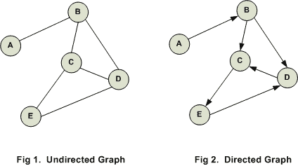
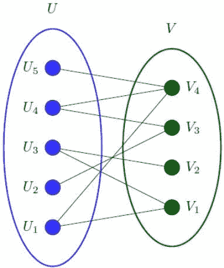
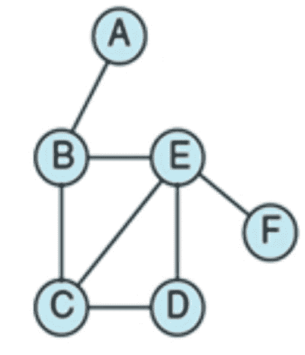
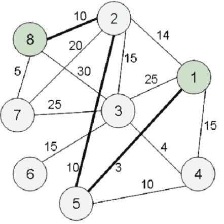
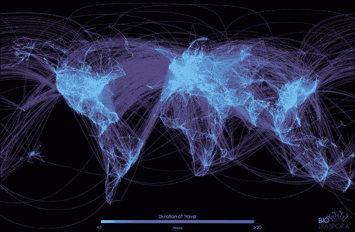

# 社交网络分析

> 原文：<https://medium.com/analytics-vidhya/social-network-analytics-f082f4e21b16?source=collection_archive---------2----------------------->

## 社交网络分析(Python 中的案例研究)

## 介绍

你有没有想过社交媒体网站是如何向你推荐朋友或关系的？事实上，一些像 linkedin 这样的社交媒体网站也会通知你你可能有兴趣申请的工作。你能猜到他们是怎么做到的吗？

他们研究社交网络(网络是一组具有互连(边)的对象(节点))，其中人们充当网络的节点，并通过各种参数确定两个简档的连接程度。这有助于他们推荐工作、人脉等。


让我们举个例子来更好地理解这一点。

考虑一个政党“ABC ”,其中党内的人在他们自己之间有争议。如果该党分裂成两个政党，你认为我们将能够确定哪个成员将加入哪个政党？想想吧。基于所有党员的社会网络，可以回答“哪个成员将加入哪个组？”。很有趣，对吧？

社交网络分析还可以通过检测社交网络中的重要节点来帮助防止社交媒体上的谣言传播，这些节点在关闭时会将特定谣言的传播降至最低。

在本文中，我们将首先研究各种节点和边属性、不同类型的图，以及描述社交网络的不同参数，并以 Python 为例进行研究。我们开始吧！

## 目录

1.  图的节点和边属性
2.  二部图
3.  聚类系数和距离度量
4.  中心性度量
5.  Python 案例研究

## **图的节点和边属性**

连接不同节点的边可以被加权以确定节点之间的关系强度。他们也可以被赋予不同的关系，如“家庭”、“朋友”、“敌人”。

```
import networkx as nximport matplotlib.pyplot as plt%matplotlib notebookG = nx.Graph()G.add_edge(‘A’,’B’,weight=13,relation=’friend’)G.add_edge(‘B’,’C’,weight=9,relation=’family’)G.add_edge(‘B’,’D’,weight=7,relation=’friend’)G.add_edge(‘E’,’B’,weight=10,relation=’friend’)G.add_edge(‘E’,’A’,weight=1,relation=’enemy’)G.add_edge(‘F’,’B’,weight=13,relation=’family’)G.edges(data=True)
```

输出:

```
[(‘C’, ‘B’, {‘relation’: ‘family’, ‘weight’: 9}),(‘E’, ‘B’, {‘relation’: ‘friend’, ‘weight’: 10}),(‘E’, ‘A’, {‘relation’: ‘enemy’, ‘weight’: 1}),(‘B’, ‘F’, {‘relation’: ‘family’, ‘weight’: 13}),(‘B’, ‘A’, {‘relation’: ‘friend’, ‘weight’: 13}),(‘B’, ‘D’, {‘relation’: ‘friend’, ‘weight’: 7})]
```

**无向图**的边没有方向。这些边表示一种双向关系，因为每个边都可以在两个方向上遍历。**有向图**有带方向的边。这些边表示一种*单向*关系，每个边只能在一个方向上遍历。



节点属性可以是关于个人、公司(节点)的任何信息，例如，我们可以将节点属性设置为“经理”、“分析师”、“工程师”等。

**节点度**:给定节点连接的节点数。有向图中出现的度有两种类型，即“入度”和“出度”。

```
G.add_edge(‘A’,’B’,weight=13,relation=’friend’)G.add_edge(‘B’,’C’,weight=9,relation=’family’)G.add_node(‘A’,role=’Trader’)G.add_node(‘B’,role=’Analyst’)G.add_node(‘C’,role=’Manager’)G.nodes(data=True)
```

输出:

```
[(‘C’, {‘role’: ‘Manager’}),(‘B’, {‘role’: ‘Analyst’}),(‘A’, {‘role’: ‘Trader’})]
```

**二分图**

假设我们在一家公司工作，如果用户选择的球队或球员在特定的比赛中获胜，他们就可以赚钱或获得奖励。我们有责任找到用户瞄准的重要球员或球队。用户和他们选择的玩家之间的网络是一个二分图。

二部图是这样一种图，它的节点可以分成两组 G1 和 G2，每条边连接从 G1 到 G2 的节点。

考虑这里有 5 个用户(蓝色节点)和 4 个玩家或团队(绿色节点)，因为这个图被分成两组节点，这是一个二分图。



```
from networkx.algorithms import bipartiteB = nx.Graph()B.add_nodes_from([‘A’,’B’,’C’,’D’,’E’],bipartite=0)B.add_nodes_from([1,2,3,4],bipartite=1)G.add_edges_from([(‘A’,1),(‘B’,1),(‘C’,1),(‘C’,3),(‘D’,4),(‘E’,1),(‘A’,2),(‘E’,2)])bipartite.is_bipartite(B)
```

输出:

```
True
```

二分图有两组，一组是用户，另一组是用户过去购买的产品。因此，现在我们需要创建共享共同产品的用户之间的图表，这将是一个加权的图表，其中权重将与他们有多少共同的产品成比例。

这个图被称为**投影图**,因此，如果客户购买了某种新产品，我们可以向在投影图中与该用户共享一条边的用户推荐该产品。

**聚类系数和距离测度**

**三元闭合**:社交网络中共享共同连接的节点(人)相互连接的趋势。

**局部聚类系数**:相互为朋友的一对节点的朋友的分数。

考虑节点“E ”,它有 4 个朋友。所以朋友对的数量是 4C2 = 6。

彼此是朋友的“E”朋友对= 2。

聚类系数=彼此是朋友的“E”朋友对的数量“E”朋友对的数量

在我们的例子中，局部聚集系数= 26= 0.33



**全局聚集系数**:衡量整个网络中节点趋向聚集或形成三角形的程度。可以使用两种方法使用平均局部聚类系数来计算它，另一种方法是计算传递性(它是网络中开放三元组数量的度量)。

**距离测量**

**路径**:由边连接的节点序列。考虑从节点 8 到节点 1 的路径。其中一条路径是 8–2–5–1，还有许多其他路径。

**两个节点之间的距离**将是它们之间最短路径的长度。

为了计算所有节点到给定节点的距离**，使用了广度优先搜索**算法。在 Networkx 中，我们可以使用 nx.bfs_tree(G，' A ')命令来获取树，以获得与节点' A '的距离。



假设在一家公司，我们需要根据某些特征研究 5 个不同团队的绩效。因此，我们需要比较网络中不同节点的接近程度，并根据成员之间的接近程度来比较这 5 个组。这可以通过网络中一对节点之间的平均距离来计算。

nx.average _ shortest _ 路径长度(G)

**直径**:网络中任意一对节点之间的最大距离。

**偏心度**:节点 n 的偏心度是节点 n 与所有其他节点之间的最大距离。

**图形的外围**:它是偏心率等于图形直径的节点的集合。

**中心性测量**

在现实世界的网络中，我们经常需要回答这个问题——“网络中哪些是重要的节点？?"。它的主要应用是在研究社交网络时避免网络谣言的传播。确定航班连接网络中机场枢纽的关键位置。这对于在营销分析中识别客户流失预测模型的重要网页也是有用的。

网络中的重要节点通过网络中心性度量来识别。

**度中心性**:这是基于重要节点有很多联系的假设。

节点 a 的 cdeg =节点 a 的度数。网络中节点的数量— 1

在有向网络中，我们可以根据应用选择使用节点的度内中心性或度外中心性。

**接近中心性**:这是基于重要节点与其他节点接近的假设。

节点“a”的接近中心度=网络中的节点数— 1 d(a，u)

其中 d(a，u)表示节点 a 和节点 u 之间的最短距离。

**中间中心性**:两个节点之间的距离是它们之间的最短路径。它测量给定节点位于两个节点之间的最短路径中的次数。这将是运输网络中的一个重要参数，以便在飞机的情况下创建用于维护目的的枢纽。



**Python 中的案例研究**

考虑一个社交网络，其中人们相互连接，我们有基于当前时间戳的关于网络的信息，并且我们需要预测未来将在网络中创建的链接。

```
import networkx as nximport pandas as pdimport numpy as npimport pickleG = nx.read_gpickle(‘Social_Network.txt’)print(nx.info(G))
```

输出:

```
Type: GraphNumber of nodes: 1005Number of edges: 16706Average degree: 33.2458
```

该图由社交网络上的 1005 个用户组成，根据当前时间戳，有 16706 个边或连接。

因此，现在对于链接预测模型，我们有不同的措施或指数，如-

度量 1-共同邻居

度量 2-JAC card 系数:通过邻居总数标准化的公共邻居数。

Jaccard_coeff(X，Y) = N(X) N(Y)N(X) N(Y)

其中 N(X)代表 X 的邻居的数量。

措施 3:资源分配

度量 4 : Adamic-Adar 指数

措施 5:优先依附

Future _ connections = PD . read _ CSV(' Future _ connections . CSV '，index_col=0，converters={0: eval})

因此，现在我们将创建用于预测不同用户之间的链接的功能。

```
from sklearn.neural_network import MLPClassifier

from sklearn.preprocessing import MinMaxScalerfor node in G.nodes():
     G.node[node][‘community’] = G.node[node][‘Department’]

preferential_attachment = list(nx.preferential_attachment(G))df = pd.DataFrame(index=[(x[0], x[1]) for x in preferential_attachment])df[‘preferential_attachment’] = [x[2] for x in preferential_attachment]SH = list(nx.cn_soundarajan_hopcroft(G))df_SH = pd.DataFrame(index=[(x[0], x[1]) for x in SH])df_SH[‘soundarajan_hopcroft’] = [x[2] for x in SH]df = df.join(df_SH,how=’outer’)M = mean(df[‘soundarajan_hopcroft’] )df[‘soundarajan_hopcroft’] = df[‘soundarajan_hopcroft’].fillna(value=M)df[‘resource_allocation_index’] = [x[2] for x in list(nx.resource_allocation_index(G))]df[‘jaccard_coefficient’] = [x[2] for x in list(nx.jaccard_coefficient(G))]df = future_connections.join(df,how=’outer’)df_train = df[~pd.isnull(df[‘Future Connection’])]df_test = df[pd.isnull(df[‘Future Connection’])]features = [‘cn_soundarajan_hopcroft’, ‘preferential_attachment’, ‘resource_allocation_index’, ‘jaccard_coefficient’]%%**Creating an MLPClassifier Model for predicting the future links**X_train = df_train[features]Y_train = df_train[‘Future Connection’]X_test = df_test[features]scaler = MinMaxScaler()X_train_scaled = scaler.fit_transform(X_train)X_test_scaled = scaler.transform(X_test)clf = MLPClassifier(hidden_layer_sizes = [10, 5], alpha = 5,random_state = 0, solver=’lbfgs’, verbose=0)clf.fit(X_train_scaled, Y_train)test_proba = clf.predict_proba(X_test_scaled)[:, 1]predictions = pd.Series(test_proba,X_test.index)target = future_connections[pd.isnull(future_connections[‘Future Connection’])]target[‘prob’] = [predictions[x] for x in target.index]
```

## 结束注释

社交网络分析在数据科学行业中有很大的应用，它可以在交通网络等广泛的应用中使用。

在线蔬菜配送公司可以确定他们在网络中的重要节点，以在重要的枢纽保持他们的储备，因为这对他们来说很重要，因为一些新鲜蔬菜在一段时间后会变质。图也用于解决运营和供应链行业中的各种问题，例如解决旅行推销员问题、车辆路径问题等。

**Shreyansh Nanawati**

我现在是从那格浦尔理工大学机械工程专业毕业的第四年。作为一个数据科学爱好者和一个喜欢玩数学的人，我期待着探索我在这个领域的知识。