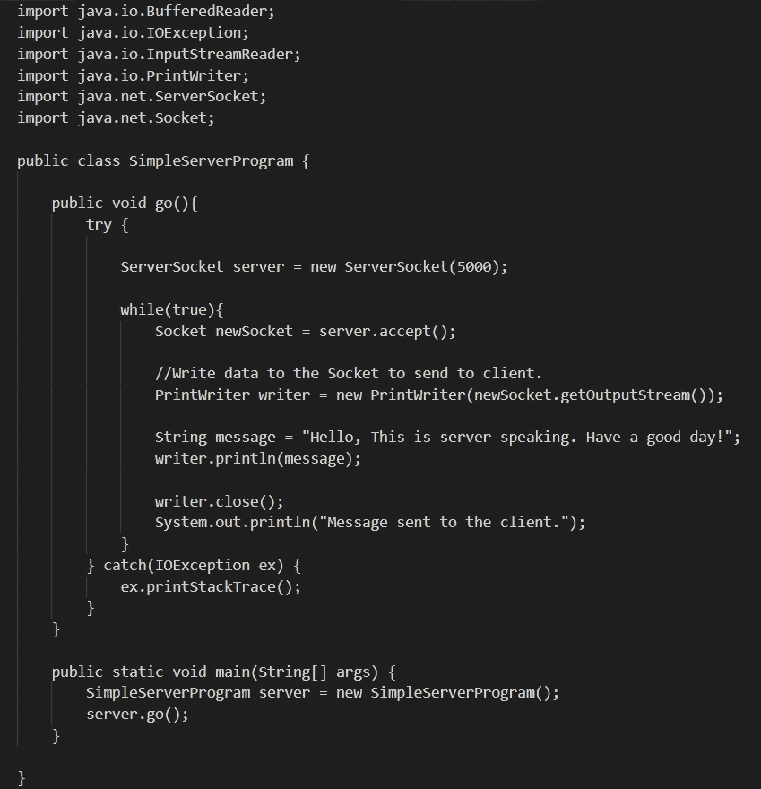

# Java 中的套接字编程

> 原文：<https://medium.com/analytics-vidhya/socket-programming-in-java-75918f7e99bf?source=collection_archive---------20----------------------->

## 使用您的 java 应用程序与外部世界建立联系。

克里斯蒂安·威迪格在 [Unsplash](https://unsplash.com?utm_source=medium&utm_medium=referral) 上拍摄的照片

你好，在这篇博文中，我将解释你机器上的 java 程序是如何接触到另一台机器上运行的程序的。

为了让你通过这一点，我要开发简单的客户端和服务器程序。我会让他们互相交流。对于所有这些客户端-服务器连接，我需要套接字。这是一个快速的概述，给你一个简单的概念。让我们开始吧。

首先让我们考虑客户。对于客户端程序，我们要做三件事。

1.  如何在客户端和服务器端建立初始的**连接**。
2.  如何**向服务器发送**消息。
3.  如何**接收来自服务器的**消息。

为了与服务器建立连接，我们需要一个套接字连接。套接字表示 java.net.Socket 类附带的对象。它用于表示两台机器之间的网络连接。要创建这个套接字对象，我们需要机器的 IP 地址和 TCP 端口号。IP 地址标识计算机网络上使用互联网协议进行通信的主机/计算机，端口是通信端点。操作系统中的每个进程都有一个特定的端口号。因为从 0 到 1023 的端口号是为众所周知的服务保留的，例如 HTTP、FTP、POP3、Telnet 等，所以我们可以为我们的程序使用 1024 到 65535 之间的任何其他端口号。

***Socket client Socket = new Socket(" 127 . 0 . 0 . 1 "，5000)；***

为了向服务器发送数据，客户端必须向服务器提供输出。我们使用 PrintWriter 将数据写入套接字。

***PrintWriter writer = new PrintWriter(client socket . get output stream())；***

***writer.println("你好服务器！");***

***打版("你好！");***

为了从套接字接收数据，使用了 BufferedReader。数据是客户端的输入。

***InputStreamReader stream = new InputStreamReader(client socket . getinputstream())；***

***buffered reader reader = new buffered reader(stream)；***

***String message = reader . readline()；***

现在让我们考虑服务器。

以上 3 项任务也适用于服务器。但是当我们考虑服务器套接字时，这是有区别的。当客户端向服务器发出连接请求时，服务器接受连接。接受后，服务器获得一个绑定到不同端口的新套接字。它需要一个新的套接字(这意味着一个不同的端口号)，因为服务器需要具有原始端口号的原始套接字来侦听新的客户端请求，同时向已经连接的客户端提供服务。Java 中的 ServerSocket 类中的 accept()方法用于此目的。它在不同的端口上返回一个新的套接字，以便与已经连接的客户端进行通信。

***server socket server = new server socket(5000)；***

**Socket new Socket = server . accept()；**

所以让我们编写一个简单的服务器和一个简单的客户端。

Java 中的服务器程序

Java 客户端程序

首先运行服务器程序，然后运行客户端程序。这里，服务器程序不仅可以服务于一个客户端，因为我已经将代码包含在一个永久循环中。否则，在一个客户端连接到服务器后，服务器不会创建新的套接字。在服务器服务 2 个客户端后，您可以得到如下输出。

服务器程序的输出

客户端程序的输出

这篇博客文章涵盖了 Java 套接字编程的基础，我希望这篇文章能帮助你很好地理解它。

编码快乐！