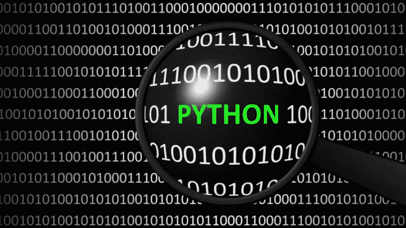

# Python 世界的软介绍

> 原文：<https://medium.com/analytics-vidhya/soft-introduction-to-the-world-of-python-b2b10ec33d58?source=collection_archive---------1----------------------->

尽管我已经在数据领域工作了 5 年，但我的职责并不要求我学习编码。我主要关注的是确保数据结构合理，可视化有效。

编码/编程一直听起来很刺激；因此，我决定多了解一下。我参加了一些关于 R 的课程，但是我决定继续学习 Python。