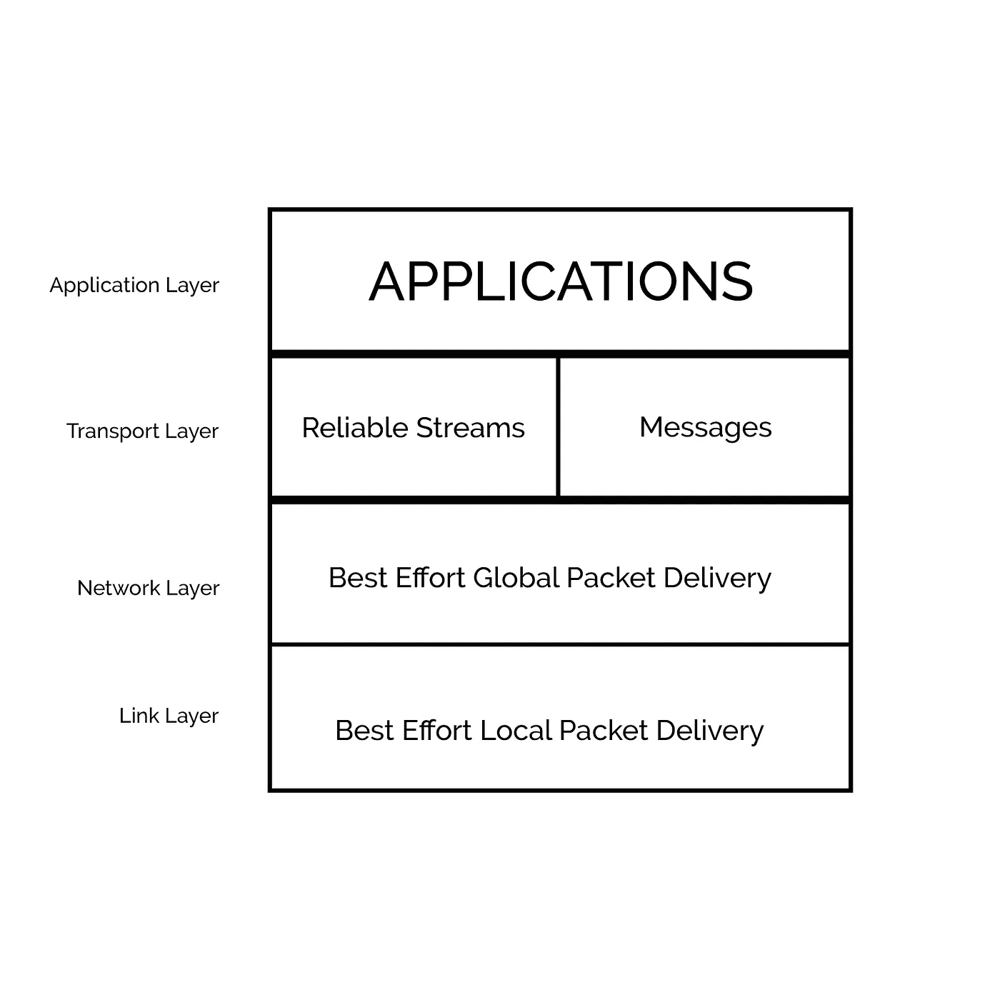
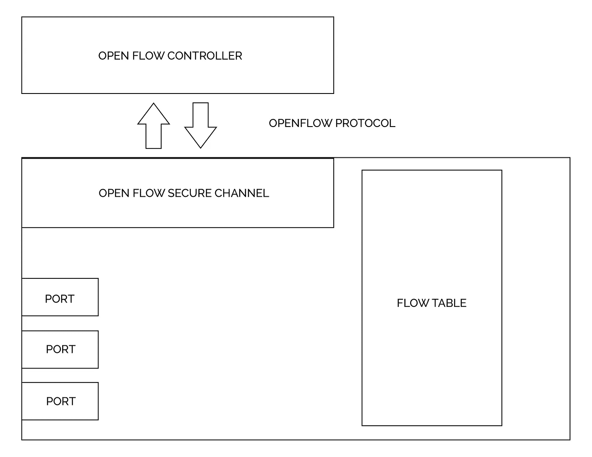
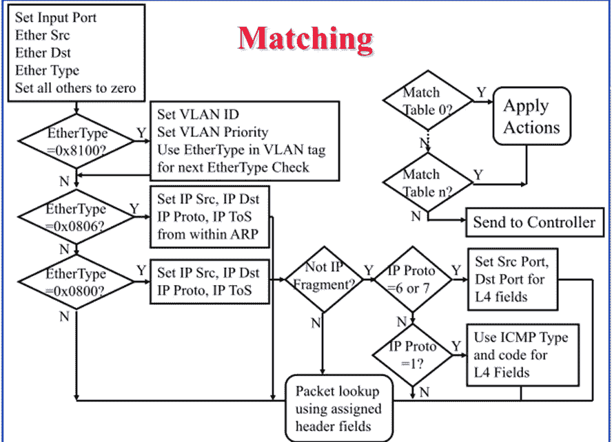

# 软件定义的网络—这些是什么，为什么要使用它们

> 原文：<https://medium.com/analytics-vidhya/software-defined-networks-what-are-these-and-why-to-use-them-35f7ba8101e0?source=collection_archive---------10----------------------->

互联网不属于任何人，但多家公司正在研发设备，让世界上的每个人都可以访问互联网。无论是 D-Link、TP-Link 还是 Cisco，我们都有许多由它们制造的设备，包括交换机、集线器、路由器等。

这基本上是一个封闭的设备环境，其中专有软件与硬件捆绑在一起，并向用户提供特定于供应商的接口。

在这个新兴技术的世界里，我们有太多的协议、成堆的标题格式、一大堆盒子和大量的工具。这种特定于供应商的固件通常会延迟更新，并且由于很少有人进行创新，因此协议标准化的速度很慢。

接下来是软件定义网络(SDN ),这是一个提供无缝移动性、服务器负载平衡、动态访问控制、高能效网络、自适应流量网络、网络可视化等的概念。

> SDN 基于一个简单的集中化概念。SDN 是一种网络架构，其中集中控制器控制一组分布式交换机的转发行为。

*或者可以解释为*

> SDN 是一个概念框架，在该框架中，网络被视为抽象概念，并通过编程方式进行控制，与各个网络组件的直接接触最少。

网络基本上有两个平面，控制平面和数据平面。数据平面是将数据包转发到下一跳的平面，不考虑或不知道完整路径，它只是将数据包发送到下一个接口。控制平面是指有助于确定使用哪条路径的所有功能，包括路由协议、生成树等。

传统上，这两个平面都由每个网络组件单独处理，而在 SDN 中，控制平面是集中的，并在控制器的帮助下使用，所有网络设备都与控制器通信以进行所有查询。而数据平面保留在每个单独的组件中。

# SDN 背后的主要理念

1.  尽力分组交换
2.  模块化协议分层
3.  各层之间的关系
4.  可量测性

**尽力分组交换**

分组交换:

将数据分成数据包，然后数据包分开传输，这样可以实现统计多路复用。

数据包传送:

数据包可能会丢失、延迟或乱序。简化网络设计和故障处理。构建及时、有序的数据包，确保可靠的交付。

**模块化协议分层**

每层仅依赖于其下一层提供的接口

上层选择它需要的下层
下层复用许多上层
“上/下”接口
网络中的对等接口执行
通信协议

**SDN 不仅仅是使用 IP 地址，为什么？**

1.  链接可以支持任何网络协议，而不仅仅是 IP。
2.  不同的地址可以有不同类型的链接。
3.  适配器可能会移动到新的位置，因此不可能提供静态 IP，这种情况下需要重新配置。
4.  控制器必须在引导过程中识别适配器。

**可扩展性**

目录

1.  键值存储，其中键是名称，值是地址。该查询接收姓名并返回地址。
2.  缓存响应，在一段时间内重用响应，更好的性能和更低的开销。
3.  允许条目更改，更新与名称关联的地址，有权验证或终止缓存的响应。

目录设计

1.  泛洪查询，ARP 被应用于搜索具有它正在搜索的 IP 的 MAC。在大型网络中，它可能会被延迟，延迟时间长达一秒。
2.  将数据推送到所有客户端(/etc/hosts)，所有节点存储目录的完整副本，可以在本地检查所需的地址，通常速度非常快。在更新和更改过程中，大型网络中可能会有超过一百万次的更新。
3.  中央目录服务器，所有数据由一个主服务器处理。当许多设备同时 ping 中央服务器时，可能会导致性能下降、可伸缩性问题和可靠性问题。

*那解决办法是什么？*

**分布式系统**

1.  分层目录— DNS(域名系统)，遵循分层命名空间、分布式目录和队列，并支持对目录的分散更新。
2.  分布式哈希表(对等)，目录有一个具有平面名称的哈希表，每个节点处理一系列哈希输出，并使用哈希将查询定向到目录节点。

**数据平面**

数据平面中发生的功能可以描述如下:

1.  对分组的所有(或一些)比特进行匹配。
2.  执行一些操作，如转发、访问控制、映射头文件、流量监控、缓冲、整形和调度。
3.  通过 MAC 地址匹配目的地，以独立于位置，即 IP 地址。
4.  它还可以匹配 IP 前缀，即分组到公共子网中的 IP 地址。

**转发 Vs 路由**

转发发生在平面，而路由发生在控制平面。转发是将数据定向到传出链路，每个路由器/交换机都使用转发表，并将数据包转发到目的地，而不考虑最终目的地。在控制平面中，L1 进行计算以确定分组要遵循的路径，并在每个交换机/路由器中创建单独的转发表。

**管理平面**

控制平面还包含一个进行所有管理和优化的部分，称为完全不同的平面，即管理平面。

基本功能是设置网络中所有路径的权重。控制器获得网络拓扑、链路容量和流量矩阵的输入。输出 id 为链接权重。

目标很简单，最小化每条链路的最大利用率，最小化链路拥塞的总和。

***短暂的路由中断***

1.  拓扑结构发生变化，所有链路权重都需要改变，或者节点/链路出现故障，需要进行恢复。
2.  路由收敛，由于过载或过度消耗，节点暂时不同意转发数据包或路由，这可能导致网络中的瞬时环路和黑洞。

**管理平面挑战**

1.  间接控制，管理平面不能改变路径，它只能改变链路的权重，这产生了复杂的优化问题。
2.  不协调的控制，管理平面无法控制哪个路由器将首先更新，并在其他路由器仍在更新时开始执行新协议，从而在网络中产生一种失去协调的感觉。
3.  与多种协议和机制的交互。

> **SDN 的 4d**
> 
> *决策-* 管理和控制逻辑
> 
> *传播-* 与路由器通信
> 
> *发现-* 拓扑和流量监控
> 
> *数据-* 数据包处理

# OpenFlow 开关

该交换机包含三个基本组件:端口、OpenFlow 安全通道和流表。

控制器和交换机连接，以及交换机内部

**端口**

有三种类型的端口

1.  物理端口—硬件接口
2.  逻辑端口—逻辑接口，分配给逻辑连接的端口
3.  保留端口—这些端口用于特殊功能(如泛洪)的内部数据包处理。

*所需端口*

ALL —除输入端口或任何配置为不转发数据包的端口之外，所有可用作输出端口的端口。

控制器—是安全通道中连接交换机和控制器的端口。

IN_PORT —数据包被发送回接收它的端口。

任何—既不用作输入端口也不用作输出端口，但可以表示为任何或所有端口的端口。

*可选港口*

本地—交换机本地网络和管理堆栈的入口和出口。

正常—从开放流进程到正常交换进程的输出端口，仅存在于混合交换机中。

泛洪—用于通过正常交换过程将数据包泛洪到所有出口硬件或一组出口 VLAN 端口的端口。仅出现在混合交换和输出端口。

*这种开放流程是如何运作的？*

数据包一到达，就发送报头字段进行匹配，一旦匹配，就执行相应的操作，并更新计数器以保存统计数据。标题字段如下:

入口端口、以太网源、以太网目的地、VLAN ID、VLAN 优先级、IP 源、IP 目的地、IP 协议、IP ToS、源 L4 端口、目的地 L4 端口。流表由这些头字段、动作和各种计数器组成。

流表条目被频繁更新，并且基于超时删除旧条目。有两种超时，空闲和硬超时。空闲超时是指如果在给定时间内没有匹配的数据包，则条目被删除，而在硬超时中，在任何情况下，在该特定时间段之后，条目被删除。

*显示实体的各种计数器字段*

**每表—** 活动条目、数据包查找、数据包匹配

**每流—** 接收的数据包、接收的字节、持续时间(秒)、持续时间(纳秒)

**每端口—** 接收数据包、发送数据包、接收字节、发送字节、接收丢弃、发送丢弃、接收错误、发送错误、接收帧、对齐错误、接收溢出错误、接收 CRC 错误、冲突

**每队列—** 传输数据包、传输字节、传输溢出错误

进一步的 OpenFlow 版本引入了表链和组表等概念，支持 IPv6 和光纤，这超出了本文的范围，将另文讨论。

请在下面的评论中告诉我对这篇文章的反馈，并告诉我它是否对你有所帮助！