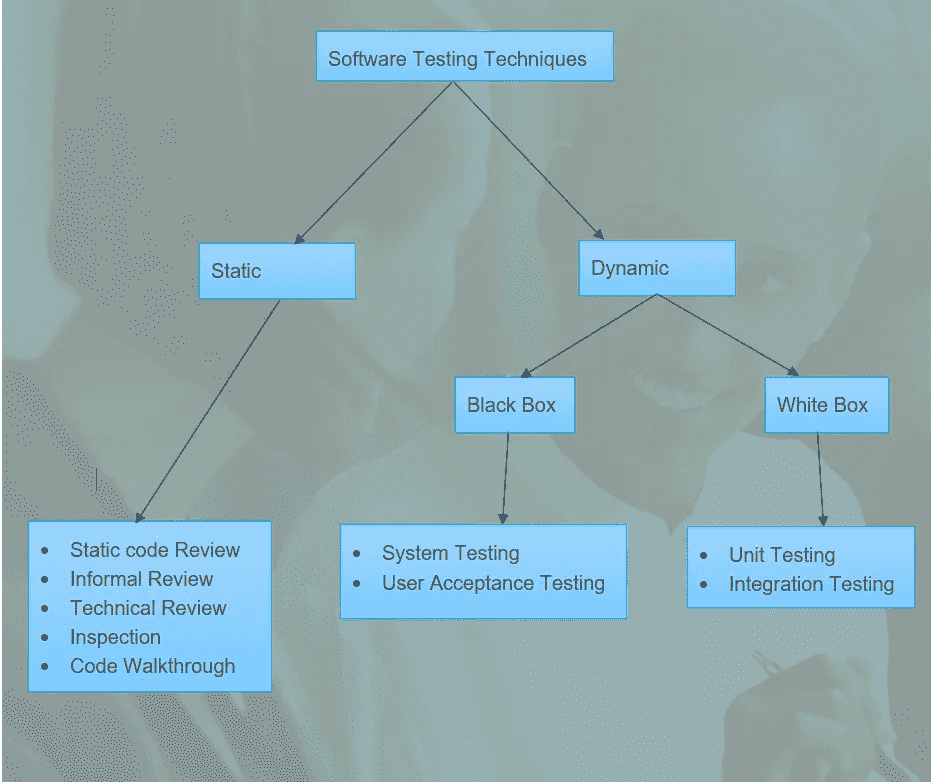
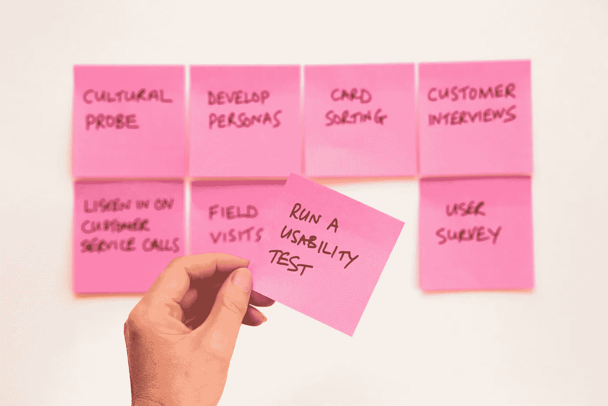

# 软件验证—测试技术

> 原文：<https://medium.com/analytics-vidhya/software-validation-testing-techniques-44f461c7451f?source=collection_archive---------9----------------------->

> 一旦你想验证你的最终产品***——******纳根德拉·辛格·亚达夫*** ，确认和验证是两件需要检查的事情

*特定测试技术的采用取决于组织的规模(中型、大型或小型)，包括项目范围。

当谈到软件验证或测试时，只有在 AUT(测试中的应用程序)中对应用程序进行超越极限的测试，这是远远不够的。那么我们是否使用几种测试技术来确保测试用例及测试的所有路径都被覆盖了呢？

卡尔·海尔达尔在 [Unsplash](https://unsplash.com/?utm_source=unsplash&utm_medium=referral&utm_content=creditCopyText) 上拍摄的照片

> 商誉是任何组织都不想冒的风险。你的测试质量取决于***UAT 没有缺陷——纳根德拉·辛格·亚达夫***

*   UAT-用户验收测试。
*   AUT —测试中的应用程序。

大致上，我们可以将 ***软件技术*** 分为两类，如下所述

软件测试技术

S静态测试—

> 当不借助系统或电子设备(如计算机)进行测试时，这种测试称为静态测试。**-纳根德拉·辛格·亚达夫**

照片由[费伦茨·阿尔马西](https://unsplash.com/@flowforfrank?utm_source=unsplash&utm_medium=referral&utm_content=creditCopyText)在 [Unsplash](https://unsplash.com/?utm_source=unsplash&utm_medium=referral&utm_content=creditCopyText) 上拍摄

当谈到静态测试时，就成本而言，这是最便宜的测试方法，因为在现实世界中，成本驱动项目，有时会在一定程度上影响项目。

静态测试的重点是 ***验证*** ***过程*** ，目的是 ***预防*** 缺陷。作为静态测试一部分，有一些必须遵循的清单和过程。它在代码(程序)的编译分析之前执行。在这种类型的测试中，你不必执行程序。文档是静态测试的主要成果，静态测试中发现的缺陷修复起来更便宜。

## 技术-

下面是作为 ***静态测试*** 一部分的*技术*:

1.  **非正式评审-** 静态测试的实现可以以 ***SRS*** 文档(软件需求说明书)的形式来看，其中列出了所有的需求及其行为。行为定义了应用程序或一段代码的预期输出。一旦需求分析阶段完成，您将拥有一份 **SRS** 文档，并对提供了非正式评审意见的 **SRS** 文档进行评审。
2.  **代码演练-** 在这个阶段，开发人员解释一段代码是如何工作的，并且向测试团队解释应用程序的整体功能。向团队解释整个产品，并记下评论。
3.  **检查-** 执行正式审查以发现缺陷。评审者将试图找到缺陷，并将缺陷传达给开发团队，以便及时做出所需的变更(如果有效的话)。
4.  **技术评审-** 具体到技术评审，比如评审软件的技术规范文档和标准，会进行多重分析。此外，软件标准还包括项目实施过程中的各种测试步骤，如测试策略、测试计划等..
5.  静态代码审查- 包括检查代码语法标准，这由开发团队执行。

D动力测试-

> 当测试在系统或电子设备如计算机的帮助下进行时，这种测试被称为动态测试。**-纳根德拉·辛格·亚达夫**

由[大卫·特拉维斯](https://unsplash.com/@dtravisphd?utm_source=unsplash&utm_medium=referral&utm_content=creditCopyText)在 [Unsplash](https://unsplash.com/?utm_source=unsplash&utm_medium=referral&utm_content=creditCopyText) 上拍摄的照片

在动态测试中，使用预期的输出来执行、确认和验证代码。如果实际结果与预期结果相匹配，就说代码通过了测试。当在测试环境中为代码创建构建和删除时，该测试在软件开发的所有阶段执行。动态测试是验证的最终标志。缺陷在这次测试中得到修复，并再次测试以确保测试环境中的代码稳定性，同样的情况也在生产测试中得到验证，而 UAT 用户正在测试实际应用程序。换句话说，当代码没有出现错误时，动态测试就开始了。

## 黑盒测试

在该测试中， ***AUT*** 的功能得到验证和确认，而无需在内部代码结构中进行任何查找。该测试基于 SRS 文件中规定的内容。为了测试应用程序，测试人员不需要知道数据结构、内部代码、语言。

**优势**

*   在测试较大的代码时有很好的帮助
*   不需要代码访问
*   测试人员可以在没有任何编程语言知识的情况下测试代码

**弊端**

*   不需要代码访问
*   设计测试用例可能是一个挑战。
*   测试人员的知识有限

1.  系统测试- 系统测试由测试人员团队执行。它是在一个全功能的应用程序上执行的，该应用程序是在代码集成后获得的实际应用程序的实时版本。
2.  **用户验收测试-** UAT 测试由测试人员执行，通常，涉众终端测试人员执行该测试，以确保软件是否满足用户需求，并根据用户体验执行。有两种类型的 UAT 测试

*   **Alpha 测试-** 在预登记软件应用程序的实时版本可供特定最终用户使用之前，对该应用程序进行 Alpha 测试。它是由实际开发应用程序的那个组织的一组测试人员执行的。执行此测试是为了确保代码中不再存在错误或缺陷。如果存在，应该在软件的 beta 版发布之前修复。
*   **Beta 测试-** 在 Beta 测试中，一组特定的用户可以使用该产品的一个实际版本。这样做将在应用程序的最终发布之前检测和纠正剩余的缺陷。测试中提供的反馈被记录下来，以后用于增强用户体验。测试的使用因组织而异。在一个小型组织中，成本是一个限制因素，因为他们不能有一个单独的测试团队来测试产品，所以他们更倾向于选择向一组用户提供测试版本，这样就不会产生测试成本。

## 白盒测试

> 当你主要关注的是安全性，应用程序中输入和输出的流程，目的是改进设计和可用性时，白盒测试是一个选择。 **—纳根德拉·辛格·亚达夫**

照片由[沙哈达特·拉赫曼](https://unsplash.com/@hishahadat?utm_source=unsplash&utm_medium=referral&utm_content=creditCopyText)在 [Unsplash](https://unsplash.com/?utm_source=unsplash&utm_medium=referral&utm_content=creditCopyText) 拍摄

白盒测试侧重于内部结构和编码。人们可以把这种特殊的测试技术看作是玻璃盒或开箱测试。这种测试技术基于应用程序的内部工作，需要预先定义的编程技能。利用这一点，一组预定义的输入将根据预期的输出进行验证。

运行白盒测试包括:

> 了解代码和功能，创建测试用例并执行

**优势:**

*   高效的
*   代码优化

**缺点:**

*   需要具有编程知识的熟练测试人员
*   高成本
*   有时不查找就留下错误

它们有两种类型:

1.  **单元测试-** 在单元测试中，每个模块都被验证，不管它们是否与另一个模块集成。单元测试在一定程度上消除了基于模块的错误，但效果不如 **SIT** (系统集成测试)。程序的每个部分都经过验证，以确保在应用程序功能上没有差距。此处的所有内容均根据要求的规定进行验证。
2.  **集成测试-** 模块通过单元测试后，进入集成测试。在集成中，所有基于单元的模块相互链接，形成实际应用的流程。集成测试侧重于验证应用程序的整体功能，确保它在测试环境中的稳定性，因此它在生产测试中的行为是相同的。该测试适用于分布式和基于客户端-服务器的系统。

* ***集成测试*** 用于 ***白盒*** 和 ***黑盒*** 测试。

## 独立于其类型但不属于特定类型的其他测试技术:

S莫克检测

> 它是在实际应用程序上开始测试之前，在 AUT 上进行的测试。进行冒烟测试只是为了确保应用程序所需的重要功能运行良好。**-纳根德拉·辛格·亚达夫**

如果必须对一个应用程序进行测试，它应该在第一阶段就通过冒烟测试。

作为烟雾测试的一个例子，我们可以想到这样一个例子:

> 在测试应用程序之前，你必须打开电脑的电源

R回归测试

> 执行回归测试是为了确保现有代码上新放置的代码能够正常工作，而不会影响应用程序的功能。**-纳根德拉·辛格·亚达夫**

当针对前一测试周期中遇到的错误修复进行代码构建和删除时，必须对应用程序执行回归测试。每当进行任何代码更改，或者创建新代码来修复错误时，都会执行回归测试，只是为了检查整个应用程序的功能。

*

Sanity 测试

> 执行健全性测试是为了确保所有现有的缺陷都得到修复，并且不会因为任何微小的代码更改而遇到更多的缺陷。**-纳根德拉·辛格·亚达夫**

P性能测试

> **性能** **测试**用于检查所有**非功能性要求**，确保 ***产品服务水平协议中规定的内容。***

*非功能性需求可以是应用程序的吞吐量或响应时间

## 性能测试的类型-

1.  **负载测试-** 负载测试在服务器上执行，该服务器处理应用程序发出的请求。执行此操作是为了确保服务器一次可以处理多少个请求。
2.  **压力测试-** 执行压力测试是为了测试服务器的爆发点或断点，在这些点上，服务器无法处理来自用户的更多请求。
3.  **耐久性测试-** 进行耐久性测试是为了测试服务器的容量，以了解服务器能够承受多长时间的负载。这也验证了应用程序长时间保持和处理负载的能力。
4.  **容量测试-** 容量测试是为了验证应用在不同数据库容量下的性能。通常会创建一个更大的数据库，并在测试过程中监控应用程序。
5.  **可伸缩性测试-** 执行可伸缩性测试是为了确保系统的现有组件能够为将来的版本进行更新。可伸缩性测试的一个例子可以是我们的手机，即使软件不时更新，其组件也能够运行。

Disclaimer-

对于任何建议，如果需要，可以给作者回信。这篇文章是根据作者的全部知识编写的。

这个博客不包含旧式的书籍方法，相反，你会发现在真实的项目方面，这个行业真正发生了什么。

F **在 Linkedin 上找到我-**

 [## Nagendra Singh Yadav -技术作家-首都| LinkedIn

### 3 年作为测试工程师的丰富经验(手动和自动化测试)。

in.linkedin.com](https://in.linkedin.com/in/nagendra-singh-yadav-84a586192) 

F **在 Instagram 上找到我-**

[https://www.instagram.com/thoughtspu89](https://www.instagram.com/thoughtspu89/)

F在推特上找到我—

 [## 纳根德拉·辛格·亚达夫

### 纳根德拉·辛格·亚达夫的最新推文(@bonscot94674500)。一个热衷于学习计算机新技术的技术极客…

twitter.com](https://twitter.com/bonscot94674500) 

在 ORCID - 上找到我

 [## 纳根德拉·辛格·亚达夫(0000-0002-9591-4491)

### 纳根德拉·辛格·亚达夫的 ORCID 记录。ORCID 为个人提供了一个标识符，当他们…

orcid.org](http://orcid.org/0000-0002-9591-4491) 

F **在区块链生态系统上找到我-**

 [## 纳根德拉·辛格·亚达夫-区块链生态系统

### 向 Nagendra Singh Yadav 请求(点击“查看源”链接继续)。点击“查看源”后…

www.blockchainecosystem.io](https://www.blockchainecosystem.io/nagendra) 

F找我上学术界-

 [## Academia.edu 比卡内尔大学

### Academia.edu 是一个分享和跟踪研究的地方。

bikaneruniversity.academia.edu](https://bikaneruniversity.academia.edu/NagendraSinghYadav) 

在谷歌学术找到我-

[https://scholar.google.com/citations?hl=en&user = XRUSDkwAAAAJ](https://scholar.google.com/citations?hl=en&user=XRUSDkwAAAAJ)

F **在研究之门-** 上找到我

 [## 纳根德拉·辛格·亚达夫|计算机应用硕士|比卡内尔工程学院，比卡内尔…

### Nagendra Singh Yadav 是 Eudoxia 的国际计算机科学委员会(ICCS)的全球助理秘书长

www.researchgate.net](https://www.researchgate.net/profile/Nagendra_Singh_Yadav) 

给我找许多故事-

 [## 纳根德拉·辛格·亚达夫——许多故事

### 阅读并讨论纳根德拉·辛格·亚达夫的许多故事

www.manystories.com](https://www.manystories.com/@nksyadav100) 

F **在渣土架上找到我-**

 [## 纳根德拉·辛格·亚达夫

### Nagendra Singh Yadav 的联系偏好我更喜欢在晚上(下午 5 点到 10 点之间)通过社交媒体进行推介……

muckrack.com](https://muckrack.com/nagendrasinghyadav) 

F **在 Snapchat 上找到我-**

 [## Snapchat 上的 n_yadav3702

### 看这个故事！

www.snapchat.com](https://www.snapchat.com/add/n_yadav3702) 

我的我的**博客-**

 [## 纳根德拉·辛格·亚达夫

### 如果你没有准备好迎接大学生活之外的世界，你将无法在这个行业生存，除非你…

nagendrasinghyadav.blogspot.com](https://nagendrasinghyadav.blogspot.com/) 

在 Quora 上找到我-

 [## 纳根德拉辛格·亚达夫

### NagendraSingh Yadav，ICCS 全球助理秘书长(2020 年至今)。纳根德拉·辛格·亚达夫是全球助理…

www.quora.com](https://www.quora.com/profile/NagendraSingh-Yadav)