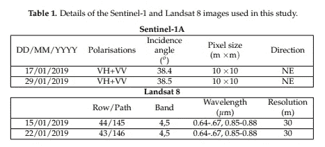
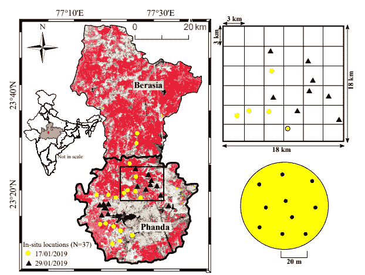
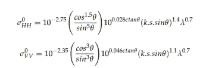
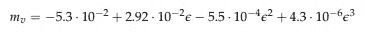
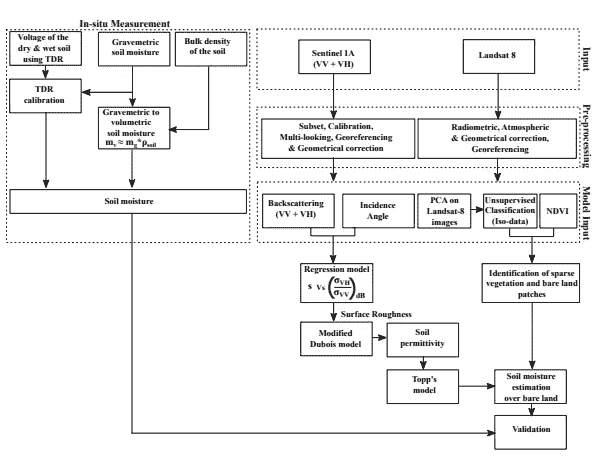
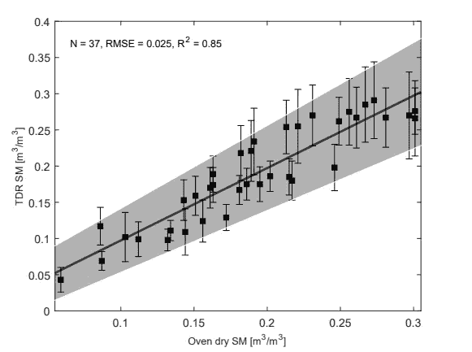
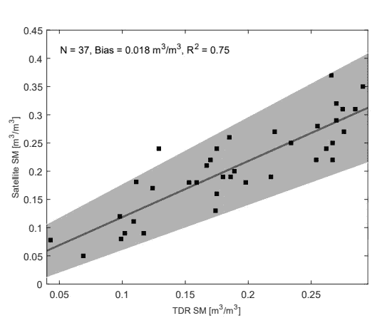
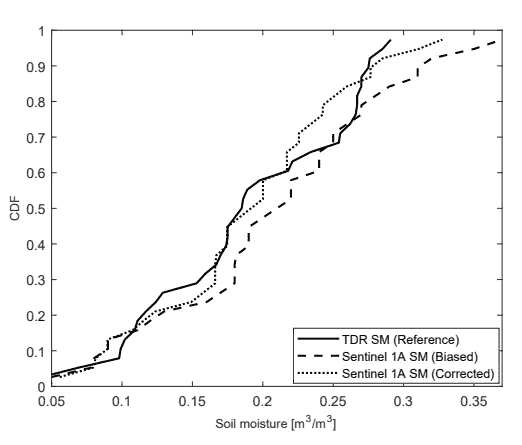
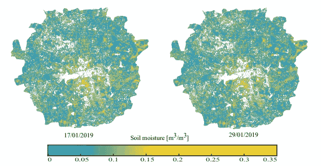

# 根据微波卫星图像(大数据)估算土壤湿度

> 原文：<https://medium.com/analytics-vidhya/soil-moisture-estimation-from-microwave-satellite-images-big-data-6f839ad65979?source=collection_archive---------18----------------------->

在本文中，我们将讨论使用卫星图像估算表层土壤湿度(表层 5 cm)的详细过程。本文分为五个部分。首先，我们将看到使用的卫星图像，然后我们将看到研究区域。之后，我们将浏览模型。然后我们会看到详细的方法论。最后，我们将看到结果、讨论和结论部分。

你可以从**网站 [**下载**](https://www.mdpi.com/2072-4292/12/14/2266/pdf) 的论文。如果您有任何问题，可以给我写信(abhilash.singh@ieee.org ),或者访问 [**我的网页**](http://www.abhilashsingh.net/) 了解更多更新**

## **卫星图像**

**在这项研究中，我们使用了微波和光学卫星图像(表 1)来估计土壤湿度。我们已经从欧洲航天局**下载了连续两次，即 2019 年 1 月 17 日和 29 日的 1A 哨兵图像。我们还下载了来自美国地质调查局的地球资源卫星 8 号的图像，这些图像与哨兵-1A 的图像日期最接近。****

********

****我们已经使用哨兵应用平台(SNAP)6.0 处理哨兵 1A 图像。该处理包括四个主要步骤:辐射校准、多视、使用改进的 Lee 滤波器减少斑点噪声以及地形校正。地形或几何校准采用空间分辨率为 30 米的航天飞机雷达地形任务(SRTM)数字高程模型。最终的图像像素包含线性标度的真实反向散射(σ)值。最后，我们根据σ(dB)= 10∫log 10(σ)将反向散射值转换为分贝标度σ(dB)。我们还处理了 Landsat-8 的图像来计算 NDVI。它有助于根据植被密度和植被高度来衡量植被覆盖的强度。我们将波段 5(近红外)和波段 4(红色)之间的差值与 Landsat-8 图像的波段 5 和波段 4 之和的比值。要求 NDVI 规定土壤水分修正 Dubois 模型的有效范围(NDVI ≤ 0.4)。****

## ****学习区****

****这项研究在印度中部中央邦的博帕尔省进行(图 1)。博帕尔分为两个行政区，北部的 Berasia 和南部的 Phanda，面积分别约为 1424 平方公里和 1348 平方公里(图 1)。在气候上，博帕尔位于半干旱地区，通常被农业用地(64.5%)、贫瘠土地(7.3%)、森林(13%)和水体(4.6%)覆盖。研究区域的平均海拔在平均海平面 450 米和 550 米之间变化，地形平缓起伏。平均气温在 6 摄氏度到 41 摄氏度之间。大约 75%的研究区域被玄武岩风化形成的黑棉土覆盖。其余 25%被黄红色混合土壤覆盖。****

********

****图 1:假彩色合成(FCC)的 Landsat-8 图像显示了中央邦博帕尔区的行政区(Phanda 和 Berasia)。黄色圆圈和黑色三角形是田间土壤湿度测量的位置。右上角的网格说明了收集土壤水分的随机取样策略。****

****在本研究中，我们将 Phanda 地块作为估算土壤湿度的试验场地。大约 44%的 Phanda 地区是可耕地，用于农业目的。该地区的农业实践很大程度上依赖于六月、七月、八月和九月(JJAS)的印度夏季风，那里的降雨量约占总降雨量的 92%。近年来，印度中部的干旱频率增加，这对农业生产力产生了不利影响。在这种情况下，以更高的空间和时间分辨率监测土壤湿度对于规划和管理农业生产力、水资源和确保粮食安全变得十分重要。****

****我们使用了 ML3 探针传感器和重量法来测量田间土壤水分。Theta 探头根据 TDR 原理工作，它以 100 MHz 的频率测量大块土壤的相对介电常数。然后，通过应用 TDR 的土壤特定校准，将该体积相对介电常数转换为土壤体积湿度。我们已经为研究区域的三种不同的主要土壤类型校准了 theta 探头。附录中提到了详细的校准程序。为了测量土壤湿度，我们于 2019 年 1 月 17 日和 29 日在中央邦博帕尔进行了实地调查。这些日期与 IST 时间早上 5 点 50 分 1A 哨兵掠过博帕尔相吻合。在卫星经过的时候，我们已经测量了 37 个地点的土壤湿度。为了进行测量，我们在研究区域覆盖了一个 3 km × 3 km 的正方形网格。然后，我们随机选择几个网格来测量土壤湿度。在每个网格的中心，我们通过将 theta 探针的金属杆插入地面以下 5 cm 处(如 [**Singh 等人 2018**](https://www.researchgate.net/publication/329010092_ANALYSIS_OF_THE_EFFECT_OF_INCIDENCE_ANGLE_AND_MOISTURE_CONTENT_ON_THE_PENETRATION_DEPTH_OF_L-_AND_S-BAND_SAR_SIGNALS_INTO_THE_GROUND_SURFACE) 、 [**2019**](https://www.researchgate.net/publication/333925791_Evaluation_of_the_Penetration_Depth_of_L-_and_S-Band_NISAR_mission_Microwave_SAR_Signals_into_Ground) 所建议的)来测量土壤湿度，并在数据记录器中记录土壤湿度值(m3/m3)，并使用 Garmin-64S 手持 GPS 记录它们的位置。我们在网格内至少 8 到 10 个不同的位置重复了这一过程，最后对它们进行平均以获得土壤湿度(图 1)。同时，在每个地点，我们使用管状采样器在地表以下 5 厘米处采集了约 100 克土壤样本。我们用烘干法测量了这些样品的土壤湿度。在每个测量位置，我们还对土地利用、土壤类型、植被高度和天气参数(温度、降水等)进行了观察。).****

******模型(土壤湿度模型)******

****我们使用哨兵 1A 图像的后向散射值和修正的 Dubois 模型中的入射角来计算相对土壤介电常数。最后，我们使用通用 Topp 模型中的相对介电常数来计算土壤体积湿度。Dubois 等人开发了一个经验模型，从四极化 SAR 图像计算相对土壤介电常数。最初，该模型是为从散射仪获得的 L、C 和 X 波段数据开发的，后来也应用于航空图像。模型结构建立在强物理推理的基础上；然而，一些未知系数是通过拟合实验数据获得的。HH 和 VV 偏振的反向散射系数由等式给出****

********

****其中，θ是入射角，ε是相对土壤介电常数，s 是表面粗糙度(cm)，k =(2π/λ)是波数，λ是 SAR 波长。这些参数可以分为两类:传感器参数(θ和λ)和目标参数(e 和 s)。在上述等式中，目标参数是未知的。这些方程可以反过来计算相对土壤介电常数和表面粗糙度参数。****

****为了推导方程σ (VV)的未知参数(表面粗糙度),我们从 Srivastava 等人提出的回归模型中获得参数。一旦表面粗糙度已知，就可以求解方程(σ VV 或 HH)来计算另一个未知参数，即相对土壤介电常数。为了估计土壤湿度，我们使用了 Topp 的模型。****

********

****它采用从哨兵-1A 图像得到的相对土壤介电常数作为输入来估计土壤体积含水量。图 2 中的流程图说明了用于现场数据采集、图像处理和建模以估计土壤湿度的详细方法。****

********

****图 2:流程图说明了用于从 Sentinel-1 图像估算土壤湿度的方法。****

## ******结果******

*****校准后的θ探头性能*****

****我们首先比较了 theta 探针和烘干法测得的土壤湿度。我们没有观察到明显的差异，尽管有轻微的分散，所有的数据点似乎都聚集在一条线上(图 5)。这表明(R-square = 0.84，RMSE = 0.025 m3/m3)两种方法之间有很好的一致性，前提是θ探头针对研究区域的特定土壤类型进行了正确校准。此后，我们将使用θ探头的测量值进行进一步分析。****

********

****图 3:使用 theta 探针测得的土壤湿度与重量法的关系。灰色阴影区域是回归曲线的 95 %置信水平。****

*****来自 1A 哨兵*的土壤湿度****

****我们的结果表明，模型推导的土壤水分与现场测量结果吻合得很好(R 平方= 0.75，RMSE = 0.035 m3/m3)。****

********

****图 4:卫星导出的和现场(TDR)测量的土壤湿度之间的回归曲线。灰色阴影区域是回归曲线的 95 %置信水平。****

****将 CDF 校正应用于我们的数据，从 Sentinel-1A 得出的土壤湿度偏差从 0.02 m3/m3 减少到 0.001 m3/m3(图 5)。最后，我们使用偏差校正值来生成研究区域 2019 年 1 月 17 日和 29 日的土壤湿度图(图 6)。****

********

****图 5:利用 CDF 匹配技术进行偏置校正。黑色实线是使用 TDR 现场测量的土壤水分的 CDF，黑色虚线和虚线分别是根据 sentinel-1A 估计的有偏差和校正的土壤水分的 CDF。****

********

****图 6:根据 Sentinel-1 估算的土壤湿度的空间分布。显示为白色的像素对应于修改的 Dubois 模型无效的区域。****

******参考文献******

****[[1]辛格、阿比拉什、库马尔·高拉夫、加内什·库马尔·米娜和沙希·库马尔。“将修正的 Dubois 模型应用于 Sentinel-1 估算土壤湿度；印度中部的一项区域研究。”*遥感* 12，14 号(2020): 2266。](https://www.mdpi.com/2072-4292/12/14/2266)****

****[[2]辛格、阿比拉什、库马尔·高拉夫。“深度学习和数据融合，从多传感器卫星图像估计表层土壤湿度。”*科学报告* 13，第 1 期(2023): 2251。](https://doi.org/10.1038/s41598-023-28939-9)****