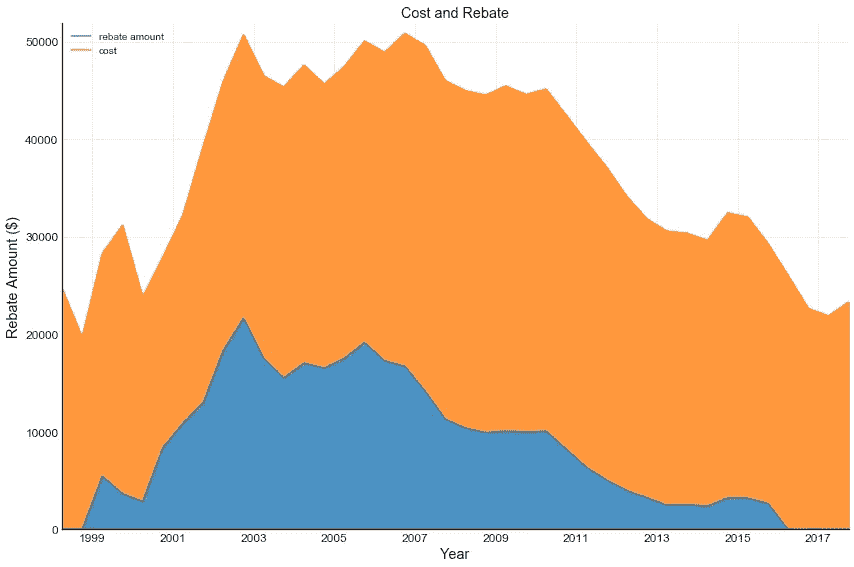
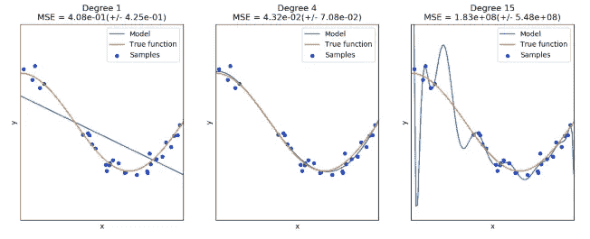

# 太阳能电池板阵列，要多少钱？

> 原文：<https://medium.com/analytics-vidhya/solar-panel-array-what-does-it-cost-46aaa083502?source=collection_archive---------15----------------------->

[切尔西](https://unsplash.com/@chelseadeeyo?utm_source=medium&utm_medium=referral)在 [Unsplash](https://unsplash.com?utm_source=medium&utm_medium=referral) 上的照片

让我们用数据来回答这个问题吧！

# 介绍

不用说，太阳绝对是我们太阳系中最强大的天体。

尽管出现了技术进步和硬件价格的大幅下降，太阳能仍未被充分利用，并且可能被美国公众误解。如果我们选择追求它，它可以为我们提供清洁和稳定的能源生产。

也许是对太阳能技术的误解以及可感知的高成本成为许多人购买太阳能电池板的巨大障碍。

的确，很难接受我们不理解的东西。太阳能电池板的真相似乎隐藏在黑暗中，但一旦我们将光芒照射到它身上，真相将永远不会被发现。

为了更好地了解太阳能的潜力，我们可以使用数据来分析历史安装并预测其成本。

这是一个相对较大的数据集，可以从中提取大量信息。然而，本文将重点回答这些关于住宅安装的特殊问题:

1.  **哪些州的安装最便宜和最贵；哪些州的奖励最高/最低？**
2.  这些年来价格是如何变化的？
3.  **我们能否预测太阳能电池板的安装成本？哪些因素对硬件成本影响最大？**

美国公共电力协会在 [Unsplash](https://unsplash.com?utm_source=medium&utm_medium=referral) 上拍摄的照片

# 数据

该数据集包含 1998 年至 2018 年 1 月期间美国各地的太阳能电池阵列安装。所有代码和数据都可以在我的 [GitHub](https://github.com/sergatron/projects/tree/master/solar_array) 上找到。

此时，数据帧包含大约一百万行和 81 列。然而，它们中的许多都包含 100%的缺失值。这里每一行代表一个安装及其变量，稍后将讨论。

数据框摘要。

以上是删除空列后的数据概览，将计数从 81 列减少到 29 列。

由 [Unsplash](https://unsplash.com?utm_source=medium&utm_medium=referral) 上的[灯光景观](https://unsplash.com/@lightscape?utm_source=medium&utm_medium=referral)拍摄

# 数据争论

任何事情之前最重要的一步是数据清理。这些数据相当混乱、无序。

例如，一些数字列( *rebate* 和 *cost)* 包含了不需要的字符，比如美元符号、逗号和百分号。

在*状态*列中，一些状态被计数两次，因为它们包含尾随空格。

分类列 *install_type* ，包含了许多实际上属于同一类别或相似类别的类别，但是有拼写错误。

通常，执行以下操作来清理数据:

1.  删除包含 80%以上缺失值的列
2.  处理其他缺失的值
3.  将所有非数字列转换为小写
4.  将日期列转换为日期时间对象
5.  在' *install_type'* 列中组合类别
6.  删除不需要的字符(%、$、逗号、尾随空格)
7.  转换数据类型(一些数字列作为对象加载)
8.  通过 [**NREL API**](https://developer.nrel.gov/docs/solar/openpv/) 获取更多数据
9.  使用 API 中的数据来填充一些缺失的值

# 探索性数据分析

现在是有趣的部分。

寻求洞见从这里开始。虽然，在这个过程中需要更多的数据争论，因为有离群值必须被删除。

由于住宅安装在数据中占主导地位，因此它们将是本文的重点。

安装类型。

首先，我搜索了我想要预测的目标变量( *cost* )和预测变量(所有其他列)之间的一些相关性。然而，深入研究之后，我确实知道哪些变量可能具有最强的相关性。

成本与系统规模(以千瓦计)

从上图可以看出，安装成本和系统容量之间存在很强的线性相关性。此外，可以看出有一种最常见的特定跟踪类型。

一般来说，这种模式似乎是线性的。然而，考虑到这应该是所有的住宅安装，容量和成本的大小没有意义。

通常，住宅太阳能电池阵列的平均容量在 6 到 8 千瓦之间，但该数据包含的值远远超出了住宅类型安装的“平均值”。

例如，任何家庭都不太可能(如果不是不可能的话)需要一个 100 千瓦的系统，这个系统每年产生大约 154，864 千瓦时(T3)的电力，成本为 995，956 美元。

最合理的解释可能是这些数据点被贴错了标签。更合理的假设是，较高的值可能代表*商业*或*公用事业*类型的安装。

因此，本项目将继续假设这些极端值被贴错标签，实际上并不代表住宅价值。

系统容量与发电量

从上面的图中，很容易看出容量和发电量之间的关系。就建立机器学习模型而言，这有点问题，因为我们有两个高度相关的特征。

这叫做*多重共线性*。简而言之，在建立线性回归模型时，这会导致*系数*不准确。然而，这不会损害模型的预测能力。

这些系数很有用，因为它们告诉我们每个变量在预测成本中的重要性。这反过来让我们了解每个功能如何影响太阳能电池阵列的安装成本。

## 箱线图

使用箱线图，我们可以可视化异常值和高影响数据点的影响。下面，我们看到一些叛逆的数据点，它们真的扭曲了数据，必须处理！

可怕的方框图

在去除了非常大的值之后，我们得到了下面的箱线图。

这是通过简单地过滤系统大小、发电量和成本，只包括低于 97.5%的数据来实现的。超过百分位数，这些值将被丢弃。

[多晶](https://www.greenmatch.co.uk/blog/2015/09/types-of-solar-panels)

[单晶](https://www.greenmatch.co.uk/blog/2015/09/types-of-solar-panels)

## 技术类型

太阳能电池板并非生而平等。有各种各样的技术。有些比其他的贵，有些比其他的效率高。

该数据集包含各种类型的技术，但其中只有少数几种是流行的；多晶和单晶。

最常见的太阳能电池板。

在下面的方框图中，我们可以看到与不同技术相关的不同成本。

不同技术间的成本差异。

下面，我们可以看到与不同技术相关的不同发电量。

每种技术类型的发电。

从上面的图中可以注意到一些事情。箱线图表明，与其他技术相比，CIS/ [CIGS(铜铟镓硒)](https://energyinformative.org/best-thin-film-solar-panels-amorphous-cadmium-telluride-cigs/)模块具有更高的功率生产，具有低得多的方差，并且相对更便宜。

不同技术的成本和发电。

以上是每种太阳能电池板技术生产的每单位电力的平均成本。

## 分布

箱线图给我们一些分布的感觉，但是实际上做一个直方图更好。直方图让我们更好地理解数据是如何分布的。

这个数据仍然有点偏右，但它非常接近正态分布。理想情况下，在建立机器学习模型时，我们需要数据具有*正态分布*。

因此，需要对这些数据进行转换，使其呈正态分布或非常接近正态分布。这将大大提高 ML 模型的性能。

## ECDF(经验累积分布函数)

下面的 ECDF 是通过对值进行排序然后绘制它们来完成的。这使我们能够获得关于每个特性的一些有意义的统计数据。

ECDF 图

例如，就年度能源估算(年度光伏发电)而言，我们可以看到，大约 75%的装置(在美国)预计可产生约 10，000 千瓦时的能源。

在成本方面，大约 70%的人为他们的太阳能电池阵列安装支付的费用少于 35，000 美元。请记住，这些是从 1998 年到 2018 年的历史数字，并且此成本不包括安装人工或任何激励措施。

## 按州统计

正如我们所看到的，这个数据集中的大多数太阳能电池板都安装在加利福尼亚。红线只是代表百分之一标记，表示大多数州出现在该数据中的时间少于百分之一。

通过暂时排除 CA，我们可以更好地了解该数据中表示的其他状态。

下面是通过一个 [NREL API](https://developer.nrel.gov/docs/electricity/energy-incentives-v2/) 收集的激励措施。这只是可用的州和地方政府激励措施的总和。这不包括任何联邦激励措施。

根据从 API 获得的信息，每个州都至少有一项针对太阳能的激励措施。此外，还有一些联邦激励措施，这些都没有体现在数据中。

每个州的奖励数量。

平均成本和折扣如下图所示。对于某些州来说，折扣信息缺失，并且很难说出缺失的原因。也许对于特定的安装没有折扣，或者也许当时没有折扣。

所以，回答第一个问题:

1.  哪些州的安装最便宜和最贵；哪些州的奖励最高/最低？

**中间值**成本和折扣

以上数据提供了 ***中值*** 值，涵盖了从 2013 年到 2018 年底的数据。从上面的两个图中，我们现在可以了解全国的*成本*和*折扣*值。

但是，请记住，联邦回扣并没有出现在这个数据中，这可能会进一步降低成本。

**2。这些年来价格有什么变化？**

为了回答这个问题，我创建了一个时间序列，并将其重新采样为六个月。产生的时间序列图具有六个月的间隔和这六个月期间的平均成本。

安装费时间序列。

从上面的图表来看，对消费者来说有一些好消息。硬件成本在 2007 年至 2010 年达到峰值后，自 2010 年左右开始下降。

然而，这对太阳能行业意味着什么？制造业变得不那么复杂和更具成本效益了吗？或者，是否有更多的竞争发展，这是推动价格下降？不幸的是，我们无法仅从这些数据中回答这些问题。

这真是出乎意料。回扣金额也大幅下降，似乎与成本同时达到峰值。此外，该数据包含 2017 年和 2018 年许多缺失的返利值，导致 2017 年出现上述异常。确切原因尚不清楚，但可能是由于数据收集过程中的变化，因为该数据的来源在 2019 年已被弃用。

这幅图提供了丰富的信息，但也带来了更多关于太阳能产业、经济以及我们对环境的整体关注的问题。

但是并不是所有的希望都破灭了。尽管返点的价值在下降，但安装和返点的数量在同一时期一直在增长。尽管自 2000 年代初以来，回扣金额有所下降，但数量一直在增加。

安装数量和激励措施。

**3。我们能预测安装太阳能电池板的成本吗？哪些因素对硬件成本影响最大？**

要回答这个问题，可以使用几种不同的方法。我们可以看看自变量*成本*和所有因变量之间的相关性。然而，相关性并不意味着因果关系，因此不能告诉我们整个故事。

功能之间的相关性热图。

相关范围在-1 和 1 之间。最强相关性接近 1 和-1，弱相关性或无相关性出现在零附近。

通过可视化特性之间的相关性，我们可以了解哪些预测因素可能会对硬件成本产生重大影响。

# 机器学习

当有一大堆数据，而你想从中找出一个模式时，你会怎么做？

通过建立机器学习模型，我们可以预测目标变量*成本*，并估计每个变量对*成本的影响。*我们可以探索多种方法来建立这样的模型，包括*多元线性回归、* [*梯度推进*](https://machinelearningmastery.com/gentle-introduction-gradient-boosting-algorithm-machine-learning/) 和 [*随机森林*](https://machinelearningmastery.com/bagging-and-random-forest-ensemble-algorithms-for-machine-learning/) *回归。*

建立模型是一个迭代的过程。有许多变量可能会影响结果，我们可能从一开始就不知道哪些变量是最有用的。

这些变量也可能有不同的数据类型—分类、数字和字符串。因此，在建立任何模型之前，必须以所有变量都是数字的方式准备数据。

对于这个项目，一般过程如下:

*   分类编码(如果任何特征是非数字的)
*   特征工程。玩转数学，尝试创造额外的功能
*   构建一个管道来处理分类变量和数值变量
*   搜索最佳管道参数和回归超参数
*   通过交叉验证评估管道
*   重复该过程，重用管道来评估其他算法

最初使用的几种算法是岭回归和弹性网回归。两者都实现了正则化，正则化惩罚对结果影响很小的系数，将它们缩小到接近零。

## 过度拟合/欠拟合

需要解决的一个问题是过度装配和装配不足。一般来说，当模型适合真实信号或模式周围的噪声时，就会发生过拟合。

下图右侧显示了*过度拟合*的示例。在这里，模型试图拟合每一个点。发生这种情况是因为模型*太复杂*也有*高方差*。

来自 [Scikit-Learn](https://scikit-learn.org/stable/auto_examples/model_selection/plot_underfitting_overfitting.html) 的欠拟合和过拟合示例。

也有可能建立一个不太复杂的模型，这会导致数据中的实际信号拟合不足。这在上图的左侧可以观察到。左边的型号*太简单*导致*欠配*据说*偏高*。

偏差-方差权衡。

这种机器学习模型的目标之一是实现偏差和方差之间的平衡。为了实现这一点，数据被分成*训练子集*和*测试子集*。该模型对训练数据进行了拟合。然后用它来预测结果，*成本*。

在这种情况下，训练集由从 1998 年到 2015 年 5 月的数据组成；测试数据从 2015 年 6 月到 2017 年 12 月。

照片由[威廉·艾文](https://unsplash.com/@firmbee?utm_source=medium&utm_medium=referral)在 [Unsplash](https://unsplash.com?utm_source=medium&utm_medium=referral) 上拍摄

## 韵律学

我们如何评价一个模型的成功？

然后，我们可以使用各种指标来评估结果。在这种情况下，使用了两个度量标准， ***平均绝对误差*** *(MAE)* 和 ***均方根误差****【RMSE】*。

MAE 本质上是预测值和实际值之间的平均误差，其中误差的方向(正或负)无关紧要。RMSE 计算预测值和实际值的差的平方，求和，然后求和的平方根。数据中的异常值对 RMSE 的影响会比 MAE 更大。因此，当存在异常值时，RMSE 是一个很好的度量标准。

## 结果

在特征工程过程中，有必要转换预测值，以便生成的模型能够提供“最佳结果”。在这种情况下，通过最小化验证数据的 RMSE 可以获得最佳结果。

通过多次试验，通过将所有变量乘以*大小 _ 千瓦*获得了合理的结果，因为它与目标*成本*的相关性最高。此外，分类变量如*状态*、*跟踪类型*和*技术 1* 最初被编码为虚拟变量，但对误差没有显著影响，因此未被使用。

使用 ElasticNet 和岭回归，我们可以看到下面的结果。

ElasticNet 回归度量

岭回归度量

离群值的影响可以通过 RMSE 看到。训练分数高于测试分数将意味着在训练集中可能出现一些欠拟合。然而，这两个模型在测试集上都表现得相当好。拟合时间以秒为单位，我们可以看到两种线性模型的训练速度都非常快。

系数

上面，我们可以看到两个线性模型在最重要的变量上是一致的，这些变量主要是两个变量的乘积， *size_kw* 和 *cost_per_watt。*

## 交叉验证

到目前为止，这两个模型都表现得很好，但它们需要测试。为了做到这一点，我们可以使用 Scikit-Learn 的函数进行时间序列验证。这将从本质上拆分数据，以便对过去的数据进行训练，并对未来的数据进行预测。

可视化交叉验证时间序列分割。 [Scikit-Learn](https://scikit-learn.org/stable/modules/cross_validation.html)

下面，我们可以把这个拆分数据，在过去的数据上训练，然后在未来的数据上预测的过程形象化。

请注意，验证误差开始时高于训练，这意味着存在过度拟合，但随着更多数据用于训练模型，验证误差开始向训练分数收敛。误差似乎也在继续减小，尽管是非常缓慢的。在某种程度上，添加更多的训练数据将导致微小的误差减少。

## 随机森林和梯度增强

早先的两个模型 Ridge 和 ElasticNet 相对简单，但提供了相当好的结果。现在，我们可以尝试使用更复杂的算法(如随机森林和梯度推进)来建立更多的模型。

随机森林回归度量

从随机森林模型得到的度量似乎比线性模型、Ridge 和 ElasticNet 更好。由于其复杂性，训练时间要长得多，但随机森林需要较少的功能工程，并且不需要扩展，这反过来节省了生产时间。

此外，这是一个经过调整的模型，结果是在找到最佳参数以最小化验证集上的 RMSE 后获得的。寻找最佳参数的过程在计算上是昂贵的，因此增加了制作模型的时间。

最后一个模型，梯度推进，也比线性模型更复杂，其结果如下所示。这个模型似乎表现最差，训练时间最长。

梯度推进指标

所有模型的最后比较如下所示。我们可以用美元来解释 RMSE，用秒来拟合时间，因为它们都属于相似的尺度。

此外，我们可以可视化梯度增强和随机森林模型产生的特征重要性。

对成本影响最大的两个特性是， *size_kw* 和 *cost_per_watt* 的乘积。所有模型似乎都同意这些特征。

## 最好的模式是什么？

通常，将一个模型归类为“最佳”是相对于正在解决的问题的上下文而言的。在这种情况下，目标是以最小的误差预测太阳能电池阵列安装的硬件成本，如 RMSE 所测量的。

考虑到安装成本在数万美元的范围内，所有型号的 RMSE 都低于 100 美元，实际上表现相当不错。做出一个实际成本在 100 美元以内的预测实际上是非常准确的。然而，可以考虑许多其他因素，例如预处理/转换数据、训练时间和可解释性。

就简单性和可解释性而言，线性模型是最好的。它们提供了预测因素如何影响结果的简单理解。在这种情况下，硬件成本主要是两个预测值的乘积， *size_kw* 和 *cost_per_watt* 加上一些误差。

照片由[雅各布·克里兹](https://unsplash.com/@jakubkriz?utm_source=medium&utm_medium=referral)在 [Unsplash](https://unsplash.com?utm_source=medium&utm_medium=referral) 上拍摄

# 结论

无论你住在哪里，太阳能成本正接近历史低点，而各种来源的激励措施正变得越来越广泛——地方/州/联邦政府和公用事业公司。

与此同时，环境需要远离化石燃料。更便宜的太阳能就在眼前。还不如在省钱的同时做点好事。

我的 [GitHub](https://github.com/sergatron/projects/tree/master/solar_array) 上有完整的项目。

如果你读到这里，或者只是浏览了一下，谢谢你的阅读。