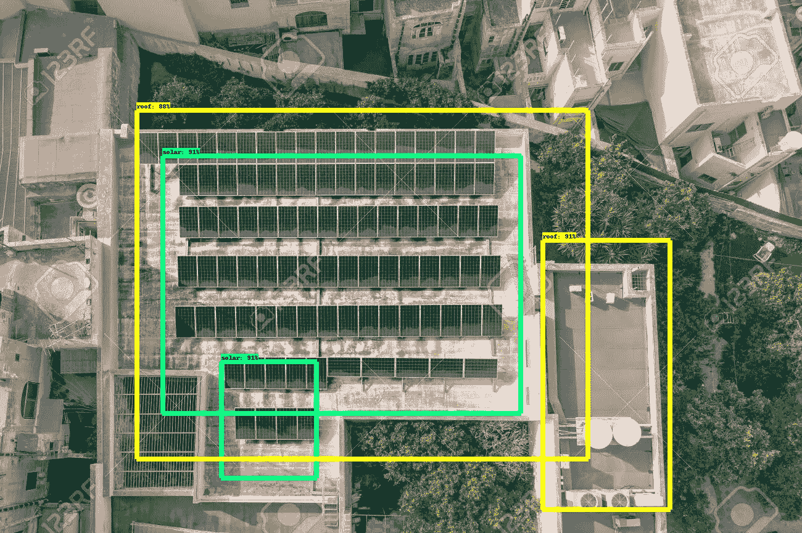
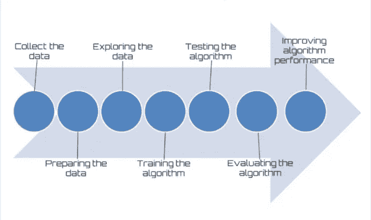
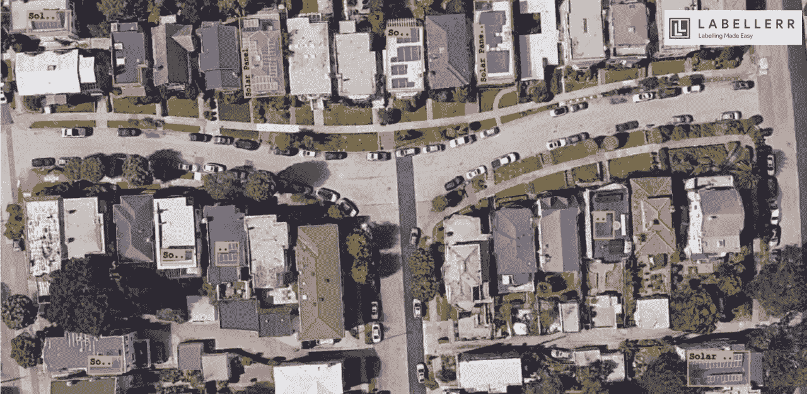
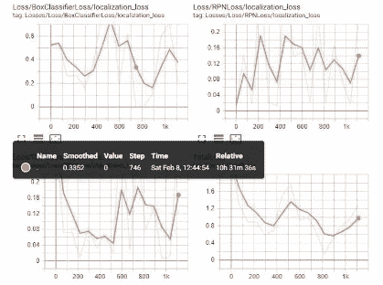
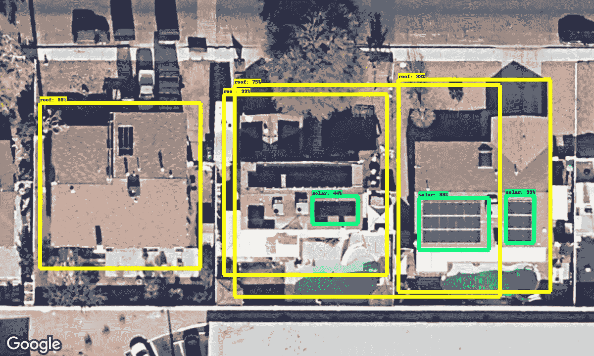
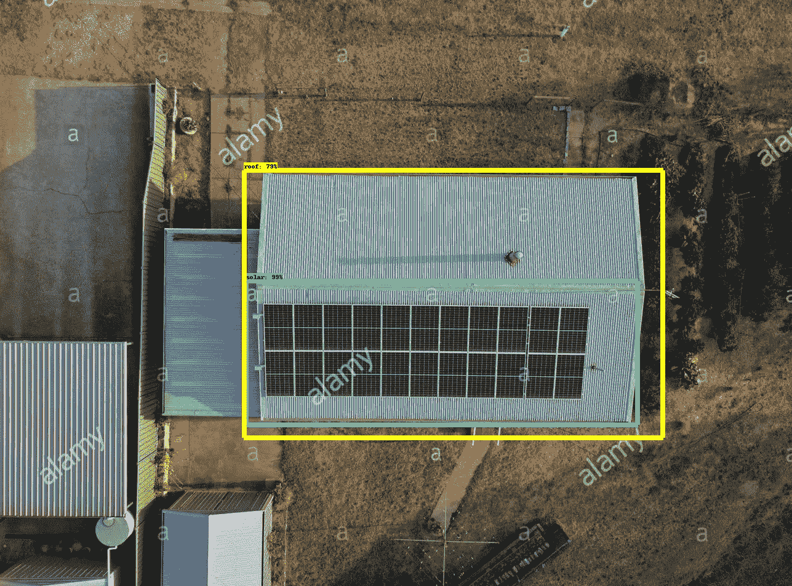
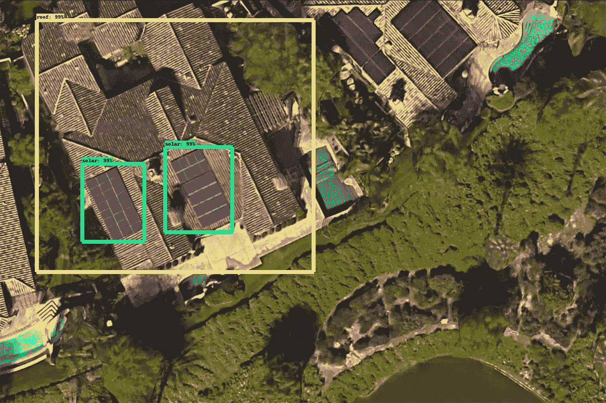
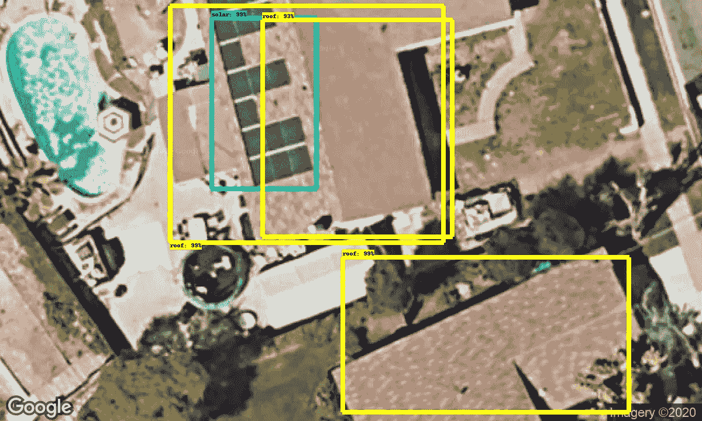
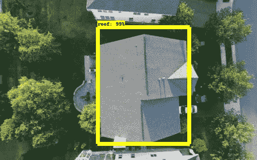

# 从鸟瞰图或卫星图像探测太阳能电池板

> 原文：<https://medium.com/analytics-vidhya/solar-panel-detection-from-aerial-view-or-satellite-images-648c22c260ba?source=collection_archive---------2----------------------->

使用更快的 R-CNN ResNet101 检测太阳能电池板，使用 OpenCV 处理图像

# **为什么要检测太阳能电池板？**

随着太阳能光伏(PV)成为能源市场的主要部分，对分布式屋顶太阳能光伏的粒度数据的需求越来越大。太阳能供应商和客户、城市规划者、电网系统运营商和能源政策制定者将极大地受益于基于图像的太阳能电池板检测算法，该算法可用于形成装置及其功率容量的粒度数据集。太阳能电池板检测的另一个原因是太阳能电池板安装者通常不共享关于太阳能电池板安装的信息。这就是为什么突出的太阳能电池板检测机制/算法是非常需要的。然而，从航空或卫星图像中探测太阳能电池板的工作做得很少。

> 私营太阳能电池板公司可以使用某个地区的太阳能电池板信息，其中包括:

一、[太阳能源](https://www.consumeraffairs.com/solar-energy/sunpower.html) —为家庭和社区物业提供 Maxeon 面板系统。存储软件监控并提供备用电源。租赁，贷款和购买太阳能选项。无需现场布线即可轻松安装。包括 25 年保修。

二。[Vivint](https://www.consumeraffairs.com/solar-energy/vivint-solar.html)——Solar——专注于家用太阳能、蓄电池和电动汽车充电器。购买，PPA，贷款或租赁太阳能选项。安装需要四到八个小时。包括 25 年面板和 10 年逆变器保修。

三。SunLux Energy——销售电池板、逆变器和电池。包括监控、终身支持和 25 年部件、人工和维修保修。提供购买、融资、租赁或预付太阳能选项。执行全方位服务安装。

四。Sungevity 为家庭和企业提供太阳能选择。提供多种存储选项和全天候监控。购买、租赁和 PPA 期权。包括 25 年性能保修和 20 年面板和安装保修。

# **接近**检测太阳能电池板

为了解决这个问题，我们教育放弃基金会决定利用人工智能和机器学习的力量。因此，为了开始创建一种可以从航空或卫星图像中检测太阳能电池板的算法，我们需要一组带标签的卫星图像数据集。

## **步骤 1:收集数据**

这是开发机器学习算法最重要也是最基本的一步。我们使用了来自 google 云平台的“Maps Static API ”,使用一些随机位置的经纬度来获取卫星图像。

> 质量>数量

数据对于我们想要解决的问题是正确的，这一点非常重要。如果数据与问题不一致，即使我们有万亿字节的数据也没有关系。我们试图找到与我们试图分类或预测的特征相关的数据，并丢弃不相关的特征。第一步应该是适当的数据收集，直到我们做到这一点，我们会发现自己不断回到这一步。数据集应该突出所有有用的特征。我们需要制作一个模型，它的工作是检测太阳能电池板在图像上的位置，我们的数据集应该由包含太阳能电池板的图像组成，我们知道太阳能电池板在图像上的确切位置。为此，我们需要标记从谷歌卫星图像获得的原始数据。

## **第二步:标记卫星图像**

这对于我们来说是至关重要的一步，因为标记需要大量的人力和精力，对于每一张单独的图像，我们需要生成标签及其相应的 XML 文件，但多亏了 [**标签器**](https://www.labellerr.com/) 他们的自动标记工具帮助了我们很多，并加快了创建正确的标记数据集的速度，从而开发出一种稳健的算法来检测太阳能电池板。我们将这些图像分为两个不同的类别，即“太阳能”和“屋顶”。

使用贴标机研究计划贴标签

我们可以看到[*labeller*](https://www.labellerr.com/)*如何通过他们的自动标注工具使整个标注过程变得简单，并使数据集更加准确和高效。因为正确标记的数据集是任何机器学习模型的基础。*

## *第三步:训练机器学习模型*

*这一步需要适当的环境设置和大量的计算能力，也是整个过程中最耗时的一步。我们使用 TensorFlow 对象检测模型进行核心处理，并使用“更快的 R-CNN ResNet101”配置。与其他模型相比，该模型需要更多的计算能力，但该模型的准确性补偿了额外的计算能力。我们将数据集分为两部分，一部分用于训练模型，另一部分用于在测试数据集上评估模型。这一步花费了将近 54 个小时的处理时间，我们在训练 10-2 阶模型时保留了损耗，这样我们的模型可以更准确地预测太阳能电池板，因为损耗越低，训练的模型就越准确。在处理过程中，我们密切关注张量板上的模型训练参数和统计数据，并密切监控训练图中的损失。此图显示了模型在训练时的丢失率，这是 TensorFlow 提供的一项服务，用于可视化精确和稳健模型的统计数据。在此之后，我们从冻结的推理图中获得了经过训练的机器学习模型。pb)我们保存它以备将来使用。*

**

*张量板上的实时统计数据*

## *步骤 4:评估机器学习模型*

*现在由于机器学习模型是以冻结图形界面格式训练和导入的。现在，我们需要一个 python 脚本，它能够使用上一步中训练的模型对新图像进行预测。我们制定的 Python 脚本将 label.pbtxt、freezed _ inference _ graph . Pb 和一个测试图像作为输入参数。label.pbtxt 包含我们的模型在其上被训练的标签的数量，而 freezed _ inference _ graph . Pb 包含被训练的模型。在输出中，我们得到带有所有标记的图像。*

## *第五步:改进训练好的机器学习模型*

*我们可以通过用更多的变化更新我们的训练数据集并重新训练我们的 ML 模型来进一步提高我们的模型的准确性，以便我们可以具有能够在所有条件下检测太阳能电池板的更准确和稳健的模型。*

*太阳能电池板探测模型的样本预测:*

> *屋顶-由黄色边框标记*
> 
> *太阳能电池板——以绿色边框标记*

**

*训练好的模型检测到太阳能电池板和屋顶*

**

*训练好的模型检测到太阳能电池板和屋顶*

**

*训练好的模型检测到太阳能电池板和屋顶*

**

*训练好的模型检测到太阳能电池板和屋顶*

**

*由于没有太阳能电池板，训练模型检测到屋顶*

> *现在我们的算法可以检测太阳能电池板了。*

*我已经将这个经过训练的模型贡献给了 Labellerr 模型库，Labellerr 团队已经将它集成到了他们的工具中，因此如果您不想再做所有这些艰苦的工作，只需在 Labellerr 上注册并选择地理空间数据类型，然后您就可以从那里使用它并将其集成到您的项目中。希望有帮助:)*

> *使用的工具和技术*

1.  *[谷歌静态地图 API](https://developers.google.com/maps/documentation/maps-static/overview) —获取卫星图像*
2.  *[贴标机](https://www.labellerr.com/)——轻松贴标所需图像，加快贴标速度。*
3.  *[tensor flow](https://www.tensorflow.org/)——训练模型，进行预测。*
4.  *[OpenCV](https://opencv.org/) —预处理图像，使其格式适合继续训练步骤。*

**

*技术栈*

*关于我:*

*我本质上是一个编码者；从开发具有挑战性的大型软件到小型周末黑客马拉松。对于我的日常工作，我在 TIET 信息技术学院攻读计算机科学工程。我选修了计算机视觉，因为我对面部、物体和图像处理技术感兴趣。我在印度昌迪加尔的教育豁免基金会实习期间创建了这个项目。
在 [LinkedIn](https://www.linkedin.com/in/shiva-thavani-916177167/) 上与我联系*