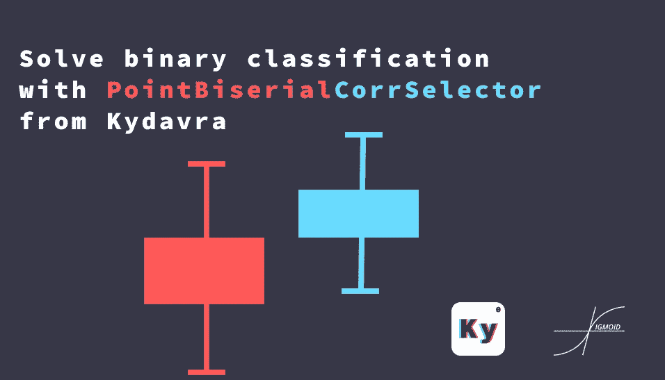

# 使用 Kydavra 的 PointBiserialCorrSelector 求解二元分类

> 原文：<https://medium.com/analytics-vidhya/solve-binary-classification-with-pintbiserialcorrselector-406565328e35?source=collection_archive---------17----------------------->

当今世界的大多数机器学习问题都是分类问题。大多数情况下，数据科学家和机器学习工程师使用相关性，如 Pearson 或 Spearman，来查找与预测值最相关的特征。但是，这些类型的相关性在连续-连续特征对上工作得更好。这就是为什么我们在**s 形** …