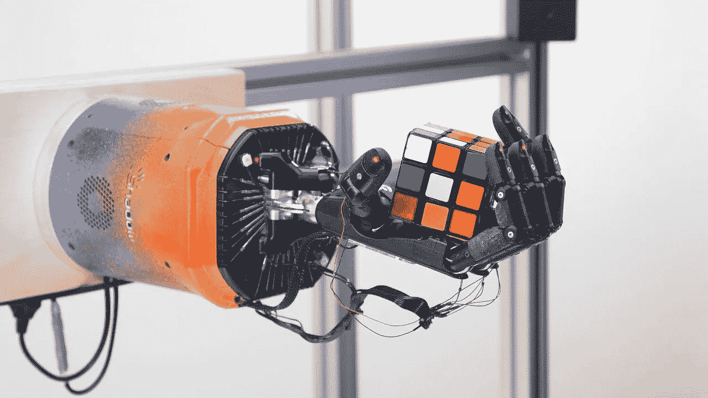
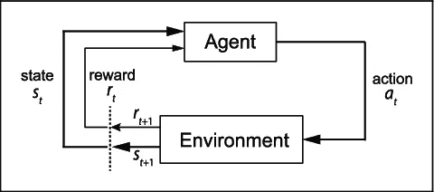
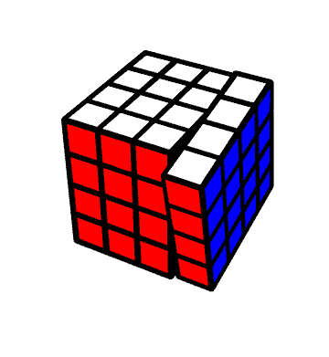
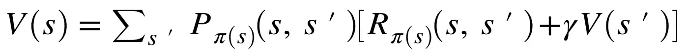
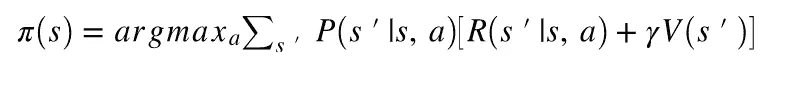
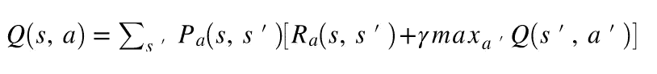

# 用强化学习解魔方(第一部分)

> 原文：<https://medium.com/analytics-vidhya/solving-a-rubiks-cube-with-reinforcement-learning-part-1-4f0405dd07f2?source=collection_archive---------4----------------------->

## 解决常见难题的深度 Q 学习方法

来源:[https://openai.com/blog/solving-rubiks-cube/](https://openai.com/blog/solving-rubiks-cube/)。OpenAI 在 2019 年秋季成为头条新闻，因为它解决了相关但更困难的 RL 任务，即教会一只手操纵立方体。实际上解决立方体的任务是使用[科辛巴的算法](https://en.wikipedia.org/wiki/Optimal_solutions_for_Rubik%27s_Cube#Kociemba's_algorithm)完成的。

去年，我通过康奈尔理工学院的硕士项目开始了我的机器学习之旅。一个特别引起我注意的话题是强化学习(RL)，我们从马尔可夫决策过程(MDP)的传统方向和深度学习(DL)的方向来研究它。虽然课程内容丰富，但我想更进一步。在这里，我记录了我(正在进行的)尝试，通过训练一个智能体来解决一个魔方。

一些介绍性注释:

1.  用强化学习解决魔方并不是一个新问题，我的大部分工作将基于 Stephen McAleer 等人的这篇[论文](https://arxiv.org/abs/1805.07470)，并做一些修改。
2.  对于某些概念，我将尝试尽可能详细地介绍我的特定任务实现，因此建议您熟悉概率、机器学习、RL 和 DL。也就是说，我绝不是专家，任何和所有的反馈都非常感谢！

# **介绍马尔可夫决策过程**

马尔可夫决策过程捕获*代理*如何在*环境中采取*动作*。*每个动作将代理置于不同的环境*状态中，*通常根据某种概率分布*，*代理有可能获得某种*奖励。*代理人的目标是学习一个*策略*(即在给定状态下采取的适当行动)，以使代理人获得的长期回报最大化。

来源:*萨顿，R. S .，&巴尔托，A. G. (2018)。强化学习:导论。麻省理工出版社。*

更具体地说，MDP 是由一个元组( *S，a，Pₐ，Rₐ* )定义的。其中:

S 是环境中所有可能状态的集合

*A* 是代理可以采取的所有可能动作的集合

*Pₐ* 定义了采取行动 *a* 时，从状态 *s⁰* 到状态 *s* 转换的概率分布

*Rₐ* 指定在状态 *s* 采取行动 *a* 所收到的奖励

# 将魔方任务公式化为 MDP

来源:[https://Mathematica . stack exchange . com/questions/195064/Pascal-records-and-Mathematica-programming](https://mathematica.stackexchange.com/questions/195064/pascal-records-and-mathematica-programming)

为了训练我们的代理，我们必须指定一个 MDP 来表示解决魔方的任务，这是通过定义元组的每个组件来完成的。

我们的一组可能状态， *S* ，是魔方的所有可能排列。我们应该注意到大约有 4.3×10 个⁹态！这将对我们的代理如何学习完成任务起到主要作用。

我们的一组可能的动作， *A* ，由立方体的 12 个可能的 90 度旋转组成。按照惯例，这 12 个移动是根据立方体的六个面中的哪一个被移动来命名的，例如正面或正面，以及该面是顺时针还是逆时针旋转。这些移动用以下符号缩写:( *F，R，L，U，D，F’，R’，L’，U’，D’*)。

幸运的是，指定状态转移概率分布 *Pₐ* 非常容易，因为每个动作都会决定性地改变状态。例如，执行 *F* 动作只会将立方体从其当前状态转换到其正面顺时针旋转 90 度的状态。如果我们把这些状态分别叫做 *s₁* 和 *s₂* ，那么 p(*s₁*->t24】s₂； *F* ) = 1，p(*S1->s)；F* ) = 0 表示所有的*！= s₂* 。然后，我们可以将同样的逻辑应用于所有其他状态/动作组合，以获得概率分布。

最后，我们必须指定奖励函数(即，代理人在每个状态下采取每个行动会得到什么奖励，如果有的话)。为了确保我们的代理只关心解决魔方，而不关心其他次要目标，我们将说，当代理采取行动导致魔方被解决时，它将获得 1 的奖励，如果行动导致任何其他状态，则获得 0 的奖励。

# 一种解决立方体的策略

代理在 MDP 的每个状态中应该采取哪个动作的选择被称为代理的*策略*。特别是，我们想学习一个*最优策略*，它将使代理人获得最大的长期回报。给定我们上面指定的奖励函数，魔方代理的最优策略是最终导致解决状态的策略，因为这是给出奖励的唯一状态。

策略是将状态映射到操作的函数，用π()表示。对于简单的 MDP，最优策略可以通过求解一组称为贝尔曼方程的递归方程来确定。

贝尔曼方程

直观地说，上述等式的左侧可以被认为是代表当遵循策略π( *s* )时处于状态 *s* 的代理的“值”。贝尔曼方程表示，该值等于采取策略指定的下一个行动的预期回报(该行动可达到的每个状态的平均回报，以该状态结束的可能性加权)加上这些状态中每个状态的“值”，再减去某个因子γ。从这些等式中，最优策略可以定义为在每个状态中采取使 *V(s)* 最大化的行动。

最佳策略定义

虽然可以使用动态规划为简单的 MDP 计算 Bellman 方程，但是这对于较大的动作和状态空间很快变得不可行。对于这些更大的问题，我们不得不采取强化学习的方法来解决 MDP。一种这样的方法叫做 *Q-learning，*它利用了一个叫做 Q-function 的相关函数。一旦 Q 函数被指定(或至少被估计)，代理就可以遵循一个策略，采取使每个状态下的 Q 函数最大化的行动。

q 函数

最简单形式的 Q 函数可以被认为是一个巨大的查找表，具有维度| *S* | x | *A* |。然而，在魔方的例子中，这将产生一个尺寸为 4.3×10⁹×12 的表格，我们很快发现确定表格的每个条目是不可行的。相反，我们需要一种方法来估计所有状态-动作对的 Q 函数。

## 进入深度学习

我们用来估计 Q 函数的机器是一个神经网络。具体来说，我们将利用神经网络的[通用逼近定理](https://en.wikipedia.org/wiki/Universal_approximation_theorem)，该定理指出，在某些条件下，神经网络可以用来逼近任何函数。

在我的下一篇文章中，我将介绍用于训练神经网络来估计 Q 函数的开创性算法(如果你想同时继续阅读，可以在这里查看原始论文)、我用于魔方任务的特定模型架构，以及一些初步结果。

感谢您阅读我在 Medium 上的第一篇博文！我希望你觉得这很有趣，并愿意在下面的评论中讨论任何反馈或进一步的对话。敬请期待[第二部](/@mgd67/solving-a-rubiks-cube-with-reinforcement-learning-part-2-b4ff0f3522b3)！