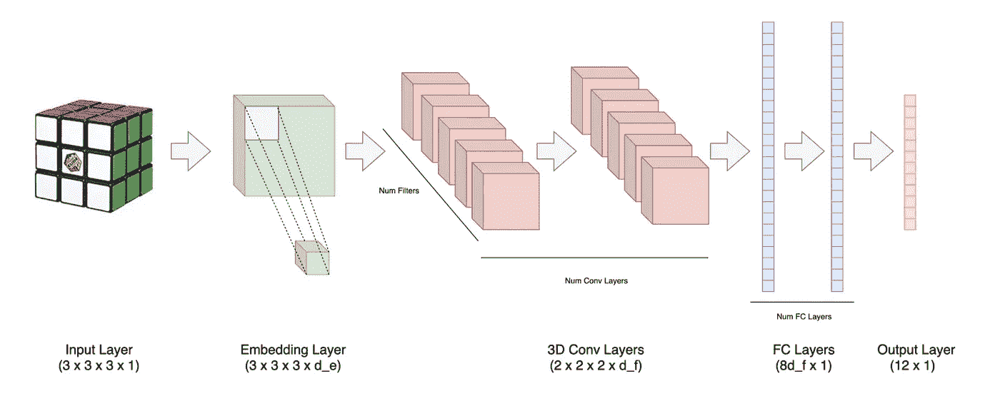
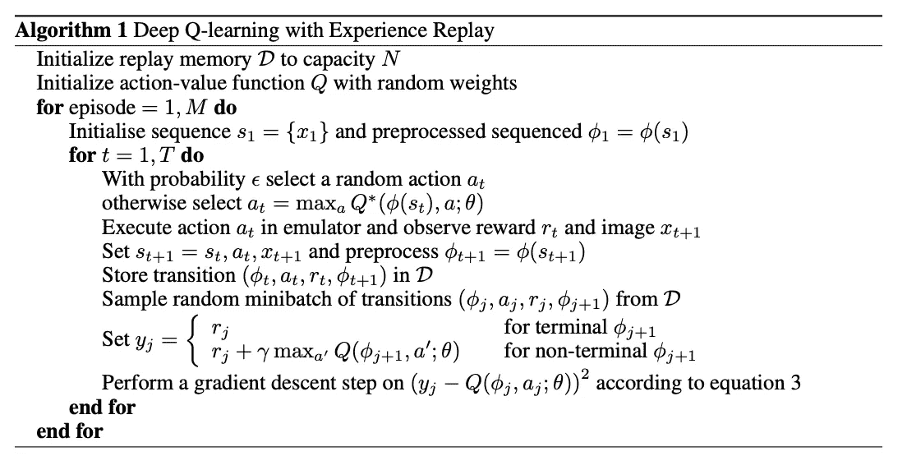
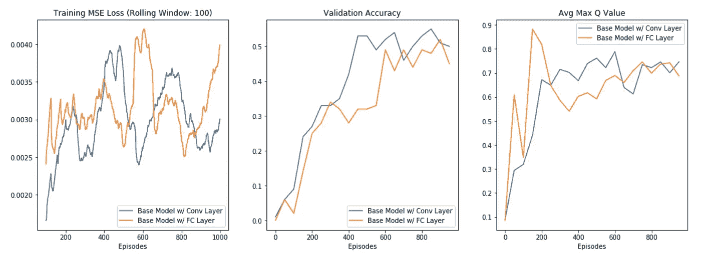
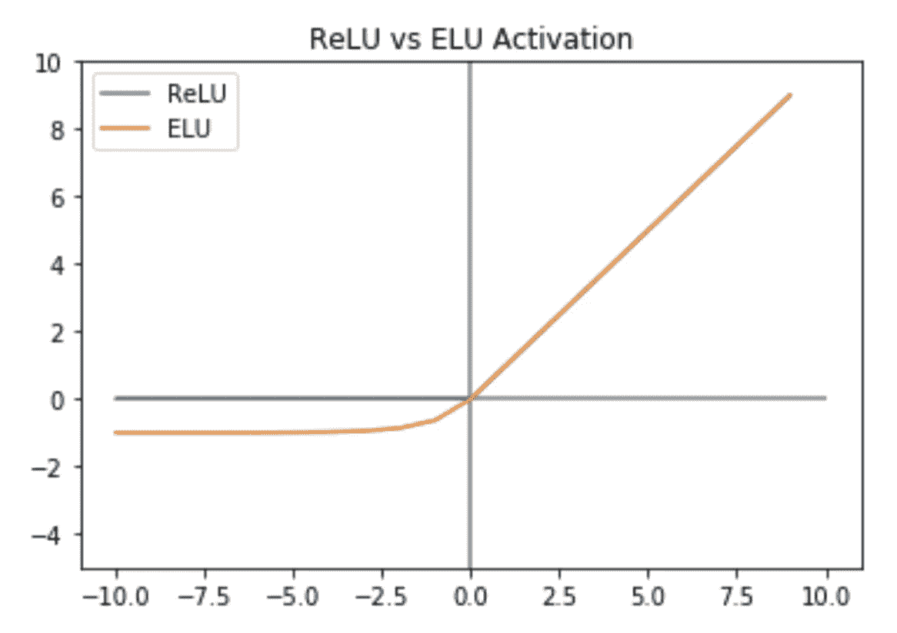
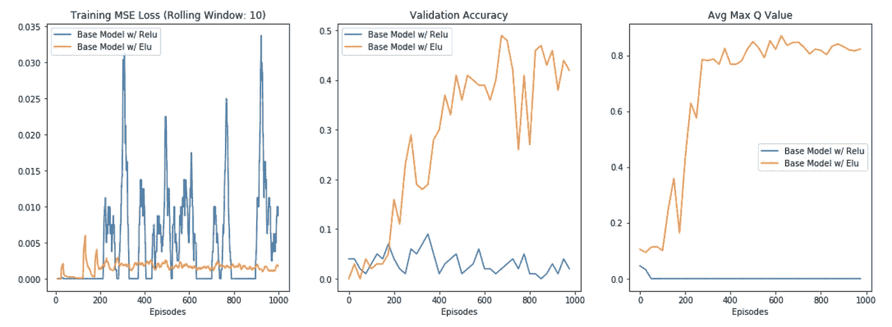
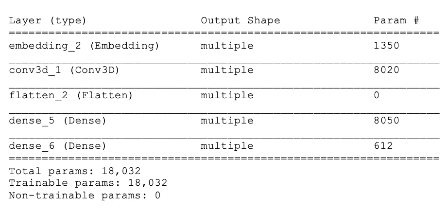

# 用强化学习解魔方(下)

> 原文：<https://medium.com/analytics-vidhya/solving-a-rubiks-cube-with-reinforcement-learning-part-2-b4ff0f3522b3?source=collection_archive---------4----------------------->

## 解决常见难题的深度 Q 学习方法

来源:[https://openai.com/blog/solving-rubiks-cube/](https://openai.com/blog/solving-rubiks-cube/)。OpenAI 在 2019 年秋季成为头条新闻，因为它解决了相关但更困难的 RL 任务，即教会一只手操纵立方体。实际上解决立方体的任务是使用[科辛巴的算法](https://en.wikipedia.org/wiki/Optimal_solutions_for_Rubik%27s_Cube#Kociemba's_algorithm)完成的。

欢迎来到我尝试通过强化学习(RL)解决魔方的第二部分。上一次，我介绍了马尔可夫决策过程(MDP ),并将解决魔方的任务公式化为 MDP。如果你错过了这篇文章或者想要快速复习，你可以点击查看[。](/@mgd67/solving-a-rubiks-cube-with-reinforcement-learning-part-1-4f0405dd07f2)

在我上一篇文章的结尾，我停止了对 Q 函数的讨论，以及由于状态-动作对的空间太大，我们需要如何近似它来完成我们的任务。在这篇文章中，我将实现一个神经网络来做到这一点。在这个过程中，我们将探索如何通过经验重放算法训练网络，并提供一些初步的实验结果。如果你好奇，我实际的 Python 实现是这里的[这里的](https://github.com/MattD18/rubiks-cube)。一如既往，非常感谢您的任何评论、问题或反馈！

# 体系结构

回想一下，Q 函数将状态-动作对 *(s，a)* 作为输入，并返回一个标量值，该值粗略地表示在状态 *s* 中采取动作 *a* 对于解决魔方的最终目标有多“好”。此外，回想一下，在每个求解步骤中，智能体的策略将是采取使当前状态的 Q 函数最大化的行动。

有了这两个想法，我们将希望制作一个神经网络，它将立方体的一些表示作为输入，并返回一个 12 维向量作为输出。对于网络的给定输入，*s’*，12 个输出神经元中的每一个都表示在该状态下采取 12 个有效动作中的每一个时 Q 函数值。例如，第一个神经元可以代表 Q(*s’，*前旋转)，第十二个神经元可以代表 Q(*s’，*，左旋转)。注意:输出层中动作和神经元位置之间的精确映射是任意的。

用于 Q 函数逼近的示例架构

既然已经讨论了输出，我还需要一种方法将魔方的状态表示为数字输入。为了实现这一点，我们将依赖于[嵌入](https://developers.google.com/machine-learning/crash-course/embeddings/video-lecture)的概念。嵌入是一种密集的、固定维度的向量，用于表示某个对象。例如，在 NLP 中，单词嵌入通常用于表示单个单词，并且两个单词嵌入向量之间的关系意味着捕获两个对应单词之间的语义关系。

在我们的例子中，组成 3x3x3 魔方的 27 块中的每一块都有自己独特的 *dₑ* 维度嵌入。在训练期间，这些嵌入将与网络中的其他权重一起被学习。实施细节见[此处](https://www.tensorflow.org/api_docs/python/tf/keras/layers/Embedding)。

在输入层和输出层之间，我选择了使用 3D 卷积层，然后平坦化来自卷积层的输出，并在 12 维输出层之前使用一个更完全连接的层。ELU 激活用于所有层。使用 ELUs 以及包括卷积层的基本原理将在下面的初始结果部分中探讨。

# 体验回放

神经网络的实际训练是通过经验重放算法完成的。这个算法在 Volodymyr Mnih 等人关于深度 Q-Learning 的开创性论文[Playing Atari with Deep Reinforcement Learning](https://www.cs.toronto.edu/~vmnih/docs/dqn.pdf)中有所描述，为了读者的参考，我已经包括了论文中的伪代码。然而，我将尝试首先从高层次描述该过程。

体验重放是一种迭代算法，在该算法中，代理多次尝试求解立方体。在每次尝试期间，代理从一个被打乱的立方体开始，并采取它认为最好的动作(根据它当前对 Q 函数的近似)。每当代理采取一个动作时，动作、当前状态、结果状态以及对动作“良好性”的估计都作为一个元组存储在一个叫做重放缓冲区的东西中。重放缓冲区只是这些过去“经验”元组的集合。然后，从该缓冲区中采样这些元组的小批量，以通过梯度下降对神经网络进行更新。基于过去的事件对网络执行更新是一种非策略学习的形式。这与基于当前情节进行更新形成对比，这被称为基于策略的学习(RL 算法的另一个主要分支)。

在第一次尝试解决立方体时，神经网络未经训练，因此代理几乎随机地尝试解决立方体。然而，这一系列随机动作最终会导致代理在其中一集的时候偶然解开魔方。此时，奖励信号将被添加到重放缓冲器中。随着代理保持训练，它将开始在用于梯度下降权重更新的小批量中包括包含该奖励信号的“经验”元组。这将慢慢地改善 Q 函数的近似性，并使代理在随后的训练中的行为变得不那么随机。这将导致更多已解立方体的实例和更多“好”剧集被添加到重播缓冲器中。这个过程是一个良性循环，将导致代理变得更好地解决任务。

然而，有一点需要注意，在这个过程中，代理有时会陷入局部极小值。例如，代理可能只知道如何从某些打乱的状态中解出立方体，而不知道其他的。为了尝试将代理推出这些局部极小值，代理经常会采取随机行动，而不是 Q 函数近似所规定的行动。这个随机的动作给代理一个机会，用一种全新的方式来解决立方体，并学习一些新的东西。

采取这种随机行动的可能性由参数ε(在 0 和 1 之间)控制，这就是为什么这种策略通常被称为*ε-贪婪策略*。更广泛地说，在 RL 中，*ε-贪婪策略*是一种探索方法。探索，或发现完成手头任务的新方法，通常与开发，或利用代理的现有知识来解决任务形成对比。这两个概念经常被描述为一种权衡，并且是强化学习的重要组成部分。

https://www.cs.toronto.edu/~vmnih/docs/dqn.pdf[中描述的体验回放算法的伪代码](https://www.cs.toronto.edu/~vmnih/docs/dqn.pdf)

# 初步结果

在我的第一轮实验中，我从一个非常简单的设置开始，目标是帮助决定 Q 函数逼近的架构。任务是解决一个魔方，它离已解决的状态的洗牌距离为 3。我所说的洗牌距离为 3，只是指从一个解出的立方体开始，依次对该立方体进行三次随机旋转。这种混洗状态是代理在每集期间尝试达到已解决状态的起点(在每集之前，立方体以不同的方式混洗)。此外，代理被限制为每集最多 5 次移动来解决魔方。

训练进行了 1000 集，探索率ε从 100%开始，在第一个 100 集内线性下降到 10%，之后保持恒定在 10%。使用大小为 128 的重放缓冲器，这意味着一次只存储所有训练集的最后 128 个“经验”元组。最后，使用 16 号小批量进行重量更新。

在评估这些实验的结果时，我发现有三个指标有助于跟踪性能:

**损失(均方误差):**损失是网络的 Q 值的当前近似值与在给定状态下采取某个行动的观察到的长期回报之间的平方差，是小批量中所有“经验”元组的平均值。这种损失反过来在一集的所有小批次上平均，以获得每集的损失。一般来说，损失应该随着网络的学习而收敛，当代理重新考虑它的策略时偶尔会出现峰值。

**验证准确性:**评估代理性能的一个更直接的方法是使用一组混洗立方体。具体来说，我使用了一组 100 个立方体，洗牌距离为 3，每 25 集训练测试一次网络。代理能够在 5 次移动或更少移动中正确解决的该组立方体的数量除以 100，被报告为验证准确性。

**Avg。最大 Q 值:**最终评估指标取自 [Atari 论文](https://www.cs.toronto.edu/~vmnih/docs/dqn.pdf)。每 25 集，对于用于验证准确性的同一组立方体，每个立方体的初始混洗状态通过网络传递，并记录动作的最大 Q 值。然后将这些最大 Q 值一起平均。这样做的基本原理是，随着智能体变得越来越聪明，它将对特定的动作将如何导致解决魔方有更强的感觉。这意味着该行为的 Q 值(即当前奖励和所有贴现的未来奖励的总和)也有望增加。通过培训，如果代理有所改进，我们将会看到这一指标有所提高。

## 实验 1:卷积与全连接层

第一个实验是评估是否有必要使用卷积层。备选方案是在嵌入层之后，简单地将所有嵌入连接成一个平面(27 * *dₑ* )维向量。比较这两种架构的所有三个性能指标，结果是不确定的，使用卷积层可能略有优势。具有卷积层的模型在训练上具有稍高的验证准确性。此外，对于具有卷积层的模型，平均最大 Q 值似乎增加得更平滑。一个毫无根据的预感告诉我，这是一个更稳定的训练过程的迹象。

更多的是基于验证的准确性和先前的信念，即卷积层将很好地与魔方的对称性一起工作，我选择在我的架构中保留卷积层。一个可能更有根据的理由是，卷积层的参数比全连接层少(8，020 对 67，550)。

模型 w/ Conv 层与模型 w/ FC 层的比较。与训练相比，Conv 层模型的验证准确性稍好一些。

## 实验 2: ELU 与 ReLU 激活

我进行的第二个实验是帮助选择神经网络每一层的激活函数。最初，我选择了 ReLU 激活，并注意到一些奇怪的行为。在洗牌距离为 3 时，代理没有学到任何东西，这由发散损失函数和在随机机会附近徘徊的验证准确性所证明。然而，关键的诊断是，在训练期间，平均最大 Q 值很快变平为 0。

雷卢(蓝色)和 eLU(橙色)激活功能

这一观察是*将死的证据。当执行 ReLU 激活功能的层产生负值时，会出现死亡 ReLU。作为参考，ReLUs 被定义为对于所有负值取常数值 0。这意味着在反向传播期间，通过激活的梯度也将为 0，并且不会发生权重更新。除非基础层可以在训练的稍后某个点获得正值，否则层输出将始终为 0。我们在下图中看到了这个问题，其中 ReLU 模型的平均最大 Q 值(实际上是输出神经元的最大值)为 0。*

幸运的是，这个问题可以通过使用 ELU 激活函数来避免，该函数可以在输入小于 0 时保持略微下降的输出。这意味着它在反向传播期间将具有负(和非零)梯度，这允许一些梯度流动，并防止神经元完全关闭。当我切换到使用 ELUs 而不是 ReLUs 时，我发现在所有三个评估指标的训练中有了巨大的改进，如下所示。

工程师需要切换到 ELU 激活来解决该任务

在以上实验的基础上，我决定进一步实验的架构是:

在我的下一篇文章中，使用这个架构作为起点，我将尝试增加代理能够解决的立方体的洗牌距离，从而增加任务的复杂性。我还将讨论将神经网络的输出与蒙特卡罗搜索树相结合的效果，这是 RL 中的一种常见方法，也是之前提到的 [McAleer 论文](https://arxiv.org/pdf/1805.07470.pdf)中使用的一种方法。

感谢您阅读我的魔方系列的第二部分！我希望你觉得这很有趣，并愿意在下面的评论中讨论任何评论或进一步的对话。请继续关注第 3 部分！