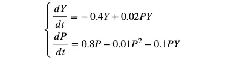
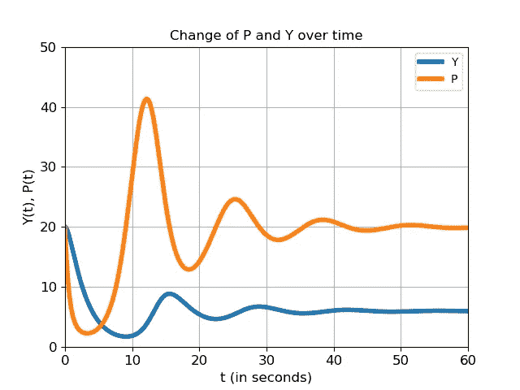
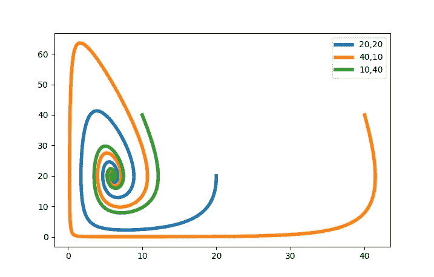

# 用 Python 数值求解两个微分方程组

> 原文：<https://medium.com/analytics-vidhya/solving-a-system-of-two-differential-equations-numerically-in-python-d31844d4ea28?source=collection_archive---------1----------------------->


米卡·鲍梅斯特在 [Unsplash](https://unsplash.com?utm_source=medium&utm_medium=referral) 上的照片

> *这个故事是我之前关于* [*使用 python*](/@hugodegroot/how-to-numerically-solve-a-differential-equation-66d07098553e?source=friends_link&sk=ba31fbec04fbcc780fe600710fb942bb) *数值求解微分方程的后续。*

## 模型

假设我们有以下一组微分方程:



y 和 P 可能是同一地区的两个动物种群。因此，一个种群的增长依赖于另一个种群中食肉动物的数量。对于每一次计算，都应该给出初始总体。在第一个模型中，两个初始种群都被设置为 20。

## 代码

现在我们已经确定了我们的模型，是时候写一个 python 程序来计算给定时间段后的种群大小了。

首先，我们需要导入 *Numpy* 和 *Matplotlib* 库。然后我们可以设置初始值。我们必须确定近似值的时间步长，开始时 Y 和 P 的值。我们还需要一个开始和结束时间来计算我们需要计算的步数。

```
import numpy as np
import matplotlib.pyplot as pltDt = 0.01               # timestep Delta t
Y_start = 20            # initial Y
P_start = 20            # initial P
t_start = 0             # starttime
t_end = 60              # endtimen_steps = int(round((t_end-t_start)/Dt))    # number of timesteps
```

然后我们可以随时创建空数组来存储计算出的值。我们应该用指定的初始值填充元素 0。

```
Y_arr = np.zeros(n_steps + 1)   # create an array of zeros for Y
P_arr = np.zeros(n_steps +1)    # create an array of zeros for P
t_arr = np.zeros(n_steps + 1)   # create an array of zeros for t
t_arr[0] = t_start              # add starttime to array
Y_arr[0] = Y_start              # add initial value of Y to array
P_arr[0] = P_start              # add initial value of P to array
```

现在是时候为循环创建一个**了，它将迭代每一个时间步长，并根据微分方程计算 P、Y 和 t 的下一个值。如果你想尝试不同的微分方程，你可以在这里做。**

```
# Euler's method
for i in range (1, n_steps + 1):  
   Y = Y_arr[i-1]
   P = P_arr[i-1]
   t = t_arr[i-1]
   dYdt = -0.4*Y +0.02*P*Y          # calculate the derivative of Y
   dPdt = 0.8*P - 0.01*P*P-0.1*P*Y  # calculate the derivative of Y
   Y_arr[i] = Y + Dt*dYdt  # calc. Y at next timestep,add to array
   P_arr[i] = P + Dt*dPdt  # calc. P at next timestep,add to array
   t_arr[i] = t + Dt       # add new value of t to array
```

最后，我们可以画出 P 和 Y 随时间的变化。

```
# plotting the result
fig = plt.figure()                                  # create figure
plt.plot(t_arr, Y_arr, linewidth = 4, label = 'Y')    # plot Y to t 
plt.plot(t_arr, P_arr, linewidth = 4, label = 'P')    # plot P to tplt.title('Title', fontsize = 12)    # add some title to your plot
plt.xlabel('t (in seconds)', fontsize = 12)
plt.ylabel('Y(t), P(t)', fontsize = 12)
plt.xticks(fontsize = 12)
plt.yticks(fontsize = 12)
plt.grid(True)                        # show grid
plt.axis([t_start, t_end, 0, 50])     # show axes measures
plt.legend()
plt.show()
```



如你所见，达到了一个平衡。我们现在已经解决了这个微分方程系统。你可以摆弄这些代码，改变一些变量，看看结果如何变化，或者是否达到了平衡点，或者甚至是一个不同的平衡。你仍然应该确保选择一个合适的 *dt* 时间步长。

## 相图

如果我们把 Y 画在 P 上，而不是 t 上，我们会得到一个所谓的相图，这对研究平衡很有用。在这种情况下，它并不令人兴奋，但可以创造一个美丽的形象。在这种情况下，所有三个初始组合都汇聚到一个点。这一个叫做*螺旋下沉*。



具有图例中初始值的微分方程组的相图

如果你已经理解了这个代码和支持它的理论，你就有了数值求解任何微分方程系统的基础。