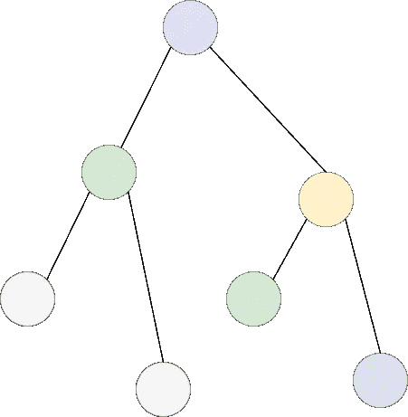

# 解决树的问题

> 原文：<https://medium.com/analytics-vidhya/solving-a-tree-problem-236de07c9af5?source=collection_archive---------6----------------------->

平衡二叉树

ree 问题在竞争性编程问题中非常普遍。所有的名声都是因为它们传递给初学者思想的复杂性，有时它们甚至会吓到已经编程一段时间的中级程序员。

在这篇博客中，我将讨论一个具有相似复杂性的普遍问题，并分享一个打破这个解决方案的想法。