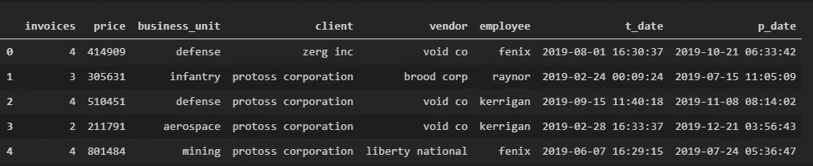

# 用分析解决业务问题:工作负载评估(1.3)

> 原文：<https://medium.com/analytics-vidhya/solving-business-problems-with-analytics-workload-evaluation-1-3-30d2bf287891?source=collection_archive---------24----------------------->

# 生成和加载测试数据

本文是关注使用分析解决常见业务问题的系列文章的第一篇。对于第一个问题，即工作负载评估，我决定分成五个较小的部分，这样我就可以更详细地讨论这个问题，并希望为解决这类问题提供一个有用的例子。这五个会议将是: [*将业务问题转化为分析问题*](/analytics-vidhya/how-to-translate-business-problems-into-analytical-problems-d1e4f1305ff0) *、* [*重新评估纸上解决方案*](/analytics-vidhya/solving-business-problems-with-analytics-workload-evaluation-1-2-6d54ad1c15b0) *、生成和加载测试数据(当前会议)、提出解决方案，以及最后的项目总结和演示。*


照片由[zdenk Macháek](https://unsplash.com/@zmachacek?utm_source=medium&utm_medium=referral)在 [Unsplash](https://unsplash.com?utm_source=medium&utm_medium=referral) 上拍摄

在之前的一次会议中，我提出了一个常见的日常业务问题，即试图衡量和评估员工的工作量。我们的目标是回答这些典型的问题:

*   我们如何衡量当前的工作量？
*   我们的工作负载能力是多少？
*   我们需要多少员工来完成我们的要求？
*   我们应该期望一名员工完成什么？
*   员工工作量是否平衡？

在那篇文章中，我将重点放在将业务问题转化为一个可以用可量化的方式测试和解决的分析问题上。在本次会议中，我们将生成测试数据，以跟进建议的解决方案。

## ***回顾(如果还新鲜，可以跳过这一节到下一个标题)***

我们决定，要解决所有这些问题，我们必须首先从我们现有的信息开始。我们知道我们有一些员工，我们知道我们有一些工作量要完成。好的，到目前为止很简单。我们需要做的最重要的事情是确定如何衡量要求我们完成的总工作量。这些问题中的每一个都依赖于这个问题的解决方案；这一定是我们的起点。

我们如何衡量总工作量？这需要你研究现实世界中的潜在变量。与你交谈的每一位经理对此可能会有不同的答案，所以尽你所能为这次评估收集所有的特征。对于我们的例子，我们提出了一些通用的方法:购买、开具的发票和购买金额。我们需要评估并确定每个场景的最佳度量。然后，我们必须将这些测量值标准化，并将它们加在一起，以获得总工作量。因为我们试图测量功，最好的测量方法将与完成单位体积的努力有最线性的关系。虽然努力是一件很难衡量的事情，但是我们可以通过观察它的成本来推断它的价值；在一个组织中，努力的代价是时间。因此，为了评估工作量的最佳潜在测量值，我们将评估每个工作量测量值的相关系数，最高值将是我们的选择。

```
*ρx,y = co-variance(x,y)/(σₓ*σᵧ)
Where x = effort, and y = volume
effort = 1+((x-μ)/σ)
volume = sum(units)

volume_category = {category|max{ρ(effort,vol_measure):∀vol_measure}}**normalized_units = ∑{units/max(units)|volume_category}
_________________**relative_volume = effort * normalized_units*
```

因此，现在我们有了总工作量的度量，其他的一切都自然而然地到位了。下一个障碍是确定单个贡献者的工作量。

为了评估这一点，我们用平均总工作量除以完成这项工作所需的平均时间来衡量工作效率。为了确定期望从平均贡献者那里得到多少，我们将取效率测量的平均值，并返回平均体积贡献，其中效率在总体平均值的标准偏差内。

```
*avg_volume = avg(relative_volume)/employee
avg_efficiency = avg_volume/avg(time)
_________________**exp_vol_contribution = avg_volume <--- avg_efficiency - σ < avg_volume < efficiency + σ*
```

既然我们知道了如何衡量总工作量和员工的预期贡献，我们就可以很容易地回答剩下的问题了。

为了评估所需的员工，我们只需将我们的总工作量除以预期贡献。为了评估我们当前的工作负载能力，我们将我们当前的员工乘以预期贡献。

```
*req_contributors = relative_volume/exp_vol_contribution*
*capacity = exp_vol_contribution * count(employees)*
```

我们现在可以回答我们面临的每一个问题。现在，为了在实践中看到这个解决方案，我们首先必须生成一些测试数据。


克里斯里德在 [Unsplash](https://unsplash.com?utm_source=medium&utm_medium=referral) 上的照片

## **生成测试数据**

我们将使用 Python 来生成我们的测试数据。

首先，我们将导入随机库并创建一个字典来存储我们的结果。

```
import random as rand
values = {}
```

***发票数量:***

接下来，我们将使用随机库来生成发票计数列表；这个数字就是一次采购所需的发票数量。为此，我们将创建一个快速函数，它接受一个列表对象、我们的样本大小和一个上限。

```
def rand_inv(list_to_append,n,upper_limit):
```

然后，我们将使用 for 循环生成一个大于零的随机整数，并将其添加到一个列表中，以确定迭代次数和上限。

```
for i in range(samples):
     r = rand.randint(1,upper_limit)
     list_to_append.append(r)
```

之后，我们将定义样本大小，并在字典中创建一个名为“invoices”的空列表来存储函数结果。最后，我们将简单地调用函数。

```
samples = 5000
values['invoices'] = []rand_inv(values['invoices'],samples,5)
```

一起:

或者，如果列表理解是你的事情(他们应该是):

***采购价格:***

我们将做同样的事情，并创建一个函数来生成每次购买的价格。我们将通过创建另一个函数来生成一个介于 1 和我们定义的范围限制之间的随机数，然后将结果追加到一个指定的列表中。之后，我们将在字典中创建一个空列表来存储函数结果并调用函数。

注意，由于货币值通常有两位小数，我们将调用 *rand.uniform()* 函数，并将其包含在 *round()* 函数中，以限制其两位小数。

列表理解:

另一方面，在这一点上应该清楚，列表理解是你的朋友。

***分类值:***

我们还需要生成一些分类值。为此，我们将在列表中定义所有选项，然后使用一个随机整数从列表中调用一个值。

```
business_unit = ['supply','mining','aerospace','infantry','defense']
client = ['terran industries','protoss corporation','zerg inc']
vendor = ['brood corp','liberty national','swarm llc','void co']
employee = ['kerrigan','raynor','fenix']
```

接下来，我们将创建一个函数，它将类别、相应的列表对象和样本大小作为参数。

```
def create_categories(category,source_list,samples):
```

然后，我们将在值字典中为该类别创建一个列表，并为 *rand.randint()* 函数定义范围限制。

```
 values[category] = []
    range_limit = len(source_list)-1
```

然后，我们将创建一个 for 循环，为每个样本生成一个随机整数，并将相关的类别列表项追加到值字典列表中。

```
for i in range(samples): 
        r = rand.randint(0,range_limit) 
        values[category].append(source_list[r])
```

然后我们会为每组参数调用我们的函数。

```
create_categories('business_unit',business_unit,samples)
create_categories('client',client,samples) 
create_categories('vendor',vendor,samples) 
create_categories('employee',employee,samples)
```

一起:

同样，我们可以使用列表理解来巩固这些步骤，而不是编写一个又长又乱的函数。这一次，我们还将使用 lambda 函数来使它更加清晰。

***日期:***

接下来，我们必须为我们的交易和支付日期生成随机日期。

我们将从从日期时间库中导入*日期时间*和*时间增量*开始。

```
from datetime import datetime
from datetime import timedelta
```

现在我们将创建一个函数，它将开始日期限制、结束日期限制和样本大小作为参数。

```
def rand_date(start_date_limit,end_date_limit,samples):
```

然后，我们将在字典中创建空列表，并确定时间窗口内的秒数。

```
values['t_date'] = []
values['p_date'] = []time_delta = end_date_limit - start_date_limit
seconds_delta = time_delta.total_seconds()
```

在该范围内为每个样本创建一个随机开始日期，并添加到我们的列表中。

```
for i in range(samples):
    random_second = rand.randrange(seconds_delta)
    start_date = start_date_limit + timedelta(seconds=random_second)
    values['t_date'].append(start_date)
```

此后，我们将开始日期作为新的下限，并生成相应的结束日期，这样结束日期将始终在开始日期之后。

```
time_delta = end_date_limit - start_date
seconds_delta = time_delta.total_seconds()random_second = rand.randrange(seconds_delta)
end_date = start_date + timedelta(seconds=random_second)         values['p_date'].append(end_date)
```

定义我们的开始和结束参数，然后调用我们的函数。

```
start_date_limit = datetime.strptime('1/1/19','%m/%d/%y') end_date_limit = datetime.strptime('12/31/19','%m/%d/%y')rand_date(start_date_limit,end_date_limit,samples)
```

接下来，我们将导入熊猫并将字典加载到数据帧中。

同样，为了简化，我们将使用 lambda 函数并列出理解。


丹尼尔·林肯在 [Unsplash](https://unsplash.com?utm_source=medium&utm_medium=referral) 上的照片

## 创建测试环境

现在我们已经有了测试数据，我们将在 PostgreSQL 数据库中创建一个测试环境来存储我们的数据，以便将来进行转换。

首先，我们将导入 *pandas* 库，并将我们的测试数据字典加载到 dataframe 中。

```
import pandas as pddf = pd.DataFrame(values)
df.head()
```



***创建数据库:***

接下来，我们必须创建我们的数据库。我们将从导入 *psycopg2* 库和*ISOLATION _ LEVEL _ auto commit*扩展开始。

```
import psycopg2
from psycopg2.extensions import ISOLATION_LEVEL_AUTOCOMMIT
```

现在我们将定义我们的连接并创建一个测试数据库。务必确保要创建的任何数据库连接在完成后都已关闭。这将帮助您避免将来出现问题，即使这是一个测试环境。

```
with psycopg2.connect("user=postgres password=****") as conn:
    conn.set_isolation_level(ISOLATION_LEVEL_AUTOCOMMIT)
    cur = conn.cursor()
    create_database = 'Create Database wlcap_test_env;' try:
        cur.execute(create_database)
        cur.close()
    except:
        cur.close()
```

**如果没有安装 PostgreSQL，可以在这里* *找到* [*。*](https://www.postgresql.org/download/)

一起:

我添加了一个 catch 来删除并重新创建数据库，这样我就可以继续重新运行整个脚本，而不用担心数据库是否存在。

接下来，我们将创建一个函数来执行查询，以便在将来节省时间。

关闭与打开的数据库的任何连接是非常重要的，因此编写函数来执行查询可以让您将整个过程放在函数中，而不用担心有打开的连接。

***创建模式和表***

让我们创建我们的模式和主表。您不必为此创建一个模式，因为这是一个测试环境，但是根据您所做的转换有多广泛或者您需要做多少测试，这可能有助于您保持有组织性。如果您不选择创建模式，您的表将被添加到数据库的“公共”模式中。

***导入数据:***

现在为了加载我们的数据，我们需要为它的 pandas 集成导入*sqlalchemy . create _ engine*。如果您愿意，以上所有操作也可以使用 sqlalchemy 来完成。

```
Output: [(0001, 4, 414909.0, ‘defense’, ‘zerg inc’, ‘void co’, ‘fenix’, datetime.datetime(2019, 8, 1, 16, 30, 37), datetime.datetime(2019, 10, 21, 6, 33, 42)), (0002, 3, 305631.0, ‘infantry’, ‘protoss corporation’, ‘brood corp’, ‘raynor’, datetime.datetime(2019, 2, 24, 0, 9, 24), datetime.datetime(2019, 7, 15, 11, 5, 9)), (0003, 4, 510451.0, ‘defense’, ‘protoss corporation’, ‘void co’, ‘kerrigan’, datetime.datetime(2019, 9, 15, 11, 40, 18), datetime.datetime(2019, 11, 8, 8, 14, 2)), (5004, 2, 211791.0, ‘aerospace’, ‘protoss corporation’, ‘void co’, ‘kerrigan’, datetime.datetime(2019, 2, 28, 16, 33, 37), datetime.datetime(2019, 12, 21, 3, 56, 43)), (0005, 4, 801484.0, ‘mining’, ‘protoss corporation’, ‘liberty national’, ‘fenix’, datetime.datetime(2019, 6, 7, 16, 29, 15), datetime.datetime(2019, 7, 24, 5, 36, 47))]
```

为了节省时间，您还可以让 *pandas* 和 *sqlalchemy* 在 *df.to_sql* 命令上自动创建表。这样做将允许您跳过 create table 查询，而不必定义每个字段。

**总结**

在这个会话中，我们生成了 5000 条测试数据记录，在 PostgreSQL 中创建了一个测试数据库，创建了一个模式和表，并将测试数据加载到数据库中。作为额外收获，我们还看到了列表理解和 lambda 函数非常有用的另一个例子。

在下一节课中，我们将使用新数据完成工作负载评估。