# 使用窗口函数的组合解决复杂的大数据问题。

> 原文：<https://medium.com/analytics-vidhya/solving-complex-big-data-problems-using-combinations-of-window-functions-deep-dive-in-pyspark-b1830eb00b7d?source=collection_archive---------0----------------------->

*Spark2.4，Python3。*


窗口函数是 Spark 中极其强大的聚合工具。它们具有**窗口特有的**功能，如*等级、密集等级、滞后、领先、*累积等级、百分比等级、[整体等级](https://jaceklaskowski.gitbooks.io/mastering-spark-sql/spark-sql-functions-windows.html#ntile)。除此之外，我们还可以使用**正常聚合**函数，如 *sum，avg，collect_list，collect_set，approximate _ count _ distinct，count，first，skewness，std，sum_distinct，variance，list* 等。

通过选择您的聚合窗口，窗口**比您的普通分组更加灵活。Windows 提供这种灵活性的选项有: ***partitionBy、orderBy、rangeBetween、rowsBetween*** 子句。 **PartitionBy** 类似于你通常的 groupBy，通过 **orderBy** 你可以指定一列来排序你的窗口，并且**range between/rows between**子句允许你指定你的**窗口框架。**框架可以是 unboundedPreceding，或 unboundingFollowing，currentRow 或 long(BigInt)值(9，0)，其中 0 是当前行。**

> 对于大数据，几乎总是建议在 partitionBy 子句中有一个分区/分组列，因为它允许 **spark 跨分区分布数据，而不是将其全部加载到一个**中。该子句中可以有多列。

如果你的数据帧在你的窗口函数中的 partitionBy 列上被**分区，窗口函数也有能力**显著地**胜过你的 groupBy。这将允许您的窗口函数只将您的**数据混洗一次(一遍)。****

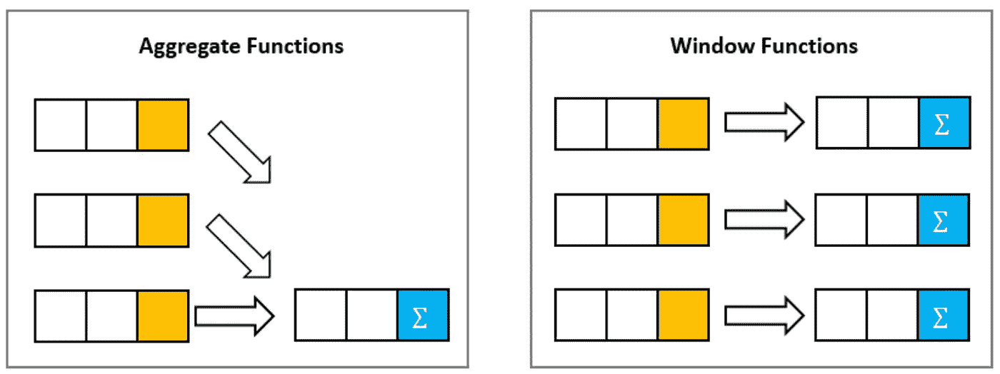

您可以通过调用 **repartition(col，numofpartitions)或 repartition(col)** 来实现这一点，然后再调用您的窗口聚合函数，该函数将由 **(col)** 进行分区。重新分区基本上是**平均分配**您的数据，而不管您正在重新分区的列中的**倾斜。**

> 还要避免使用只有一个唯一值的 parititonBy 列**，因为这等同于将其全部加载到一个分区**。

在真实世界的大数据场景中，****窗口功能的真正威力在于使用其所有不同功能*** *的组合来解决复杂问题。**

*首先，我将**概述一些见解**，然后我将**提供真实世界的例子**来展示我们如何**使用不同窗口函数的组合**来解决复杂的问题。*

# *见解和技巧:*

*   *带有 **sum 函数**的窗口允许您获得整个窗口的**和，或者如果指定了 orderBy 子句，则获得窗口的**增量/累积和。**如果您对 orderBy 列执行累积求和，而 order by 列在像 **[a，b，c，d，e]** 这样的窗口组中具有所有唯一值，那么**您不需要指定 rowsBetween 子句**来确保它正常工作，但是，如果您按 **[a，a，a，b，b]** 进行排序，并且您需要增量/累积求和，那么您需要指定【T20**增量总和可以成为**计算特定值增长率的有力工具**。也可以与其他窗口函数结合**使用，例如**填充动态分区**，如**例 2 所示。**我们还可以对窗框的**逐步**移动应用其他功能。***
*   *如果有一列的窗口组的值为 **[0，0，0，0，5，0，0]** (基本上，**除了一个值**之外都是零)，并且出于某种原因，您希望窗口组具有 **[5，5，5，5，5，5，5，5，5]** ，您可以使用 *sum(columntosum)。结束(窗口()。partition by(grouping col/id))*。这相当于将计算列分组 5 的总数，并且由于没有 orderBy 子句，它将基本上**广播到整个窗口**。类似地，如果您的列有类似[null，null，null，5，null]的组，您可以使用**sum 和 mean，**将值传播到[ 5，5，5，5，5]。*
*   *当处理窗口分区中的**空值时，可以使用带有 **asc_nulls_first()** 或 **desc_nulls_first()** 的 orderBy 子句，这样空值可以占据顶部的所有行。当**试图使用窗口函数将值归入空值**时，它可以派上用场。***
*   *有一些窗口聚集函数，如 **max 或 last** 要求窗口框架无界，否则它们将无法正常工作。因此，如果你写了一个有 orderBy 但没有:**rows between(window . unboundedpressing，Window.unboundedFollowing)，**的窗口，那么你的 max/last 函数**将不会给出它想要的输出。** *参考我回答的 StackOverflow 问题***:**[https://stack overflow . com/questions/60327952/py spark-partition by-leaves-the-same-value-in-column-by-which-partitioned-multip/60344140 # 60344140](https://stackoverflow.com/questions/60327952/pyspark-partitionby-leaves-the-same-value-in-column-by-which-partitioned-multip/60344140#60344140)。*

> *另一种让 max 正常工作的方法是**只使用 partitionBy** 子句**而不使用 orderBy 子句**。最大值函数**不需要顺序**，因为它正在计算整个窗口的最大值，并且窗口将是无界的。*

*   *就像我们在增量步骤中使用 sum 一样，如果我们希望从窗口中收集的列表按照 orderBy 子句 *中指定的顺序进行收集，我们也可以以类似的方式使用 collect _ list**(order by 子句可以接受订单的多列)。*** **参考例 1** 。 **Spark2.4** 确实提供了新的**数组函数和高阶函数**，允许我们以**可伸缩的方式**对数组进行排序，但是**从窗口中以正确的顺序收集它们可能会更好。***
*   *我们也可以使用 **when & otherwise 子句在窗口**上使用 sum 和 collect_list 等聚集函数，以便**隔离窗口**的某些行，如果它们不满足子句中的条件。一个用例可以是当 ***是 Null()或 isNotNull()时使用，以对窗口分区上的列表求和/收集。****
*   *另一种处理窗口分区中的空值的方法是使用函数 **first 和 last，**，它们有一个名为 **IgnoreNulls** 的**参数**，该参数接受一个**布尔值**(默认设置为 False) **。**基本上你可以在你的窗口中计算出**第一个非空值或者最后一个非空值。***
*   *如果您有一个需求或一个大难题中的一小部分，基本上需要您**用 max row_number(来自有序窗口)**填充一个窗口分区，您可以在不同的窗口上联合使用 row_number()和 max()。它看起来会像这样:*

```
*df.withColumn("xyz", F.max(F.row_number().over(w)).over(w2))*
```

***麦克斯会要求窗户无界。**这可能看起来相当模糊和无意义，这就是为什么我将详细解释这如何帮助我**计算中位数(因为中位数你需要 n 行的总数)**。这也将有助于保持**解决方案的动态性**，因为我可以使用**整个列**作为**列** **，其中包含跨每个窗口分区广播的总行数。**更多细节和视觉帮助参见**示例 3** 。*

*   *使用不同窗口功能的**组合的一个**用例**是当**需要在分区窗口**内创建新分区时。如果由 partitionBy 列**提供的分区窗口不足以获得期望的输出**，这可能是真的。一旦计算出较大组分区内的那些新组，该**新列**可以被添加到新窗口**函数的 **partitionBy 子句中，该函数将更加**动态**，因为它进入分组**更深**。这在我对**例 2** 的解释中会更有意义。***
*   *这是**并不专门针对涉及窗口函数**的问题，但有时当创建具有不同窗口函数的新列并试图计算您想要的输出时，您可能会遇到这样的情况:基本上给出 2 个结果的 **when/otherwise 子句**(您可以在 when 子句中使用&、| etc 运算符，但它仍然会导致 1 个结果)**不足以获得您想要的输出。在这些情况下，你可以**像 ***when(…)一样链接你的 when/otherwise 子句***。当(…)。).当(…)。否则(…)。*****
*   *如果有效使用，Spark 窗口功能非常强大，但是有一个限制，即窗口框架本质上不是动态的。意味着 **rangBetween 子句只能接受不会随着每个不同的窗口框架而改变的长整型(bigInt)值。最初，我期望窗口框架 rangeBetween 接受一列作为前面的参数，然而这是不可能的，它给出了一个错误，即**只接受一个文字值。**因此，**如果你想开发一个动态窗口**，你将让**使用特定于每个用例的逻辑来计算它。**我第一次面对这个问题时，我的任务是**根据日期**计算一列的 year today 总和，这基本上意味着随着窗口经过**的每个日期，窗口框架都必须改变并计算新的日期范围，以获得 year today**。如果我可以计算一个从年初开始的天数为**的列**，然后**将该列放入子句**的范围内，这就很容易了，但是这是不可能的**。**绕过这个路障的一个方法，**是从日期、**年、月、日**创建新的列，然后创建一个窗口函数，用 *partitionBy 作为年，orderBy month and day 和 rows between(window . unbounded preding，Window.currentRow)* 。您也可以应用类似的逻辑让 MonthToDate 也能这样做。我将在例 6 中深入探讨这是如何工作的。*****

*****使用这种逻辑也是高度优化的，如 Spark 更新中所述:**[https://issues.apache.org/jira/browse/SPARK-8638](https://issues.apache.org/jira/browse/SPARK-8638)***

> ***"1.在运行情况下**(例如，在未绑定的前一行和当前行之间)性能更好(10 倍)。”*****

*****这里需要注意的一件事**是，这种使用**unbounded preding、**和 **currentRow** 的方法只会让我们得到**正确的 YTD** ，如果**对于我们试图对**求和的每个日期只有一个条目的话。如果**每个日期**有多个条目，那么**将不会工作**，因为**行框架会将同一日期的每个条目视为不同的条目**，因为它会逐渐向上移动。这种情况也使用窗口功能的**组合进行处理，并在示例 6** 中进行解释。***

# ***示例 1:***

***假设您有一个**数据帧:*****

***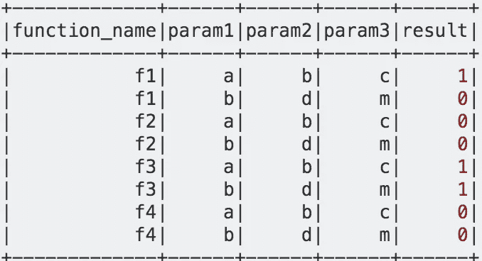***

***而**输出**所需的是:***

***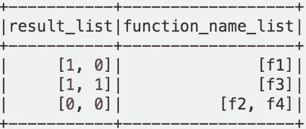***

***这看起来很简单，你可以首先通过函数名来分组和收集列表，然后通过收集列表来分组，并收集函数名的列表。这里唯一的问题是，**结果列表**必须按照特定的**顺序收集。**如上文所述，我们现在可以使用数组函数对 **spark2.4** 、**中的数组进行排序，但**上面显示的数据只是一个样本，而**结果列表可以跨越数十或数百个条目。**因此，高度可伸缩的解决方案将使用**窗口函数来收集由 orderBy 指定的列表。**窗口将**递增** collect_list **s** o 我们只需要获取/过滤包含整个列表的**组的最后一个元素。**实现这一点的一种方法是在窗口上计算 **row_number()** ，并仅过滤该行号的 **max()** 。一旦我们有了**完整列表**和**所需的适当顺序**，我们就可以最终*根据收集列表和 function_name 收集列表进行分组。****

******代号*** *:****

***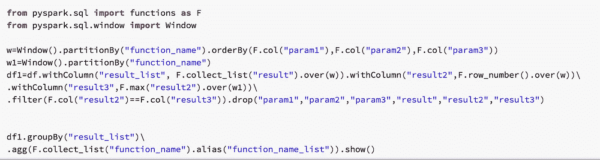***

***该问题要求按照 w. 的 **orderBy 子句所示的 **param1、param2、param3** 中指定的**字母**的顺序收集列表。第二个窗口( **w1** )只有一个 partitionBy 子句，因此没有 orderBy** 的**才能使 max 函数正常工作。在**过滤器中使用了 **max 和 row_number** 来强制代码只取完整的数组。**group by 向我们展示了我们也可以**通过 ArrayType 列进行分组。*******

*使用窗口上的**最后一个函数也可以实现**最大行数逻辑**。然而，最后一个函数的**窗口需要是无界的**，然后我们可以**过滤最后一个函数的值。这方面的代码应该是这样的:*****

*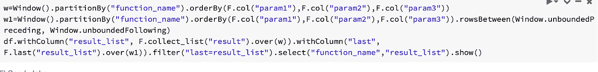*

*基本上，我在这里试图阐明的观点是，我们可以使用 windows 的**增量操作，使用 orderBy 和 collect_list、sum 或 mean** 来解决许多问题。使用增量窗口(w)的集合将在下面**看起来像这样，因此，**我们必须获取组中的最后一行(使用 max 或 last)。*****

*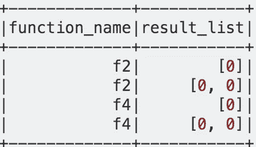*

**链接到我在 StackOverflow 上回答的问题:*[https://stack overflow . com/questions/60155347/Apache-spark-group-by-df-collect-values-into-list-then-group-by-list/60155901 # 60155901](https://stackoverflow.com/questions/60155347/apache-spark-group-by-df-collect-values-into-list-and-then-group-by-list/60155901#60155901)*

# *示例 2:*

*假设您有一个**数据框架**，其中有一个**项目存储组**，如下所示:*

*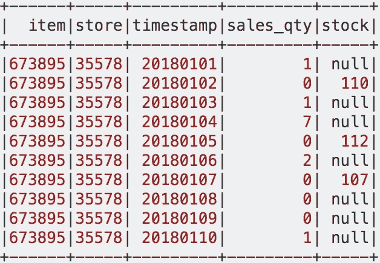*

*要求是**根据**最后一个非空值**估算库存**的空值，然后**使用 sales_qty 从库存值**中减去。这里的**捕捉**是指**每个非空股票值**正在创建另一个**组或项目-商店组合的组**内的分区。*

*这里的**方法**应该是以某种方式创建**另一列以添加到 partitionBy 子句(item，store)** 中，以便**窗口框架、**可以 ***更深入到我们的股票列*** *。**

**本质上，通过向我们的 partitionBy* *添加另一列* ***，我们将使我们的窗口* ***更加动态，更适合这个特定的用例。******

****所需输出:****

*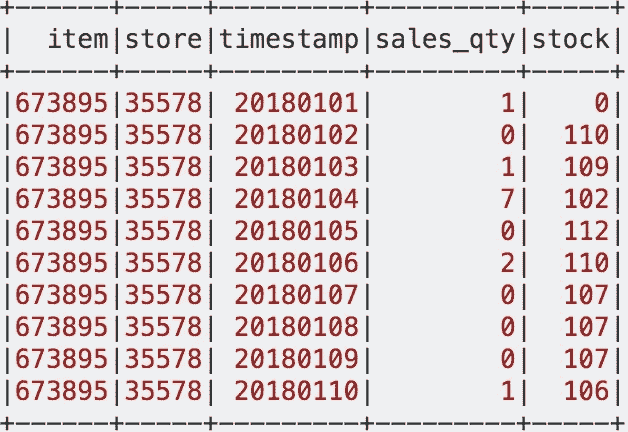*

***完整的代码如下所示。**我将提供**解决方案的逐步解释**，向您展示使用窗口功能组合的**威力。***

*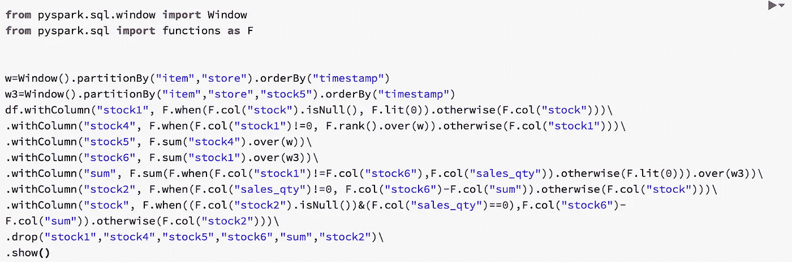*

*读到这里，有人可能会想，为什么不能用 ignorenulls=True 的 **First 函数呢？**答案是我们在同一个分组/窗口中有**多个非空值，而**第一个**函数只能给我们整个窗口的**第一个非空值。**也就是说，第一个带有忽略空值选项的函数是一个非常强大的函数，可以用来解决许多复杂的问题，**只是不是这个。*****

*这个**输出显示了我用来获得期望结果**的所有列。如果你**能看到正在发生的事情**，解释起来会更容易:*

*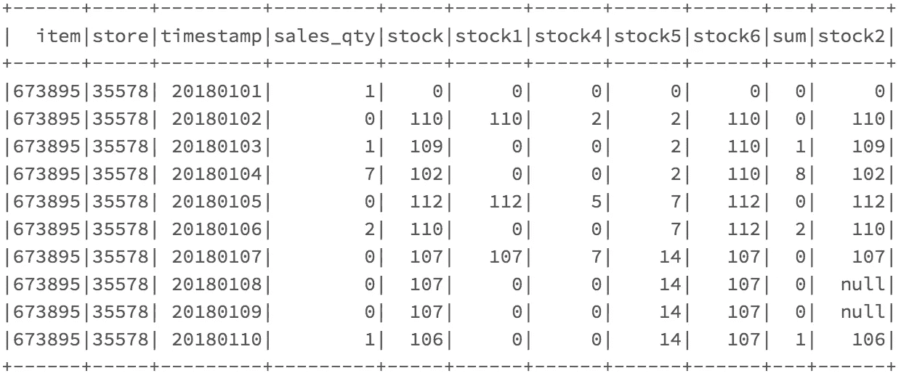*

```
*df.withColumn("stock1", F.when(F.col("stock").isNull(), F.lit(0)).otherwise(F.col("stock")))\*
```

***股票 1 列**基本上是用 0 替换空值，这在以后做增量求和来为深入股票列的窗口创建新行时会很方便。*

```
***w=Window().partitionBy("item","store").orderBy("timestamp")**
.withColumn("stock4", F.when(F.col("stock1")!=0, F.rank().over(**w**)).otherwise(F.col("stock1")))\*
```

***Stock 4 列**在 when/otherwise 语句中使用窗口上的 rank 函数，以便我们仅在原始股票值存在时填充等级(**忽略 stock1 中的 0**)。*

```
***w=Window().partitionBy("item","store").orderBy("timestamp")
w3=Window().partitionBy("item","store","stock5").orderBy("timestamp")**
.withColumn("stock5", F.sum("stock4").over(w))\
.withColumn("stock6", F.sum("stock1").over(w3))\*
```

***Stock5 和 stock6** 列对于这个例子的整个逻辑非常重要。 **Stock5 基本上累加**到 **stock4** ， **stock4 除了股票值**之外都是 0，因此那些**值在它们的特定分组**中广播。Stock5 列将允许我们**创建一个名为 w3** 的新窗口，并且 **stock5 将进入已经有**项的 partitionBy 列**并存储**。*

***Stock6 将使用新窗口(w3)** 进行计算，该窗口将对我们的初始 **stock1** 求和，这将在 stock5 列定义的各自的**分区中传播非空的**股票值**。***

```
***w3=Window().partitionBy("item","store","stock5").orderBy("timestamp")**
.withColumn(“sum”, F.sum(F.when(F.col(“stock1”)!=F.col(“stock6”),F.col(“sales_qty”)).otherwise(F.lit(0))).over(w3))\*
```

***sum** 列也非常重要，因为它允许我们根据我们计算的新窗口(w3) 将 **sales_qty(这是问题的第二部分)**的增量变化包含在我们的**中间数据框架**、**中。***

```
*.withColumn("stock2", F.when(F.col("sales_qty")!=0, F.col("stock6")-F.col("sum")).otherwise(F.col("stock")))\
.withColumn("stock", F.when((F.col("stock2").isNull())&(F.col("sales_qty")==0),F.col("stock6")-F.col("sum")).otherwise(F.col("stock2")))*
```

*在上面显示的代码中，我们最终使用所有新生成的列来获得我们想要的输出。 **Stock2** 列计算足以处理几乎所有我们想要的输出，唯一留下的漏洞是那些后面跟有 0 sales_qty 增量的**行。**为了处理这些部分，我们使用如上所示的另一个 case 语句，以获得我们的最终输出作为**股票**。*

> *将不同的窗口函数相互结合使用(生成新的列)可以让我们解决您的复杂问题，这个问题基本上需要我们在 stock-store 的窗口中创建一个**新的分区列。***

***我回答的这个 StackOverflow 问题的链接**:*

*[https://stack overflow . com/questions/60673457/py spark-replacing-null-values-with-some-calculation-related-to-last-not-null-val/60688094 # 60688094](https://stackoverflow.com/questions/60673457/pyspark-replacing-null-values-with-some-calculation-related-to-last-not-null-val/60688094#60688094)*

# *示例 3:*

*对于这个例子，我们必须**将中间值**估算到组上的**零值。Spark 没有内置的聚合函数来计算组/窗口的中值。Spark 有 **approxQuantile()** 但是它不是一个聚合函数，因此你不能在一个窗口上使用**。**因此，我们必须使用窗口函数来计算我们自己的**自定义中值输入函数。*****

*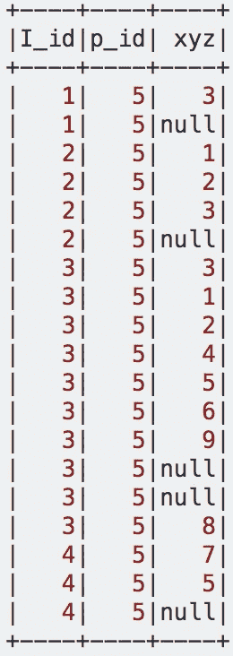*

*计算中位数的公式如下:*

> *“{(n+1)÷2 }个值，其中 n 是一组数据中值的个数。为了**计算**的**中值**，必须首先对数据进行排序(按升序排序)。**中位数**是中间的数字。**中位数** = **一组有序数据的中间值**。*
> 
> *来自[https://www 150 . stat can . GC . ca/n1/edu/power-pouvoir/ch11/median-mediane/5214872-eng . htm](https://www150.statcan.gc.ca/n1/edu/power-pouvoir/ch11/median-mediane/5214872-eng.htm)。*

*窗口将被 I_id 和 p _ id 分割成**,我们需要窗口的顺序为**升序**。我们还需要**计算一组数据中值**的总数，我们还需要确定值的总数是奇数还是偶数，因为如果有奇数个值**的**，中值就是**的中心值**，但是如果有偶数个值**的**，我们必须将**的两个中间项相加，然后除以 2。**我们还必须确保如果**有 1 个以上的空值**，它们都用中值估算，并且**空值不应该干扰我们的非空 row_number()计算。*****

***奇数总计**例:1，3，3， **6** ，7，8，9*

***中值:6***

***偶数总计**例:1，2，3， **4，5** ，6，8，9*

***中位数:4.5***

**所有这些都需要针对每个窗口分区进行计算，因此我们将使用窗口函数的组合。**

***整个代码:***

*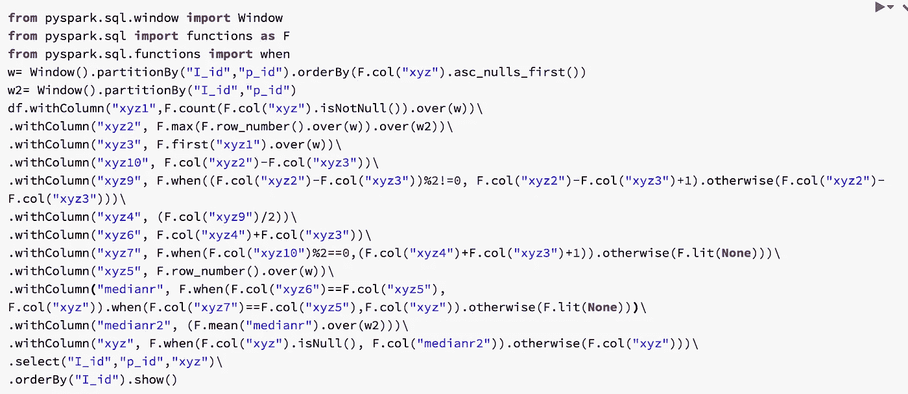*

> *这可能看起来过于复杂，一些阅读本文的人可能会觉得有更好的解决方案。所以对于那些人来说，如果他们能提供一个更优雅或不太复杂的解决方案(满足所有边缘情况)，我很乐意**审阅它并将其添加到本文中。***

*之前，**我解包了上面**的代码，我想**给你看我用来得到想要的结果的所有列**:*

*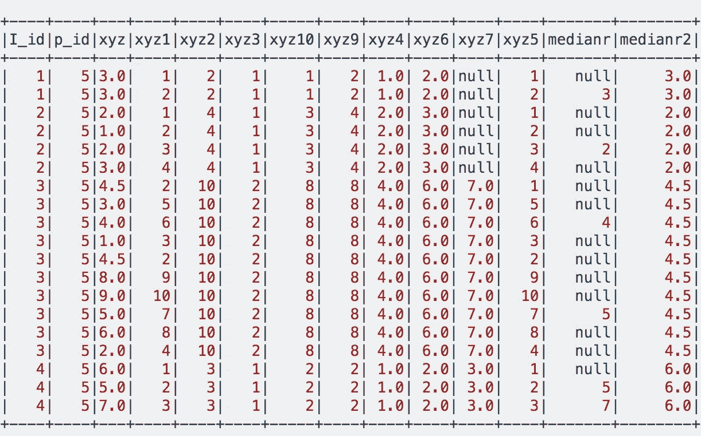*

*这里的一些列本可以被**缩减并与其他的**合并，但是为了能够完整地显示**逻辑**和**显示** **我是如何导航逻辑的，**我选择保留它们，如上图所示。*

```
***Imports used:
from pyspark.sql import functions as F
from pyspark.sql.window import Window
from pyspark.sql.functions import when****Windows used:**w=   **Window().partitionBy("I_id","p_id").orderBy(F.col("xyz").asc_nulls_first())**
w2=
 **Window().partitionBy("I_id","p_id")***
```

*现在我将解释为什么以及如何得到列 **xyz1、xy2、xyz3、xyz10** :*

```
*df.withColumn("**xyz1**",F.count(F.col("xyz").isNotNull()).over(w))\
.withColumn("**xyz2**", F.max(F.row_number().over(w)).over(w2))\
.withColumn("**xyz3**", F.first("xyz1").over(w))\
.withColumn("**xyz10**", F.col("xyz2")-F.col("xyz3"))\*
```

***Xyz1** 基本上是对一个窗口内的 **xyz** 值进行计数，在这个窗口内，我们首先按空值排序。可以使用 **isNotNull 或 isNull** 进行计数，两者都将在窗口的第一行向我们提供窗口中 Null 的总数**(经过大量测试后，我得出结论，两者都适用于这种情况，但如果使用没有 Null 条件的计数，它将不起作用)。***

***Xyz3** 从每个窗口分区获取第一个值 **xyz** 1，为我们提供在每个分区上广播的空值的**总数。***

***Xyz2** 结合使用 **max 和 row_number()** 为我们提供了跨分区窗口广播的每个分区的总行数，但是两者都用于不同的分区，因为为了使 **max 正确工作，它应该是无界的**(如本文的见解部分所述)。*

***Xyz10** 通过从条目总数中减去空条目总数**给出每个窗口分区的非空条目总数。***

*现在我将解释列 **xyz9、xyz4、xyz6、xyz7。***

```
*.withColumn(“**xyz9**”, F.when((F.col(“xyz2”)-F.col(“xyz3”))%2!=0, F.col(“xyz2”)-F.col(“xyz3”)+1).otherwise(F.col(“xyz2”)-F.col(“xyz3”)))\
.withColumn(“**xyz4**”, (F.col(“xyz9”)/2))\
.withColumn(“**xyz6**”, F.col(“xyz4”)+F.col(“xyz3”))\
.withColumn(“**xyz7**”, F.when(F.col(“xyz10”)%2==0,(F.col(“xyz4”)+F.col(“xyz3”)+1)).otherwise(F.lit(None)))\*
```

***Xyz9** 基本使用 **Xyz10(即 xyz2 列 xyz3 列)**，查看数字是否为奇数(**使用模 2！=0** )然后给它加 1，使它偶数，如果是偶数就保持原样。这个以后会派上用场的。*

***Xyz4** 除以 **Xyz9** 的结果，结果是**偶数，给我们一个四舍五入的值**。*

***Xyz6** 计算 **xyz4 和 xyz3** 的和。*

*基本上, **xyz9 和 xyz6** 满足这样的情况:我们将有一个总数为奇数的**条目，因此我们可以将**加 1，除以 2，其答案将是我们的中位数**。对于**偶数情况**来说是不同的，因为中值必须通过将**中间的 2 个值相加，然后除以 2 来计算。*****

***Xyz7** 将用于满足**窗口分区**条目总数为偶数的要求。如果 Xyz10(col xyz2-col xyz3)数是偶数，使用(**模 2=0** )，对 xyz4 和 xyz3 求和，**否则在该位置放置一个空值**。Xyz7 将用于**与窗口分区**的 row_number()进行比较，然后如果我们的条目总数**是偶数，则为我们提供**额外的中间项**。***

*最后，我将解释最后 3 列，即 **xyz5、medianr 和 medianr2** ，它们**驱动我们的逻辑。***

```
*.withColumn("**xyz5**", F.row_number().over(w))\
.withColumn("**medianr**", F.when(F.col("xyz6")==F.col("xyz5"), F.col("xyz")).when(F.col("xyz7")==F.col("xyz5"),F.col("xyz")).otherwise(F.lit(None)))\
.withColumn("**medianr2**", (F.mean("medianr").over(w2)))\
.withColumn("xyz", F.when(F.col("xyz").isNull(), F.col("medianr2")).otherwise(F.col("xyz")))\
.orderBy("I_id").show()*
```

***Xyz5** 就是先出现空值的窗口分区上的 **row_number()** 。*

***Medianr** 将检查 **xyz6(中间项的行号)**是否等于 **xyz5(分区的 row _ number())**，如果等于，它将用该行的 xyz 值**填充 Medianr**。它还将检查以查看 **xyz7(在偶数条目的情况下第二个中间项的行号)**是否等于 **xyz5(分区的 row _ number())**，如果是，它将用该行的 xyz 填充 medianrr。如果这些条件都不满足，medianr 将得到一个空值。*

> *在计算 medianr 时，我们必须**链接 2 个 when 子句**(这就是为什么我必须**从函数**导入‘when ’,因为**链接 F.when 将不起作用**),因为有 **3 个结果。***

***Medianr2 可能是这个例子中最美的部分。**它为每个分区计算无界窗口上 **medianr** 的平均值。它很好地处理了具有 **1 个中间项和 2 个中间项的两种情况**，就好像只有**一个中间项，那么这将是在分区窗口**上广播的平均值，因为**空值不计数**。此外，如果有 **2 个中间项(对于偶数)**，则平均值将是这 2 个项的和**然后除以 2** ，然后该结果将被**在分区窗口上广播**。*

*这个任务的最后一部分是用 medianr2 值替换任何有 **null 的地方，如果那里没有**null，那么保持原来的 xyz 值**。我们能够做到这一点，因为我们的**逻辑(具有空值的窗口的平均值)发送整个分区**的中值，所以我们可以对每个窗口中的每一行使用 **case 语句。*****

*所解释的代码处理所有的边缘情况，例如:没有空值的**、**只有 1 个值和 1 个空值的**、**只有 2 个值和 1 个空值，以及每个分区/组有同样多的空值**、**。*****

*要获得我们的**输出**:*

*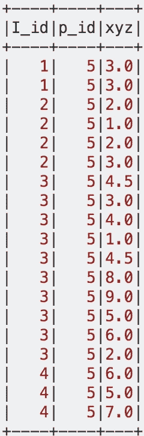*

*链接到我回答的 StackOverflow 问题:
[https://stack overflow . com/questions/60408515/replace-na-with-median-in-py spark-using-window-function/60409460 # 60409460](https://stackoverflow.com/questions/60408515/replace-na-with-median-in-pyspark-using-window-function/60409460#60409460)*

***注意:**另一种不用窗口函数实现的方法是创建一个组 udf(计算每个组的中值)，然后使用 groupBy 和这个 UDF 创建一个新的 df。将此 df 连接回原始 df，然后使用 when/otherwise 子句估算它们各自的中间值。这种方法是可行的，但在 99%的大数据用例中，上面使用的窗口函数会优于 UDF、Join 和 GroupBy。*

> ****Spark3.0*** *发布了***percentile _ approximate***等 sql 函数，可以在 windows* *上使用* ***。链接:*https://issues.apache.org/jira/browse/SPARK-***

# *示例 4:*

*假设您有一个如下图所示的数据帧，并且您的任务是**计算 stn_fr_cd 和 stn_to_cd 两个列对于**每个 id** 具有相同的对角值**的次数，并且对于**每个 val_no.** 将发生**对角比较***

*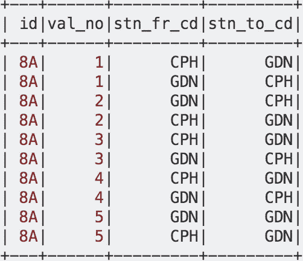*

*正如你所看到的，val_no = 5 的行没有两条匹配的对角线( **GDN=GDN** 但是 **CPH 不等于 GDN** )*

***期望输出**如下所示:*

*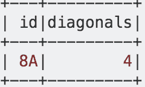*

*这里的方法应该是使用一个带有窗口的**引导函数**，在该窗口中，partitionBy 将是 **id 和 val_no 列。**我们将在**stn _ fr _ CD 和 stn_to_cd** 列上使用 lead 函数，这样我们就可以将每列的下一项放入**的同一首行，这将使我们能够运行 case(when/other)语句来比较对角线值**。*

*如果对角线的两个**条件都满足，我们将创建一个**新列并输入 1，如果它们不满足我们的条件，我们将输入 0** 。这里需要注意的一点是，第二行**将总是输入空值，**因为在任何分区中都没有第三行(**作为主要函数计算下一行**)，因此第二行的 case 语句将**总是输入 0，**对我们有效。***

*一旦我们运行了它，我们就可以对我们为其编写 when/otherwise 子句的列进行 groupBy 和 sum。看看下面的**代码和用于计算我们期望的输出**的列，以便更好地理解我刚才解释的内容。*

*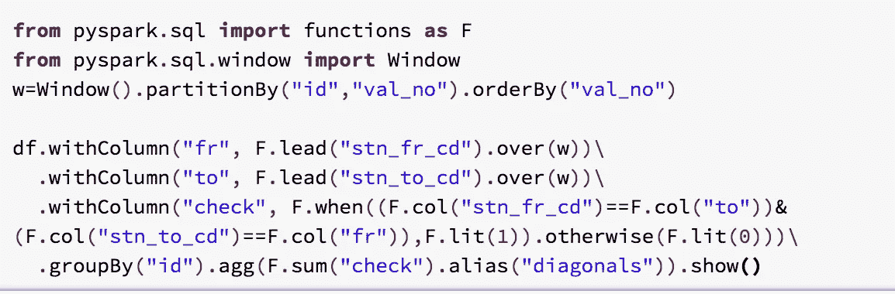*

*下面的这个**输出是在 groupBy:** 之前的获取的*

***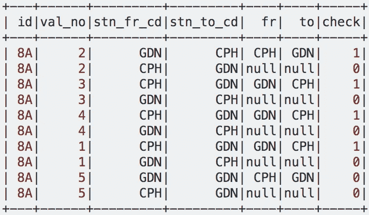***

***我们可以看到，**的**第二行**的每个 id 和 val_no 分区**将**始终为空**，因此，该分区的**校验列行将始终为 0** 。在 when/otherwise 子句中，我们正在**检查 stn_fr_cd 列是否等于‘to’**列，以及 **stn_to_cd 列是否等于‘for’**列。***

***我在这个例子中回答的 **StackOverflow 问题:*****

***[https://stack overflow . com/questions/60535174/py spark-compare-two-columns-diagnolly/60535681 # 60535681](https://stackoverflow.com/questions/60535174/pyspark-compare-two-columns-diagnolly/60535681#60535681)***

# ***示例 5:***

***假设您有一个**数据帧，包含 2 列秒、小时和总计。** Total 列是在那个特定的第二个时刻某个网站的访客总数；***

***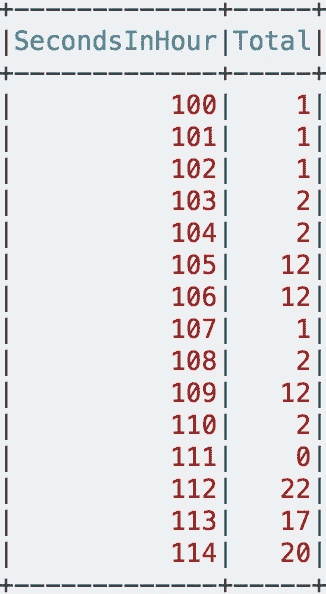***

***我们必须计算每秒钟进入和离开网站的人数。 因此，我们必须在列中计算一个**，在**列中计算一个**来显示**进入**网站，然后**退出。*******

******

*****所需输出:*****

***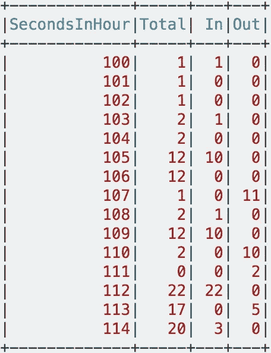***

***对于这个用例，我们必须在窗口上使用 **lag 函数(在这种情况下，窗口不会被**分区，因为没有小时列**，但是在真实数据中会有，我们**应该总是分区一个窗口以避免性能问题**)。该解决方案的要点是对输入和输出使用**相同的滞后函数，但要修改这些列，使其提供正确的输入和输出计算。*******

***下面，我提供了实现所需输出的**完整代码**:***

***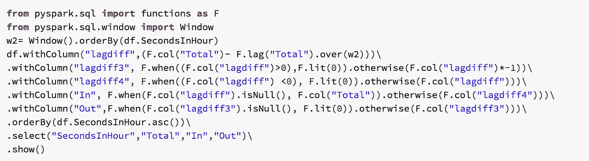***

***下面的**我提供了不同的列**，我用它们来得到**的进出。*****

***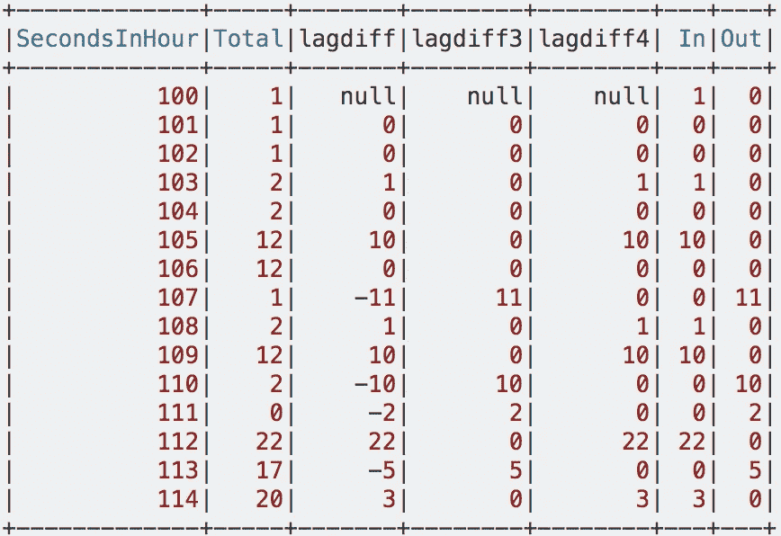***

***正如您在上面的代码和输出中看到的，我们使用的唯一的 lag 函数用于计算**列 lagdiff** ，并且从这个**列我们将计算我们的 in 和 Out 列**。 **Lagdiff** 通过**从每个总值中减去滞后来计算。**因此，lagdiff 中的**列和**列都有值。***

*****Lagdiff3** 是使用 when/otherwise 子句计算的，其逻辑是，如果 **lagdiff 为负，我们将把负值转换为正的**(通过乘以 1)，如果是正的**，那么我们将用 0** 替换该值，这样我们基本上过滤掉了值中的所有**，给出了我们的 **Out** 列。*****

*****Lagdiff4** 也是使用 when/otherwise 子句计算的。这里的逻辑是，如果 **lagdiff 是负的，我们将使用 0** 替换它，如果它是正的，我们将让它保持原样。这样我们就过滤掉了所有的**和**值，在列中给出了我们的**。*****

***代码中计算 **In/Out** 的下两行只是处理**在 **lagdiff3 & lagdiff4** 的开始**中的空值，因为在列上使用 **lag 函数**将**总是为第一行产生一个空值。*****

# ***示例 6:***

******

***在这个例子中，我将向您展示如何有效地**计算一个 YearToDate (YTD)总和作为一个新列**。正如我在**洞见部分**中所说，PySpark 窗口**中的窗口框架不能完全动态**。这意味着 rangeBetween 或 rowsBetween 子句只能接受 Window.unboundedPreceding，Window.unboundedFollowing，Window.currentRow 或 literal long 值，**而不是整列值**。***

***我们可以计算像过去 4 周总销售额或过去 52 周总销售额这样的结果，因为我们可以通过一个**时间戳(转换为 long)** 进行排序，然后使用 rangeBetween 遍历回一个**设置的天数** ( *使用秒到天的转换*)。年初至今变得棘手，因为**的天数对于每个日期**都是变化的，而 rangeBetween **只能取文字/静态值。**因此，我们必须用给定的窗口工具获得 **YTD** 。***

***计算 YTD 有两种可能的方法，这取决于您的使用情形，您更喜欢使用哪一种方法:***

***计算 YTD 的**第一种方法**使用*rows between(window . unbounded preding，Window.currentRow)* (我们也放 0 代替 Window.currentRow)。只有当**每个日期只有一个条目需要求和时，这个方法才有效，因为即使在同一个分区中，它也会将**每一行视为新事件(rowsBetween 子句)**。这种方法基本上使用增量求和逻辑来累计我们的 YTD 值。*****

***第二种**方法**更复杂，但**更动态**。这两种情况都适用于**:**每个日期 1 个条目，**或**每个日期超过 1 个条目**。因此，它几乎总是理想的解决方案。*****

*****第一种方法是最佳选择的唯一情况是，如果你 **100%肯定每个日期只有一个条目**，并且你想**最小化你在火花簇**上的足迹。由于仅使用一个带有子句间行的窗口比第二种方法**更有效，第二种方法更复杂**并涉及使用更多窗口功能的**。*******

*****我将并排计算这两种方法，向您展示它们的不同之处，以及为什么方法 2 是最佳选择。*****

*****假设我们有一个**数据框架，**，我们必须**计算每个 product_id** 的 YTD 销售额:*****

*****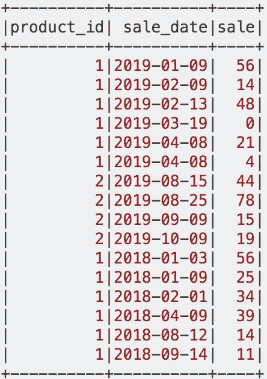*****

*****在我**解包所有这些逻辑(一步一步)**之前，我想展示一下**输出**和用于获取它的**完整代码**:*****

*****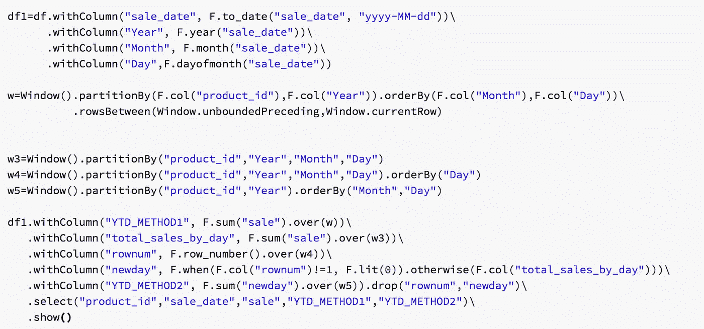**********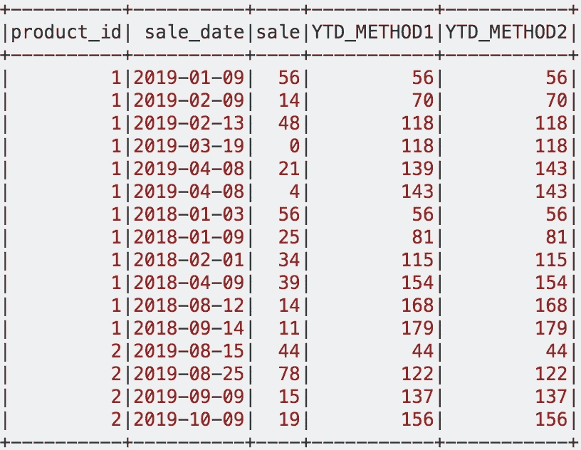*****

*****乍一看，如果你看一下**第 5 排和第 6 排**，它们有相同的**日期**和相同的**产品 id** 。这是**方法 1** 不正常工作的唯一地方，因为它仍然从 **139 增加到 143，**另一方面**，方法 2** 基本上包含了当天的**的全部总和，如 143。*******

> *****这似乎是一个可以忽略的问题，但是在企业环境中，查询该数据的 BI 分析师、数据科学家、销售团队成员会希望 YTD 完全包含他们正在查看的日期行中**天的**。*********

***代码的**顶部，从 df** 计算 **df1，基本上确保**日期列的日期类型为**，**将年、月、日提取到自己的**列中。在计算这两种方法时，我们使用所有这些列来得到我们的 **YTD。基本上，我们在 partitionBy 和 orderBy 子句上变得越来越狡猾。*******

*****方法 1** 非常简单:***

```
*****w**=Window().partitionBy(F.col("**product_id**"),F.col("**Year**"))\
.orderBy(F.col("**Month**"),F.col("**Day**"))\
.rowsBetween(W**indow.unboundedPreceding,Window.currentRow**)df1.withColumn("**YTD_METHOD1**", F.sum("**sale**").over(**w**))***
```

***我们使用一个由 **product_id 和年份**划分的窗口，并按**月和**日排序。排序允许以正确的顺序维护**增量行变化**，并且**分区与年份**确保我们将它**保持在年份分区**内。窗口在前面的中是**无界的，这样我们就可以**总结我们的销售**直到**当前行日期**。*****

*****方法 2** 稍微复杂一点:***

*****使用的窗口:*****

```
*****w3**=Window().partitionBy(**"product_id","Year","Month","Day"**)
**w4**=Window().partitionBy(**"product_id","Year","Month","Day"**)\
           .orderBy(**"Day"**)
**w5**=Window().partitionBy(**"product_id","Year"**).orderBy(**"Month","Day"**)***
```

*****组合使用的窗口功能:*****

```
***df1.withColumn(**“total_sales_by_day”**, **F.sum(“sale”).over(w3)**)\
 .withColumn(**“rownum”**, **F.row_number().over(w4)**)\
 .withColumn(**“newday”**, F.**when**(F.col(**“rownum”**)!=1, F.lit(**0**)).**otherwise**(F.col(**“total_sales_by_day”**)))\
 .withColumn(**“YTD_METHOD2”**, **F.sum(“newday”).over(w5)**)***
```

***为了更好地解释这个逻辑，我想用**展示我用来计算**方法 2** 的列**。***

***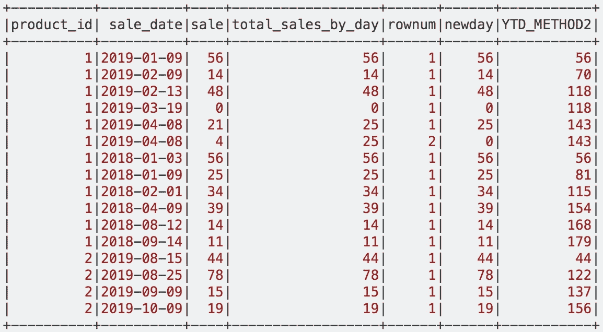***

*****total_sales_by_day** 列计算每天的**总数，并将其发送到当天的每个条目**。 **Rownum** 列为我们提供了每个年-月-日分区的**行号，按行号排序。*****

*****Newday** 列使用这两个列( **total_sales_by_day 和 rownum** )来得到我们的**倒数第二列**。这里的逻辑是除了第一行编号之外的所有**都将被**替换为 0。**这样做的主要目的是，对于那些有**多个条目**的日期，它将当天的**总和保留在最上面，其余的为 0** 。*****

***这将允许我们使用 **F.sum("newday ")对我们的 newday 列求和。over(w5)**with Window as**w5 = Window()。partitionBy("产品标识"，"年份")。orderBy("月"，"日")。**这确保了即使相同的日期有多个条目，整个日期的**总和将出现在该日期**的所有行中，同时**保持总和**的 YTD 进度。***

# ***总结:***

***乍一看，窗口函数似乎是微不足道的普通聚合工具。然而，一旦您使用它们来解决复杂的问题，并看到它们对于大数据的可扩展性，您就会意识到它们实际上是多么强大。了解它们隐藏的工具、怪癖和优化的唯一方法是实际使用它们的组合来导航复杂的任务。***

*   ****感谢您的阅读！随时补充意见和建议！****
*   ****特别感谢****data bricks****为我的代码原型提供了一个免费的社区版集群，并感谢****stack overflow****社区让我提供自己的见解和答案来帮助他人。****

***我想用我最喜欢的一句话来结束这篇文章。***

> ***“不要只练习你的艺术，而是强行进入它的秘密；艺术理应如此，因为它和知识可以把人提升到神的境界。”**――路德维希·范·贝多芬*****