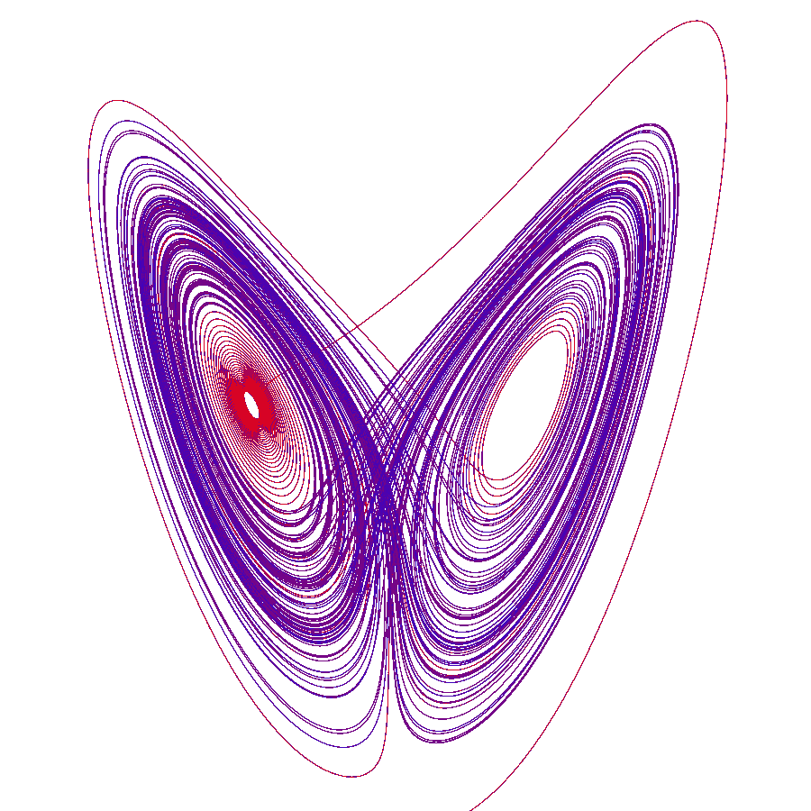
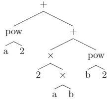
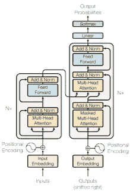
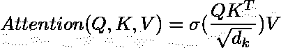
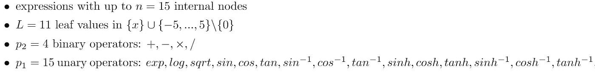
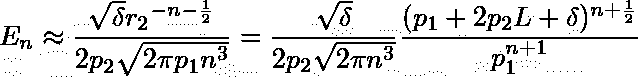
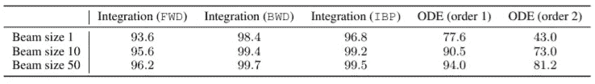
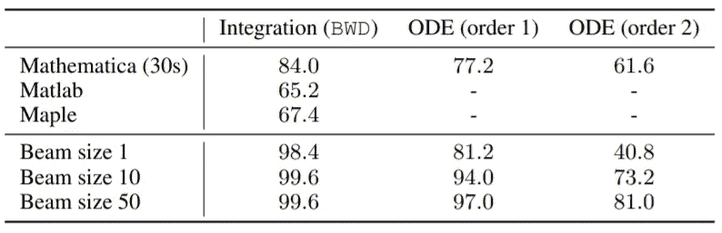

# 用变压器解微分方程:符号数学的深度学习

> 原文：<https://medium.com/analytics-vidhya/solving-differential-equations-with-transformers-21648d3a1695?source=collection_archive---------2----------------------->

来源:[https://upload . wikimedia . org/Wikipedia/commons/f/F4/Lorenz _ attractor . SVG](https://upload.wikimedia.org/wikipedia/commons/f/f4/Lorenz_attractor.svg)

在本文中，我将介绍一种新的神经网络方法来解决一阶和二阶常微分方程，这种方法在 Guillaume Lample 和 Franç ois Charton(脸书人工智能研究)的 ICLR 2020 聚焦论文“符号数学的深度学习”中介绍。本文使用 seq2seq 转换器处理积分和求解一阶和二阶常微分方程的符号计算任务，我们今天将重点讨论后者。

为了给本文提供背景，尽管神经网络方法在结构清晰的统计模式识别任务中取得了巨大成功，例如对象检测(计算机视觉)、语音识别、语义分析(自然语言处理)，但符号推理不是它的强项之一。

符号计算不仅需要人工智能推断复杂的数学规则，还需要对抽象数学符号之间的关系有灵活的上下文理解。在创作的时候，计算机代数系统(CAS)(如 Matlab、Mathematica)在符号数学任务上拥有最先进的性能，由复杂算法的后端驱动，如 100 页长的 Risch 无限积分算法。

然而，这些半算法远非完美:在特定情况下会失败，有时会无限期超时。在他们的论文中，Lample 和 Charton 开发了一种 seq2seq 方法，试图超越计算机代数系统。他们的贡献可归纳如下:

1.  **展示 seq2seq 变形金刚在 3 个符号数学任务中的潜力，并延伸到符号推理中**
2.  **在这些任务中实现最先进的性能(使用非平凡数据集&推理时间约束)**
3.  **介绍一种新的方法来生成任意大的表达式数据集&相应的解决方案，其中每个表达式都是从指定的问题空间中均匀采样的。**

在执行推理之前，在任务构造和定义以及数据集生成方面进行了大量的预处理。Lample 和 Charton 做了两个有见地的观察——第一，函数整合的具体情况可以通过模式识别显著简化；其次，形式数学可以使用自然语言前缀语法来描述(也在以前的研究中)。作者首先将数学表达式解析为树结构，随后将树表示为序列，然后研究其问题空间的大小，最后提出数据集生成的方法。尽管作者调查问题空间和数据生成的方法非常有趣，但出于本文的目的，我将集中讨论“表达式作为树”、“树作为序列”和“实验”部分。很快我会写一篇全论文的后续文章！

**像树一样的表情**

树数据结构本质上是分层的，可以反映数学表达式的重要特征。通过将运算符和函数视为树的内部节点；操作数作为节点；常量和变量作为叶子，作者实现了 3 件事:编码操作信息的顺序，描述操作符的结合性，通过消除对括号的需要来简化。为了说明这个方法，让我们解析表达式 *a* +2 *ab+b* :

按照文中的约定，该树与右侧相关联。为了保证表达式和树之间的一对一映射(特别是不同的表达式对应于不同的树，即使它们在评估中是相同的)，施加了约束(例如，每个父代至多 2 个子代，不能使用一元运算符)。

**作为序列的树**

作者选择使用 seq2seq 模型，而不是树到树网络，以避免运行时开销，并避免必须在不同的语法语法之间进行选择(例如，Penn Treebank，Head Driven 短语结构语法)。为了将树转换成序列，作者使用前缀符号将表达式建模为自然语言。例如，2(a+b)将变成[∫2 幂+ a b 2]。

**型号**

本文方法的一个显著特点是使用了一个非常简单的标准 seq2seq 转换模型。该模型由 2017⁴的 Vaswani 等人提出，有 8 个注意头，6 层，产生 512 维的输出。该模型利用了编码器-解码器结构，并添加了堆叠自关注和逐点全连接层。

基于“你只需要关注”的模式

正如在原始论文中所描述的，注意力 mechanisms⁵在两个方面改进了传统的序列模型:它更好地编码了语言数据中的长距离依赖性；避免了必须将句子输入编码成固定长度的特征向量，允许解码器选择性地注意相关的输入单词。这种转换模型通过用自我注意机制完全取代循环模型和卷积，扩展了原始的注意模型。通过多头注意力机制，这款 2017 型号通过并行性促进了加速。比例点积注意力，定义为:

其中 Q 是输入查询的矩阵，K 和 V 分别是输入键和值的矩阵。σ对由 *1* / *sqrt(d_k)* 缩放的查询和键的点积应用 softmax 函数，以获得关注的权重。通过使用点积运算，并且并行使用 8 个注意力头，变压器模型变得比其递归模型对应物在计算上更高效。这种优势在本文的微分方程求解实验中得到了证明，通过使用 Transformers，Lample 和 Charton 能够在 30 秒内计算出比 CAS 更高精度的解，优于 Mathematica，后者在 20%的测试案例中会无限超时。

**实验&评估**

用于求解一阶和二阶常微分方程的 seq2seq 模型在每个具有 40M 表达式的训练集上进行训练。如论文中所述，作者考虑满足以下条件的表达式:

问题空间的大小可以通过应用

其他实现细节包括使用学习率为 1e-04 的 Adam 优化器，移除超过 512 个标记的表达式，以及用 256 个表达式的批量大小进行训练。推理结果由波束搜索产生，对数似然损失最小。SymPy 用于比较推断结果是否等同于参考答案。

**评估&结果**

对 5000 个方程的测试集进行评估，结果如下:

光束尺寸会显著影响测试精度

作者着重进行了两个比较:与 Mathematica(计算时间限于 30s)、Matlab 和 Maple 的结果比较，使用不同光束尺寸的结果比较。由于 Mathematica 的超时和延迟(作者提到这使得在更大的集合上测试不可行)，前者的结果是在 500 个方程的测试集上计算的，如下所示:

作者指出，转换器通常需要 1 秒钟来计算结果

作者还得出结论，更宽的光束可以显著提高精确度。值得注意的是，变压器的结果是针对*回忆@k=1* 、*回忆@k=10* 和*回忆@k=50* (对应于 3 个射束尺寸)报告的，这意味着如果射束搜索找到的前 *k* 个结果中至少有一个与参考答案相等，则推断结果被判定为正确。

**结论**

本文将 seq2seq 变压器模型作为传统方法(计算机代数系统和树到树模型)的替代方案和竞争对手。Lample 和 Charton 将数学建模为自然语言，引入了将一元二叉树解析为序列的方法，引入了研究它们的问题空间的综合方法，以及数据生成的方法。尽管符号数学计算长期以来一直由 CAS 主导，但 Lample 和 Charton 证明了神经结构在函数积分和求解带约束的一阶和二阶微分方程任务中的优越性，证明了序列模型在符号推理任务中的潜力。

**实施注意事项**

截至 2020 年 1 月 21 日，本论文还没有提供代码和数据集。为了用一般的神经网络实现微分方程解算器，除了使用 Python 库，我们还可以考虑朱莉娅编程 Language⁹中的 Rewrite.jl⁶、ModelingToolki.jl⁷和 Transformers.jl⁸软件包——所有这些软件包都在积极维护和改进中。凭借“看起来像 Python，感觉像 Lisp，运行起来像 C/Fortran”的口号，Julia 是科学和数值计算的绝佳选择。

**参考文献**

[1] [G .兰普尔和 f .查顿。符号数学的深度学习，ICLR 2020。](https://arxiv.org/pdf/1912.01412.pdf)
【2】[e . Davis .深度学习在符号整合中的应用综述(Lample and Charton，2019) ArXiv e-prints，abs/1912.05752v2，2019 .](https://arxiv.org/pdf/1912.05752v2.pdf)
【3】[b .皮奥特罗斯基，c .布朗，j .厄本，c .卡利西克。神经网络可以学习符号重写吗？，AITP 2019。](http://aitp-conference.org/2019/aitp19-proceedings.pdf)
【4】[a .瓦斯瓦尼、n .沙泽尔、n .帕尔马、j .乌兹科雷特、l .琼斯、A. N .戈麦斯、l .凯泽、I .波洛苏欣。你需要的只是关注。ArXiv 电子印花，abs/1706.03762。, 2017.](https://arxiv.org/pdf/1706.03762.pdf)
【5】[d .巴丹瑙，k .秋，y .本吉奥。通过联合学习对齐和翻译的神经机器翻译。ArXiv 电子印花，abs/1409.0473。,2014.](https://arxiv.org/pdf/1409.0473.pdf)
【6】[rewrite . JL](https://github.com/HarrisonGrodin/Rewrite.jl)
【7】[modelingtookit . JL](https://github.com/JuliaDiffEq/ModelingToolkit.jl)
【8】[transformers . JL](https://github.com/chengchingwen/Transformers.jl)
【9】[Julia 编程语言](https://julialang.org/)