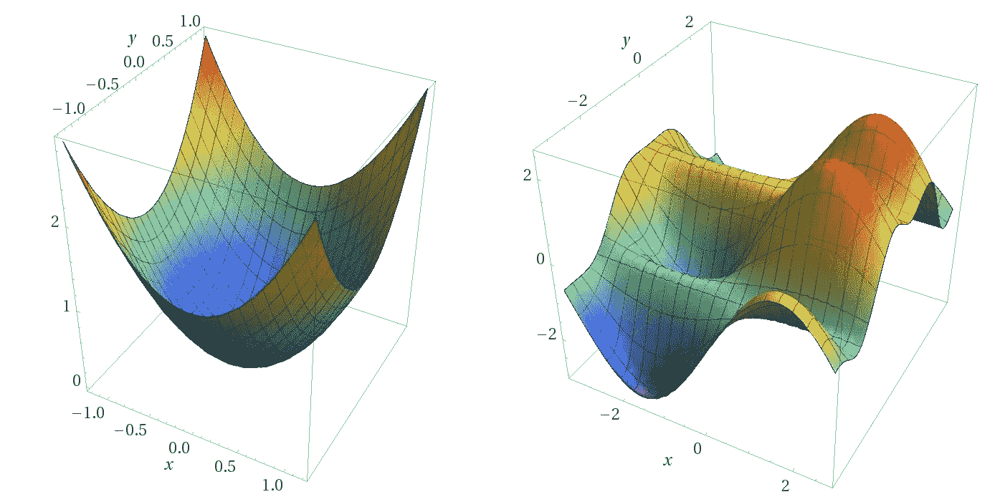

# 求解最优化问题

> 原文：<https://medium.com/analytics-vidhya/solving-for-optimization-problems-fee1e7ee5d22?source=collection_archive---------12----------------------->

一个**优化问题**的**解**可以通过选择不同的方法来完成。此外，用户可以在曲面或曲线上导航，以建立初始点并找到最佳点或临界点，这可以在绘制的函数上观察到。

# 内容

1.单值微分