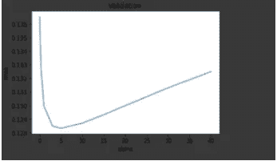
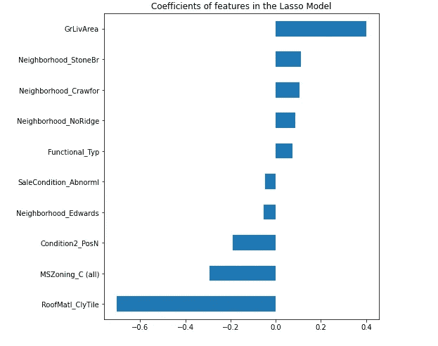

# 解决我的第一个回归问题

> 原文：<https://medium.com/analytics-vidhya/solving-my-first-regression-problem-ffbd76d9032e?source=collection_archive---------17----------------------->

*我如何开始我的数据科学之旅，以及从解决我的第一个回归问题中学到的东西*


由[马克西米利安·科纳彻](https://unsplash.com/@maxconacher?utm_source=medium&utm_medium=referral)在 [Unsplash](https://unsplash.com?utm_source=medium&utm_medium=referral) 上拍摄的照片

它位于疫情的中部。我的朋友在我们的一次谈话中偶然提到了数据科学。作为一名计算机科学毕业生，我已经无数次听到 ML、AI、DS 等术语。出于某种原因，我总是放弃尝试这个领域。但是这个领域一直吸引着我。预测事物和计算机自己做决定的世界总让人感觉有点不可思议。由于封锁和旅行限制而感到无聊，我决定尝试一下。我开始在谷歌上搜索如何在数据科学的世界里做事。因此，我从每个千年都喜欢的来源——随机的 Instagram 视频——获得了动力，并在 coursera 上开设了吴恩达的机器学习入门课程。就这样，我开始了走向数据科学的旅程(双关语)。

这就是我，完成了成为数据科学家的第一步。重要的问题是，下一步是什么？我的朋友建议我应该选择数据科学中的一个领域，并尝试解决该领域中的一些基本问题。数据科学的各个领域包括回归、分类、自然语言处理、时间序列分析等..因为我总是发现计算机本身预测事物的行为非常迷人，所以我决定选择回归。

# **概述**

在这篇文章中，我将带你经历我的旅程，并解释解决你的第一个回归问题的步骤。我们将实施以下步骤:

1.  挑选数据集
2.  数据预处理
3.  实施回归算法，如线性回归(岭和套索)和 XgBoost 回归
4.  选择正确的模型

注意:对于这个实现，我们将使用 Python 编程语言以及一些库，如 pandas，matplotlib，sklearn 等。

# **选择正确的数据集**

作为一个初学者，到目前为止，我不想让自己过多地参与数据工程和预处理部分。我开始在 Kaggle 上寻找回归问题的干净数据集。我发现了一组关于美国爱荷华州房价的数据，看起来很有趣，于是我决定尝试一下这个问题。数据集出现在[这里](https://www.kaggle.com/c/house-prices-advanced-regression-techniques/overview)。有些特征是你所期望的，比如房子的面积、邻居、公共设施等。但是数据集也包含了深入每栋房子的特征，比如壁炉质量、车库类型、地下室状况等。

选择这个数据集有几个原因:

1.  这是在 Kaggle 的“入门”部分，因此我知道这将是初学者友好的。
2.  我检查了数据集，发现它很大程度上是完整的，因此只需要最少的预处理。
3.  问题的描述表明，学习高级回归技术是理想的。

如果上述任何一个因素对你来说不一样，我会建议你去找一个你自己选择的数据集。例如，如果您已经解决了一些回归问题，并且知道不同的库，那么您可以选择一个不干净的数据集来学习更多关于预处理技术的知识。

对于这个特定的数据集，我们将使用 pandas 库的 read_csv 函数来导入数据集:

```
import pandas as pd
trainData = pd.read_csv('<path_to_file>')
testData = pd.read_csv('<path_to_file>')
```

# **数据预处理**

数据集包含具有字母数字字符、1 位数、5 位数、NAs 等值的特征。因此，以一种格式获取数据是非常重要的，这种格式使得没有一个变量是偏斜的，并且算法尽最大能力执行。最初，作为一个初学者，我只听说过标准化。但是当我开始阅读关于标准化的指南时，我发现对数转换值也是一种减少变量值偏差的方法。对数变换是考虑对数值而不是变量的实际值的过程。对于这个问题，当我比较对数转换和归一化的结果时，对数转换的结果稍微好一些。因此，我们将在这里使用对数变换:

```
# Joining train and test data to preprocess, will separate out laterall_data=pd.concat((trainData.loc[:,'MSSubClass':'SaleCondition'],testData.loc[:,'MSSubClass':'SaleCondition']))
```

首先，在训练集中记录房价:

```
#log transform the target values
trainData["SalePrice"] = np.log1p(trainData["SalePrice"])
```

然后，我们找出偏斜度> 0.75 的训练变量。这些值也将进行对数转换:

```
#log transform the target values
trainData["SalePrice"] = np.log1p(trainData["SalePrice"])#extract features which are pure numeric
numeric_feats = all_data.dtypes[all_data.dtypes != "object"].index#calculate skew of features using lambda functions
skewed_feats = trainData[numeric_feats].apply(lambda x:skew(x.dropna()))#extracting indexes features which have skew > 0.75
skewed_feats = skewed_feats[skewed_feats>0.75]
skewed_feats = skewed_feats.index#log transform features
all_data[skewed_feats] = np.log1p(all_data[skewed_feats])
```

当前数据集包含非数字和数字值。为了使用各种可用的 python 库，我们需要将非数值转换为数值。在这里，我们将使用所谓的一热编码。一键式编码将一个变量分解成几个指标变量。关于一热编码的解释和一些例子，请查阅[https://panases . py data . org/panases-docs/stable/reference/API/panases . get _ dummies . html .](https://pandas.pydata.org/pandas-docs/stable/reference/api/pandas.get_dummies.html.)

现在我们将把非数值转换成数值。这很容易通过使用熊猫函数 get_dummies 来完成:

```
#Dummy Data
all_data = pd.get_dummies(all_data)
```

接下来，我们将按该列的平均值填写所有 NA 值:

```
#Fill NAs with mean of column
all_data = all_data.fillna(all_data.mean())
```

最后一步是将分割的预处理数据转换回训练和测试样本:

```
#creating matrices for sklearn
X_train = all_data[:trainData.shape[0]]
X_test = all_data[trainData.shape[0]:]
y = trainData.SalePrice
```

作为预处理的附加步骤，您可以尝试检查特征描述文件，如果您认为这些特征可能不是非常有用，则决定是否要从训练数据中删除一些特征。我会建议在实现套索线性回归后这样做，因为这将帮助你决定一个功能是否有用(稍后会有更多)。

完成！数据现在是可用的格式。现在我们进入非常有趣的部分，回归算法

# **回归算法**

在以下方法中，我们将选择*均方根误差* (rmse)作为度量模型性能的指标。rmse 应尽可能接近 0。

1.  线性回归-岭回归(L2 正则化)

岭回归是线性回归的变种。当数据集中的变量存在多重共线性时，通常采用岭回归。在岭回归中，我们通常会添加一定程度的偏差，以防止数据集的过拟合。岭回归之所以被称为 L2 正则化，是因为惩罚项的系数大小是平方的。要了解更多共线性，请阅读此处:[https://NCSs-WP engine . net DNA-SSL . com/WP-content/themes/NCSs/pdf/Procedures/NCSS/Ridge _ rejection . pdf](https://ncss-wpengine.netdna-ssl.com/wp-content/themes/ncss/pdf/Procedures/NCSS/Ridge_Regression.pdf)并了解更多 ridge regression watch 的内部工作方式:[https://www.youtube.com/watch?v=Q81RR3yKn30&ab _ channel = statt questwith joshstarmer](https://www.youtube.com/watch?v=Q81RR3yKn30&ab_channel=StatQuestwithJoshStarmer)

关于岭回归的 python 代码，我们首先实现一个方法，该方法为我们提供特定线性模型的交叉验证分数

```
def rootMeanSquareError_CrossValidation(model):
    rmse_negative= cross_val_score(model, X_train, y, scoring="neg_mean_squared_error", cv = 3)
    rmse = np.sqrt(-rmse_negative) return(rmse) # The returned rmse is array of 3 numbers as the cross validation is done 3 times, as signified by the cv=3 parameter
```

现在，我们实现学习模型。岭回归模型采用一个称为偏差程度的参数α。我们循环遍历一组阿尔法值，并绘制均方根误差与阿尔法值的关系图。

```
alphas = [0.05, 0.1, 0.3, 1, 3, 5, 10, 15, 30, 40]ridgeReg_cv = []for alpha in alphas:
    temp = rootMeanSquareError_CrossValidation(Ridge(alpha)).mean()
    ridgeReg_cv.append(temp)ridgeReg_cv = pd.Series(ridgeReg_cv, index = alphas)
ridgeReg_cv.plot(title = "Validation")
plt.xlabel("alpha")
plt.ylabel("rmse")
```



alpha vs rmse。作者图片

现在，我们从该图中找出均方根误差的最小值:

```
ridgeReg_cv.min()
Output : 0.12834043288009075
```

我们看到 rmse 值是 0.12834043288009075。我们稍后将使用该值与其他模型进行性能比较。

万岁！我们实现了第一个回归模型。现在，进入下一个。

2.线性回归-套索回归(L1 正则化)

与岭回归一样，Lasso 回归也增加了一个偏差项，为学习过程增加偏差。这两种方法的主要区别在于，在 Lasso 回归中，偏差项具有系数的模。由于正则化程度为 1，因此 lasso 回归称为 L1 正则化。由于套索回归的内在作用，变量的系数有可能变为零。这意味着在套索回归模型中，某个特征可能会从学习过程中被消除。岭回归就不是这样了。要了解更多，请观看[https://www.youtube.com/watch?v=NGf0voTMlcs&ab _ channel = StatQuestwithJoshStarmer](https://www.youtube.com/watch?v=NGf0voTMlcs&ab_channel=StatQuestwithJoshStarmer)

在代码中，我们将使用 LassoCv 方法和一个 alphas 列表。我们还将使用上面定义的方法来找出均方根误差:

```
model_lasso = LassoCV(alphas = [5, 1, 0.1, 0.01, 0.001, 0.0005]).fit(X_train, y)rootMeanSquareError_CrossValidation(model_lasso).mean()Output rmse: 0.1242464172089154
```

在这种情况下，Lasso 模型的表现略好于岭回归模型。

如上所述，Lasso 回归可以帮助我们确定数据集中的哪些要素正在被实际使用。我们将挑选正在使用的前 5 个特征和 Lasso 回归模型最少使用的 5 个特征，并绘制它们:

```
coef = pd.Series(model_lasso.coef_, index = X_train.columns)importance = pd.concat([coef.sort_values().head(5),coef.sort_values().tail(5)])matplotlib.rcParams['figure.figsize'] = (7.0, 8.0)importance.plot(kind = "barh")plt.title("Coefficients of features in the Lasso Model")
```

以下是输出:



作者图片

从上图可以看出，最重要的功能是“GrLivArea ”,即居住面积平方英尺，最少使用的功能是“RoofMatl ”,即屋顶材料。如果你仔细想想，这是一种直觉，因为在买房子的时候，一个人会首先关注房子的居住面积以及周围的环境，并会把屋顶的材料放在次要位置。

耶！我们实现了第二个线性回归模型！

3.XGBoost

这是我实现的第三个也是最后一个回归模型。在继续之前，我强烈建议您查看决策树和随机森林，因为 XGBoost 模型与这两个主题有点关系。

XGBoost 是一个非常强大的模型。它使用了助推的概念。该算法不是训练彼此隔离的每个模型，而是迭代地创建某个预定义深度的新的随机森林，以从本质上纠正由先前模型产生的错误。XGBoost 极其迷人！了解模型手表的内部运作:[https://www.youtube.com/watch?v=OtD8wVaFm6E](https://www.youtube.com/watch?v=OtD8wVaFm6E)

谈到代码，我们首先将训练和测试数据转换成 xgboost 接受的格式。该算法的学习不同于岭回归或套索回归。在 XGBoost 中，我们首先使用 xgb.cv 方法超调各种参数，以获得可能的最佳模型。在这里，我用试错法调整了我的参数*最大深度、预计到达时间*和*最小体重*。要对最佳参数进行网格搜索，请查看[https://blog . Cambridge spark . com/hyperparameter-tuning-in-xgboost-4ff 9100 a3b2f](https://blog.cambridgespark.com/hyperparameter-tuning-in-xgboost-4ff9100a3b2f)和[https://machinelingmastery . com/tune-number-size-decision-trees-xgboost-python/](https://machinelearningmastery.com/tune-number-size-decision-trees-xgboost-python/)

```
import xgboost as xgbxg_train = xgb.DMatrix(X_train, label = y)
xg_test = xgb.DMatrix(X_test)params = {"max_depth":2, "eta":0.1, "min_child_weight":1}
model = xgb.cv(params, xg_train,  num_boost_round=1000, early_stopping_rounds=50)print(model['test-rmse-mean'].min())Output rmse : 0.123212
```

既然我们已经学习了最佳参数，我们将使用 XGBRegressor 和我们的最佳参数

```
final_model_xgb = xgb.XGBRegressor(min_child_weight=1,n_estimators=360, max_depth=2, learning_rate=0.1)final_model_xgb.fit(X_train, y)
```

恭喜你！我们现在已经成功部署了我们的第三个回归模型！

# **挑选合适的型号**

为了选择正确的模型，我们通常可以选择均方根误差最小的模型，因为这是预测结果最接近真实值的模型。总结一下我们 3 个模型的 rmse 值:

1.  岭回归:rmse = 0.12834043288009075
2.  Lasso 回归:RMSE = 0.124586768686
3.  XGBoost : rmse = 0.123212

根据性能指标，我选择 XGBoost 模型，因为它给了我最好的性能。

在我完成最终解决方案后，我发现还有另一种方法来选择最终模型。可以取两个或多个模型的加权平均值。为了说明这一点，我们将首先使用我们想要考虑的模型进行预测，然后找到它们的加权平均值:

```
lasso_predictions = np.expm1(model_lasso.predict(X_test))
xgb_predictions = np.expm1(final_model_xgb.predict(X_test))preds = 0.35*xgb_predictions + 0.65*lasso_predictions
```

就是这样！简单回顾一下，我们刚刚实现了 3 个不同的回归模型，了解了这些算法的内部工作原理。我强烈建议任何开始其旅程的数据科学家参加这项活动。万事如意！