# 解决嘈杂的文本验证码

> 原文：<https://medium.com/analytics-vidhya/solving-noisy-text-captchas-126734c3c717?source=collection_archive---------2----------------------->

验证码作为一种机制存在，以防止机器人发送垃圾 API，抓取网站，以及整体滥用供人类使用的互联网特权。从概念上来说，CAPTCHA 已经从简单的无衬线字体中的简单黑白分离字符发展到包括多种颜色、噪声、变化的字体、变化的字符比例和复杂的消息/单词，如图 1 所示，其中简单的无衬线字体很少或没有变换(例如旋转)。虽然最初很难解决，但系统最终发展到包括图像验证码、音频验证码和称为 reCAPTCHA 的多模式用户交互验证码，这些都可以在图 3 中看到。

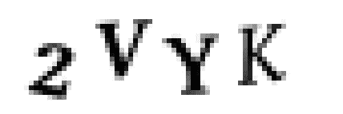

**图一。**简单文本验证码示例

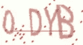

**图二。**更复杂文本验证码的示例

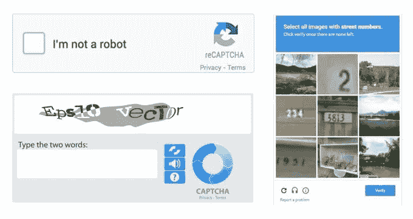

**图三。**验证码的三种现代形式。左上:reCAPTCHA。左下角:音频验证码。右图:验证码图片

# 工作

虽然有些显而易见，但这个项目更大的目标是通过预测隐藏在消息中的字符来破译文本验证码。然而，这本身是一项困难的任务，因为存在验证码的 36⁴排列，假设验证码包含 4 个字符，其中每个字符可以是 36 个字符(a-z0–9)中的一个。因此，不是在 36⁴-way 分类任务上评估监督模型，而是将目标简化为字符识别，这需要通过分割验证码进行额外的预处理，但是创建了 36 路分类任务而不是 36⁴-way 分类任务。

# 资料组

到 2020 年写这篇博客的时候，文本验证码已经相对过时了。尽管如此，它们确实存在，并且将它们用作计算机视觉辅助项目的玩具问题来说明传统的视觉技术(例如腐蚀、去噪等)是有价值的。)和深度学习技术(即 CNN)。在这个项目中，将使用类似于图 2 所示的验证码。这些验证码是通过使用 Python 验证码库([https://github.com/lepture/captcha/](https://github.com/lepture/captcha/))以 140x76 的分辨率由 4 个字符生成的，包含大写英文字母(A-Z)和数字 0-9，总共 36 个不同的字符。

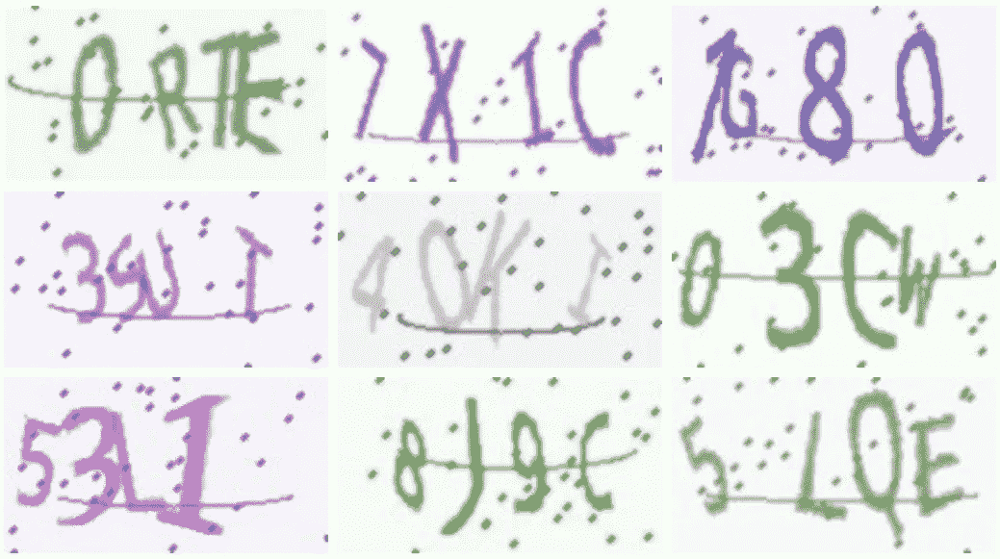

**图 4。**本项目数据集中使用的文本验证码示例

# 预处理

## 挑战

由于几种不同的特征，这种形式的文本验证码难以破译。首先，图像包含两种形式的噪声:点噪声和线噪声。点噪点通常很容易管理，尤其是以椒盐噪点的形式，但这张图像中的点看起来大小不一，呈圆形，这使它稍微有点困难。同时，线噪声增加了额外的挑战，因为它与试图从图像中破译的字符相交，同时是曲线而不是完美的线性。第二，图像是彩色的，背景是非白色的。二进制阈值处理相对容易地解决了这个挑战，但是在背景和字符具有相似颜色的情况下，它仍然是一个障碍。第三，人物重叠。第四，字符不像图 1 中那样处于固定的角度。第五，字符在大小上既不是定宽也不是定高。第六，字符之间的比例不同。

预处理验证码有两个步骤。首先，除了在下一步中帮助分割之外，从图像中去除噪声以减少由训练过的网络学习到的偏差。第二，字符被分割，以便将问题转化为字符识别任务。因此，由于 N 个验证码每个包含 4 个字符，所以为我们的模型的字符识别数据集生成了 4N 个字符。

首先，RGB 图像作为灰度图像读入，以简化任何去噪过程；所有像素值都在 0–255 的范围内。接下来，用阈值 230 对图像进行二值化。因此，所有小于等于 230 的像素亮度值都转换为亮度值 0(黑色)，大于 230 的像素亮度值都转换为 255(白色)。这个阈值完全是经验性的，在手动检查图像后，在几乎所有可观察到的情况下都有效。

## 消除噪音

现在，一旦图像被简化为基本形式，预处理的第一个真正步骤是去除噪声。如前所述，图像中存在的两种形式的噪声是圆形噪声和水平曲线噪声。

图像首先被反转，因此字母是白色的，背景是黑色的。然后，用(2，2)的核进行 1 次迭代的腐蚀，以削弱圆和线噪声。通常，对于较大的图像和较厚的圆/线噪声，该内核应该较大，但它适用于此任务中的数据集。

然后，中值滤波器来削弱任何额外的线。第一个中值滤波器是(5，1)，代表长度为 5 的垂直滤波器，可以去除图像中几乎所有的线噪声。巧合的是，这也有助于削弱一些圈子的噪音。然后，维度(1，3)的水平滤波器移除大部分圆形噪声。在这一点上，我们不仅侵蚀了噪音，而且还侵蚀了一些保持我们的角色健全和完整所必需的实际角色数据。因此，使用滤波器大小(2，2)对 1 次迭代执行膨胀，以使字母更大。这里要注意的关键是，膨胀比任何残留的噪声图像更能让字母恢复生机。然而，由于膨胀，残留的小噪声可能在整个图像中变得更加明显，因此大小为(3，3)的最终中值滤波器在图像上通过，以去除任何残留的最终弱噪声。

在项目进行过程中，经验评估对于确保所有预处理和训练程序正确执行至关重要。因此，在对去噪图像进行一些定性评估后，偶尔会出现一些额外的噪声。最初，我不打算处理这个问题，因为它需要额外的工作来获得额外的好处，但它最终导致了细分的挑战。因此，一些最终程序被用于去除最终噪声。首先，霍夫圆变换检测圆心和它们的半径，它们用作去除任何附加圆噪声的掩模。检测半径在 0 和 2 之间的圆，每个圆之间的最小距离为 1。然后，在去除圆之后，用(3，3)核对图像进行 1 次迭代，以从圆噪声中去除任何边缘。(5，1)垂直中值滤波器清除了额外的水平噪声。倒数第二个过程是使用(3，3)滤波器进行 2 次迭代的膨胀，以恢复图像，这最终会创建浮肿的字符，并在图像中引入更多的噪声。最后一步是用大小为(3，3)的核对图像进行 1 次迭代。从质量上来说，这几乎消除了所有的噪声，无论是圆形的还是线性的。

此时，图像应该几乎完全没有噪声，只包含散布在整个图像中与字符相交的残余噪声。

## 字符分割

一旦噪声被去除，单个字符被从图像中分割出来，以便在字符分类任务中训练模型。

首先，使用 OpenCV 的 connectedComponents(…)函数检测图像的连通分量。然后，分水岭算法试图进一步分割重叠字符。

理想情况下，由于所有字符都不相交，并且图像中没有残留噪声，因此应该返回 4 个分量，表示 4 个字符。但是，有时会出现错误，指示字符重叠(几乎无法分割)或噪音被识别为字符的情况。第一种情况很难，但有可能解决，而第二个问题很容易解决。例如，在包含 4 个字符的 140x76 图像中，在验证码完全不可读之前，字符只能如此之大和如此之小。这样，根据经验确定包含少于 100 个像素的字符掩模是“噪声”，因此从图像的任何未来预处理中去除它。第二，当图像包含≥ 2200 个像素时，字符被认为是“联合字符”，这意味着掩码包含两个相互交叉的字符。为了解决这个问题，使用了一种简单的方法。掩码直接从中间分开，左边的子掩码是一个字符，右边的子掩码是另一个字符。这种去除“噪声”屏蔽和细分“联合字符”屏蔽的迭代方法被执行 10 次迭代。此时，如果恰好没有生成 4 个掩码，则验证码被从数据集中丢弃，这被认为是一个糟糕的例子，因为所有 4 个字符的掩码都不能被识别。通过统计分析，在生成的掩码中存在一致的 5%的误差，这表明 N 个生成的验证码中有 5%被从用于训练和评估的最终数据集中丢弃。到目前为止，在 Google Colab 虚拟机上预处理 100 万验证码大约需要 3 个小时。

一旦检索到字符，预处理和分割的最后一步是将它们方形化。这是一个要求，因为卷积神经网络(CNN)需要固定大小的输入。因此，具有 45x67 和 76x65 尺寸的字符会导致模型抛出大小不匹配错误。为了补救这一点，背景像素被添加到已经分割的字符图像中，以强制字符为 76×76，同时也在图像中居中。整个过程如图 5 所示，显示了预处理的 4 个主要步骤(原始图像、二值化、去噪和分割)。

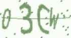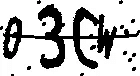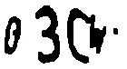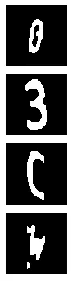

**图 5。**第一张图片:原始 RGB 验证码图片。第二张图片:二进制验证码。第三张图片:去噪验证码。第 4-7 张图片:从验证码中分割出来的字符

现在，在去噪和分割验证码之后，我们已经从 N 个验证码图像到空间 A-Z0–9(36 个类别)中的 4N 个字符。现在是训练模型识别这些字符的时候了。

# 模型

该模型最初是一个预训练的 AlexNet，后来转变为一个定制的卷积神经网络(CNN)。该网络可描述如下:

```
2D Conv: in = 1, out = 20, kernel = (5, 5), stride = 1, padding = 4
ReLU()
2D Max Pool: kernel = (2, 2), stride = 2, padding = 0, dilation = 1
2D Conv: in = 20, out = 50, kernel = (5, 5), stride = 1, padding = 4
ReLU()
2D Max Pool: kernel = (2, 2), stride = 2, padding = 0, dilation = 1
Flatten()
FC: in = 24200, out = 500, bias = true
ReLU()
FC: in = 500, out = 36, bias = true
```

与最近的视觉文献相比，这种深度学习架构相对较浅，但它完成了工作。这个模型的 PyTorch 实现可以在 model.py 文件的代码中找到。这个模型没有什么特别的，但保持它相对简单是有用的，因为更先进/最新的深度学习架构得到了测试(VGG，雷斯网)，它们实际上比这个模型表现得更差，这表明可能对数据集过度拟合。此外，从从业者的角度来看，在整个过程中根据需要修复/修改架构更加容易。

*注:*对于卷积层，in = #个输入通道，out = #个输出通道。对于全连接层(FC)，in = #个输入神经元，out = #个输出神经元。最后，对于最后一个 FC 层，out = 36，因为有 36 个类。

# 培养

该模型的训练是一个相对简单的过程，非常类似于处理 MNIST 分类的项目。Adam 优化器与交叉熵损失一起使用(“总和”减少，而不是“平均值”减少)。根据经验，对于优化器，学习率为 0.0001，权重衰减为 0.98，批处理大小为 32 时效果最佳。当我用 100 个时期训练时，模型通常在不到 20 个时期内收敛。

培训阶段使用的模型如上所述。值得注意的是，所有传入网络的图像尺寸都是 76x76x1(第三通道表示灰度)。

学习率衰减进行了实验，但由于缺乏影响，最终从最终培训中省略。然而，批量大小确实起了作用。人们发现，一个批次的< 32 hurt performance significantly, while a batch size > 512 只略微损害了准确性。

因此，最终使用 0.00005 的学习率来训练批量为 512 的模型。虽然在 32 ≤ *batch_size* ≤ 512 的范围内没有观察到批量大小产生显著影响，但是选择更大的批量大小以加速训练过程。

训练模型的一些最重要的设计选择实际上必须处理数据集。数据集大小和分区大小对模型的性能都有相当大的影响。第一次试验是在 1000 个验证码(约 4000 个字符)的数据集上进行的。这最终增加到 10K、100K 和 1M 验证码，分别生成大约 40K、400k 和 4M 个字符。实际上，由于前面提到的来自*预处理*部分的 5% CAPTCHA 分段错误率，数据集中的字符数最终低于估计数。这些数据集大小的精确度在*结果*部分进行了说明。同时，分别以 60%/20%/20%的比率进行初始训练/验证/测试分割。然而，深度学习的一个简洁特征是，验证和测试规模不需要保持与训练集规模的特定比例，就可以被认为是“体面的”或“无偏见的”。因此，一旦数据集增加到 1M 验证码，拆分就转变为 80%/10%/10%，这仍然为验证和测试拆分保留了大的平衡分区，同时允许模型查看更多的训练图像，从而提高未来的鲁棒性。

最后，在进行了所有的设计选择之后，对模型进行了训练。使用上述超参数，培训在 NVIDIA K80 GPU(从 Google Colab 获得)上进行了大约 10 个小时。

# 结果

这个项目主要关注的是验证码的解码，同时也利用了字符识别子任务的重要贡献。主任务和子任务都在这一部分进行了评估，但只有字符识别任务进行了定性评估。

这项任务最重要的评估标准是准确性，这是定量的。当通过 CAPTCHA 设计一个健壮的安全系统时，F1-score、precision 和 recall 等指标几乎没有用。架构师只关心确保非人类用户的低成功率。在这个实验中，当系统可以识别验证码中的所有 4 个字符时，我们数据集的假设是成功的；任何更少都表示失败。因此，计算精度相对简单。直觉上，高的 CAPTCHA 解码率意味着高的字符识别准确度。因此，精确度用于任务/数据集，结果显示如下。

## 数量的

在讨论定量结果之前，先讨论一下预期结果是很重要的。在 MNIST 分类任务中，通常会遇到达到 99%以上分类准确率的模型，但该任务和该任务之间的区别是 MNIST 是 10 路分类(不是 36 路)，数字不需要预处理，因为它们是事先精心策划给研究人员的。因此，在训练模型之前，预期的准确度应该在 80-100%之间。此外，假设模型在字符分类任务上达到 X%的准确度，我们可以估计 CAPTCHA 任务的准确度，因为它是简单的字符排列。例如，如果模型达到 80%的字符分类准确率，每个类别都有相同的成功可能性，我们预计验证码的准确率为(0.8)⁴ = 0.4096 = 40.96%)。在表 1 的右栏中观察到所有预期的验证码准确性。

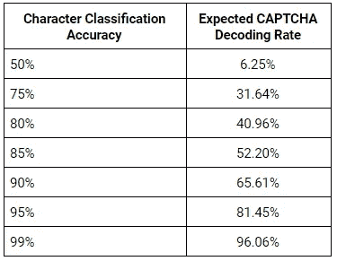

**表 1。**左栏是我们的模型在字符分类任务上达到的给定准确率。右栏包含预期的验证码准确率。这些数字是理论上的，不是经验上的。

因此，肯定的情况是字符分类为 90%，这表明得到整个验证码的情况比随机翻转好。然而，理想的情况是字符准确度为 95%或 99%，这导致了自信的 CAPTCHA 解码模型。但是，关于精度期望的理论讨论已经足够了。让我们来看看实际的经验结果。

首先，在训练我们的模型之后，我们观察字符识别的准确性:

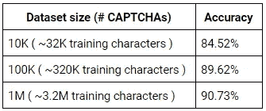

**表二。**左边是数据集大小乘以生成的验证码数量。请记住，在预处理期间，5%的验证码被识别为“坏的”，每个验证码有 4 个字符，80%/10%/10%的训练/验证/测试分割用于字符识别训练。

然后，我们通过利用每个分段字符上的字符分类模型来观察验证码成功率:

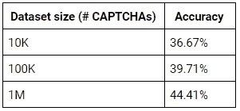

**表 3。**显示在不同数据集大小上训练的模型在 CAPTCHA 数据集上的经验准确度。

如表 2 所示，数据集大小在字符分类准确性中起着重要作用，达到了近 91%的准确性，这是一个积极的迹象。然而，当在成熟的验证码上使用 91%的准确度模型时(通过与训练集相同的预处理阶段来分割字符)，返回 44.41%的准确度，这比表 1 中的预期准确度低大约 20%。这是一个有趣的结果，不仅是因为其本身的低准确性，而且是因为其准确性明显低于预期。

乍一看，最初的假设是数据集是不平衡的。然而，经过一些分析后，认为情况并非如此。此外，由于数据集包含 100 万个验证码和大约 400 万个字符，我们假设这些字符是统一生成的，因此这是第二次验证，类别不平衡不是问题。所以，在这个想法被否决后，对单个字母的准确性进行了分析。如下图所示，几乎所有字母的准确率都在 90%或更高，只有两个例外，O 和 0，这两个字母的准确率都很低，徘徊在 50–70%的范围内。然而，这种情况的原因很简单，因为 O 和 0 在形状上非常相似。精度可在表 4 中观察到。

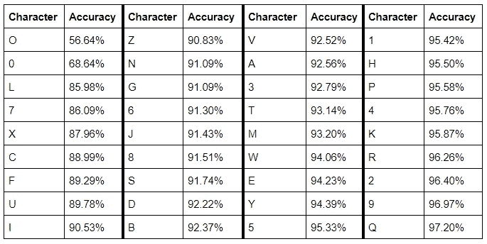

**表 4。**每个字符的精确度。

在那次分析之后，我调查了模型错误分类的角色。表 5 包含属于特定类别的错误分类字符的比例。这个表提供了一些信息，显示一些字符比其他字符更容易被错误分类。虽然“O”是错误分类率最高的字符并不令人惊讶，但考虑到其低分类精度，“0”在错误率中排在第七位则有点令人惊讶。

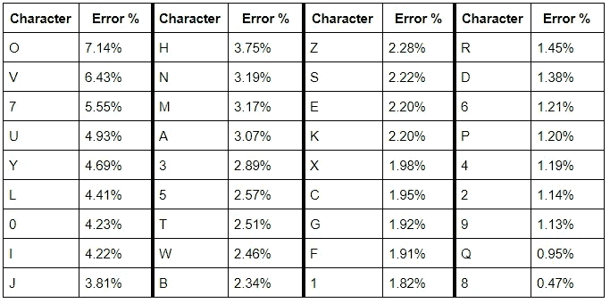

**表五。**字符的错误率。例如，如果有 100 个分类错误的字符，我们预计其中大约有 7 个 O(0.0714 * 100 = 7.14 ~ 7 个 O)和 1 个 Q (0.0095 * 100 = 0.95 ~ 1 个 Q)。

尽管有这些分析，也不能确定为什么验证码的准确性比预期的低这么多。然而，尽管如此，准确度仍然是可管理的，考虑到 44%的成功率并不是世界上最糟糕的情况，并且大多数文本验证码机制允许用户生成新的验证码。

## 定性的

虽然定量结果是客观和简单的，但定性结果也总是受到重视。不值得浪费你的时间来展示预测给定字符标签的模型。相反，t-SNE 曲线是为数字创建的，如图 6 和图 7 所示。在图 6 中，76x76 字符图像被展平以产生 5775 个图像“特征”/像素，而没有被传递到分类器中。相反，图 7 通过完全训练的字符分类模型传递图像，并且从最后完全连接的层中提取 500 个特征。虽然执行 t-SNE(一种迭代的非线性降维技术)足以产生一些好看的图，但 t-SNE 在计算上是昂贵的，根据方法的不同，运行时间为 O(NlogN)或 O(N)。因此，图像特征通过 PCA(封闭形式的线性维数缩减技术)被缩减到 100 个分量，然后这些分量被传递到 t-SNE 算法中以产生下面的可视化。这大大减少了训练 t-SNE 算法所需的时间。

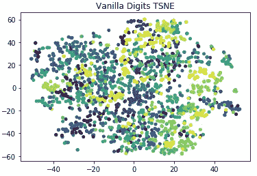

**图 6。**使用原始图像显示类别的 t-SNE 图。

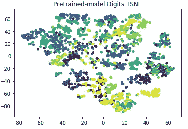

**图七。**从完全训练的模型中提取的角色特征的 t-SNE 图。

*注:*这些图说的是“数字”，其实应该是“字符”。这些图实际上是所有 36 个类别的，而不是一个子集。

值得讨论的一个要点是类的可分性。前后剧情令人咋舌。通过训练的模型，类内变异性显著降低，而类间可分性适度增加。值得将这个来自具有 91%分类准确度的模型的图与 MNIST t-SNE 图(来自仅在 10 个类别上具有 99.2%准确度的模型)进行比较，可以在这里找到:[https://github.com/kingsman142/mnist-classification](https://github.com/kingsman142/mnist-classification)。显然，可分性并不理想，但是对于 36 个类的可视化，我对结果很满意。在 3D 绘图中，我假设存在更大的类间可分性，但这超出了本项目的范围。

*注*:我计划为两个图创建图例，显示每个类的颜色，但结果证明 matplotlib 的工作量太大，不值得，而且会使图看起来很丑，所以我避免了麻烦。

# 讨论

## 假设

本项目中有一个无止境的假设列表，以使其更容易处理，我们将尝试列出尽可能多的假设:

*   在所有验证码中，线噪声总是相同的宽度
*   线条噪点总是比字符的笔画宽度细
*   图像总是 140x76
*   圆形噪波总是相同的半径
*   验证码中只使用了 4 个字符
*   验证码数据集图像都包含大致相同的样式
*   验证码数据集的样式并不是所有生成验证码的 Python 库或研究论文中最复杂的样式
*   线路噪声通常总是水平的，而不是垂直的
*   人物没有被掏空
*   验证码不是 3D 的
*   不使用小写字母(将问题转化为 62 类问题)
*   一次最多连接两个字符
*   背景和文字之间有足够的对比度，阈值处理在预处理中是有效的

## 挑战

假设的另一面是挑战，这是通过这个特定的数据集使任务具有挑战性的困难。它们可以在下面找到:

*   字符的大小不是固定宽度的
*   字符的大小没有固定的高度
*   不在固定(x，y)位置的字符
*   字符没有固定的角度
*   图像为 RGB 格式，颜色差异很大
*   图像有圆形噪声
*   图像有曲线噪声
*   圆形噪声不是盐和胡椒风格的，这使得用中值滤波器去除非常简单
*   线路噪声不是完全线性的，因此必须利用多种组合梯度技术和滤波器来尽可能消除它
*   字符的比例不同(一些比另一些大/小)
*   验证码只包含 4 个字符

## 可能的研究

对研究的深入分析可能会在今后对这份报告进行修正，但它们没有报告的内容重要。因此，下面将列出多个问题，其中包含有用的启发性问题:

*   阈值处理在预处理步骤中有帮助吗？阈值对预处理图像有影响吗？
*   去噪有帮助吗？虽然直觉的答案是肯定的，但如果我们只是天真地将角色分开呢？假设数据集足够大，字符分类准确率会显著下降吗？
*   与其他更复杂的技术相比，从中间分割连体角色会影响性能吗？
*   字符的白色填充(当切分字符时)重要吗？
*   如果我们完全平衡数字数据集会发生什么？它已经相当平衡了，但是值得研究一下平衡是否会影响精度 1-2%。

## 结果

在这份报告中，更大的任务是解决嘈杂的文本验证码。虽然更大的目标是验证码，但一个必要的字符分类子任务被执行，实现了约 91%的准确率。然而，尽管有这种令人印象深刻的准确性，但在现实中，在 CAPTCHA 任务上的准确性是 44.41%，这比给定字符分类准确性的预期低约 20%。尽管如此，通过定性评估，模型显示与原始数据本身相比，类内可变性和类间可分性有所改善，这是一个重要且至关重要的观察结果。

在未来，值得探索更高级的预处理步骤以更有效地分割字符，以及执行数据增强技术和确定验证码解码准确性低的根本原因。

总而言之，我认为这个项目是成功的。它包含大量代码，除了现代深度学习模型之外，还需要传统的低级计算机视觉技术。更大的目标有一个必须首先完成的子任务，并且在两个任务上都取得了令人满意的结果，这导致了在现实世界中解决有噪声的文本验证码的实际应用。

# 技术

在预处理、培训和评估方面，使用了以下技术来构建整个系统(未提供版本):

*   Python3
*   PyTorch
*   sci kit-学习
*   Scipy
*   OpenCV
*   NumPy
*   Matplotlib

完整代码可以在这里找到:[https://github.com/kingsman142/captcha-solver](https://github.com/kingsman142/captcha-solver)。

一个预先训练好的模型可以在这里找到:[https://drive.google.com/open?id = 16 vwha 7 uxy 7 coe9y-nkh 6 sky pw 3 kz 8 xza](https://drive.google.com/open?id=16Vwha7uxy7coe9y-Nkh6skYPW3Kz8xZA)。为了使用它，在项目根目录中创建一个模型/目录，并将模型放在那里，然后按照上面存储库中的说明来评估模型。