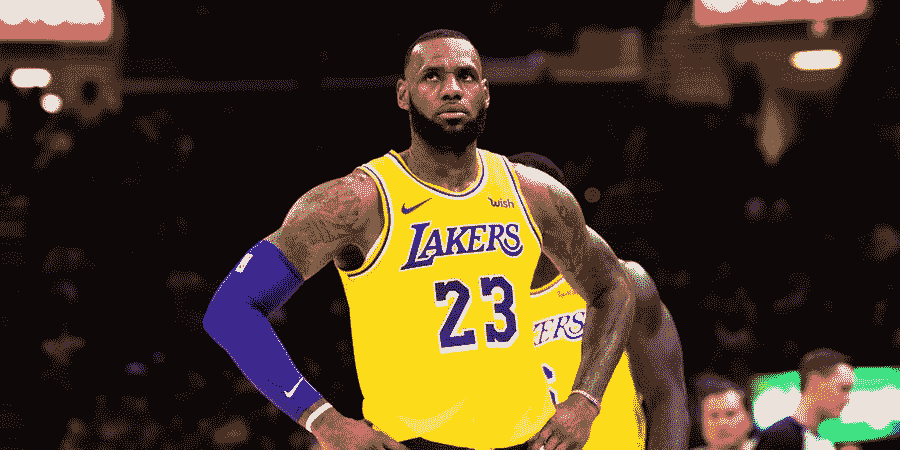

# Python 中的优化可减少均方误差

> 原文：<https://medium.com/analytics-vidhya/solving-our-python-basketball-model-d89edfb83f79?source=collection_archive---------7----------------------->

# 修订本

好的，我们让模型处于什么状态？

**我们到底在哪里？**

如果你还记得的话，我们使用博彩公司对篮球比赛的价差输入来预测球队的获胜概率。经过紧张的码头工人建造，留下了比格里塔·图恩伯格最大的敌人加起来还大十倍的碳足迹，我们基于[韦恩](https://www.amazon.co.uk/Mathletics-Gamblers-Enthusiasts-Mathematics-Basketball/dp/0691154589/ref=sr_1_2?dchild=1&keywords=mathletics&qid=1594744092&sr=8-2)建造了一个基本的篮球模型…