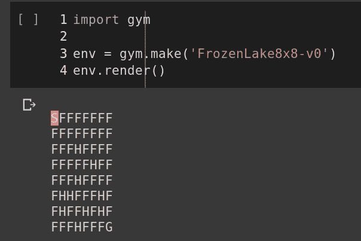
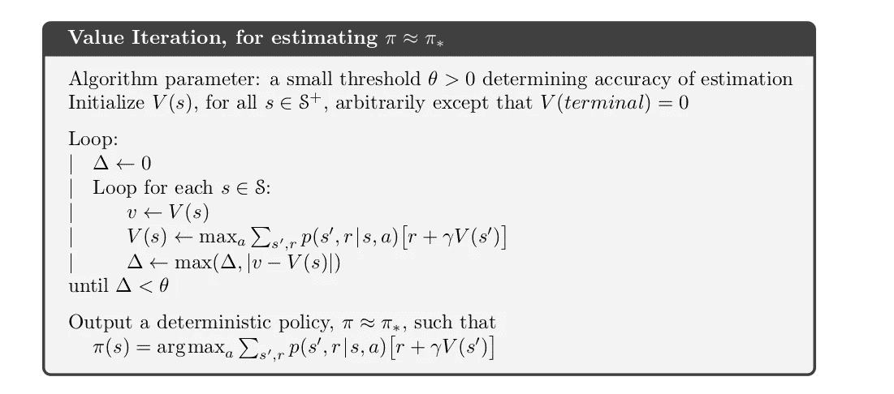

# 使用值迭代求解 OpenAI gym 的 FrozenLake 环境

> 原文：<https://medium.com/analytics-vidhya/solving-the-frozenlake-environment-from-openai-gym-using-value-iteration-5a078dffe438?source=collection_archive---------1----------------------->

所以我在尝试学习强化学习，然后我碰到了这个东西叫做'**值迭代**。我真的无法理解价值迭代。我很难理解它是如何工作的，以及它如何帮助一个代理人找到最优策略。然后我想到了一个主意。

理解“价值迭代”还有什么比用它来解决某个游戏或环境更好的方法呢？就这样，我开始了寻找一些足够简单的游戏问题来解决的旅程。然后我偶然发现了[这个来自 OpenAI 的仙女](https://gym.openai.com/envs/FrozenLake8x8-v0/)。

一个简单的玩具文本游戏

## 了解 FrozenLake8x8

我先解释一下游戏/环境。

FrozenLake8x8

游戏中有 64 个州。代理从 S (S 代表开始)开始，我们的目标是到达 G (G 代表目标)。所以快走吧。没有。这是一个光滑的表面。中间的 F 和 H 是很奇怪的东西。所以 F 的意思是冰冻的表面。你可以在上面行走。但是 H 的意思是洞。如果你掉进了一个 H，BOoom，**为你结束了**的游戏，重新从 S 开始。所以只要通过所有的 F 避开 H 就可以到达 G 了。没有。还有更多。既然这是一个“*冰冻的*湖，那么如果你往某个方向走，那么代理人真的往那个方向走的几率只有 0.333%。我的意思是，代理的运动是不确定的，只是部分取决于所选择的方向。所以你不会一直朝着你想要的方向前进。关于 FrozenLake8x8 的更详细解释，[点击这里](https://gym.openai.com/envs/FrozenLake8x8-v0/)。

## 了解开放式健身房

好了，我们明白了如何从 OpenAI 加载环境。为此，我们将使用 OpenAI 的 python 库' [**gym**](https://gym.openai.com/docs/) '。

您可以使用 *env.render()* 查看环境，其中红色突出显示了代理的当前状态。

*env . action _ space . sample()*从所有可能的动作中随机选择一个动作。而 *env.step(action)* 根据给定的动作走一步。在这里，我们可以看到动作是“向右”**，所以代理从 S 向右到 F ( *这可能不总是这样，因为代理的移动是不确定的，所以有时当动作是“向右”时，代理也可能向下或向上。*)**

****

# **有趣的部分**

**好吧，这是最简单的部分。现在是困难的部分，或者我应该说是有趣的部分。代理人如何在这个湿滑的湖中航行并到达目标而不掉进洞里？**

**让我们一步一步来。首先让我们编写“*值迭代*函数。**

****

**值迭代函数的伪代码(I)**

**在价值迭代中，故事是这样的。对于一个特定的状态，首先我们计算来自该状态的所有可能动作的状态-动作值，然后用最大的状态-动作值更新该状态的值函数。这不同于“*政策迭代*”，在这里我们计算预期/平均国家行为值。当所有新状态值和旧状态值之间的差是一个可忽略的小值时，值迭代终止。**

## **代码代码代码**

**下面是我用于值迭代函数的代码。**

**大部分代码都很容易理解。我来解释一下非直觉部分。**

***env.nS* 和 *env.nA* 分别给出状态和动作的总数。不过最有趣的还是 *env。p*； *env。P[0]* 输出这样一个字典。这里 0 在 *env。P[0]* 是环境的第一状态。**

****

**这里你可以猜到，字典的键 0，1，2，3 是我们可以从状态 0 开始陈述的动作。此外，每个动作包含一个列表，其中列表的每个元素是一个元组，显示转换到状态、下一个状态、奖励的概率，并且如果完成=真，完成=假。(*如果下一个状态是球洞或球门*，则 done=True)。所以 *env。P* 是包含所有状态的列表，其中每个状态包含一个字典，该字典将所有可能的动作从该状态映射到下一个状态，如果我们采取该动作，进入下一个状态的概率，奖励以及游戏是否在那里终止。**

****

**在这里你可以看到 54 是一个如此完成的洞=真。同样 63 是这样做的目标=真。**

**因此，根据**值迭代公式**，我们迭代所有这些动作，并使用公式计算动作状态值:**

*****Prob *(奖励+折扣 _ 因子*状态 _ 下一状态值)*****

**这些都在 *env 中提供。P* 。然后，我们更新具有最高状态-动作值的状态的值函数。我们迭代环境的所有 64 个状态，直到每次迭代后新状态值和旧状态值之间的差异小到可以忽略不计，或者如果我们已经超过了最大迭代次数。**

## **从价值函数中提取策略**

**现在我们有了所有状态的值函数，我们的下一步是从值函数中提取策略。**

**我们使用类似的技术来做这件事。对于特定的状态，我们从该状态计算所有可能动作的状态-动作值，并选择具有最高状态-动作值的动作。**

# **那么我们是达到了目标还是掉进了坑里？**

**终于！现在我们有了策略，我们可以遵循该策略，看看我们的代理是否达到了目标或掉进了洞里。**

**我们运行代理 1000 集，并计算达到目标平均需要多少步。我们还计算它有多少次达不到目标，掉进了一个洞里。运行上述函数后，我们最终得到了这个答案。**

****

**我觉得代理做的挺好的:)**

**你也可以检查一下 [FrozenLake-v0](https://gym.openai.com/envs/FrozenLake-v0/) ，它是一个较小的版本，只有 16 个状态，并检查代理到达目标平均需要多少步。关于我解决 FrozenLake8x8 环境的完整代码，请访问我的 GitHub repo，这里:[https://GitHub . com/realdiganta/solving _ open ai/tree/master/frozen lake 8 x 8](https://github.com/realdiganta/solving_openai/tree/master/FrozenLake8x8)**

**同时，随着我继续进入强化学习的令人兴奋的领域，我将在不久的将来解决更多的开放 AI 环境。请继续关注更多内容。**

## **参考资料:**

1.  **[强化学习:导论|第二版，作者理查德·萨顿&安德鲁·巴尔托](https://www.amazon.com/Reinforcement-Learning-Introduction-Adaptive-Computation/dp/0262039249/ref=pd_sbs_14_t_0/147-7865363-3852556?_encoding=UTF8&pd_rd_i=0262039249&pd_rd_r=96f1b22e-1339-4f4f-93ff-26c787125b93&pd_rd_w=vDJJ6&pd_rd_wg=y1LXN&pf_rd_p=5cfcfe89-300f-47d2-b1ad-a4e27203a02a&pf_rd_r=ACR43W905JY9PYNWDRRS&psc=1&refRID=ACR43W905JY9PYNWDRRS)**