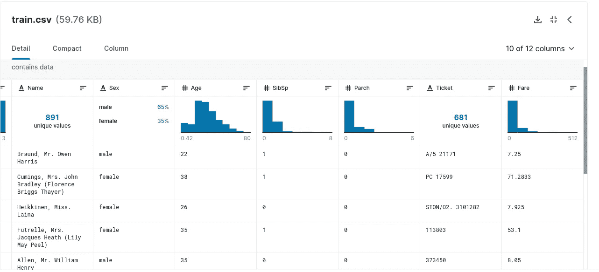

# 使用神经网络和张量流解决“泰坦尼克号:灾难中的机器学习”

> 原文：<https://medium.com/analytics-vidhya/solving-titanic-machine-learning-from-disaster-using-neural-networks-and-tensorflow-2abade61994a?source=collection_archive---------6----------------------->


杰克对罗斯说使用张量流=)

***《泰坦尼克号:机器从灾难中学习》*** 是机器学习初学者的经典问题。

挑战在于根据一组训练数据来预测哪些人会在灾难中幸存，哪些人不会。显然，这只是一个挑战，试图发现幸存者和非幸存者特征之间的相关性，并利用它进行预测。

不过事不宜迟，还是解决吧！

# **开头**

当你从 Kaggle 下载数据时，他们提供了两个数据集。

一个对应于训练，用数据来训练你的模型，这个数据集已经有了谁幸存谁不幸存的答案。在你问我之前，我不知道这是不是真的。

但是我们在这个数据上有些问题…


可视化数据后的我…

第一个问题是:我们对于这个问题的数据很少。训练数据集只有 891 个例子。但是这并不意味着我们不能解决问题！

这些数据有一些不一致，所以我们需要解决让任何数据科学家的工作变得更糟的问题。

# **调整数据并解决不一致性**

我将继续这些数据的问题，以及我们如何解决它，这篇文章的重点是建立一个模型，谁来解决我们的问题。

第一个问题是数据集中存在的字符串数据，但这很容易解决。字符串数据位于“名称”和“票证”列中，如下图所示:



资料组

对于这个问题，我们有很多解决方案，但最简单的是删除这些列，因为它们对我们的模型不太重要。

删除这些列后，我们必须处理缺失的数据。

为了识别缺失的数据，可以将 ***Seaborn 和 Matplotlib*** 与 ***HeatMap*** 图配合使用，以便更好地可视化。

```
plt.figure(figsize=(12, 6))sns.heatmap(train.isnull(), yticklabels=False, cbar=False, cmap='viridis')
```

在定位缺失数据后，我们有两种常见的解决方案:

***1-删除缺少数据的行(注意！).***

如果是一个数字数据，比如年龄或类似的东西，我们可以用所有其他数据的平均值来填充数据。

您可以为您的问题选择最佳解决方案，但我真的推荐第二个，因为您不会丢失对您的模型有用的数据。

基本上这是训练数据集的问题！

但是别担心，我给你准备了一个惊喜…

在这个项目的存储库中，我将把已经格式化的数据输入到我们的模型中！

现在，我们解决了你问题中最糟糕的部分。**该做机器学习了，宝贝！**


我格式化所有数据后，准备建立我的模型

# ***建立模型***

对于这个问题，就像你在标题中看到的，我们将使用 ***神经网络*** 和 ***Tensorflow*** 。

我将数据分成 75%用于训练，25%用于测试。我们在这里使用神经网络，我们需要尽可能多的数据，但减少太多的测试数据会导致我们的模型性能不佳。

我们的模型将有 4 层，其中:

*   ***输入图层将一个*** [***图层展平***](https://www.mathworks.com/help/deeplearning/ref/nnet.cnn.layer.flattenlayer.html) ***。***
*   ***这 2 个隐藏层，每层有 32 个神经元，会随着 R 的密集***[***elu***](https://machinelearningmastery.com/rectified-linear-activation-function-for-deep-learning-neural-networks/)***激活。***
*   ***输出层将被密集的***[](https://machinelearningmastery.com/logistic-regression-for-machine-learning/)****激活。****

*在构建我们的模型之后，我们将用以下代码编译它:*

*   *[***二元交叉熵***](https://towardsdatascience.com/understanding-binary-cross-entropy-log-loss-a-visual-explanation-a3ac6025181a) ***损失函数。****
*   *[***亚当优化器***](https://machinelearningmastery.com/adam-optimization-algorithm-for-deep-learning/) ***。****
*   ****以准确度为主要衡量标准。****

*现在，是时候训练我们的模型了！*

*对于这些模型，我使用了以下参数:*

*   ****150 个时代****
*   ***批量*15*批量***

*训练完模型后，结果不会太有传染性…*

*通过这些参数，模型在测试数据集中制定了以下指标:*

*   ****精度 0.7578****
*   ****0.5041 损失****

*这个损失太大了，但是不要担心，我们有很多方法来改善它！*

# *我们如何改进它？*

*造成这一结果的原因不仅仅是我们选择的参数，而是一个主要问题。*

*我们正在使用 ***神经网络*** ，我们需要更多的数据来追赶惊人的结果！*

****神经网络*** 如此强大，但相比其他算法需要大量数据。*

*但是这并不意味着这个问题不能用神经网络来解决。我们可以通过改变参数来改善这些结果。而在这里，我给你最好的建议，用一个简单的字来恢复: ***考！****

*下面，我列举了一些可以改进模型的变化:*

*   ****减少测试数据的例子来使用到模型的训练中。****
*   ****增加列车运行过程中的批次数量。****
*   ****增加训练过程中的历元数(这可能导致过拟合！).****
*   ****改变模型的架构。****

*这样可以改进你的模型，产生更好的结果，比如我在这个问题中使用 NN 的最好损失是 0.37。但是天空才是极限！*

# *一些附加信息*

*对于你有一个小数据集， ***少于 5000 个例子*** 的问题，我真的推荐使用其他算法，像逻辑回归(我在这个挑战中用过，你可以在这里查一下)或者随机树森林，它们可以比神经网络表现的更好。*

*对于这个具体的问题和解决方案，我个人建议试验一个多选项的参数来改进模型！*

*你可以在[这里](https://github.com/gabrielmayers/kaggle_titanic-neural_networks)访问这个项目的资源库。*

*目前，这就是全部！*

*下次见！*

****我的社交媒体:****

****领英:****[https://www.linkedin.com/in/gabriel-mayer-779b5a162/](https://www.linkedin.com/in/gabriel-mayer-779b5a162/)**

*****GitHub:***[https://github.com/gabrielmayers](https://github.com/gabrielmayers)**

*****Instagram:***[https://www.instagram.com/gabrielmayerl/](https://www.instagram.com/gabrielmayerl/)**