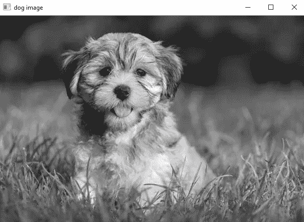

# 关于公开简历的一些基础知识—第一部分

> 原文：<https://medium.com/analytics-vidhya/some-basics-about-open-cv-part-1-e4392da256a8?source=collection_archive---------21----------------------->


公开简历(第一部分)

在这篇博客中，我将使用 Pycharm IDE 编写代码。基本上，OPEN CV 是一个图像处理工具，你可以从中分析任何图像。它用于物体检测。让我们开始吧——

你可以在命令提示符下通过命令 **pip3 install cv2** 来安装它或者在 Pycharm 中你可以遵循这个路径— ***文件>设置>项目:你的项目名称>项目解释器>点击加号图标>在搜索栏(顶部)写 cv2>选择 cv2 >点击安装包***

你还需要更多的工具，如 ***numpy，matplotlib*** 。

首先，你必须在 python 文件中导入所有需要的库，以便我们可以使用它。

> ***导入 numpy 为 np***
> 
> ***导入 cv2***
> 
> ***导入 matplotlib.pyplot 为 plt***

在上面的代码中，numpy 用于读取数组中的图像。在第二行，我们正在导入 cv2，我们将很快在这个博客中看到它的使用，在第三行，我们正在导入 matplotlib，用于一些基本的图像可视化。

在那之后，我们将通过这个代码读取图像——


一个图像(您可以使用您选择的任何图像)

> ***image = cv2.imread('你的图像'，cv2。*IMREAD _ gray)**

在上面的代码中有两个参数，第一个是图像，第二个是图像的颜色(如 RBG，GBR，cv2。IMREAD _ gray)，RBG 和 GBR 是指彩色图像。但是这里我们给出的第一个参数是彩色图像，但是我们只读取一个灰色图像。在这里，我采取灰度图像，因为我们是初学者。并且在灰度图像中比在彩色(RBG)图像中进行处理更简单。

现在是时候访问我们在前面的代码中生成的图像了。所以让我们再写一些代码——

好了，在继续编码之前。让我们有更多的细节-有两种方法来访问图像(实际上不是两种方法，但我知道两种方法)。

首先是使用 matplotlib(我们在 sarting 中导入的),其次是使用 cv2 本身。

**先说说 cv2** —

> **cv2.imshow('狗图像'，图像)**
> 
> **cv2.waitKey(0)**
> 
> **cv2 . destroyallwindows()**



灰度图像(名为“狗图像”)

在上面代码的第一行中，我们显示了 image( cv2.imshow())并通过第一个参数给它命名(意味着图像窗口打开，窗口工具栏名称将是“dog image”)。第二个参数是实际图像(灰度图像)，我们在前面的代码。

第二行是——销毁图像窗口(我们通过 imshow()方法生成的图像窗口),当你按下图像窗口将销毁的任何键时，它将等待按下任何键(销毁代码在第三行)。

让我们用 matplotlib 显示图像

> **plt.imshow(image，cmap= "gray" )**
> 
> **plt.show()**


matplotlib 提供的图像

在第一行中，我们通过 **matplotlib.pyplot** 的 imshow 方法制作图像。在这个方法中，第一个参数用于图像(灰度图像)，第二个参数用于颜色。

你可以通过下面的代码保存这张图片—

```
cv2.imwrite(**'dog.png'**,image)
```

第一部分到此结束

在第二部分中，我们会读到更多关于公开简历和网络摄像头的内容。

我希望你喜欢。

谢了。